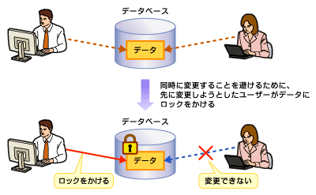

<html>
<body>
<h2>【DB概論】データベースシステムに求められる要件</h2>

　デキるエンジニアになるためには、DB技術の基礎は必須です。

　「使える」システムを構築するには、データベース設計がと非常に重要です。先人が遭遇したトラブルを避けられるかどうか、システム構築やアプリケーション開発が成功するか否かは、データベース設計にかかっているところが大きいです。

　本連載では、豊富な実例と演習問題で、プロとして恥ずかしくない設計手順を解説します。システム構築において「どの工程で、どのような観点からデータベース設計を行うべきか」という視点から、DB設計のポイントとなる汎用的なケースを紹介します。

<strong>●連載構成</strong>

<ol>
<li>データベースシステムに求められる要件</li>
<li>DBMSに求められるもの</li>
<li>データベース設計の重要性とデータ中心アプローチ</li>
<li>データベース設計概論</li>
<li>正規化の手順</li>
</ol>
<h4>データベースシステムに求められる要件</h4>

　データベースを構築する際には、まず何がデータベースシステムに求められているかを把握する必要があります。 データベースには、ユーザーが必要とするデータが格納されていることは当然ですが、システムとしていかに使いやすくデータを利用できるかということを考えたとき、次の要件が求められます。

<ol>
<li>共有利用（複数ユーザーからの共有利用）</li>
<li>一元管理（1データ1個所の原則）</li>
<li>信頼性（耐障害性、高度なセキュリティ）</li>
<li>性能（処理速度）</li>
</ol>
<h4>1 共有利用</h4>

　データベースには、複数のユーザーまたはアプリケーションが同時にアクセスします。 複数のユーザーまたはアプリケーションが、同じデータに対して同時に読んだり、変更したりすることを想定し、扱っているデータがお互いに矛盾をきたさないようにする必要があります。

　それを実現するためには次の2点が重要です。

<ul>
<li>排他制御</li>
<li>同時実行性の維持</li>
</ul>

<strong>●排他制御</strong>

　扱っているデータに矛盾が生じないようにするためには、排他制御機能を実装し、誰かがデータを変更している最中には、他のユーザーが同じデータを同時に変更しないように制御する必要があります。 ロックという機能を実装することによって、排他制御を実現します。

<!--CAP-->

<small><strong>データの共有</strong></small>

<!--CAPEND-->

<strong>●同時実行性の維持</strong>

　データベース管理システム（Database Management System：DBMS）にとって排他制御は必須の機能です。 ところが、長期間ロックを掛けっばなしにすると、そのデータに対して他のユーザーが変更することができなくなってしまいます。 同時に同じデータにアクセスする際には、なるべく多くのユーザーがそのデータをアクセスできるようにする必要があります。 このことを<strong>同時実行性を維持する</strong>といいます。

<h4>2 一元管理</h4>

　一元管理されていないと困る例を1つ挙げてみましょう。

　例えば、得意先の情報が販売促進ファイルに登録されていて、販売促進部門が管理しているものとします。 また、同じ顧客の情報がメンテナンス契約を管理するファイルにも登録されていて、顧客サポート部門が管理しているものとします。

　顧客が移転したため、顧客サポート部門に住所変更の情報が伝えられました。 しかし、販売促進部門にはその情報が伝えられず、販売促進ファイルは更新されませんでした。 その場合、挨拶状は古い住所へ届くことになり、顧客の住所すら一元管理できていない会社と受けとられ、信用を失うことになるかもしれません。

　ある意味をもつ情報（1データ）は1個所にのみ存在させるという原則のことを、<strong>1データ1個所の原則</strong>（正しくは、「1つの事実は1個所にのみ存在する」の原則と表現します）といいます。 1データ1個所の原則を守ってデータを管理していると、次のような場合、対処が楽だということが分かります。

<strong>【CASE1】変更が発生したとき</strong>

　複数個所に同じ意味をもつデータが散在している場合、そのすべてを漏れなく変更する必要があります。1つでも変更し忘れると、そのデータを使用するユーザーは間違った処理結果を得ることになり、信頼を失うことになります。

 

<strong>【CASE2】アプリケーションを追加するとき</strong>

複数個所に散在しているデータを使用するアプリケーションが新たに追加された場合、新アプリケーションはそのすべてに対する処理を漏れなく記述する必要があります。

 

　アプリケーションの変更や拡張を行う可能性がｓｓある場合には、1データ1個所の原則に基づいてデータを管理する必要があることが分かります。 データベースを設計する際、この原則に基づいてデータを管理することができるようにするため、<strong>正規化</strong>という作業を行います。

<strong>●従属関係の洗い出し</strong>

　正規化は、「データを管理する際に、重複のない形でデータを管理するために行う作業」といえます。 この重複がない形にデータを管理するためには、データ間の従属関係を洗い出す必要があります。

　データ間の従属関係の例を示します。 例えば、社員を管理する名簿があり、「社員番号」は社員1人につき1つ割り振られているとします。 このとき、「社員番号」と「社員名」の間には「<strong>従属関係</strong>がある」と言います。 もう少し正確に定義すると、どの「社員番号」の値をとっても必ず1つ「社員名」の値が決まるという関係がある場合、「社員番号」と「社員名」の間には<strong>関数従属性</strong>があるといい、「社員名」は「社員番号」に「<strong>関数従属</strong>である」と言います。

<strong>●正規化</strong>

　正規化とは、「管理すべきデータ間の意味的な関係を洗い出し、従属関係にあるデータ間の意味的な関係を整理して、独立して管理できるものは独立させるという作業を繰り返すこと」といえます。

　正規化の作業は、第1正規化から第5正規化まで5つの作業が定義されていますが、一般的には第3正規化まで実施すれば十分といわれています。 この理由は、「第3正規化より後の正規化作業は、例外的なケースに適用すべき作業だから」であり、本来の意味でいえば第5正規化まで必要に応じて行う必要があります。 第5正規化まで分析が行われた結果のデータ格納方法は、1データ1個所の原則を満たし、理論上重複して管理されることはなくなります。

<h4>3 信頼性</h4>

　管理されているデータが信頼できるものでなければ、データベース内のデータを安心して使うことはできません。 データベースに求められる信頼性とはどのような観点から測るべきものなのかを次に示します。

<ul>
<li>データの整合性維持</li>
<li>耐障害性</li>
<li>セキュリティの確保</li>
</ul>

<strong>●データの整合性維持</strong>

　データの整合性維持を実現するためには、次の2つの要件を満たす必要があります。

<ul>
<li>データが常に正しい値を持っていること</li>
<li>ルールに違反するデータがないこと</li>
</ul>

　まず、データが常に正しい値をもつようにするためには、次の3つの観点からデータを適切に管理する必要があります。

<ol>
<li>ある業務処理に関連するデータが複数ある場合、その処理が完了するためには、関連するすべてのデータは同期をとって更新する必要があります。これを実現するために、<strong>トランザクション</strong>という概念を使ってデータを管理します。</li>
<li>一時点をとった場合、あるデータまたは関連する複数のデータを更新することができるユーザー（またはアプリケーション）は1人だけでなければなりません。つまり、同時に更新する可能性がある場合は、更新する順序を管理し、ユーザー（またはアプリケーション）は一度に1つずつ順番に更新する必要があります。 これを実現するためには排他制御機能が必要です。</li>
<li>データが一元管理されていて、更新時の対象データが1個所に存在する構成になっているか、複数存在する場合でも、漏れなく更新する仕組みができている必要があります。</li>
</ol>

　次に、定義したルールに違反するデータがないようにするためには、例えば、データ長やデータ型、その他データに関するルールをあらかじめ定義しておいた場合、それに違反したデータが存在してはいけないということであり、データベースにデータを入れる前や、更新する前に必ずチェックする機能が常に動作している必要があります。

<strong>●耐障害性</strong>

　システムに障害が起きたとき、障害から回復できないようでは使いものになりません。 障害からの回復は、次の要件が満たされているかが大切なポイントになります。

<ol>
<li>トランザクションの処理の途中で障害が発生した場合、そのトランザクションは最初からまったく実行されなかった状態に戻す必要があります。</li>
<li>トランザクション処理が完了した後に障害が起きた場合、そのトランザクションによる更新処理はすべて回復される必要があります。</li>
<li>回復処理の途中で次の更新処理が実行されると整合性が維持できなくなるため、回復処理が完了するまで、回復後の更新処理は実行できないようにする必要があります。</li>
</ol>

<strong>●セキュリティの確保</strong>

　機密性の高いデータに、任意のユーザーやアプリケーションが自由にアクセスすることは許されません。 その意味で、次の観点で管理できるようになっている必要があります。

<ol>
<li>ユーザー（またはアプリケーション）に対して、表レベル、行レベルの単位でアクセス権を設定できる。</li>
<li>アクセス権は、参照、更新、削除などの種類によって設定できる。</li>
</ol>
<h4>4 性能（処理速度）</h4>

　いくら信頼性が高く、一元管理され、共有可能に設計されているデータベースシステムでも、1つのオンライン処理を行うのに30秒もかかっていたのでは使いものになりません。 適切な処理速度は、システムにとって1つの重要な価値です。

　これらの要件のいずれか1つでも欠けてしまっては「使えるデータベース」とはいえません。 また、これらの要件は、実際のデータベースを構成するDBMSと適切に設計されたデータベースの両方が存在して初めて実現することができるのです。

　それでは次に、DBMSに求められるものと、データベース設計で要件を満たすことができるものに分けて紹介します。

</body>
</html>
