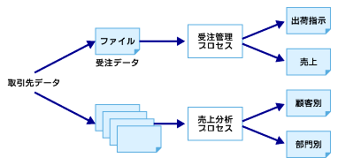
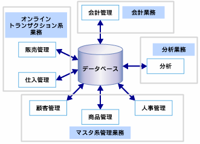
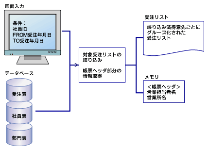

<html>
<body>
<h2>【DB概論】データベース設計の重要性とデータ中心アプローチ</h2>

　これまで、データベース設計に関する話を中心に説明してきましたが、システム構築の全体工程を見る中で、他の開発工程との関連を見ておきます。

　次の図で、システム構築の際の全体工程の概要を見ることができます。 データベース設計の工程が他の工程とどのように関わっているかを確認します。

<!--CAP-->

<small><strong>図1 システム構築の全体工程（クリックで拡大します）</strong></small>

<!--CAPEND-->

　システム構築工程の他工程との関係で、特にデータベース設計と関係が深いところを説明します。

　システム化計画でシステム全体の方向性を鳥撤した上で、データベース設計の概念設計に入ります。ここは、トップダウンでシステムの全体像をつかんだ上でデータベースの設計をする重要な工程です。システム化計画で出た企業の経営層の戦略などをインプットにして、将来のシステム像をにらんだ設計を行う必要があります。一方、現行業務に沿った、アプリケーション開発の要件定義、概要設計工程と同期を取りながら、データベースの概念設計を進めていきます。

　方式設計は、データベース設計の物理設計と深く関わっています。物理設計の実装段階で具体的なメモリ要件やディスク構成の最終的な詰めを行いますが、次のようなことは、ユーザー要件と照合してあらかじめ洗い出して検討しておく必要があります。

<ul>
<li>システム構成
<ul>
<li>クラスタ化の検討</li>
<li>分散データベースにするか</li>
<li>ディスク構成はRAID構成か</li>
</ul>
</li>
<li>アプリケーションの配置</li>
<li>ネットワークの帯域幅計算</li>
<li>バックアップリカバリツールはサードパーティ製品を採用するか</li>
<li>メモリ要件</li>
<li>OS、データベースの種類</li>
</ul>

　また、方式設計段階では情報不足で決定できない部分については、アプリケーション開発工程、データベース開発工程を担当しているグループと随時連絡を取りながら、追加・修正を行っていきます。

　アプリケーション開発の基本設計フェイズ（外部設計）工程と同期を取りながら、データベースの概念設計（詳細設計）を進めていきます。

　アプリケーション開発の基本設計フェイズ（外部設計）工程では、入出力とユーザーインタフエースが決まりますので、ここで業務上扱うべき属性が漏れなく洗い出せるはずです。

　アプリケーション開発の基本設計フェイズ（内部設計）工程と同期を取りながら、データベースの論理設計を進めていきます。

　アプリケーション開発の基本設計フェイズ（内部設計）工程では、ジョブフローおよびプログラム（さらに小さいレベルではモジュール）で使用するフラグ類やコード類の仕様が決まるので、それらのうちデータベースで管理すべき属性を漏れなく洗い出すことができます。また、データベースに発行されるSQLが明確になるため、性能要件を考慮した索引設計を行います。

　アプリケーション開発の詳細設計～単体テストフェイズ工程と同期を取りながら、データベースの物理設計を進めていきます。

　実際にテーブルを作成し、物理的なディスク上にテーブル類を配置します。

　テスト工程でアプリケーションを実行し、必要に応じてSQLのチューニング、索引の再考、物理的な格納方法の試行を繰り返します。

　テストは、連結テスト、総合テストでも性能テストを繰り返します。データ量の違い、単位時間当たりのトランザクションの量が異なると、異なる結果が出ることは容易に想像できます。なるべく実際に適用される状態に近い状態でテストを繰り返してください。

　標準化という作業が他の工程とは独立しています。大きなレベルでは、設計全般における基本方針の標準化、ドキュメント様式の標準化、非正規化などのルールの標準化などが挙げられます。

　詳細レベルでは、アプリケーションとデータベースに共通で使用する列や表の命名規則、列の桁数やデータ型、共通データ型として定義するドメイン、業界で標準に使われているコード類（商品コードや住所コード）の扱い方について、データベースの中で使用するコード類の設計などを、それぞれに調査、判断するために重要な役割を果たします。

　システム構築の手順は、アプリケーション構築とデータベース構築、インフラ構築が連携をとり合って初めて成功します。各フェイズが設けてあるのは、それぞれのフェイズの終わりで相互に整合性が取れているかどうかの確認作業を行うためです。

　必要に応じて随時連絡はとりあうのは当然ですが、少なくとも各フェイズの最終場面で各工程のアウトプットをつき合わせ、認識に相違がないことを確認して次のフェイズに進んでください。認識の食い違いによって工程の後戻りが発生した場合の時間と費用のロスは、皆さんが想像している以上の損失につながります。

<h4>プロセス中心設計とデータ中心設計</h4>

　システム構築の手順の基本になる考え方は、大きく分けて2つあります。 1つは<strong>プロセス中心</strong>、もう1つが<strong>データ中心</strong>と呼ばれる設計方針です。

　以前はプロセス中心設計の手法が多く、データ管理はファイルシステムを使用していました。

　プロセス中心設計の目標は「いかに速くプロセスを動かすか」であり、プロセスを速く動かすために最適になるよう、ファイル設計が行われていました。プロセスをいかに速く動かすかを中心に設計が行われていたので、データが複数のファイルに冗長に存在することが普通の状態でした。

<!--CAP-->

<small><strong>図2 プロセス中心設計</strong></small>

<!--CAPEND-->

　プロセス中心のデータ管理方法で一番の問題点は、データの冗長性にあります。あるデータが更新されるときには、複数箇所に存在するデータを漏れなく更新するための追加のアプリケーションを作成する必要があります。

　また、アプリケーションを追加する際には、関連するすべてのファイルの影響を確認する必要があり、拡張性に問題が残ります。

　これらの問題点を解決することができるのが、データ中心の設計方針です。データ中心の設計は、データの一元管理を重視した設計になっており、1データ1個所の原則に基づいてデータが管理されます。

<!--CAP-->

<small><strong>図3 データ中心設計</strong></small>

<!--CAPEND-->

　企業で管理すべきデータを一元管理し、プロセスはそれを共有するという形になります。データが必ず1個所にのみ存在するようにするためには、データベース設計をする際に<strong>正規化</strong>という手順を踏み、冗長性を排除する必要があります。

　正規化の作業を行うと、データを管理する表は、列数の少ない小さな表の単位に分けられます。ユーザーが求める画面のイメージや帳票を作成するためには、これらの表を再度、意味のある形で結合して加工する必要があります。ところが、この結合に時間がかかるため、必ずしもアプリケーション開発者にとってはうれしいことだけではないのです。

　そこで、大量のデータを対象にデータを操作する必要がある場合には、データベースから必要なデータのみを抽出してファイルの形にし、それをインプットとしてアプリケーションをバッチジョブの形で処理し、アウトプットを成形することも考えます。

　オンラインでデータを直接参照、加工するだけではなく、このようにオフラインでデータを処理する例としては、レポート出力や帳票の大量作成、分析のためのデータ抽出などが挙げられます。今でもこの方法は使用されています。

<!--CAP-->

<small><strong>図4 オフラインのデータ処理の例</strong></small>

</body></html>

