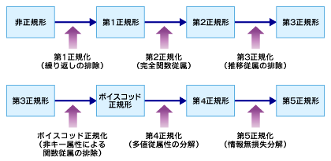
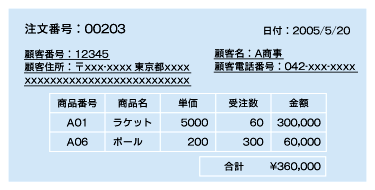
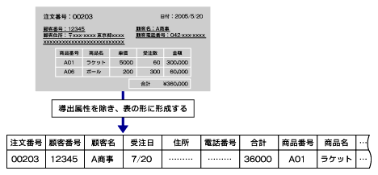
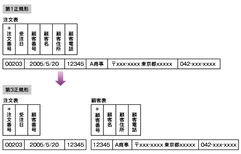

<html>
<body>
<h2>【DB概論】正規化の手順</h2>

<h4>正規化の手順</h4>

　正規化は、データの一元管理を行うために、データベース設計で行うべき手順です。

<!--CAP-->

<small><strong>図1 正規化の手順</strong></small>

<!--CAPEND-->

　正規化とは、データを一元管理するための理論です。

　1データ1箇所の原則を実現するために、1970年にE.F.Codd氏がリレーショナルモデルの理論として提案しました。正規化の理論は、データの冗長性を排除し、更新時の整合性を維持しやすくすることを目指しています。

　具体的には、属性間の関連性を分析し、属性の最適なグループ化を図ることを目的としています。 一般には第3正規化まで行えば十分といわれていますが、本来は、あてはまる場合にはきちんと第5正規化まで行う必要があります。 まず、正規化の処理をする際によく出てくる関数従属という用語の意味を復習しておきましょう。

<strong>◎ 関数従属とは</strong>

　ある属性Aの値が決まると他の属性Bの値が一意に決まるとき、「属性Bは、属性Aに関数従属である」（A→B）といいます。

　<strong>完全従属</strong>とは、2の属性A、Bの間でA→Bが成立し、Aが複数の属性の集合で成り立っている場合、Aのいかなる部分集合も関数従属が成立しない状態を表します。

　<strong>部分従属</strong>とは、関数従属が成立しているが、完全従属ではない状態を表します。

　<strong>推移従属</strong>とは、エンティティの3つの属性A、B、Cにおいて、「A→BかつB≠＞AそしてB→Cである」とき「A→C」が得られ、既存の関数従属から新たな関数従属が得られる状態を表します。

<h4>正規化の手順</h4>

　正規化の手順を、ある受注伝票を例にとって説明します。 まず、実際の業務で目に触れているデータは、非正規形といわれる状態で管理されています。

<!--CAP-->

<small><strong>図2 受注伝票</strong></small>

<!--CAPEND-->

<strong>非正規形</strong>

　現実の世界では、データは属性の集合として存在しています。

　つまり注文伝票や納品伝票などの形で存在しているデータは、属性の集合ということができます。 通常、これらの属性は正規化されていません。 これを<strong>非正規形</strong>といいます。

<strong>導出属性</strong>

　導出属性は、正規化の作業を行う場合、取り除くのが原則です。

　ただし、実際の設計では、管理項目を上流工程で削除してしまうと、元々管理されていた属性を失ってしまい、後で復活させることは難しくなります。 そこで、導出属性である旨明記した上でER図には残しておきます。 この非正規形のデータ集合を表の形に成形します。

<!--CAP-->

<small><strong>図3　 非正規形のデータ集合を表の形に成形</strong></small>

<!--CAPEND-->

　表の形に成形する際、表の定義として以下の2点に留意してください。

<ul>
<li>表を定義する列は、1列につき1個しか入れない。</li>
<li>表の1行を特定できるキー列（一意識別子）を考える。</li>
</ul>

　非正規形のデータを、これから正規化していく前準備として表の形に成形しました。 次のように表すことができます。

<!--CAP-->

<small><strong>図4 受注伝票を表に成形</strong></small>

<!--CAPEND-->

　それでは、この形を基に、正規化の作業を順次、進めていきましょう。

<h4>第1正規化</h4>

　第1正規化では、同一の情報のグループが繰り返し出現している部分を分離します。その結果、第1正規形は、繰り返しの配列構造が排除された構造になります。

<strong>第1正規化の手順</strong>

<ol>
<li>同じ属性が繰り返されている部分の重複をなくす。 すると、細かい複数の表に分かれるので、元の表と結合できるように、分けた表に元の表のキー項目（<strong>主キー</strong>）を外部キーとして入れる。</li>
<li>1．を具体的に説明すると、まず、属性が繰り返し出てきているグループを別の表に分解し、元表の残った行と、分解した繰り返しグループの行を一意に決められる、主キーをそれぞれ定義する。</li>
<li>次に、 分解した表の行と元の表の関係を維持することを目的として、分解先の表に元の表と結合できるように、キー項目（<strong>外部キー</strong>）を定義する。</li>
</ol>

<strong>受注伝表の第1正規化をしてみよう</strong>

<ol>
<li>元の表のキーは「注文番号」。</li>
<li>繰り返しグループを図5のように分解し、主キーをそれぞれ＊がついている属性とする。</li>
<li>分解した注文明細表と注文表との関係は、注文明細表に取り込んだ「注文番号」を使用して参照できるようにする。注文明細表の「注文番号」は、注文表への外部キー。</li>
</ol>
<!--CAP-->

<small><strong>図5 第1正規形</strong></small>

<h4>第2正規化</h4>

　第2正規化で焦点となるのは、主キーと主キー以外の属性との関係です。

　注文明細表の「単価」と「受注数」は主キーによって一意に特定できますが、その決定のされ方は微妙に異なります。 「受注数」は主キーを構成する「注文番号」「商品番号」のどちらの属性が欠けても一意に特定できませんが、「単価」は「商品番号」があれば一意に特定できます。 表の主キーすべてを必要とせず、「主キーの一部」だけで一意に指定可能な属性が存在する場合、その部分を別の表に分割することができます。この作業を行うのが第2正規化です。

<ul>
<li><strong>関数従属</strong> ある属性X（複数の場合もある）の値が決まると、それに応じて属性Yの値が一意に決まる関係を関数従属（関数的に従属している）といい、次のように書きます。  X→Y  属性Xに対して、属性Yが関数従属していて、Xの一部の属性に部分従属していない場合、完全関数従属（完全に従属している）といいます。注文明細表の「単価」は、主キー「注文番号」と「商品番号」に完全従属しているとはいえません。</li>
<li><strong>完全関数従属</strong> X→Yの関係があり、かつYがXのどの真部分集合にも関数従属でない場合、（Xを構成するA＋B＋Cのいずれの構成要素および構成要素の組み合わせ（A、B、C、AB、AC、BC）にも関数従属しない）Yは、Xに完全関数従属しているといいます。</li>
<li><strong>部分関数従属</strong> YがXの一部に関数従属することを、YはXに部分関数従属しているといいます。注文明細表の「単価」は、主キー「注文番号」と「商品番号」に部分従属しているといいます。主キーの一部である「商品番号」のみに関数従属しているからです。</li>
</ul>

<strong>第2正規化の手順</strong>

<ol>
<li>主キー列が複数の列で構成されている複合主キーの表を対象とする。</li>
<li>複合主キーの一部に関数従属関係をもつ属性を洗い出し、別の表に分解する。</li>
<li>分解した表の行と元の表の行の関係を維持することができるよう、分解した表のキー項目（外部キー）を定義する。</li>
</ol>

<strong>受注伝票の第1正規化から第2正規化をしてみよう</strong>

<ol>
<li>注文明細表が対象となる。</li>
<li>図6のように分解する。注文明細表の主キーは、「注文番号」と「商品番号」。商品表の主キーは、「商品番号」。</li>
<li>注文明細表の「商品番号」は、商品表を参照する外部キーとして定義する。</li>
</ol>
<!--CAP-->

<small><strong>図6 第2正規形</strong></small>

<!--CAPEND-->

<strong>第3正規化</strong>

　第2正規形から主キー以外の属性が相互に依存関係をもたないようにする作業が第3正規化です。 つまり、非キー項目どうしの関数従属関係がある場合は、それを取り除きます。

　「顧客住所」と「顧客電話」は「注文番号」から直接決定されるわけではなく、「顧客情報」という独立した要素の一部です。 注文表の中の非キー項目「顧客番号」から決定される「顧客名」や「顧客住所」のような関係を「推移関数従属がある」といいます。

<ul>
<li><strong>推移関数従属</strong> 重複しないX、Y、Zにおいて、YはXに関数従属であり、ZはYに関数従属であり、XはYに関数従属でない場合、ZはXに推移関数従属であるといいます。  X→Y、Y→Z、Y≠＞X の場合、X→Zが成り立つ</li>
</ul>

<strong>第3正規化の手順</strong>

<ol>
<li>すべての表の主キー以外の属性間の関数従属関係が対象となる。</li>
<li>従属関係をもつ属性を洗い出し、別の表に分解する。</li>
<li>分解した表の行と元の表の行の関係を維持することができるよう、表のキー項目（外部キー）を定義する。</li>
</ol>
<!--CAP-->

<small><strong>図7 第3正規形</strong></small>

</body></html>

