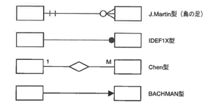
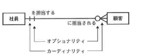
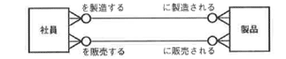
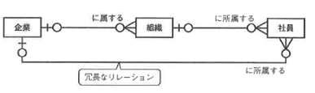

<html><body>
<h2>2.3 概念設計の手順（1/3）</h2>

実際の手順としては次のような処理手順を考えることができます。

<strong>【STEP1】</strong> 対象領域を明確にする

<strong>【STEP2】</strong> エンティティを洗い出す

<strong>【STEP3】</strong> リレーションシップを検討する

<strong>【STEP4】</strong> 属性と一意識別子を洗い出す

<strong>【STEP5】</strong> 概念データモデルを検証する

<!--/.yellowBox-->

STEP2からSTEP5までの手順は、トップダウンとボトムアップの手順で繰り返し実行します。 具体的に手順を追って説明します。

<!--/.section-->

<h3>2.3.1 対象領域を明確にする</h3>

まず、対象領域を明確にします。 トップダウンでシステム構築を考えると、範囲はその企業全体、または関連企業を含めた広範囲になる場合も少なくありません。 また、いくつかの組織を横断して構築されているマスタの再構築などを考えると、あれもこれもと範囲が無制限に広がってしまう場合があります。 そこで、システム構築を始める際には、最終的なシステム化の全体像やシステム化の目標をつかんでおいて、フェーズを区切って開発対象範囲を絞っていきます。

対象領域が定義できたら、概念設計の手順に入ります。 ここでは、トップダウンとボトムアップを組み合わせた設計工程を紹介します。 詳細設計の作業に入る前に、概念設計全体の処理の流れをつかんでください。

図2-2 設計工程

<!--/.grayBox-->

<!--/.section-->

<h4 class="caption">トップダウンとボトムアップ</h4>

概念設計は、理想的なあるべき姿をモデル化したいというフェーズですが、現実に存在しているシステムを無視するわけにはいきません。 理想と現実のバランスをとる必要があります。 しかし、いきなり現在の業務の細かい仕様の確認から入ってしまうと、現実に縛られた設計しかできなくなってしまうため、まず高い視点から広い視野でシステム化の作業を行う姿勢が大切です。

対象業務範囲の中で大まかな業務フローを事前に決め、その方針に従ってモデル化していきます。 これがトップダウンにあたるフェーズです。 その後、具体的な業務に従って、詳細に現在の業務を分析し、必要なデータを漏れなく洗い出していきます。 これがボトムアップにあたるフェーズになります。

<!--/.section-->

<h4 class="caption">トップダウンで概略ER図を作成する</h4>

システム化の範囲を決め、企業として管理すべき情報の方向性を検討します。 方向性が決まったら、それに従って必要なエンティティを抽出します。

たとえば、コンビニエンスストアで販売分析を強化するという方針であれば、分析の軸となるエンティティを抽出する必要があります。 今までは店舗の情報だけ管理していたところを、地域性を考慮して店舗ごとに売れ筋商品を分析するという観点から、店舗の上位に地域情報をエンティティとして追加するなどの施策を追加します。 地域情報としては、住所情報だけではなく、近辺の公共施設（学校、公園、駅、病院）や各施設のイベントカレンダーの情報なども付加して、人や車の流れを予測できるようにすると購買計画にも役立てることができるかもしれません。 利益率を重視するのであれば、会計の支出を構成する勘定科目をもう少し詳細に定義し直すところから分析が必要かもしれません。

トップダウンでの分析は、今までの業務では考慮されていなかったエンティティの抽出が主な目的です。 このため、トップダウンで作成する概略ER図では、まだ正規化を考慮する必要はありません。 エンティティと一意識別子程度の属性が抽出されていれば十分です。 リレーションに関しては、多対多が残っていても問題ありません。 詳細な属性の検討や正規化は、この後のボトムアップのフェーズで検討します。

トップダウンのフェーズで作成するER図を概略ER図と呼びますが、概略ER図ができた時点で、下記の点に留意してユーザに対するレビューを行い、確認します。 この時点でレビューを行う相手は主に経営者または管理職と呼ばれる人たちで、細かい点ではなくシステムの将来性を思い描ける人たちを対象にします。

<ul>
<li>●ユーザと開発者の間でシステム化の方針や方法に誤解、誤認識がないか</li>
<li>●将来的な拡張性は考慮されているか</li>
<li>●追加すべきエンティティはないか。現行と比較して追加したエンティティがあるとしたら、その判断基準は何か</li>
</ul>
<!--/.section-->

<h4 class="caption">ボトムアップで詳細ER図を作成する</h4>

大まかにエンティティの抽出ができたら、詳細にエンティティとリレーションシップを見直します。

エンティティは属性を漏れなく抽出し、リレーションは多対多を見直して、1対多に分解します。 属性を抽出するために、帳票や伝票、画面などを分析してすべての属性と識別子を抽出します。 リレーションシップを見直して多対多を分解することによって、正規化の作業が実行され、このフェーズでは現在の業務で使用されているすべての情報を整理して正規化された詳細ER図を完成します。

ER図は、初期の議論の段階からER図を検討したドキュメントを残しておきます。 時間が経つと、議論した当人でさえ、なぜこのようなエンティティがあるのか、なぜ関連があるのかわからなくなるのはよくあることです。 途中から参加した人がいたり、担当者が変わってしまう場合はなおさらです。 これらのドキュメントがないと、毎回最初に戻ることさえあり得るのです。

また、概念設計では、シノニムはそのままエンティティ名や属性名として残しておきます。 1つの名前に決めるのは、論理設計の最終フェーズでかまいません。

<!--/.section-->

<table class="tableBox">
<tr>
<th style="width:100px;" abbr="ドキュメント">ドキュメント</th>
<th abbr="内容">内容</th>
</tr>
<tr>
<td>全体概略ER図</td>
<td>全エンティティと関連がわかる図 属性は識別子まで</td>
</tr>
<tr>
<td>全体詳細ER図</td>
<td>全エンティティと関連がわかる図 全属性も表示 1枚に収まらないので、全体を貼り合わせる</td>
</tr>
<tr>
<td>概略議事録</td>
<td>すべてのエンティティと関連がなぜこうなったのかを示す特に重要キュメント なぜこうなったのかという大筋の方針、理由を表す</td>
</tr>
<tr>
<td>詳細議事録</td>
<td>各エンテイティごとに議論した内容を示す</td>
</tr>
<tr>
<td>データ項目 新旧対応辞書</td>
<td>シノニム、ホノニムや新規データ項目を明らかにする 新旧対応が目的 異なる部署間で、同一のモノを異なる呼称にしているデータ項目があれば、その呼称の意味するところを説明する</td>
</tr>
<tr>
<td>データ項目 対応辞書</td>
<td>データ項目、属性、桁数、解説</td>
</tr>
</table>

表2-1 概念設計で作成されるドキュメント

それでは、個々の作業をもう少し詳しく説明していきます。

<!--/.section-->

エンティティとは、簡単にいうとデータの集合ですが、次のように定義することができます。

<ul>
<li>●企業や業務で長期的に管理したい情報</li>
<li>●その性質や意味を表すための複数のデータ項目（属性）をもち、特定のデータ項目により識別が可能なもの</li>
</ul>

エンティティは、システム化する対象となった業務説明の中で、名詞として管理されていることが多いものです。 これまで、すでに情報として管理されているものに関しては、管理するための何らかの識別子がついているはずなので、一意識別子も併せて定義することができます。 また、エンティティオカレンスという用語も設計時に使われることが多いので、用語の定義を解説しておきます。

<!--/.section-->

<h4 class="caption">エンティティの種類</h4>

<ul>
<li>●マスタ系エンティティ</li>
<li>●イベント系エンティティ</li>
<li>●サマリ系エンティティ</li>
</ul>

<strong>エンティティオカレンス</strong> エンティティは管理されるものを抽象化した概念です。 具体的な情報をグループ化した集合体と考えるとわかりやすいでしょう。 エンティティオカレンスとは、エンティティを構成する個別の実体のことです。 エンティティは、実装されるときにはデータベースの表となり、エンティティオカレンスは行（レコード）に相当します。 エンティティを抽出する際には、具体的なオカレンスを思い浮かべ、それをグループとしてまとめるものをエンティティとして考えるとわかりやすいでしょう。

<!--/.yellowBox-->

<!--/.section-->

<h4 class="caption">マスタ系エンティティ</h4>

比較的安定した管理状態であり、実際に存在するモノを管理するエンティティということができます。 エンティティのオカレンス量や変更の頻度に関しては、時間の経過とともにおきる変化が少ないということができます。 リソース系エンティティとも呼ばれます。

（例） 社員、顧客、店舗、商品

<!--/.yellowBox-->

<!--/.section-->

<h4 class="caption">イベント系エンティティ</h4>

時間の経過に伴い、企業活動の中で随時発生するオカレンスが、恒常的に増加するエンティティです。 履歴データエンティティとも呼ばれます。 マスタ系のエンティティに対して、エンティティ名は動詞の場合が多く、「動詞で表される処理を履歴として管理する」エンティティということもできます。

マスタ系エンティティとイベント系エンティティの関係を例として挙げます。 顧客が商品を注文する場合、「顧客」「商品」というマスタ系のエンティティどうしを結びつける「注文」がイベント系エンティティとなります。 トップダウンで分析する場合、全体で利用するリソース系のエンティティはわかりやすいため、まず最初に洗い出します。 次にリソース系エンティティを取り囲むようにイベント系エンティティを洗い出していくとわかりやすいでしょう。

（例） 受注、出荷、売上、請求、入金

<!--/.yellowBox-->

<!--/.section-->

<h4 class="caption">サマリ系エンティティ</h4>

リソース系とイベント系のデータを、あるタイミングで集計した結果のサマリを格納するエンティティです。 定期的な処理（分析やレポート）のための情報を格納するのが一般的です。

サマリ系のエンティティは、バッチ処理で導出的に作成されることが多く、直接マスタ系のエンティティやイベント系のエンティティとはリレーションをもたない場合も多いのが一般的です。 管理している情報が導出の結果なので、本来の正規化の意味からすると存在しないはずのエンティティかもしれませんが、企業として管理する必要のあるデータという意味で抽出します。 どのような処理の結果、エンティティオカレンスが作成されるかという説明が必ず必要です。

（例） 商品別売上集計、部門別売上集計

<!--/.yellowBox-->

<!--/.section-->

<h4 class="caption">エンティティの表記法</h4>

エンティティは長方形で表し、その中または左上にエンティティ名を記述します。

図2-3 エンティティの表記法

<!--/.grayBox-->

<!--/.section-->

<h4 class="caption">エンティティ命名時の注意点</h4>

<ul>
<li>●エンティティのオカレンスが容易に想像できる名詞を付ける</li>
<li>●開発者、エンドユーザにとってわかりやすいように、帳票名、画面名などを使用してもよい</li>
<li>●複数の呼び名がある場合、概念設計では複数を列挙しておく</li>
<li>　同じエンティティを異なる部門では呼び方を変えて認識している場合もあるので、概念設計では、 　無理矢理1つに名前を統合することなく、併記しておく</li>
<li>　分析を進めていく中で最も適切と思われる名前を最終的に決める</li>
<li>　論理設計が終わるまでには決定する</li>
</ul>
<!--/.section-->

<h4 class="caption">エンティティ情報として管理すべきその他の情報</h4>

<ul>
<li>●説明文</li>
<li>●オカレンスの量</li>
<li>●複数の呼び名がある場合、概念設計では複数を列挙しておく</li>
<li>　初期値、最小値、平均値、最大値。DBの物理的な容量設計時、論理設計時に使用する</li>
</ul>
<!--/.section-->

<h4 class="caption">ER図の表記方法</h4>

ER図の主な表記方法には以下のような種類があります。 本書ではJ．Martin型を主に使用し、適宜IDEFlX型の説明を加えます。

図2-4 ER図の主な表記方法

<!--/.grayBox-->

<!--/.section-->

<h3>2.3.3 リレーションシップを検討する</h3>
<h4 class="caption">リレーションシップの抽出</h4>

リレーションは、2つのエンティティ間に存在する、業務上意味のある関係で、2つのエンティティを結ぶ動詞として表現されます。 片方のエンティティを主語とし、もう片方のエンティティを目的語とし、それを結ぶ動詞がリレーションとして表されます。

ところが、動詞はリレーションではなく、イベント系のエンティティとして抽出されることもあります。 動詞として管理すべき内容が複数のデータ項目で表現される場合は、イベント系のエンティティになり、単純な動詞として表されるのであれば、リレーションということができます。

<!--/.section-->

<h4 class="caption">リレーションシップの表記方法</h4>

リレーションシップは、エンティティとエンティティの間の意味のある関連を示します。 表記の例と、コンポーネントの名称を図2-5に示します。

図2-5 リレーションシップの表記例

<!--/.grayBox-->

リレーションシップは以下の手順で描きます。

<ul>
<li>１.　2つのエンティティの間で、ある意味をもった関連ごとに1本の線を引きます</li>
<li>２.　線の上下（または左右）にリレーションシップの名前（動詞）を記述します</li>
<li>３.　線の両端にオプショナリティ、カーディナリティを記述します</li>
</ul>

複数のリレーションが存在する場合の表記例を以下に示します。

図2-6 複数のリレーションが存在する場合の表記例

<!--/.grayBox-->

リレーションシップを見つけ出すには、まず対象となる2つのエンティティの各オカレンスを正確に認識する必要があります。 その上で、どちらか（のエンティティ名）を主語とし、もう一方を目的語として文を形成する動詞を考えます。

2つのエンティティの問に複数の関係（動詞）が存在する場合、リレーションシップは複数引く必要があり、それぞれにリレーションシップ名を記述します。 図2-6の場合、以下のように明らかに異なる動詞（関係）が存在します。

<ul>
<li>●社員は製品を製造する</li>
<li>●社員は製品を販売する</li>
</ul>

リレーションが複数存在するか迷う場合、リレーションが発生するタイミングを考えてみるとわかりやすい場合があります。 たとえば、図2-6の例で考えてみましょう。 製品を製造するというタイミングと販売するというタイミングは、明らかに異なるタイミングです。 したがって、複数のリレーションが必要であることがわかります。

リレーション名をER図に記述することは少ないのですが、後に残すドキュメントであるという観点からすれば、記述すべきといえるでしょう。 特に複数のリレーションを引いた場合は、その意味がわかりにくくなるため、リレーション名を明記することをお勧めします。

ER図は複数の関係者のコミュニケーションツールとして使用されるものであり、時系列で考えると、後でアプリケーションの拡張など、メンテナンスを行うメンバーが見る可能性が高いはずです。 後から参照する人たちが迷うことがないように、リレーション名をER図の情報としてどこかに記述しておくべきでしょう（図上に名前が書いてあると、図自体が煩雑になってしまうため、プロパティシートなどに記述するのが適当でしょう）。

図2-5 リレーションシップの表記例

<!--/.grayBox-->

社員がどの企業に所属するかは、組織エンティティを経由して企業エンティティのオカレンスを特定することができます。 この場合、社員から企業へのリレーションは冗長なので、正規化の観点から、リレーションを引いてはいけません。 同じ意味をもつリレーションが2つ存在するということは、関連する情報が変更されたとき、変更を1箇所に特定することができないことになるからです。

実際には、パフォーマンスの観点から（正規化されている場合、企業を特定するために1つ余分な結合を行う必要があるため、パフォーマンス的には不利）社員エンティティから企業エンティティに直接リレーションを引くケースはあり得るのですが、概念設計では正規化された理想的なモデルを目指すので、冗長なリレーションは排除します。

<!--/.section-->

</body></html>