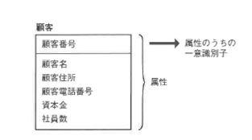
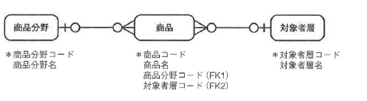

<html><body>
<h2>2.3 概念設計の手順（3/3）</h2>

<h3>2.3.4 属性と一意識別子の洗い出し</h3>
<h4 class="caption">属性とは</h4>

属性とは、エンティティがもつエンティティオカレンスに関する付加情報です。 エンティティオカレンスがもつ性質や特性を表現するもので、ユーザへのヒアリングや、現行業務で管理している帳票や画面から抽出します。 業務をよく知っているユーザに確認しながら、漏れなく抽出する必要があります。 管理すべき属性が漏れていると、実際の業務が遂行できなくなります。 また、属性の中には、業務の中だけでは類推できない、アプリケーションを実行するために追加で必要になるものもあります。 これについては、論理設計のフェーズでアプリケーションとつき合わせをする中で抽出します。

<!--/.section-->

<h4 class="caption">オプショナリティ</h4>

図2-23 属性の表記例

<!--/.grayBox-->

<!--/.section-->

<h4 class="caption">導出項目、重複項目を属性として定義するか</h4>

導出項目は元データがあって、そこから計算などによって導き出される項目のことです。 重複項目とは、他のデータからコピーして作られる項目であり、更新時の処理を考えると、1データ1箇所の原則からいって、両方とも存在していないほうが望ましいといえます。 原則的には、重複項目も導出項目も冗長なので、基本的には除きます。

DB設計の理論上は、正規化の観点から導出項目も重複項目も除くべきです。 しかし、分かりやすさと情報が欠落しない（導出項目だからという理由で削除してしまうと、本来管理されていたものが欠落してしまう）ことを重視するならば、業務で導出項目を使っている場合、ER図上に存在しても構わないと考えることができます。

たとえば、発注時の購入金額合計や買掛残高などは導出項目ですが、管理されるべき項目として挙げられます。 また、エンティティのライフサイクルの違いから作られる導出項目については、明示的に存在させるべきものもあります。

たとえば、商品販売単価などは、時の経過とともに変化する可能性があります。 しかし、受注エンティティで管理すべき商品販売単価は、受注したときに契約した商品販売単価です。 このような属性は、商品マスタを参照するのではなく、重複項目のように見えますが、受注明細エンティティでその時の商品販売単価として管理すべき属性です。

概念設計などの分析の初期段階では、業務上必要な情報は「漏れなく」洗い出すことが重要だといえます。 一度取り除いてしまうと、後から追加することは難しいため、導出項目や重複項目は、そうであることを明記して残しておくべきだということができるでしょう。

たとえば、以下のようなケースは、導出項目を残しておいたほうが良いと考えられます。

<ul>
<li>●画面、帳票上にでてくるデータ項目で、重要な意味をもつ</li>
<li>●その値を出すための計算が複雑で（エンティティをまたがった集計処理など）、導出のためのCPU負荷が大きい</li>
</ul>

概念設計では、導出項目であることを明記しておいて、データベース上に残すかどうかは、性能などの観点を考慮して論理設計で決定するようにします。

<!--/.section-->

<h4 class="caption">属性情報として管理すべき項日</h4>

属性として管理すべき項目を決めたら、次のような情報を収集します。

<!--/.section-->

<table class="tableBox">
<tr>
<th style="width:100px;" abbr="説明">説明</th>
<th abbr="属性を説明">属性を説明</th>
</tr>
<tr>
<td>オプショナリティ</td>
<td>属性値を、オカレンス生成時から必ずもつ必要があるか 
必須または任意</td>
</tr>
<tr>
<td>タイプ</td>
<td>データ型（文字、数値、日付、時刻、ドメインなど）と桁数</td>
</tr>
<tr>
<td>許容値</td>
<td>値の範囲や具体的な値リスト</td>
</tr>
<tr>
<td>ドメイン</td>
<td>ユーザが定義した、属性のとりうる値に関するルール</td>
</tr>
</table>

表2-3 収集する情報

表2-4に例を示します。

<!--/.section-->

<table class="tableBox">
<tr>
<th style="width:70px;" abbr="エンティティ">エンティティ</th>
<th style="width:60px;" abbr="属性名">属性名</th>
<th style="width:100px;" abbr="オプショナリティ">オプショナリティ</th>
<th style="width:60px;" abbr="タイプ">タイプ</th>
<th style="width:100px;" abbr="許容値">許容値</th>
<th abbr="説明">説明</th>
</tr>
<tr>
<td>顧客</td>
<td>顧客番号</td>
<td>必須</td>
<td>整数（5）</td>
<td>0001-99999</td>
<td>顧客を一意に特定するための番号</td>
</tr>
<tr>
<td>&nbsp;</td>
<td>顧客名</td>
<td>必須</td>
<td>氏名</td>
<td>0001-99999</td>
<td>顧客の姓名または法人名</td>
</tr>
<tr>
<td>&nbsp;</td>
<td>顧客名 フリガナ</td>
<td>必須</td>
<td>カナ</td>
<td>0001-99999</td>
<td>顧客名の読みガナ</td>
</tr>
<tr>
<td>&nbsp;</td>
<td>電話番号</td>
<td>必須</td>
<td>電話番号</td>
<td>0001-99999</td>
<td>顧客の自宅電話番号または法人の代表番号</td>
</tr>
<tr>
<td>&nbsp;</td>
<td>住所</td>
<td>任意</td>
<td>住所</td>
<td>0001-99999</td>
<td>顧客の自宅住所または会社住所</td>
</tr>
</table>

表2-4 管理すべき項目の例

<!--/.section-->

<h4 class="caption">属性のドメインを考える</h4>

ドメインは以下のように定義づけることができます。

属性を管理する際、データベースの中で整合性のとれた値を管理するために、ドメインをあらかじめ定義することができます。ドメインを定義することによって、属性に関しては、共通に管理できるデータ型、桁数などをそのつど定義する必要がなくなります。 また、ドメインを定義することによって、開発時の標準化を行うことになり、生産性が向上します。

また、データ型の定義などにおいて整合性がとれなくなることもなく、データの一貫性が保持できるというメリットがあげられます。

ドメインの例を表2-5に示します。

<!--/.section-->

<table class="tableBox">
<tr>
<th style="width:150px;" abbr="ドメイン">ドメイン</th>
<th abbr="意味・形式">意味・形式</th>
<th style="width:150px;" abbr="タイプ">タイプ</th>
</tr>
<tr>
<td>年月日（和）</td>
<td>平成yymmdd</td>
<td>文字（10）</td>
</tr>
<tr>
<td>年月日（西）</td>
<td>yymmdd</td>
<td>数値（8）</td>
</tr>
<tr>
<td>氏名</td>
<td>姓＋空白＋名</td>
<td>文字（30）</td>
</tr>
<tr>
<td>住所</td>
<td>都道府県名＋市区町村名＋番地</td>
<td>文字（30）</td>
</tr>
<tr>
<td>電話番号</td>
<td>xxxxx-xxxx-xxxx</td>
<td>文字（15）</td>
</tr>
<tr>
<td>金額</td>
<td>円単位の金額 zzz,zzz,zzz,zz9</td>
<td>数値（12）</td>
</tr>
<tr>
<td>重量</td>
<td>重さ 単位はkg 999999</td>
<td>数値（6）</td>
</tr>
<tr>
<td>識別番号</td>
<td>000001から999999まで</td>
<td>数値（6）</td>
</tr>
</table>

表2-5 ドメインの例

<!--/.section-->

属性について、もう少し実務に即して考慮してみましょう。 次のクイズに答えてください。

<!--/.section-->

<h5 class="quiz-title">クイズ3</h5>

誰がいつデータを更新したか、どうやって管理しますか？

<!--/.section-->

<h5 class="quiz-title">クイズ4</h5>

データを削除するとき、論理削除を実装しますか？ また、物理削除を実行しますか？

以下、解答を示します。

<!--/.section-->

<h5 class="answer-title">クイズ3の解答</h5>

マスタ表など、勝手に変更されては困るような表には、次のような列を定義しておき、アプリケーションで最終更新者の情報を表中に記述できるようにします。

<ul>
<li>●作成日</li>
<li>●更新日時</li>
<li>●更新者列</li>
</ul>

<!--/.section-->

<h5 class="answer-title">クイズ4の解答</h5>

会計に関係するデータを削除する場合は、削除の履歴が後から確認できるよう、赤黒処理と呼ばれる方法をとり、物理的に削除することはほとんどありません。 会計以外のアプリケーションでも、単純な削除を避ける場合は、論理削除という方法をとります。 表に削除フラグを設け、削除対象の行は削除フラグをONにします。 更新の場合も同様で、単純に更新するのではなく、更新の履歴を残すようにします。

ただし、これらの操作をした場合、検索の際、現在有効な行を検索するためには、必ず「削除フラグ＝0」という条件式をつけることが必要になってしまいます。 また、削除データは物理的に削除されないため、放っておくとデータ量は増加する一方なので、削除のための作業を検討する必要があります。

<strong>一意識別子</strong>

<ul>
<li>●エンティティオカレンスを一意に識別するための属性</li>
<li>●属性値は必須で、値は同じ属性の中で一意であること</li>
<li>●複数の属性（または属性とリレーションシップ）の組み合わせで構成することもできる</li>
</ul>

一意識別子になる属性は必ずしも1つに決まるわけではありません。 いくつかの候補のうち、最も処理に適した候補を論理設計の最終フェーズで一意識別子と決めればよいでしょう。

<!--/.yellowBox-->

<!--/.section-->

特に決まりはありませんが、一般的なER表記方法に従うと、以下の表記方法が使われています。

<ul>
<li>●属性に識別子であることを明確にするための印「★」をつける</li>
<li>●エンティティの外側に識別子のみを記述する</li>
<li>●エンティティの四角の内側に横線を引き、その上部に位置するのが一意識別子または一意識別子の組み合わせとする</li>
</ul>

表記例を図2-24に示します。

図2-24 一意識別子の表記例

<!--/.grayBox-->

一意識別子の候補となる属性または属性の組み合わせを候補キーと呼びます。

<strong>候補キー</strong>

エンティティのどの属性YもXに関数従属であり（一意性）、Xが極小（または非冗長）であるとき、Xを<strong>候補キー</strong>と呼びます。

<!--/.yellowBox-->

エンティティオカレンスを一意に特定できる属性であれば、識別子になり得るので、候補キーは複数存在することもあります。 概念設計では、一意識別子になり得る属性を、候補キーという形で洗い出しておき、最終的には論理設計で一意識別子を決めます。

<strong>連結キー</strong>

複数の属性でエンティティオカレンスを一意に識別できる場合、この複数属性のことを連結キーまたは<strong>複合キー</strong>といいます。 また、外部キーが連結キーの一部になる（リレーションシップが連結キーの一部になる）場合もあります。

<!--/.yellowBox-->

<!--/.section-->

<h4 class="caption">一意識別子の抽出</h4>

概念設計では、「現在の業務の中で使用されている」そして「候補になり得る」属性を一意識別子とします。 人工的にキーを作成するのは論理設計の段階で行います。 なぜかというと、この段階で人工キーを作成してしまうと、何をもってオカレンスを一意に特定するのかの定義があいまいになってしまうからです。 厳密に属性の組み合わせで一意識別子を定義することによって、エンティティオカレンスの意味が明確になります。 また、属性の組み合わせで一意にすることによって、オカレンスの一意性を確実にするという意味もあります。 人工的なキーを作成してしまうと、人工キーの値が一意でさえあれば、属性の値の組み合わせが同じであってもオカレンスを作成することができてしまいます。

概念設計では、このよう人工キーは作成せず、パフォーマンスの観点などから必要であれば、論理設計で人工キーを検討し、その際には先に一意識別子であった属性の組み合わせは一意キーとして制約を追加するなどして対応すべきと考えられます。

<!--/.section-->

<h4 class="caption">一意識別子とコード体系</h4>

一意識別子は、汎用機の時代には「コード」として、値そのものに意味をもたせるのが一般的でした。 その場合、アプリケーション側でコードを分解してその意味を照合するなどの必要がありました。

次のクイズは、そのような汎用機の時代に使われていたコードに関する質問です。

<!--/.section-->

<h5 class="quiz-title">クイズ5</h5>

現在の業務で使用されているコード体系を見直してみました。 新しいシステムではコードに意味をもたせず、必要に応じてエンティティという形で管理しようと考えています。 考えられるエンティティ、リレーションシップ、一意識別子を表しなさい。

<!--/.section-->

<table class="tableBox">
<tr>
<th style="width:120px;" abbr="コードの種類">コードの種類</th>
<th style="width:120px;" abbr="現行のコード">現行のコード</th>
<th abbr="現行のコードがもつ意味">現行のコードがもつ意味</th>
</tr>
<tr>
<td>商品コード</td>
<td>X01A</td>
<td>先頭1バイトが商品分野を示す 
（カジュアル、フォーマル、アウトドア、スポーツなど） 
次の2バイトが連番、最後の1バイトがバージョンを示す</td>
</tr>
<tr>
<td>商品カタログコード</td>
<td>AA101</td>
<td>先頭2バイトが対象層を示す（メンズ、レディス、キッス、ベビーなど） 
次の3バイトが連番を示す</td>
</tr>
</table>

表2-6 コード体系

<!--/.section-->

<h5 class="answer-title">クイズ5の解答例</h5>

図2-25 エンティティ、リレーションシップ、一意識別子の表記例

<!--/.grayBox-->

エンティティおよび一意識別子作成時の方針を説明します。

<ul>
<li>●商品エンティティの一意識別子「商品コード」は、そのコード自体に意味をもたせない</li>
<li>●どのような商品分野や対象者層が売れ筋かといった分析を行うためには、 　分析の軸となるエンティティをそれぞれ作成し、管理するこれによって、 　商品力タロクコードというコードで管理する必要はなくなる</li>
<li>●分析の軸となるエンティティを作成することによって、 　エンティティオカレンスが増加しても（たとえば、扱う商品分野が増加するなど）モデルを変更する必要はない 　この形の場合、できれば、分析軸となるエンティティは最初に抽出しておくことが望ましい</li>
</ul>

<!--/.section-->

<h3>2.3.5 概念データモデルの検証</h3>

概念設計フェーズで必要なエンティティ、属性、リレーションを分析し終わったら、必要なデータがすべて抽出されているかという観点で検証作業を行います。 概念データモデルを検証する場合には、以下の2つの観点から検証してください。

<!--/.section-->

<h4 class="caption">データモデルとして見直す</h4>

<ul>
<li>●業務と矛盾していないか（業務要件を満たすエンティティ、属性が揃っているか）</li>
<li>●リレーションシップは適切か</li>
<li>●第3正規形を満たしているか</li>
</ul>
<!--/.section-->

<h4 class="caption">プロセスから見直す</h4>

<ul>
<li>●プロセスから見て必要な入出力データはすべて定義されているか</li>
<li>●データから見てライフサイクル（CRUD：Create、Reference、Update、Delete）を管理するためのプロセスは揃っているか</li>
</ul>

また、検証する際のポイントは以下のとおりです。

<ul>
<li>●導出項目、重複項目が「導出項目、重複項目である」と明記してモデルに残されているか</li>
<li>●将来の拡張性を考慮して属性をエンティティとしておく、将来管理されるべきデータをエンティティとして作成してあるか</li>
<li>●ER図の解答は1つになるとは限らない。誤りは正す必要があるが、許容範囲内の差異について無駄な時間を浪費しない</li>
</ul>
<!--/.section-->

<h4 class="caption">プロセスから見た拡張性のあるER図</h4>

難しいのは、拡張性を見越したエンティティの抽出でしょう。 逆にいうと、ユーザの要求を把握できたコンサルタントの腕の見せ所かもしれません。 ここでは、一般的にプロセス処理を考慮した、拡張性のあるエンティティの設計のポイントをまとめます。

<ul>
<li>１．今は1対多であるが、将来的に多対多になりそうなもの： 　　履歴まで管理しようとすると、多対多になるものがほとんどになるが、なんでも多対多にしない。 　　履歴を管理する必要があるかどうかを検討して決める。</li>
<li>２．履歴データの扱い： 　　1つ前のデータだけもっていればよい場合には、同一エンティティ内に旧項目1つを管理するための属性をもたせる</li>
<li>３．削除や変更の取り消し（undo機能）： 　　変更を遡って管理しなければならないもの、変更の理由などを管理すべき場合は、履歴扱いにする</li>
<li>４．管理すべきカテゴリ（商品タイプなど）が増加しそうなもの： 　　サブタイプとして管理する。商品タイプが追加された場合、サブタイプを追加することで対応できるようにする</li>
</ul>
<!--/.section-->

<h4 class="caption">CRUDマトリクス分析</h4>

プロセスとデータの両方の観点から抜け、漏れ、過度の集中、不完全な分割がないか、という観点でCRUDマトリクスを使用した分析を行います。手順と例を示します。

<strong>【STEP1】</strong>マトリックスの作成

<ul>
<li>●識別されたエンティティと、プロセス分析で作成されたDFDの結果をマトリックスの形でまとめる</li>
<li>●両者の交点に、オカレンスのCRUD記号を記述する 　C：Create R：Retrieve U：Update D：Delete</li>
</ul>

<strong>【STEP2】</strong>データのライフサイクルの確認 CRUDマトリクスを使用して、以下の点をチェックする

<ul>
<li>●プロセスの観点から必要なエンティティ（I/O）が揃っているか</li>
<li>●エンティティを使用しないプロセスはないか</li>
<li>●プロセスに関与しないエンティティがないか（その場合、機能が漏れていないか）</li>
<li>●エンティティと機能のアンバランス</li>
<li>　　●エンティティに対応するCRUDのどれかが欠けていないか</li>
<li>　　●1つの機能にCRUDが集中（機能分割が不十分）していないか</li>
<li>　　●1つの機能で複数のエンティティのC、Dに関与していないか</li>
<li>　　●複数の機能が1つのエンティティのCに関与（機能の重複）していないか</li>
</ul>

<strong>【STEP3】</strong>その他のCRUDマトリクスを使用した分析例

<!--/.yellowBox-->

<!--/.section-->

<h4 class="caption">プロセスの複雑さの確認</h4>

同時に複数のエンティティを処理するプロセスは、その構造が複雑であることを示します。 適切に機能分割が行われているかを確認する必要があります。 単純検索、単純更新のような処理では、処理時間（レスポンスタイム）に注意する必要があります。

<!--/.section-->

<h4 class="caption">データのアクセス頻度の確認</h4>

複数のプロセスからアクセスされるデータは、アクセス頻度が高くなり、I/0のボトルネックになる可能性があります。 物理設計でデータの配置に注意します。

<!--/.section-->

<h4 class="caption">サブシステム分割の日安</h4>

「C（生成）」がマトリックスの左上から右下に並ぶように配置し、エンティティに対するCRUDの近いプロセス群を1つのサブシステムとみなし、分割の目安とします。 同一のプロセスから頻繁に同時にアクセスされる複数のエンティティは、正規化によって分割されていますが、非常に親和性の高いエンティティであることがわかります。 物理設計時、クラスタ化表の対象として考慮します。

それでは、この事の最後にCRUDマトリクスを使った簡単な検証作業を行うクイズに挑戦してみてください。

<!--/.section-->

<h5 class="quiz-title">クイズ6</h5>

以下のCRUDマトリクスを分析し、修正すべき点を指摘し、修正案を示しなさい。

<!--/.section-->

<table class="tableBox" style="text-align:center;">
<tr>
<th style="width:80px;" abbr="null">&nbsp;</th>
<th style="width:70px;" abbr="1.入会">1.入会</th>
<th style="width:70px;" abbr="2.受注">2.受注</th>
<th style="width:70px;" abbr="3.納品">3.納品</th>
<th style="width:70px;" abbr="4.請求">4.請求</th>
<th style="width:70px;" abbr="5.受注">5.受注 処理</th>
<th style="width:70px;" abbr="6.入荷">6.入荷 検査</th>
<th style="width:70px;" abbr="7.契約">7.契約 解除</th>
</tr>
<tr>
<th abbr="1.会員">1.会員</th>
<td>C</td>
<td>R</td>
<td>R</td>
<td>&nbsp;</td>
<td>&nbsp;</td>
<td>&nbsp;</td>
<td>D</td>
</tr>
<tr>
<th abbr="2.受注">2.受注</th>
<td>&nbsp;</td>
<td>C</td>
<td>R</td>
<td>&nbsp;</td>
<td>&nbsp;</td>
<td>&nbsp;</td>
<td>&nbsp;</td>
</tr>
<tr>
<th abbr="3.受注明細">2.受注明細</th>
<td>&nbsp;</td>
<td>C</td>
<td>R/U</td>
<td>R</td>
<td>&nbsp;</td>
<td>&nbsp;</td>
<td>&nbsp;</td>
</tr>
<tr>
<th abbr="4.商品">4.商品</th>
<td>&nbsp;</td>
<td>R</td>
<td>&nbsp;</td>
<td>&nbsp;</td>
<td>R/C</td>
<td>U</td>
<td>&nbsp;</td>
</tr>
<tr>
<th abbr="5.在庫">5.在庫</th>
<td>&nbsp;</td>
<td>R</td>
<td>&nbsp;</td>
<td>&nbsp;</td>
<td>R/C</td>
<td>U</td>
<td>&nbsp;</td>
</tr>
<tr>
<th abbr="6.仕入先">6.仕入先</th>
<td>&nbsp;</td>
<td>&nbsp;</td>
<td>&nbsp;</td>
<td>&nbsp;</td>
<td>R</td>
<td>&nbsp;</td>
<td>&nbsp;</td>
</tr>
<tr>
<th abbr="7.発注">7.発注</th>
<td>&nbsp;</td>
<td>&nbsp;</td>
<td>&nbsp;</td>
<td>&nbsp;</td>
<td>C</td>
<td>U</td>
<td>&nbsp;</td>
</tr>
<tr>
<th abbr="8.売掛金">8.売掛金</th>
<td>&nbsp;</td>
<td>&nbsp;</td>
<td>C</td>
<td>C/U</td>
<td>&nbsp;</td>
<td>&nbsp;</td>
<td>&nbsp;</td>
</tr>
</table>

表2-7 CRUDマトリクス修正前

<!--/.section-->

<h5 class="answer-title">クイズ6の解答例</h5>

エンティティの上から順に解説します。

<ul>
<li>●会員情報の更新プロセスがないので、入会プロセスに会員メンテナンスプロセスを追加する</li>
<li>●受注/受注明細情報の更新、削除プロセスがないので、受注プロセスに受注変更、削除プロセスを追加する</li>
<li>●商品情報の更新、削除プロセスがないので、商品マスタメンテナンスプロセスを追加する</li>
<li>●在庫情報の削除プロセスがないので、商品マスタメンテナンスプロセスを追加する</li>
<li>●仕入先データの作成、更新、削除プロセスがないので、仕入先マスタメンテナンスプロセスを追加する</li>
<li>●発注情報の削除プロセスがないが、実際には発注処理プロセスで処理しているはずなので、表記を追加する</li>
<li>●売掛金データの参照、消し込みプロセスがないので、入金プロセスを追加する。それに伴い入金エンティティも追加する</li>
<li>●支払いプロセスがないので、追加する。支払いエンティティも追加する</li>
</ul>

本章では、概念設計の手順とER図の作成方法について紹介しました。 トップダウンの分析とボトムアップの分析を組み合わせて、拡張性の高い、業務に即した、理想的なデータ管理を実現するER図を作成することを心がけてください。

<!--/.section-->

