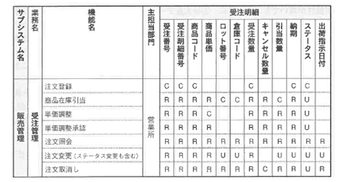
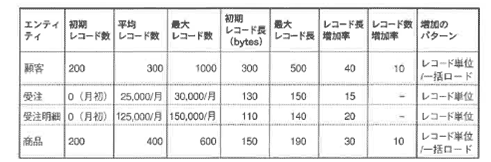

<html><body>
<h2>3.3 論理設計の手順（1/4）</h2>

論理設計で行う作業を以下に示します。

<ul>
<li>●処理機能と要件から性能を出すための最適化を行う。</li>
<li>●論理ER図をRDBにマッピングできるようにする。</li>
<li>●可能な限り正規化は崩さず、処理性能を高くする。</li>
</ul>

ブレークダウンし、手順を示します。

<strong>【STEP1】</strong> 業務に対するユーザ要件を検討する

<strong>【STEP2】</strong> データ量を見積もる

<strong>【STEP3】</strong> 処理性能を出すための最適化の検討を行う

　　●インデックスを設計する 　　●非正規化を検討する

<strong>【STEP4】</strong> バッチ処理などアプリケーションを考慮し、必要な属性を再検討する（状態の遷移を表すフラグなど）

<strong>【STEP5】</strong> 一意識別子の検討を行う

<strong>【STEP6】</strong> 一貫性制約を見直す

<strong>【STEP7】</strong> ビューとアクセス権限の設計を行う

<strong>【STEP8】</strong> 論理ER図からRDBへ変換するための準備をする

<!--/.yellowBox-->

これらの処理を実行する前に、次のことを明らかにする必要があります。

<ul>
<li>●ユーザの処理要件（業務）</li>
<li>●ユーザが求める性能要件</li>
<li>●予想される（または現状の）ピーク時のトランザクション数などのシステム環境</li>
<li>●データベースに対して発行されるSQL</li>
</ul>
<!--/.section-->

<h3>3.3.1 ユーザ要件の確認（業務プロセスの確認）</h3>

業務（プロセス）に対するユーザ要件を収集し、論理設計で必要な処理を整理します。

まず、プロセス設計でどのように処理の単位を分割しているかを調べます。 表3-1は、販売管理サブシステムで定義されている各業務の説明と利用部門、処理形態をマトリクスにしたものです。

<!--/.section-->

<table class="tableBox">
<tr>
<th style="width:65px;" abbr="業務">業務</th>
<th style="width:100px;" abbr="機能">機能</th>
<th abbr="内容">内容</th>
<th style="width:70px;" abbr="備考">備考</th>
<th style="width:80px;" abbr="利用部門">利用部門</th>
<th style="width:80px;" abbr="処理形態">処理形態</th>
</tr>
<tr>
<td rowspan="5">受注管理</td>
<td>受注の記録</td>
<td>顧客からの入力することによって受注を登録する</td>
<td>&nbsp;</td>
<td>営業所</td>
<td>Online</td>
</tr>
<tr>
<td>商品引当管理</td>
<td>商品の引当が可能かどうかを検索し、可能であれば引当処理を行う</td>
<td>仮引当</td>
<td>営業所</td>
<td>Online</td>
</tr>
<tr>
<td>発注の登録</td>
<td>受注数に対して引当数が不足した商品について、発注の登録を行い、注文書を作成する</td>
<td>発注業務への橋渡し</td>
<td>営業所</td>
<td>Online</td>
</tr>
<tr>
<td>受注の変更/ 確定</td>
<td>すべての受注明細を確定し、仮引当状態だった商品を引当する</td>
<td>受注確定</td>
<td>営業所</td>
<td>Online</td>
</tr>
<tr>
<td>受注の取消し</td>
<td>出荷済みでなければ、注文キャンセル処理を行う</td>
<td>注文取消し</td>
<td>営業所</td>
<td>Online</td>
</tr>
</table>

表3-1 販売管理サブシステムの機能分割表

<!--/.section-->

次に、表3-1の中の機能単位にブレークダウンし、どのようなエンティティにどのようなアクセス（SQLによるデータベースアクセス）をしているかを分析します。 表3-2は、機能ごとに対象となるエンティティに対して具体的にどのようなSQLが実行されるかを分析するために必要な情報の定義と具体例です。

<!--/.section-->

<table class="tableBox">
<tr>
<th style="width:170px;" abbr="要件">要件</th>
<th abbr="説明">説明</th>
</tr>
<tr>
<td>機能処理内容</td>
<td>処理で使用されるエンティティと処理内容</td>
</tr>
<tr>
<td>操作パターン</td>
<td>Insert/Retrieve/Update/Deleteのいずれか</td>
</tr>
<tr>
<td>条件指定の有無</td>
<td>WHERE条件式の内容</td>
</tr>
<tr>
<td>要求性能</td>
<td>処理に要求される応答時間</td>
</tr>
<tr>
<td>処理形態</td>
<td>オンライン/バッチ</td>
</tr>
<tr>
<td>処理実行のタイミング</td>
<td>処理が行われる時期、時間帯</td>
</tr>
<tr>
<td>実行頻度</td>
<td>単位時間内に実行される処理の数</td>
</tr>
<tr>
<td>処理データ量</td>
<td>1操作当りに処理されるデータ量/レコード件数</td>
</tr>
<tr>
<td>実行ユーザ</td>
<td>業務を実行するユーザ</td>
</tr>
</table>

表3-2 機能処理要件定義

<!--/.section-->

表3-3は、表3-2の定義に基づいた具体例です。

<!--/.section-->

<table class="tableBox">
<tr>
<th style="width:170px;" abbr="要件">要件</th>
<th abbr="具体例">具体例</th>
</tr>
<tr>
<td>機能処理内容</td>
<td>商品引当管理：各倉庫の商品在庫を確認し、受注数量と比較し、十分あれば引き当てる</td>
</tr>
<tr>
<td>操作パターン</td>
<td>検索、更新</td>
</tr>
<tr>
<td>条件指定の有無 条件式＝「エンティティ名．属性名条件式値」</td>
<td>在庫．商品コード＝値 在庫．倉庫コード＝値 在庫．有効在庫数量＞値</td>
</tr>
<tr>
<td>使用されるエンティティ</td>
<td>在庫、商品マスタ、倉庫マスタ、受注、受注明細</td>
</tr>
<tr>
<td>要求性能</td>
<td>3秒以内のレスポンス</td>
</tr>
<tr>
<td>処理形態</td>
<td>オンライン</td>
</tr>
<tr>
<td>処理実行のタイミングと実行頻度</td>
<td>受注あり次第、随時。ピーク時は営業が帰社した後の20:00-22:00</td>
</tr>
<tr>
<td>ピーク時トランザクション量</td>
<td>ピーク時、5,000件/時</td>
</tr>
<tr>
<td>処理データ量</td>
<td>平均5レコード/処理　100バイト/レコード</td>
</tr>
<tr>
<td>実行ユーザ</td>
<td>営業部門、調達部門</td>
</tr>
</table>

表3-3 機能別処理要件表

<!--/.section-->

このような機能処理ごとの情報を収集し、概念設計時に作成したCRUDマトリクスに「機能別処理要件」を追記して表3-4のようにまとめることができます。 表3-4「機能別処理要件付きCRUD」はエンティティ単位の処理要件しか分析していませんが、CRUDの基になっている表3-3「機能別処理要件表」では、エンティティの属性で設定する条件式まで分析しています。 処理要件から性能要件を満たすための方法を考察するには、属性のレベルで条件式まで分析されていないと十分な施策を打つことはできません。

表3-4 機能別処理要件付きCRUD

<!--/.grayBox-->

<!--/.section-->

<h4 class="caption">性能要件の検討</h4>

<ul>
<li>１．SQL文の種類</li>
<li>２．ユーザ要求性能（レスポンスタイム）と優先度</li>
<li>３．アクセス頻度（ピーク時の同時処理数）</li>
<li>４．アクセス対象のエンティティ</li>
<li>５．処理対象データ量</li>
<li>６．SQLで指定する条件式（項目と演算子、値のとり得る範囲）：その条件のもとでいかに性能を発揮するかを検討する。 　　索引の作成、非正規化、テーブル構造の変更など</li>
</ul>

実際の1.SQL文を記述し、5.実際の処理対象データ量に近い環境で、3.ピーク時のトランザクション量のもとで実行し、2.ユーザの要求性能と比較します。

テスト環境では5.や3.が実際の環境と異なるため、正確な性能値を求められない可能性が高いでしょう。 特に、5.は大量データを対象にSELECT文を発行して分析処理を行うような処理の場合に影響が大きく、3.は1件の処理対象件数は少ないが、同時にアクセスするユーザ数が多いようなオンラインの業務処理の場合に影響が大きいので、注意する必要があります。

また、アクセス頻度の低いSQLをチューニングしても、ユーザの期待する効果と一致しない場合があるため、ユーザにとってのチューニングの優先度も確認しておく必要があります。 性能要件を満たすためには、SQL文がどのように実行され、その際の性能を決める要因を洗い出して対策を講じる必要があります。

対策はいくつかありますが、論理設計では、索引の設計と、非正規化を検討します。 性能要件を検討するためには、これだけではなく、物理設計の段階で以下のような検討を行います。

これらについては、「<a href="../../04_01/index.md">第4章 物理設計</a>」で説明します。

<!--/.secton-->

<h4 class="caption">アクセス権限の検討</h4>

業務の機能単位にSQL文が定義できたら、それを実行するユーザまたはユーザグループと、そのSQL文を実行するのに必要な権限情報を検討します。 そのために、表3-5のような表を作成します。

表3-5　エンティティ別棟能別アクセス権限対応表（受注明細エンティティ）

<!--/.grayBox-->

これは、機能ごとに、エンティティに対してユーザグループが各属性にどのようなアクセスをするかを検討した結果です。

これを元に、ユーザグループに適切なアクセス権限を付与します。 挿入、更新、削除に関する適切な権限を、限られたユーザグループに、限られた属性単位で付与する設定を設けておかないと、データベース内のデータの信頼性を維持することはできません。

また、情報の取得という意味で、参照の際にも適切な権限を設定する必要があります。 属性の単位でSELECT（参照）権限を設定するために、ビューというオブジェクトを作成します。 適切なエンティティから必要な属性を参照するために、ビューというオブジェクトを作成し、ユーザグループに、ビューヘの参照権限を付与します。

<ul>
<li>１．各機能を実行するユーザを定義する</li>
<li>２．機能ごとにユーザがどのようなアクセスを各エンティティ内の属性に行うかを分析する </li>
<li>　　●ユーザに、属性単位で適切なアクセス権限を設定する</li>
<li>　　●必要なビューを定義し、ユーザに適切な権限を与える</li>
</ul>

表3-6 エンティティ別棟能別アクセス権限対応表（在庫エンティティ）

<!--/.grayBox-->

表3-6「エンティティ別機能別アクセス権限対応表（在庫エンティティ）」を基に、商品別在庫引当機能に必要なビュー「zaiko_hikkikae_v」を作成し、適切なユーザグループ「eigyo」にアクセス権限を与えます。

<!--/.section-->

<h4 class="caption">ビューの作成</h4>

CREATE VIEW zaiko hikiate_v AS SELECT s.倉庫コード,s.倉庫名, 　　　　　　　　　sh.商品コード,sh.商品名,sh.商品名カナ, 　　　　　　　　　z.有効在庫数 FROM 在庫データ z,商品マスタ sh,倉庫マスタ s WHERE sh.商品コード=z.商品コード AND z.倉庫コード=s.倉庫コード AND z.在庫区分=0 AND z.良品区分=0;

<!--/.yellowBox-->

<!--/.section-->

<h4 class="caption">ビューに対する処理担当者への権限の付与</h4>

GRANT SELECT ON zaiko hikiate_v to elgyo,cyotatu; GRANT UPDATE（有効在庫数） ON zaiko_hikiate_v to eigyo, cyotatu;

<!--/.yellowBox-->

<!--/.section-->

<h3>3.3.2 データ量の確認</h3>

<h4 class="caption">データ量の初期値、最大値を確認</h4>

エンティティごとに次の情報を収集して、データベース内でデータ量がどのように変化するかを確認します。

<!--/.section-->

<table class="tableBox">
<tr>
<th style="width:100px;" abbr="情報">情報</th>
<th abbr="説明">説明</th>
</tr>
<tr>
<td>初期データ量</td>
<td>システム稼動直後の初期レコード数、初期レコード長（Insert時の項目数、平均レコード長）</td>
</tr>
<tr>
<td>平均データ量</td>
<td>平均のレコード数、平均レコード長</td>
</tr>
<tr>
<td>最大データ量</td>
<td>最大レコード数、最大レコード長（Insert後にUpdateされてレコTド長が長くなる場合、最大（終）レコード長との違いが重要）</td>
</tr>
<tr>
<td>増加率</td>
<td>レコード長の増加率、レコード数の増加率（漸次増加していくの か、デイリーバッチで一括ロードされるのかなどデータ増加のパターン）</td>
</tr>
</table>

データベースのデータ量の増加パターンとしては、大きく分けて2通りあります。

DBMSとしては、レコード数が増加する方が、データベースとして自然な増加と考えられます。 Oracleデータベースを例に挙げてみると、レコード数が増加する場合、増加した分は、格納されるブロックが次々に追加されていくイメージとなります。

一方、レコード長が長くなる場合は、最初にInsertされたレコードが、余裕のない状態で格納されているため、レコード長が長くなった場合、そのままでは処理を続行できません。 そこで、あらかじめブロック内にPCTFREEというパラメータで空き領域を設けておき、長くなったレコードをブロック内の空き領域に移動するという処理を行います。 詳しくは第4章「物理設計」で紹介します。

データ量に関するサンプル表を表3-8に示します。

表3-8 データ量の例

<!--/.grayBox-->

<!--/.section-->

<h4 class="caption">アクセス頻度を確認</h4>

エンティティごとに、アクセス頻度を、ビジネスカレンダー日付、時間帯ごとに収集します。 その際、実行されるアプリケーションの種類も確認します（OLTP系の処理か、あるいはDSS系またはバッチ処理か）。

<ul>
<li>●単位時間あたりの平均更新件数/アクセス件数</li>
<li>●単位時間あたりのピーク時更新件数/アクセス件数</li>
<li>●ピークの時間帯（営業が外回りから帰ってきた後18：00-20：00など）</li>
<li>●1日あたりの更新件数/アクセス件数</li>
<li>●1日あたりの更新件数/アクセス件数</li>
<li>●処理件数が日によって偏りがある場合、ピークになる日（15/月末）、月</li>
</ul>

表3-9 アクセス頻度確認表

<!--/.grayBox-->

<!--/.section-->

<h4 class="caption">運用スケジュールの検討と物理構成の検討</h4>

業務のタイムスケジュール、処理を行うロケーションなどをヒアリングすることによって、処理が集中しないよう、システムの運用スケジュールを作成します。

<ul>
<li>１．機能単位の処理要求頻度</li>
<li>２．業務全体の稼動スケジュール</li>
<li>３．システムおよび業務実施のロケーション</li>
</ul>

また、業務を実行しているロケーションから、ネットワークの見積もり、必要であれば分散システム環境を提案します。 ただし、これらの作業はアプリケーションの運用設計、データベースの物理設計で行います。

<ul>
<li>●各プロセスのピークが重複しないよう、システム全体の運用スケジュールを作成（運用設計）</li>
<li>●分散環境、ストライプ化等を含めたシステムの物理的な構成を設計（物理設計）</li>
</ul>

以上が、論理設計、物理設計に必要な収集データに関する紹介です。 これらのデータを使って、いかに性能のでるデータベースを設計するかを考えていきます。

<!--/.secton-->

</body></html>