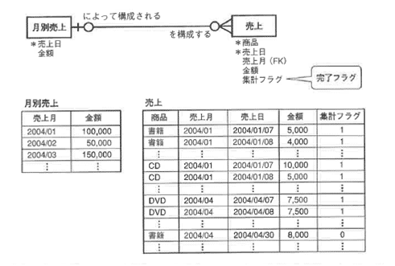
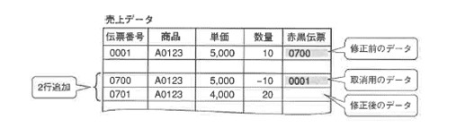

<html><body>
<h2>3.3 論理設計の手順（3/4）</h2>

<h3>3.3.4　属性の再検討</h3>

論理設計では最終的に表を作成する直前の状態まで準備する必要があります。 そこで、アプリケーションサイドからの属性の見直しを実施します。

論理設計では、概念設計で分析したER図には表現されていない、「フラグ」のようなアプリケーションに必要な情報を追加する必要があります。

たとえば次のような例があります。

<ul>
<li>●バッチ処理などを考慮した場合の完了フラグ</li>
<li>●アプリケーション上、状態の遷移を表す状態遷移フラグ</li>
<li>●会計処理で修正を記録として残すための赤黒処理</li>
<li>●更新日と更新者</li>
</ul>

このように、エンティティのライフサイクル分析だけでは見つからず、アプリケーションを介して処理を行うために、エンティティオカレンスの状態を管理する属性（フラグ）が必要になる場合があります。

順に例をみていきましょう。

<!--/.section-->

<h4 class="caption">バッチ処理などを考慮した場合の完了フラグ</h4>

図3-13 完了フラグ

<!--/.grayBox-->

<!--/.section-->

<h4 class="caption">状態の遷移を表す状態遷移フラグ</h4>

図3-14 受注から支払いまでの状態遷移図の例

<!--/.grayBox-->

図3-14のような状態遷移図をアプリケーション開発チームに作成しておいてもらい、間違いなくすべての状態を管理できるように確認する必要があります。 また、ある状態に遷移したらこの処理はできないなどの情報も盛りこんでおきます。

この場合、たとえば下から2番目の「受注取消し」は、「出荷指示完了」状態以降は処理できないことを示しています。

<!--/.section-->

<h4 class="caption">会計処理で修正を記録として残すための赤黒処理</h4>

日本の業務システムでは、売上データや入金データなど、会計にかかわるデータを修正/削除する場合、赤黒処理を行います。

図3-15 赤黒処理

<!--/.grayBox-->

赤黒処理は会計伝票を訂正するときに通常伝票を黒インク、逆仕訳用の取消し伝票を赤インクで書いたことから由来しています。 図3-15の例では、伝票番号700番で、伝票番号0001番の受注を取り消し、伝票番号701番で修正後のデータを新規に登録しています。最終的に集計処理などをする場合には、701香の伝票のみを使用して計算を行うことになります。

会計に直結するデータは赤黒処理を行いますが、受注データや商品移動データなど、会計に直結しないデータは通常赤黒処理は行いません。

<!--/.section-->

<h4 class="caption">更新日と更新者</h4>

重要なマスタテーブルやトランザクションテーブルについては、最終更新日と更新者の情報を残しておくために、必要な属性を追加しておきましょう。

このようなログ情報をどこまでとっておくかは意見が分かれます。 変更履歴や、過去の変更前情報は、オンラインで処理する必要がある滞留期間を決めておきます。 時期を過ぎたらテープに吸い上げるなどにより、ディスク上の領域からは削除し、不要なデータは残さないようにします。 検索対象のデータが減ることによって、無駄な検索は行う必要がなくなります。 このようなまめな処理を積み重ねることによって、パフォーマンスのよいデータベースを維持できるのです。

<!--/.section-->

</body></html>