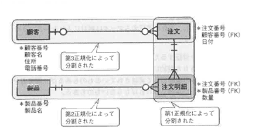
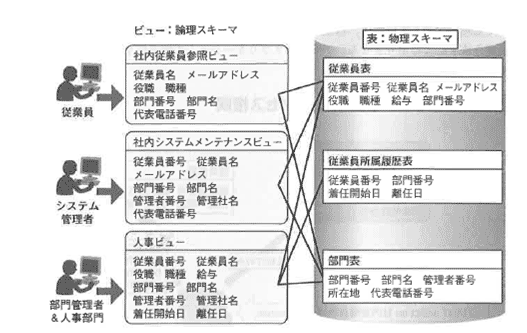
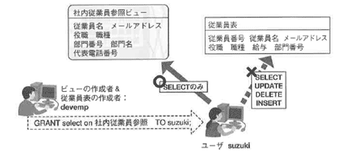
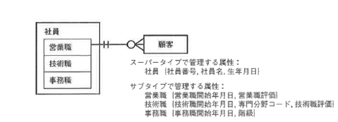
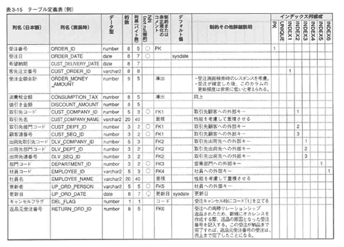

<html><body>
<h2>3.3 論理設計の手順（4/4）</h2>

<h3>3.3.5 一意識別子の見直し</h3>

<h4 class="caption">一意識別子に人工キーを使用する</h4>

受注明細表の一意識別子は、概念設計が完了した時点で以下の5つの属性の組み合わせになると考えられます。

<ul>
<li>●受注番号（FK）</li>
<li>●商品コード</li>
<li>●ロット番号</li>
<li>●受注明細種類コード</li>
<li>●受注明細種類コード連番</li>
</ul>

受注明細表は次の特徴をもちます。

<ul>
<li>●他の「複数の」エンティティから参照されるエンティティであること 　その場合、他のエンティティからの参照キーは受注明細表の一意識別子であり、 　他のエンティティの外部キー列として挿入されることになり、容量的にも多くの領域をとることになります</li>
<li>●他のエンティティと結合して参照される、または更新のためにアクセスされる頻度が高い表であること 　5つの属性の組み合わせで一意識別子とすると、他のエンティティとの結合の場合、 　5つの属性値を比較して結合条件を満たすことを確認する必要があり、結合のコストが高くなってしまいます</li>
</ul>

このような場合、論理設計の段階で人工キーを作成します。 受注明細の場合、受注エンティティとの結合キーである「受注番号」と、受注番号ごとに一意の値を発番する人工キー「受注明細番号」を組み合わせて一意識別子とすることを考えます。 人工キーを作成する基準が明確にあるわけではないのですが、次のポイントを目安にしてください。

<ul>
<li>●頻繁に他のエンティティと結合する</li>
<li>●複数のエンティティと結合する</li>
<li>●複数の属性の組み合わせで一意識別子が定義される</li>
</ul>

人工キーは安易につけられることが多いのですが、次の点に気をつけて、本来の一意識別子の意味をはずさないようにしてください。 人工キーには意味がないので、何の定義をもって一意なオカレンスとするかの意味が失われてしまいます。 そのため、人工キーにつける主キー制約の本来の意味はなく、誤って重複してはいけない属性値の組み合わせでオカレンスが作成されてしまう可能性があります。 そこで、整合性を維持するために、元の一意識別子の組み合わせでユニーク制約を設定する場合もあります。

次に、受注明細の人工キーについて、クイズで考えてみてください。

<!--/.section-->

<h5 class="quiz-title">クイズ3</h5>

受注明細テーブルの主キーはこのままでよいか検討しなさい。

<ul>
<li>●【受注番号＋商品コード】 　同じ商品を追加で受注した場合、別の行としては挿入できない</li>
<li>●【受注番号＋行番号】 　行の途中挿入をしたり削除をすると表示が意図どおりにならない 　（同じ商品は続きの行に表示したい。しかしそこに挿入するとその後の行番号（主キー列の値）を 　すべてずらさなければならなくなる）</li>
</ul>
<!--/.section-->

<h5 class="answer-title">クイズ3の解答例</h5>

<ul>
<li>１．「行連番」という連番キーを内部的に追加する</li>
<li>２．「売上番号＋行連番」＝主キーとする</li>
<li>３．「表示行番号」という属性も追加し、非主キー列として画面や帳票における表示番号を 　　表す数値列として追加する。既存の売上行に追加で行を挿入する場合は、 　　非主キー列の順序は再採番する</li>
</ul>

属性、一意識別子の見直しが完了したら、それぞれの値の整合性を維持するための一貫性制約について見ていきます

<!--/.section-->

<h3>3.3.6 一貫性制約の検討</h3>

<h4 class="caption">一貫性制約とは</h4>

データベースの信頼性を維持するために、DBMSの機能として実装されているものと、アプリケーションで実装するものがあります。

DBMSの制約は、アプリケーションで実装するわけではないので、漏れや抜けがなく、データベースに実際の値が入る直前にチェックし、これに違反するデータは絶対に入れないというルールを確立することができます。

<ul>
<li>●データの整合性を保証するためのルール</li>
<li>●データは、定義された制約に基づき、挿入、更新、削除される</li>
<li>●制約は、RDBMSの機能として実装されているものもあるが、開発者がDBトリガーなどを使って 　実装しなければならないものもある</li>
</ul>
<!--/.section-->

<h4 class="caption">一貫性制約の種類</h4>

以下の種類に分類されます。それぞれの例を順に説明します。

<ul>
<li>●参照制約</li>
<li>●削除制約</li>
<li>●ビジネスルール</li>
</ul>
<!--/.section-->

<h4 class="caption">参照制約：リレーションに関する制約</h4>

図3-16 参照制約

<!--/.grayBox-->

エンティティ間にリレーションが存在する場合、多側のオカレンスを定義する属性に、そのオカレンスが1側のいずれのオカレンスに対応するべきかを決めるための「外部キー列」が必要です。 そして、外部キーとして扱われている属性は、他のテーブルの「キー」として定義されている必要があります（1側の相手のオカレンスを一意に決めるものである必要があります）。

この例では、受注明細エンティティにある商品番号は、商品エンティティのキーとして定義されている必要があるということになります。

Oracleデータベースでは、多側の外部キーに参照制約を宣言するためには、その前に、外部キーの属性が、1側のエンティティで主キーまたはユニーク制約を宣言されている必要があるという制約があります。

<!--/.section-->

<h4 class="caption">削除制約：参照制約の中で削除に関する制約</h4>

図3-17 削除制約

<!--/.grayBox-->

エンティティオカレンスが削除された、もしくは削除要求がある場合、関係のあるエンティティオカレンスや自分自身をどのように扱うべきかのルールです。削除制約には以下の種類があります。

<!--/.section-->

<table class="tableBox">
<tr>
<th style="width:100px;" abbr="削除制約の種類">削除制約の種類</th>
<th abbr="内容">内容</th>
</tr>
<tr>
<td>CASCADE</td>
<td>子側（多側）が親に依存しているので、親のオカレンスを削除した場合、子側のオカレンスも同時に削除される 第1正規化を行ったエンティティ間に多い Oracleデータベースでは、参照制約のオプションとして設定することができる
</td>
</tr>
<tr>
<td>SET NULL</td>
<td>親を削除した場合、子側のオカレンスは残るが、外部キーの値をNULLにする 子供が宙ぶらりん状態になるような状態 第2正規化から第3正規化を行ったエンティティに多い SET NULL制約を設定するのであれば、あらかじめ子側に、親の必要な属性を重複してもたせておく場合が多い Oracleデータベースでは、参照制約のオプションとして設定できる</td>
</tr>
<tr>
<td>RESTRICTION</td>
<td>参照関係がある子側のオカレンスが存在する場合、参照されている親オカレンスは削除できない Oracleデータベースの参照制約のデフォルト</td>
</tr>
</table>
表3-12 削除制約

<!--/.section-->

<h4 class="caption">ビジネスルール：エンティティの属性に関する制約</h4>

図3-18 ビジネスルール

<!--/.grayBox-->

Oracleデータベースでは．エンティティの属性のビジネスルールとして、表を作成する際に定義できる制約があります。 Oracleデータベースの制約は、制約が有効であれば、値が入る前にチェックされ、それに違反するオカレンスはデータベース内に挿入されることはないという厳しい制限がかけられます。

not null制約は、オカレンスが生成される時点から値が設定されている必要があることを定義しています。 check optionは、列の値が設定した式の範囲を超えないという制約を満たす必要があります。 unique制約は、列の値が必ず一意である必要があります。 この制約を高速にチェックするため、unique制約が列、または列の組み合わせに定義されると、その列または列の組み合わせに索引が定義されていなければ、索引が作成されます。 ただし、値がnullであることを許すという制約です。 一意性のチェックをより高速に行いたいのであれば、事前に該当の列または列の組み合わせにunique indexを作成しておくことをお勧めします。 primary key制約は、列の値が必ず一意であり、null値も許さないという制約です。 また、この制約は表に対して1つしか設定できません。 この制約を高速にチェックするため、Primary制約が列、または列の組み合わせに定義されると、その列または列の組み合わせに索引が定義されていなければ、索引が作成されます。 この制約の一意性チェックをより高速に行いたいのであれば、事前に該当の列または列の組み合わせにunique indexを作成しておくことをお勧めします。

<!--/.section-->

<h3>3.3.7 ビューとアクセス権限の設計</h3>

<h4 class="caption">ビューとは</h4>

ビューとはどのようなオブジェクトか、どのような目的で使用するのかを説明します。

表は物理的にデータベース内に格納されるスキーマですが、ビューは、これを通して必要なデータのみを、定義した形で取得させるフィルターのようなものです。 ビューは（マテリアライズドビューを除いて）実際のデータを格納するものではありません。

セキュリティの観点から、アプリケーションやユーザは、直接、表のデータにアクセスすることはできないけれども、ビューを経由してであればデータにアクセスできるという制限をかけることができます。 ビューを経由することによって、ビューで定義した列や行のみを参照できるようにすることができます。 ビューに定義されていない列は、参照も更新もできないことになります。 また、更新できるかどうかは、ビューではなく、列単位でオブジェクト権限と呼ばれるアクセス権限を設定することによって制御することができます。

<!--/.section-->

<h4 class="caption">ビューの必要性</h4>

次の3つの観点からビューを定義します。

<ul>
<li>●照会の容易性</li>
<li>●データの独立性</li>
<li>●データの保護</li>
</ul>
<!--/.section-->

<h4 class="caption">ビューの作成方法</h4>

ビューは、以下のようなCREATE文を使って作成され、データデイクショナリと呼ばれる管理表にその定義が格納されます。

CREATE VIEW 社内従業員参照 (従業員名,メールアドレス,役職,職種,部門番号,部門名,代表電話番号) AS SELECT 従業員.従業員名,従業員.メールアドレス,従業員.役職,従業員.職種,部門.部門番号, 　　　　　　 部門.部門名,部門.代表電話番号 FROM 従業員,部門 WHERE 従業員.部門番号 = 部門.部門番号;

<!--/.yellowBox-->

図3-19 ビューの構成

<!--/.grayBox-->

<!--/.section-->

<h4 class="caption">ビューの照会</h4>

SELECT*FROM 社内従業員参照:

<!--/.yellowBox-->

上記SELECT文が発行されると、SELECT文の定義とVIEWの定義（VIEW作成時のAS SELECT文以下）がマージされ、1つのSQL文として実行されます。

アプリケーションから見ると照会のための文は簡易になりますが、パフォーマンスがよくなるわけではありません。 それは、ビューが実際の値をもつオブジェクトではないからです。

ビューを参照するSQL文の書き方によっては、かえって複雑になり、遅くなるケースも考えられるので、ビューをFROM句に指定した場合、実行計画やレスポンスタイムに気をつけてください。 ビューがネスト構造になっている場合は特に、実行計画やコストを確認した方がいいでしょう。

<!--/.section-->

<h4 class="caption">ビューによる独立性</h4>

物理スキーマ（表）に変更があったとしても、アプリケーションから直接その部分に関係することがなければ、論理スキーマ（ビュー）が定義してあれば、アプリケーションを書き直す必要はありません。 アプリケーションが、論理スキーマに対して処理を記述していれば、物理的な構造が変化したとしても、アプリケーションを書き直す必要はありません。 データとアプリケーションの独立性をビューによって実現することができます。

<!--/.section-->

<h4 class="caption">ビューによるデータ保護とアクセス権限</h4>

図3-13 完了フラグ

<!--/.grayBox-->

図3-20で、ユーザsuzukiは、従業員表に対して直接アクセスすることはできません。 一方、ビューと表の所有ユーザであるdevempによって、次の権限を与えられると、「社内従業員参照」ビューに対してSELECT文のみ発行することができるようになります。

<ul>
<li>●社内従業員参照ビューのSELECT権限</li>
</ul>

GRANT select on社内従業員参照 TO suzuki;

<!--/.yellowBox-->

これによって、ユーザsuzukiは、社内従業員参照ビューを介して、従業員表と部門表の列のうち、ビューに定義されている列を参照することができるようになります。

ただし、このビューで定義されていない、従業員表の給与列を参照することはできません。 また、一方で、これらの列に対するUPDATE権限やDELETE権限はユーザsuzukiには与えられていないため、更新や削除はできません。

ビューは参照のために使われるオブジェクトなので、更新処理などは基本的にビュー経由では行いません。 ビューを定義するのであれば、複数の元表を結合して必要な列を複数の表から取得してくることが多いのですが、その場合、更新できるのは、「ビューで定義された行集合から1行を特定できる主キー列を含む1表のみ」になるため、事実上、ビュー経由では更新はできません。

更新系の作業は、列単位または表単位でオブジェクト権限と呼ばれる権限を、ユーザまたは権限セットであるロールに付与します。 業務に必要な権限をまとめてロールに付与し、そのロールをユーザに付与することによって、管理負荷を軽減します。

<!--/.section-->

<h3>3.3.8 ER図からRDBMSへの変換</h3>

最後に論理設計で設計したER図の各要素をデータベースの各オブジェクトに変換します。

<!--/.section-->

<table class="tableBox">
<tr>
<th abbr="ドキュメント">ER図の要素</th>
<th abbr="内容">RDBMS</th>
</tr>
<tr>
<td>エンティティ</td>
<td>表</td>
</tr>
<tr>
<td>属性</td>
<td>列とデータ型、データ長</td>
</tr>
<tr>
<td>識別子</td>
<td>主キーと索引</td>
</tr>
<tr>
<td>リレーションシップ</td>
<td>外部キー</td>
</tr>
<tr>
<td>ビジネスルール</td>
<td>制約</td>
</tr>
<tr>
<td>参照制約</td>
<td>外部キー制約</td>
</tr>
<tr>
<td>削除制約</td>
<td>外部キー制約＋オプション</td>
</tr>
</table>

最後に論理設計で設計したER図の各要素をデータベースの各オブジェクトに変換します。

<!--/.section-->

<h4 class="caption">ER図からRDBへの変換</h4>

図3-21で示されるER図をデータベースの表に変換してみましょう。

図3-21のエンティティをRDBMSの各要素に変換すると図3-22のようになります。 リレーションは、1対多の多側のエンティティに、1側の一意識別子を外部キーとして取り込むことによって属性に変換されます。 多側の属性に1側の一意識別子を、外部キーとして取り込むことによって、「多側の行がどの1側の行に対応しているか」を外部キーの値で判断できるようになります。

図3-21 ER図の例

<!--/.grayBox-->

図3-22 RDBMSの各要素に変換

<!--/.grayBox-->

<!--/.section-->

<h5 class="quiz-title">クイズ4</h5>

図3-23の関係にあるエンティティを考えた場合、外部キー列がnull値を許すかどうかを検討しなさい。

<ul>
<li>１．顧客一重注の関係で、受注の外部キー列：顧客番号</li>
<li>２．商品一受注明細の関係で、受注明細の外部キー列：製品番号</li>
</ul>

図3-23 クイズ4

<!--/.section-->

<h5 class="answer-title">クイズ4の解答例</h5>
<h4 class="caption">スーパータイプ/サブタイプのRDBMSへの変換</h4>

基本的なER図からの変換作業は以上ですが、スーパータイプ/サブタイプを表に実装する方法は次の3とおりが考えられます。 
この3パターンを比較し、場合によって最も最適なパターンを使い分けられるようにしてください。

<strong>【pattern1】</strong> すべてのエンティティを1つの表にまとめる

<strong>【pattern2】</strong> スーパータイプに1つの表、それぞれのサブタイプごとに1つずつ表を作成する

<strong>【pattern3】</strong> サブタイプにスーパータイプの共通属性をもたせてサブタイプの数分、表を作成する

図3-24 スーパータイプ/サブタイプのER図

<!--/.grayBox-->

<!--/.yellowBox-->

アプリケーションでどのような問い合わせが最も頻繁に起きるか、また、それぞれのサブタイプの行数なども考えて、どのパターンで実装するかを決めてください。

図3-25 スーパータイプ/サブタイプのRDBMSへの変換

<!--/.grayBox-->

それぞれのパターンをもう少し詳しくみていきます。

<!--/.section-->

<h5 class="caption">【pattern1】すべての行を同一表</h5>

図3-26 すべてのサブタイプの行を1つの表にまとめる

<!--/.grayBox-->

<ul>
<li>●全行を1つの表で管理するため、結合処理が不要</li>
<li>●サブタイプを見分けるための属性「職種」を追加しているため、サブタイプごとの行の識別が容易</li>
<li>●柔軟性に欠ける 　（サブタイプの追加は列の追加を伴うため、表の定義そのものが変更される必要がある）</li>
<li>●null値をもつ列が増える 　（自分が属するサブタイプ以外のサブタイプに必要な属性はnullになる）</li>
</ul>
<h5 class="caption">【pattern2】スーパータイプ/サブタイプごとに別表</h5>

図3-27 スーパータイプ/サブタイプごとに別表

<!--/.grayBox-->

<ul>
<li>●サブタイプの行を取得するために、必ず結合が必要になる 　（パフォーマンスが悪い）</li>
<li>●柔軟性が高い 　（サブタイプの追加は表の追加なので、変更が容易）</li>
<li>●正規化を忠実に実装しているため、記憶容量も最小で済む</li>
</ul>
<h5 class="caption">【pattern3】サブタイプの数だけ表作成</h5>

図3-28 サブタイプの数だけ表作成

<!--/.grayBox-->

<ul>
<li>●サブタイプのみの検索であれば結合は不要</li>
<li>●スーパータイプのレベルで検索したい場合はUN10N旬を使用する必要があり、パフォーマンスは劣る</li>
<li>●柔軟性が高い 　（サブタイプの追加は表の追加のみで済むため、変更が容易）</li>
</ul>

3つのパターンをマトリクスにまとめると、以下のようになります。

<!--/.section-->

<table class="tableBox">
<tr>
<th style="width:80px;" abbr="pattern">pattern</th>
<th abbr="RDBMS実装方法">RDBMS実装方法</th>
<th abbr="メリット">メリット</th>
<th abbr="デメリット">デメリット</th>
</tr>
<tr>
<td>1</td>
<td>すべての行を同一表</td>
<td>全行検索の際、結合処理が不要 サブタイプごとの検索も可能</td>
<td>サブタイプの増加に弱い</td>
</tr>
<tr>
<td>2</td>
<td>スーパータイプ/サブタイプごとに別表</td>
<td>正規化に準じているため、柔軟性が高い：サブタイプの追加が容易</td>
<td>サブタイプレベルの行検索でも、2表の結合が必要</td>
</tr>
<tr>
<td>3</td>
<td>サブタイプの数だけ表作成</td>
<td>サブタイプのみの検索であれば結合は不要 サブタイプの追加は容易</td>
<td>スーパータイプレベルでの全行検索は、UNION句を使用して結合する必要がある</td>
</tr>
</table>

3つのパターンをマトリクスにまとめると、以下のようになります。

実際のシステムでは、全行検索の性能を重視して、「すべてのエンティティを1つの表にまとめる」パターンが採用されるのが一般的です。 アプリケーションでどのような問い合わせが最も頻繁に起きるか、サブタイプの追加がどの程度の頻度で起きる可能性があるか、また、それぞれの行数なども考えてどのパターンで実装するかを決めてください。

<!--/.section-->

<h4 class="caption">論理設計で作成される表定義</h4>

表3-15に、論理設計で作成される表定義の例を記載します。 

表3-15 テーブル定義表（例） 【<a href="./images/img_14l.gif" class="fancybox">クリックで拡大します</a>】

<!--/.grayBox-->

<!--/.section-->

<h4 class="caption">論理設計で作成される索引定義</h4>

表3-16に、論理設計で作成される、索引定義の例を記載します。

<!--/.section-->

<table class="tableBox">
<tr>
<th abbr="インデックス名">インデックス名</th>
<th abbr="表名">表名</th>
<th style="width:50px;" abbr="種類">種類</th>
<th abbr="構成列名">構成列名</th>
<th style="width:50px;" abbr="キー長">キー長</th>
<th style="width:50px;" abbr="キー種類数">キー 種類数</th>
<th abbr="DISTINCT値">DISTINCT値</th>
</tr>
<tr>
<td>ORDER_PK</td>
<td>ORDERS</td>
<td>PK</td>
<td>ORDER_ID</td>
<td>8</td>
<td>1</td>
<td>&nbsp;</td>
</tr>
<tr>
<td>CUST_ORDER_IX</td>
<td>ORDERS</td>
<td>&nbsp;</td>
<td>CUST_ORDER_ID</td>
<td>8</td>
<td>1</td>
<td>&nbsp;</td>
</tr>
<tr>
<td rowspan="3">ORD_CUST_IX </td>
<td rowspan="3">ORDERS</td>
<td rowspan="3">&nbsp;</td>
<td>CUST_COMAPNY_ID</td>
<td>5</td>
<td>3</td>
<td>&nbsp;</td>
</tr>
<tr>
<td>CUST_DEPT_ID</td>
<td>3</td>
<td>3</td>
<td>&nbsp;</td>
</tr>
<tr>
<td>CUST_SEQ_ID</td>
<td>3</td>
<td>3</td>
<td>&nbsp;</td>
</tr>
<tr>
<td rowspan="3">ORD_DLV_IX</td>
<td rowspan="3">ORDERS</td>
<td rowspan="3">&nbsp;</td>
<td>DLV_COMPANY_ID</td>
<td>5</td>
<td>3</td>
<td>&nbsp;</td>
</tr>
<tr>
<td>DLV_SEPT_ID</td>
<td>3</td>
<td>3</td>
<td>&nbsp;</td>
</tr>
<tr>
<td>DLV_SEQ_ID</td>
<td>3</td>
<td>3</td>
<td>&nbsp;</td>
</tr>
<tr>
<td rowspan="3">ORD_ACCT_IX</td>
<td rowspan="3">ORDERS</td>
<td rowspan="3">&nbsp;</td>
<td>ACCT_COMPANY_ID</td>
<td>5</td>
<td>3</td>
<td>&nbsp;</td>
</tr>
<tr>
<td>ACCT_DEPT_ID</td>
<td>3</td>
<td>3</td>
<td>&nbsp;</td>
</tr>
<tr>
<td>ACCT_SEQ_ID</td>
<td>3</td>
<td>3</td>
<td>&nbsp;</td>
</tr>
<tr>
<td>DEPT_IX</td>
<td>ORDERS</td>
<td>&nbsp;</td>
<td>DEPARTMENT_ID</td>
<td>3</td>
<td>1</td>
<td>&nbsp;</td>
</tr>
<tr>
<td>EMP_IX</td>
<td>ORDERS</td>
<td>&nbsp;</td>
<td>EMPLOYEE_ID</td>
<td>5</td>
<td>1</td>
<td>&nbsp;</td>
</tr>
</table>

表3-16 販売管理サブシステム：受注表（ORDERS）

<!--/.section-->

</body></html>