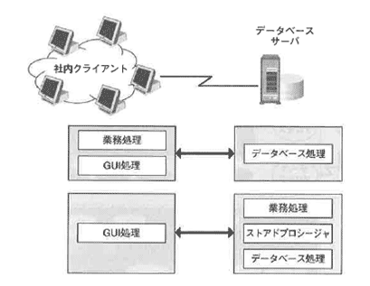

<html><body><h2 id="dbdesignTtl">4.3 システム構成図とアプリケーションの配置</h2>

物理設計ではメモリ、ネットワーク、ディスクの配置などを検討します。
その際、アプリケーション開発側の要件を認識しておかないと、システム全体を見渡した際に、ちぐはぐな設計になってしまう可能性があります。
性能要件を満たすためには、実行するアプリケーションの配置を考慮する必要があります。

まず、物理的なシステム構成を確認しておきましょう。

<!--/section-->

<h4 class="caption">3階層システム構成</h4>

図4-3 3階層システム構成

<!--/.grayBox-->

3階層システム構成は、クライアントにWebブラウザを使用する3階層アーキテクチャです。

3階層アーキテクチャは、業務要件が変更されたときには、サーバ側だけの変更で済みます。 
また、業務の利用者が増えたときは、サーバを増設することで対応できるため、拡張性が高いということができます。 
アプリケーションの配置や使用言語、セキュリティの考慮など、次のような項目について検討する必要があります。 
これらの項目は、物理設計フェーズではなく、システム化計画の段階ですでに考慮されているべき項目ですが、物理設計フェーズで再度確認してください。

<ul>
<li>● アプリケーションの配置：アプレット、ストアドプロシージャの利用</li>
<li>● 使用する言語の選択：Java、PL/SQL、C、JDBCドライバ、OClドライバ</li>
<li>● トランザクションの管理方法：EJB、TPモニター</li>
<li>● ネットワークの帯域幅：時間帯別トランザクション量の見積り</li>
<li>● ファイアウォールの検討：SSL、アクセス制御のポリシー</li>
<li>● ユーザ認証の方法：ディレクトリサーバ、サードパーティ製認証局の利用</li>
</ul>
<!--/section-->

<h4 class="caption">クライアント/サーバシステム構成</h4>

図4-4 クライアント/サーバシステム構成

<!--/.grayBox-->

クライアントサーバ型システム構成は、ダウンサイジングとオープンシステム化が顕著になった頃に多かった構成です。 
現在でも、クライアント側に高機能処理を実行させたい社内システムなどで利用される場合が多いといえます。 
管理者の注意点として、クライアント側にアプリケーションを配置する場合、アプリケーションの追加や変更が起きた場合の配布方法や、セキュリティ管理について検討しておく必要があります。 
アプリケーション配置とともに、以下の点について検討する必要があります。

<ul>
<li>● アプリケーションの配置：クライアント側ツール、ストアドプロシージャの利用</li>
<li>● ネットワークの帯域幅：時間帯別トランザクション量の見積り</li>
<li>● ユーザ認証の方法：ディレクトリサーバ、認証局の利用</li>
</ul>
<!--/section-->

</body></html>