<html><body><h2 id="dbdesignTtl">4.8 パーティションオプション、マテリアライズドビュー</h2>

大規模データベースで性能を発揮するためのOracleの機能であるパーティションオプションとマテリアライズドビューについて説明します。 
非正規化を行わなくても、パーティションオプション、マテリアライズドビューなどのOracleの機能を使用することによって、性能の問題は解決する場合が多いといえます。

ただし、管理の負荷が増えるため、要員の教育と各機能の正確な理解が必要になります。

<!--/section-->

<h3>4.8.1 パーティションオプション</h3>

パーティションオプションは、大規模表へのアクセスを効率よく行うための機能です。

インターネットの普及に伴い、データベースで扱うデータ量はますます増加しています。 
このような大規模なオブジェクト（表や索引）のメンテナンスは非常に困難で、対象が膨大であるため、パフォーマンスにも大きな影響を及ぼします。 
このような大規模な表や索引を、論理的には1つの表または索引でありながら、物理的にパーティションと呼ばれる区画に分割することによって、管理性、パフォーマンスを向上させることができます。

パーティション表に対するSQL文は、普通の表に対するアクセスと変わりません。 
論理的には1つの表であるため、パーティション化された表に対しても、既存のアプリケーションによるDML文は透過的に実行されます。 
必要であれば、特定のパーティションのみにアクセスを行わせたり、パーティションを単位としたパラレルDML文の実行も可能です。

<!--/section-->

<h4 class="caption">パインド変数の使い方の例</h4>

パーティション化の利点としては次のようなことが挙げられます。

<ul>
<li>● 高可用性：
物理的に分けることで、個別の単位でメンテナンスが可能になる障害が起きたとき、他のパーティションは使用を継続できる</li>
<li>● 管理の容易さ： 
パーティションを操作するコマンドが提供されているため、パーティション単位の表領域の移動や削除、追加が可能</li>
<li>● パフォーマンスの向上： 
SQL文のWHERE句で指定された値が、パーティションのキー列で指定されていた場合、オプティマイザは走査する必要のないパーティションを除外できるため、不必要なアクセスを低減できる（パーティションブルーニング） 
パーティション化した領域に対して、パラレル処理を実行できる 
たとえば、大規模な表に対する検索、結合処理、集計、コピー処理、大量ロード、更新/削除処理、ソート処理をパーティションごとに分けて実行し、最終的にその結果をまとめることができる</li>
</ul>

次に、具体例を挙げて説明します。

<!--/section-->

<h4 class="caption">高可用性</h4>

論理的には1つの表ですが、パーティションに分けることによって、格納する領域を物理的に分けることができます。 
物理的な障害が起きた場合、障害の範囲を局所化することができます。 
障害が起きたパーティション以外のパーティションは影響を受けません。

図4-23 高い可用性を考慮した配置

<!--/.grayBox-->

<!--/section-->

<h4 class="caption">管理の容易さ</h4>

パーティションの単位で操作するコマンドが提供されているため、パーティション単位での追加や削除、表領域間の移動などが可能です。 
また、データ量に不均衡があった場合の分割や、表をパーティションとして追加するなどの管理作業を容易に行うことができます。

<h4>追加</h4>

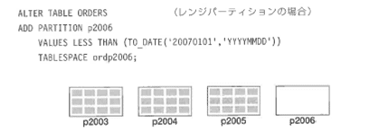

図4-24 パーティションの追加

<!--/.grayBox-->

<ul>
<li>● レンジパーティション</li>
<li>● 最も値の大きい側にパーティションを追加する場合、add partition句を使用する 
表の先頭または中間にパーティションを追加する場合、split partition句を使用する</li>
<li>● MAXVALUEパーティションを含むレンジパーティション表には、パーティションを追加するのではなく、split partition句を使用してパーティションを分割する 
指定した値で定義された新しいパーティションが追加され、MAXVALUE句のパーティションは、最大値を格納するパーティションとしてそのまま残る</li>
<li>● ハッシュパーティション：新しいハッシュパーティションが追加されると、ハッシュ関数によって既存のパーティションが選択され、再ハッシュされた行が挿入される 
ハッシュパーティションを追加する場合には、追加した結果、パーティション数が2の累乗になるようにし、各パーティションの行数が同等になるよう注意すること</li>
<li>● リストパーティション：デフォルトパーティションを含むパーティションに、パーティションを追加したい場合には、デフォルトパーティションをsplit partition句を使用してパーティション分割する 
分割することにより、新しい値を含むパーティションが追加され、デフォルトパーティションはそのまま残る</li>
</ul>

<h4>削除</h4>

 ALTER TABLE ORDERS　　　　（レンジパーティションの場合） 
DROP PARTITION p1995; 

<!-- /yellowBox -->
<ul>
<li>● レンジ、compositレンジハッシュのメインパーティション、リスト、compositレンジリストの各パーティション表からパーティションを削除できる</li>
<li>● ハッシュ、compositレンジハッシュのハッシュサブパーティションはcoalesce partition句を使用して表のパーティションを1つ減らす作業を行う</li>
</ul>

ALTER TABLE sales COALESCE PARTITION;　　　（ハッシュパーティション） 
ALTER TABLE sales MODIFY PATITION us_locations COALESCE SUBPARTITION　　　（ハッシュサブパーティション）

<!-- /yellowBox -->
<ul>
<li>● 参照整合性制約が設定されているパーティションを削除する場合、制約を無効化した後にパーティションを削除する必要がある</li>
</ul>

ALTER TABLE sales DISABLE CONSTRAINT dname_sales; 
ALTER TABLE sales DROP PARTITION dec2000; 
ALTER TABLE sales ENABLE CONSTRAINT dname_sales; 

<!-- /yellowBox -->

<h4>結合</h4>

ALTER TABLE ORDERS　　　　（レンジパーティションの場合） 
MERGE PARTITIONS p1995Ql,p1995Q2　INTO PARTITION p1995H1;

<!-- /yellowBox -->
<ul>
<li>● レンジパーティションの結合は、隣接している2つのパーティションの場合のみ可能</li>
<li>● この文は、ハッシュパーティション表、compositレンジハッシュパーティション表のハッシュサブパーティションには使用できない 
これらのパーティション結合にはcoalesce partition句を使用する</li>
<li>● 2つのパーティションの内容を1つのパーティションにマージする際、元の2つのパーティションは削除される</li>
<li>● パーティションのマージは、たとえば、古い履歴データを、今までよりも大きい単位で管理するために使う</li>
</ul>

<h4>分割</h4>

ALTER TABLE ORDERS　　　　（レンジパーティションの場合） 
SPRIT PARTITION p2000 AT(TO_DATE('20000701','YYYYMMDD')) 
　　　INTO(PARTITION p2000H1 TABLESPACE p2000H1, 
　　　　　　　　PARTITION p2000H2 TABLESPACE p2000H2);

<!-- /yellowBox -->
<ul>
<li>● 1つのパーティションの行を2つのパーティションに分割することによって、データ量を再配分する際に使用する</li>
<li>● ハッシュパーティションにはこのコマンドは使用できない</li>
</ul>

<h4>表パーティションと非パーティション表の交換</h4>

ALTER TABLE ORDERS 
EXCHANGE PARTITION p2005 WITH TABLE t2005ord

<!-- /yellowBox -->

図4-25 表パーティションと非パーティション表の交換

<!--/.grayBox-->

EXCHANGEコマンドでは、データディクショナリの定義が更新され、表パーティションが表に、表が表パーティションに変換されます。

たとえば、オンラインの業務で使用されていた売上表を、月末の締め処理終了後、バッチ処理でパーティションに追加するという運用を考えることができます。 
EXPORT/IMPORT処理を行うわけではなく、ディクショナリの書き換えだけなので、表からパーティション表の一部に一瞬で組み込むことができます。 
パーティションに組み込んだ後、該当月の売上高も分析対象として組み込むことができます。

<!--/section-->

<h4 class="caption">パフォーマンスの向上</h4>

<h4>パーティションブルーニング</h4>

SQL文のWHERE句で指定された値が、パーティションのキー列で指定されていた場合、オプティマイザは、走査する必要のないパーティションを除外することができるため、不必要なアクセスを低減できます。

SELECT SUM(AMOUNT) FROM ORDERS 
WHERE 
ORDERDATE BETWEEN 
TO_DATE('20040401','YYYYMMDD') AND TO_DATE('20040701','YYYYMMDD')

<!-- /yellowBox -->

図4-26 パーティションブルーニング

<!--/.grayBox-->

パーティション化した領域に対してパラレル処理を実行できます。

図4-27 パーティションに対するパラレル処理

<!--/.grayBox-->

<h4>パーティションワイズ結合</h4>

2つの表が、結合列をキーとして同一レベルのパーティション化している場合、ハッシュ結合のパフォーマンスを最大限活かすことができます。

次の例は、データウェアハウス環境で一般的な大規模結合の例です。 
上半期の売上データを格納しているSALES表と、顧客表CUSTOMERS表全体を結合し、問い合わせの結果行を求めます。 
その際、ハッシュ結合が選択されます。

SELECT c_cust_name,count(*) 
FROM sales,customers c 
WHERE s.cust id=c.cust_id　　　<strong>←cust_id列で結合</strong> 
AND s.time_id BETWEEN 
to_date('2005-04011,'yyyy-mm-dd') and to_date('2005-0701','yyyy-mm-dd') 
group by c.cust_name;

<!-- /yellowBox -->

cust_id列をキー列として、SALES表とCUSTOMERS表をパーティション化します。 
その際、パーティション数も同一にすると、下記のようにフルパーティションワイズ結合と呼ばれる最も効率のよいハッシュ結合が選択されます。

図4-28 フルパーティションワイズ結合

<!--/.grayBox-->

同じハッシュ関数を使用して、同じ情報（CUST_ID列）を同数のハッシュパーティションに分散させているため、同じ値が格納されている等価パーティションを結合できます。 
一致する1組のハッシュパーティションは、同じパーティション番号をもつ各表のパーティションとして定義されています。

図4-28では、SALES表のパーティション1とCUSTOMERS表のパーティション1が1組のハッシュパーティションとして結合されます。 
クラスタ化を検討する際には、このパーティションの組を同じノードに配置することが、パフォーマンス上の重要な設計ポイントになります。 
異なるノード上に結合する表を配置した場合、ノードを横断して行を移動させる必要がでてきます（ノード間転送、またはインターコネクト通信のボトルネックとなるため）。

このようにいろいろなメリットがあるパーティションオプションですが、Oracleが現在サポートしている種類は以下の4種類です。

<table class="tableBox">
<tr>
<th style="width:150px;" abbr="パーティション">パーティション</th>
<th abbr="特徴">特徴</th>
</tr>
<tr>
<td>レンジパーティション</td>
<td>列の値の範囲による分割 
売上履歴など、日付を使って管理するような履歴データに向いている 
各パーティションのサイズが不均一になる可能性がある</td>
</tr>
<tr>
<td>ハッシュパーティション</td>
<td>指定した列値にハッシュ関数をかけて分割 
パーティションサイズがほぼ均一になるため、パラレル処理の効果が高い 
ハッシュ値を基に分割しているため、範囲検索は向かない 
パーティションワイズジョイン利用の際有効</td>
</tr>
<tr>
<td>リストパーティション</td>
<td>順不同で関連性のないデータの集合を自然な形で分割 
指定した値で分割できるので、売上の地域別などの分析業務で有効</td>
</tr>
<tr>
<td>コンポジットパーティション</td>
<td>意味のある分割をパーティションで行い、パーティションサイズを均等にするためにハッシュでサブパーティション化する
<ul>
<li>レンジハッシュ：レンジで分割したパーティション内でさらにハッシュ関数を使用してサブパーティションに分割する</li>
<li>リストハッシュ：値で分割したパーティション内でさらにハッシュ関数を使用する</li>
</ul></td>
</tr>
</table>

表4-8 パーティショニングオプションの種類

<!--/section-->

<h4 class="caption">レンジパーティション</h4>

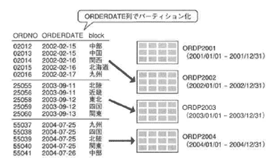

図4-29 レンジパーティション

<!--/.grayBox-->

レンジパーティションは、列備に基づいて行をパーティションにマップします。 
このタイプのパーティションが最もよく使用されるのは、年度やクオータ（四半期）ごと、月ごとの履歴データを大量に管理する必要がある場合です。

レンジパーティションを作成する場合、次の情報を指定します。

<ul>
<li>● パーティション化の方法</li>
<li>● パーティションキー列（単一列でも複数列でも可）</li>
<li>● 各パーティションの範囲（各パーティションに名前をつけた方がメンテナンスの際便利）</li>
<li>● 格納する際の物理属性（表定義の際のデフォルト値をそのまま使用することもできるが、パーティションごとに設定することも可能）</li>
</ul>

【構文例】

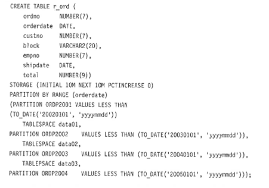

VALUES LESS THAN句にリテラルを指定している場合、この上限値を超えたり、NULL値を挿入しようとするとエラーになります。 
これを防ぐためには、VALUES LESS THAN（MAXVALUE）を指定して、どのパーティションにも含まれない最大値やNULL値、仮想の無限値を格納できるようにしておきます。

<!--/section-->

<h4 class="caption">ハッシュパーティション</h4>

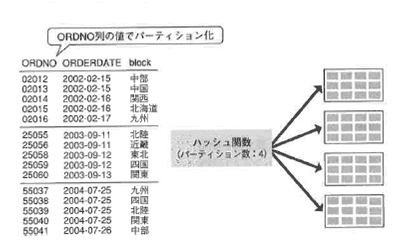

図4-30 ハッシュパーティション

<!--/.grayBox-->

ハッシュパーティションは、表のデータが履歴データではないため、レンジパーティションを選択できないが、パラレル処理を効率的に行うために、パーティションサイズを均等に配分したい場合に使用します。 
また、SQLの条件式で指定される列の値は、等号条件で指定しないと、ハッシュパーティションを効果的に使用することができません。 
大規模表のうち、履歴表ではなく、IOの並列処理を最大化させたい場合にハッシュパーティションを選択します。

また、ハッシュパーティションは、大規模な履歴表（売上実績表）と分析のための切り口の情報をもつ表（たとえば商品表）を結合する際に、両方の表をハッシュパーティション化することによって、結合のコストを大幅に削減させることができます。 
この機能を<strong>パーティションワイズ結合</strong>と呼びます。

パーティションワイズ結合を最も効率よく行うためには、2つの表を結合キーで同一レベルでハッシュパーティション化します。 
同じハッシュ関数を使用して、同じキーを同数のハッシュパーティションに分散させているため、同じ値が格納されている等価パーティションを結合できます。

ハッシュパーティションを作成する場合、次の情報を指定します。

<ul>
<li>● パーティション化の方法</li>
<li>● パーティションキー列（単一列でも複数列でも可）</li>
<li>● パーティション数または個々のバーテンションの記述
（各パーティションの名前は、レンジのときほど必要ではない）</li>
<li>● パーティション数と格納される表領域を指定しておけば、自動的にパーティション名がつけられ、表領域も自動的に選択される</li>
<li>● データ量が均等になるためには、パーティション数を2の累乗に設定する</li>
</ul>

【表領域を自動的に選択させる場合の構文例】

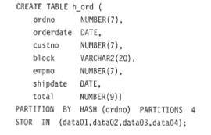

【パーティションごとに表領域を指定する場合の構文例】

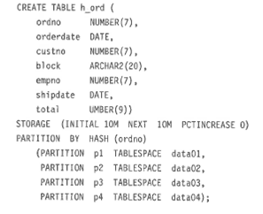

<!--/section-->

<h4 class="caption">リストパーティション</h4>

図4-31 リストパーティション

<!--/.grayBox-->

リストパーティションは、列値ごとに行をパーティションに分ける場合に使用します。 
ただし、指定する列は、レンジ、ハッシュパーティションとは異なり、単一列しか指定できません。 
リストパーティションを作成する場合、次の情報を指定します。 
分析系のデータベースで、分析の切り口を管理する表に使用することが考えられます。

<ul>
<li>● パーティション化の方法</li>
<li>● パーティションキー列（単一列のみ可）</li>
<li>● パーティション数または個々のバーテンションの記述（各パーティションに名前をつけた方がメンテナンスに便利）</li>
</ul>

【構文例】

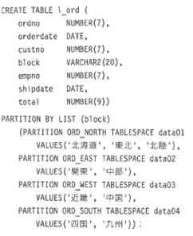

<!--/section-->

<h4 class="caption">コンポジットパーティション</h4>

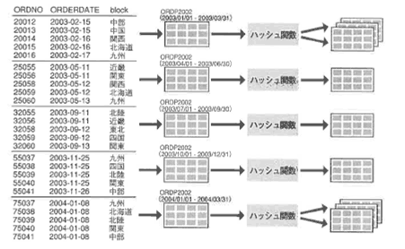

図4-32 コンポジットパーティション

<!--/.grayBox-->

コンポジットパーティションには、次の2種類があります。

<ul>
<li>● レンジハッシュパーティション</li>
<li>● レンジリストパーティション</li>
</ul>

<h4>レンジハッシュパーティション</h4>

レンジパーティションでWHERE条件句によるパーティションブルーニングの効果を発揮することができ、ハッシュサブパーティションによって、パーティションワイズ結合の効果を得ることができます。

<h4>レンジ リストパーティション</h4>

レンジパーティションが適用できる表であり、かつ、ユーザのアプリケーションで使用する論理グループが、リストサブパーティションで指定されるグループ化の必要がある場合、このコンポジットパーティションが選択されます。

コンポジットパーティションを作成する場合、次の情報を指定します。

<ul>
<li>● パーティション化の方法（PARTITlON BY）</li>
<li>● パーティションキー列（単一列でも複数列でも可）</li>
<li>● 各パーティションの範囲（各パーティションに名前をつけた方がメンテナンスの際便利）</li>
<li>● サブパーティション化の方法（SUBPARTION BY）</li>
<li>● サブパーティションキー列（単一列でも複数列でも可）</li>
<li>● 各パーティションごとのサブパーティション数または個々のサブパーティションの記述</li>
<li>● 物理属性は表定義時のデフォルト値をそのまま使用できるが、パーティションごとに設定することも可能</li>
</ul>

【構文例】

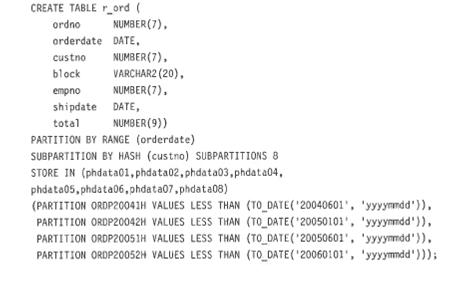

図4-33 レンジリストパーティション

<!--/.grayBox-->

図4-33のコンポジットパーティション（レンジリストパーティション）は、レンジパーティションのレベルで4つのパーティションに、さらにそのパーティションを8つのサブパーティションに分けることになります。 
計32個の物理的なパーティションに分けることになります。

日付データを管理するORDERDATE列をキー列として作成したレンジパーティションは、WHERE条件式で指定されたORDERDATE列の備に応じて、パーティションプルーニングを行う際に有効です。 
一方、CUSTOMERS表との結合に使用されるCUSTNO列をキー列として作成したハッシュパーティションは、CUSTOMERS表（こちらもハッシュパーティションで8等分に分割）との結合の際に、パーティションワイズ結合を使う際に利用され、効率的な結合処理を行うことができます。

このように、コンポジットパーティションは、非常に大規模な表において、パーティションブルーニングと、パーティションワイズ結合の両方を有効に使用することができます。

<!--/section-->

<h4 class="caption">パーティション索引</h4>

パーティションは、表だけではなく、表内に作成する索引にも適用することができます。 
パーティション索引は、その捜索対象範囲が大規模な表ではなく、区切られたパーティションになるため、さらに効果が倍増します。

<!--/section-->

<table class="tableBox">
<tr class="first">
<td>ローカル索引</td>
<td>表と索引を同じ列でパーティション化</td>
<td>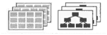</td>
</tr>
<tr>
<td>ローカル索引</td>
<td>索引のみパーティション化</td>
<td>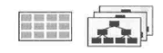</td>
</tr>
<tr>
<td>グローバル索引</td>
<td>表と索引を同じ列でパーティション化</td>
<td>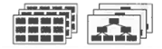</td>
</tr>
</table>

表4-9 パーティション表とパーティション索引

<!--/section-->

表と索引は、それぞれをパーティションと呼ばれる小さな管理単位に分割することができます。 
したがって、下記のようなパターンを考えることができます。

<ul>
<li>● 表と索引を同じ列でパーティション化し、索引列もパーティション化キー列を使用</li>
<li>● 索引のみパーティション化</li>
<li>● 表のパーティション化キーとは異なるパーティション化キーで索引をパーティション化する</li>
</ul>

いろいろなパターンが可能なので、適切なものを選択して利用してください。

<h4>ローカル同一キー索引</h4>

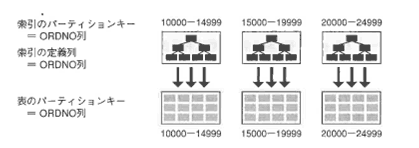

図4-34 ローカル同一キー索引

<!--/.grayBox-->

<ul>
<li>● パーティション表のキー＝索引パーティションのキー</li>
<li>● 索引列＝索引パーティションキー</li>
<li>● 検索時、1つのパーティションキーヘのアクセスのみで完了</li>
<li>● 表の更新がおきた場合も、対象の索引パーティションは1つ</li>
</ul>

【パーティション表の作成】

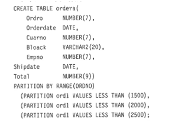

【上記表パーティションに対して、ローカル同一キー索引を作成】

パーティション範囲は、表によって決定されます。 
ローカル同一キー索引は、パフォーマンス上、また管理上、最も有効な索引として使用できます。

<h4>ローカル非同一キー索引</h4>

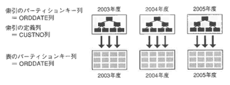

図4-35 ローカル非同一キー索引

<!--/.grayBox-->

<ul>
<li>● パーティション表のキー＝索引パーティションのキー</li>
<li>● 索引列！＝索引パーティションキー</li>
<li>● 模索時、対象となるすべての索引パーティションヘのアクセスが必要</li>
<li>● 表の更新がおきた場合も、対象の索引パーティションは1つ</li>
</ul>

【パーティション表の作成】

【上記表パーティションに対して、ローカル非同一キー索引を作成】

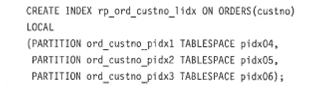

パーティション範囲は、表によって決定されます。 
ローカル非同一キー索引も、ローカル同一キー索引同様、パフォーマンス上、また管理上、最も有効な索引として使用できます。

<h4>グローバル同一キー索引</h4>

図4-36 グローバル同一キー索引

<!--/.grayBox-->

<ul>
<li>● パーティション表のキー！＝索引パーティションのキー</li>
<li>● 索引列＝索引パーティションキー</li>
<li>● 検索時、索引はすでにパーティション化されているので索引の検索コストは異なるため、パーティション索引のメンテナンスが別途必要</li>
<li>● 表の更新がおきた場合も、対象の索引パーティションは1つ</li>
</ul>

【パーティション表の作成】

【上記表パーティションに対して、グローバル同一キー索引を作成】

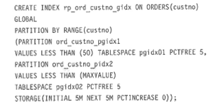

パーティション範囲は、CREATE INDEX文のPARTITION句で決まります。
グローバル索引は、表パーティションの1つが削除されるなどの修正が行われると、グローバル索引の全パーティションが影響を受け、グローバル索引の全パーティションを再作成する必要がありました。 
Oracle9iでは、このデフォルトの動作を無効にする句が提供されています。

表パーティションのメンテナンス操作でALTER TABLE文のUPDATE GLOBAL INDEX句を指定すると、表のメンテナンス操作と同時にグローバル索引のメンテナンスも同時に行われます。 
ただし、表のメンテナンス操作自体にコストがかかるため、グローバル索引は、管理性の面で推奨できません。

<!--/section-->

<h3>4.8.2 マテリアライズドビュー</h3>

大規模な表に対して、分析業務でアクセスする際に問題になるのは、結合にかかるコストです。 
そこで、Oracle8iより、元表はそのまま維持しておき、結合して集計処理などを行った結果をビューにもたせるオブジェクトが提供されるようになりました。 
このビューは<strong>マテリアライズドビュー</strong>と呼ばれ、通常のビューとは異なり、実際に元表からコピーした値をもってきます。

<!--/section-->

<h4 class="caption">マテリアライズドビューが使用される適用業務</h4>

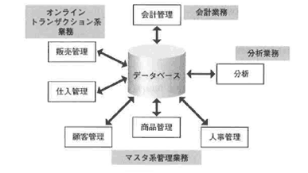

図4-37 マテリアライズドビューが使用される適用業務

<!--/.grayBox-->

企業のデータベースは、データを格納するだけでなく、ビジネスで有効に活用されてこそ真価を発揮します。

リレーショナルデータベースは、定型文による問い合わせのみではなく、非定型な問い合わせにも柔軟に対応できるように設計されています。 
非定型な問い合わせとは、たとえば、オンライン業務で蓄積された、売上データのような履歴データを、いろいろな観点から分析することによって売上傾向を把握し、今後の販売予測をたてるための問い合わせなどを指します。 
このような問い合わせは、分析業務などで実行されるものですが、マテリアライズドビューは分析業務の問い合わせを効率よく行うために使用されます。

分析業務で実行するような問い合わせは、業務データそのものを直接使用しようとすると、複数の表を結合したり、時間軸の詳細なデータを加工したり、不要なデータを取り除くなどの処理を行わないと、自分に必要なデータを取得することができません。 
マテリアライズドビューは、このような、必要なデータを加工して分析しやすくするための事前作業を行っています。

データウェアハウスでは、このようなデータの加工作業を次のように定義しています。

<table class="tableBox">
<tr>
<th style="width:80px;" abbr="作業">作業</th>
<th abbr="内容">内容</th>
</tr>
<tr>
<td>抽出</td>
<td>業務システムから分析業務で必要なデータを抽出する 抽出するためには、必要なデータを選択するためのSQL文を使用できる</td>
</tr>
<tr>
<td>クリーニング</td>
<td>抽出した業務システムのデータ形式を変換したり、異常データの削除を行う データ形式の変換とは、文字コードの変換が主で、必要なすべてのデータの文字コードを揃える処理を行う 異常データの削除とは、たとえば、売上の返品処理などが行われた場合、業務システムでは、単純に削除処理を行うのではなく、キャンセルフラグなどを使って、相殺処理をするように設計されていることが多いので、それを検出するような処理が挙げられる キャンセルレコードを検出したら、元になっているデータとともに削除処理を行う このような業務システムで発生した特殊処理によって生成されたレコードを、きれいに揃えていく処理といえる</td>
</tr>
<tr>
<td rowspan="4">変換</td>
<td>日付データ型を文字列型に変換したり、計算のためにNULL値を数値型の0に変換したり、表示のためにNULL値を空白に置き換えたりといった作業</td>
</tr>
<tr>
<td>業務システムで誤ったデータが混じっていた場合、それを抽出して正しい値に変換する エラーをあらかじめ推測して、アプリケーション的に処理ロジックを決めておく必要がある</td>
</tr>
<tr>
<td>必要な表の結合処理を行う 売上データを管理している表は、正規化されているため、商品名や顧客名などの情報を取得するためには、それぞれのマスタ表を結合する必要がある 分析業務では、結合の元になるデータは履歴データである場合が多く、非常に大量のデータを保持している これをOracleではパーティション化表として格納している このようなデータのことをデータウェアハウスでは<strong>ファクト表</strong>と呼ぶ 一方、商品データや顧客データ、店舗データ、日時データなどは、分析の軸とするデータと定義づけられ<strong>ディメンション表</strong>と呼ぶ</td>
</tr>
<tr>
<td>ファクト表の元データはDATEデータ型なので、時分秒の単位まで値をもっている しかし、分析時にはそこまで詳細な情報は不要であるため、日単位、週単位、月単位、クオータ単位に集計処理を行う</td>
</tr>
</table>

表4-10 データ加工作業

マテリアライズドビューは、SQL文を発行することによって、上記のような処理を行います。 
その結果として、日ごと、過ごと、月ごとの基本的な集計データをあらかじめ作成しておきます。 
分析業務アプリケーションは、この集計データに対して、さらに詳細なSQLを実行し、必要なデータを加工して取得します。

<!--/section-->

<h4 class="caption">マテリアライズドビューの設計</h4>

マテリアライズドビューを定義するためには、オンライン業務で集積されたデータをどのように活用するのかを定義する必要があります。
分析要件を定義するにあたり、次の点を明確にする必要があります。

<ul>
<li>● 何を分析したいのか</li>
<li>● どのような観点から分析する必要があるのか</li>
<li>● その結果、目標値はどこに設定するのか</li>
</ul>

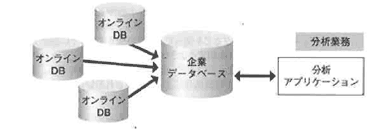

図4-38 企業戦略に活用されるデータベース

<!--/.grayBox-->

何を（売上、利益、数量など）、どのような観点から（店舗別、商品分類別、顧客層別など）分析し、どのような効果をあげればよいのか、企業戦略を理解し、具体化し、設計します。 
このように、分析業務で何を求められるのかをまず明確にする必要があります。 
業務系データの分析と活用で重要な分析項目の例を以下に示します。

<ul>
<li>● 販売管理データを利用して、売上実績、目標達成度を店舗別、商品別、顧客別に分析する</li>
<li>● 会計データを活用して、利益、コストを店舗別に分析する</li>
<li>● 在庫管理データを利用して、在庫量、在庫金額、不良在庫店舗別、品目別に分析する</li>
</ul>

このような分析を行うにあたり、次のようなデータを管理する必要があります。

業務系データの分析に必要な要素として、管理ポイントと管理項目があります。 
管理ポイントには、時間、商品、顧客、地域などのさまざまな分析の切り口での粒度の異なる項目があり、これらを<strong>ディメンジョン</strong>といいます。 
管理項目には、数量、金額、利益率など、何を指標として分析するかという数値があります。 
この数値の種類のことを<strong>ファクト</strong>といいます。

図4-39 ディメンジョンとファクト

<!--/.grayBox-->

分析の際に必要なデータを大別すると、図4-39のように、分析の切り口と、何を管理すべきかの2つをまず決める必要があります。 
データウェアハウスの用語として、分析の切り口は<strong>管理ポイント</strong>、何を管理すべきかの指標にあたるデータは<strong>管理項目</strong>と呼ばれます。

管理ポイントと管理項目でそれぞれどのような点に注意して設計すべきかをもう少し詳しくみていきます。

図4-40 業務系データの分析に必要な要素

<!--/.grayBox-->

まず、管理ポイントですが、分析業務を行うユーザの分析ニーズをヒアリングして、分析の切り口を決めます。 
このとき、次の2点に注意して情報を収集します。

<ul>
<li>1. データの粒度： 
データの粒度とは、たとえば時間軸を見るとわかりやすいのですが、データを集計するにあたり、どのレベルでデータを集積するのか、日、週、月、四半期、年といった単位を決めることです 
また、店舗データの地域という単位は、市区町村のレベルなのか、都道府県のレベルなのか、どのレベルまで集計するのかの単位のことを指します</li>
<li>2. データの粒度： 
データの粒度とは、たとえば時間軸を見るとわかりやすいのですが、データを集計するにあたり、どのレベルでデータを集積するのか、日、週、月、四半期、年といった単位を決めることです 
また、店舗データの地域という単位は、市区町村のレベルなのか、都道府県のレベルなのか、どのレベルまで集計するのかの単位のことを指します</li>
</ul>

次に管理項目についてみていきます。

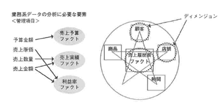

図4-41 管理項目

<!--/.grayBox-->

図4-41では、管理項目として、予算金額、売上原価、売上数量、売上金額を収集することにしています。 
どのような項目を管理項目として収集すべきかをまずヒアリングしますが、ユーザヒアリングの際、次の点にも留意して情報を収集してください。

<ul>
<li>1. 管理ポイントに対して同じ粒度で情報を収集することができるか： 
たとえば、管理ポイントとして時間軸を考え、管理項目として予算金額を考えてみます 
このとき、予算金額は、毎日収集されるものではなく、企業によって、毎月または四半期に一度しか取得できないという制約があることを管理します</li>
<li>2. いつのデータを最新のものとして定義するか： 
売上データなどは、マテリアライズドビューではリアルタイムのデータも収集できますが、オンラインの業務に影響を与える可能性が高いことを念頭に置く必要があります 
分析業務では、1日の処理終了後のバッチ処理で集計できる前日末などのレベルで設計するのが理想的ですが、ユーザ要件によってそうもいかない場合があるでしょう 
また、予算データは前月初めの時点または当四半期初時点という定義になったりします</li>
<li>3. データの保存期間： 
オンラインで比較分析する時間軸の長さによって決めます 
3年分の同期比を見たいという要件があれば、3年と定義されます</li>
</ul>

マテリアライズドビューを作成するにあたり、必要な設計項目が決まったら、実際にマテリアライズドビューを作成する手順を次に見ていきます。

<!--/section-->

<h4 class="caption">マテリアライズドビューの作成</h4>

<!--/.grayBox-->

まずイメージをつかみます。 
図4-42は、実際にオンライン業務で使用している表に対して、分析に必要なデータを収集するために作成した、マテリアライズドビューを作成するためのSQL文を実行した状態です。

この例では、ファクト表に売上履歴表を指定し、ディメンション表である店舗、商品、時間表を結合して、店舗別_目別_商品別_売上サマリービューを作成しています。 
アプリケーションによって、管理ポイントの粒度および管理項目の粒度は異なるので、必要に応じて複数のマテリアライズドビューを作成します。 
ここでは、日別売上サマリーを作成していますが、月別サマリーが必要かもしれないし、商品別ではなく商品小分類別サマリーを作成する必要があるかもしれません。

すべての管理ポイント、すべての管理項目の一番小さい粒度で集計しておけば、それを実際に問い合わせるSQL文で集計すればよいのですが、パフォーマンスの観点から、ある程度の粒度であらかじめ集計しておく必要があります。

次に、作成されたマテリアライズドビューがどのように使用されるのかを見ます。

<!--/section-->

<h4 class="caption">マテリアライズドビューの使用（クエリーリライト）</h4>

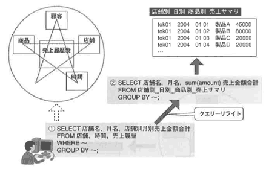

図4-43 マテリアライズドビューの使用（クエリーリライト）

<!--/.grayBox-->

アプリケーションが実表に対するSQL文を発行すると（図4-43①）、SQLのリクエストを受け取ったサーバプロセスが最適化処理を行って、マテリアライズドビューに対するSQL文（図4-43②）への書き換え処理を行います。

書き換え処理を行うためには、コストベースオプティマイザが有効になっていること、適切な権限を実行ユーザがもっていること、マテリアライズドビューが利用可能状態になっていること、マテリアライズドビューに対するクエリーリライトが有効になっている必要があります。

<!--/section-->

<h4 class="caption">マテリアライズドビューのリフレッシュ</h4>

マテリアライズドビューを使用するためには、元表に対する更新処理をどのようにサマリービューに反映させるかを決める必要があります。 
元表に対する更新処理を、サマリービューに反映させる処理を<strong>リフレッシュ</strong>と呼びます。 
リフレッシュの方法は、マテリアライズドビューを作成するときに指定します。

図4-44 マテリアライズドビューのリフレッシュ

<!--/.grayBox-->

リフレッシュのタイミングは、手動と自動の2つがあります。

手動の場合は、DBMS_MVIEWパッケージのプロシージャを実行したときにリフレッシュされます。 
自動の場合は、リフレッシュのタイミングをCREATE MATERIALIZED VIEW文の中で指定し、2つの方法を選択することができます。 
1つはCOMMIT時、もう1つはリフレッシュ開始時刻とその後のインターバルを指定することによって、定期的にリフレッシュを行う方法です。 
リフレッシュの方法も、マテリアライズドビューを作成するときに指定します。

<!--/section-->

<h4 class="caption">リフレッシュオプション</h4>

マテリアライズドビューは、スナップショットと同じメカニズムを使用しており、いくつかのリフレッシュオプションをサポートしています。

1つは、完全リフレッシュです。 
CREATEコマンドを再実行することによって、既存データの切り捨てと元表に基づいた全データの再挿入が行われます。

高速リフレッシュでは、最後に実行されたリフレッシュ以降の変更がサマリービューに適用されます。 
高速リフレッシュでは、2つのリフレッシュタイプが使用できます。 
1つは、マテリアライズドビューログを使用した高速リフレッシュです。 
実表に対する変更ログをすべて取得し、一定間隔で変更ログをサマリービューに反映させます。 
もう1つは、ダイレクトパスロードを使用して新規行をロードする際に、ロードした行を高速リフレッシュさせる方法です。 
このリフレッシュでは、SQL*Loaderのログが使用されます。

また、リフレッシュを行わないという選択も可能です。 
アプリケーションの要件によって、適切なリフレッシュオプションを選択してください。

図4-45 リフレッシュオプション

<!--/.grayBox-->

<!--/section-->

<h4 class="caption">マテリアライズドビューの種類</h4>

マテリアライズドビューは、作成およびリフレッシュ手順の複雑さの観点から、大きく分けて3つの種類があります。 
種類の違いによって、リフレッシュオプションが使用できないなどの制約があるので、マニュアルなどを確認して種類を選択し、実装してください。

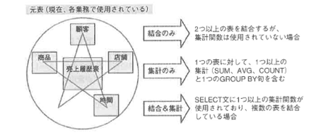

<!--/.grayBox-->

<!--/section-->

<h4 class="caption">マテリアライズドビュー利用のコツ</h4>

最後に、マテリアライズドビューを効率よく利用するポイントを紹介します。

図4-47 マテリアライズドビューの利用

<!--/.grayBox-->

管理の面から、リフレッシュ処理に自動化処理を使用すると、ログの管理や障害時の復旧にコストがかかります。 
また、制約が多い、障害時の対処などのメンテナンスに手間がかかる、特にCOMMIT時のリフレッシュは、オンライントランザクションCOMMIT時にレスポンスの悪化を引き起こす可能性もあるため、ユーザ要件が許すのであれば、リフレッシュ処理はなるべく単純化するのがコツです。

逆に、すべての分析業務が本当にリアルタイムで分析する必要があるのかを見直してみる必要がある場合もあります。 
できれば、時間指定のバッチジョブで定期的に更新処理を行う仕様にするのがよいでしょう。

<!--/section-->

</body></html>