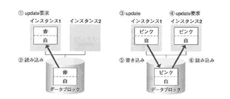
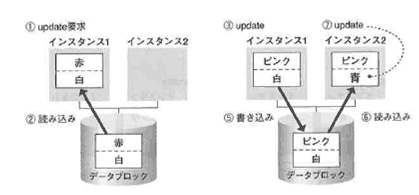

<html><body><h2 id="dbdesignTtl">4.9 障害の種類とバックアップリカバリ</h2>

「<a href="../01_01/index.md">第1章 DB概論</a>」で詳しく説明しているので、ここではポイントだけを確認します。 
運用フェーズに入ったときのバックアップ取得スケジュールと、障害時手順書を作成する必要があります。 
作成にあたっては、次のような事項を明らかにしておく必要があります。

<table class="tableBox">
<tr class="first">
<td style="width:130px;">業務要件</td>
<td>MTTR（平均回復時間） 
MTBR（平均障害間隔） 
トランザクション量と各表に対する変更頻度 
（<a href="../03_01/index.md">第3章「論理設計」</a>で説明済）</td>
</tr>
<tr>
<td>運用要件</td>
<td>計画的シャットダウンが許容されているか 
障害発生時の体制 
データベースの物理的な構成の変更頻度</td>
</tr>
<tr>
<td>技術要件</td>
<td>バックアップ＆リカバリにしようするハードウェア、ソフトウエア 
データベースのアーカイブファイル取得モード<small>(*)</small> 
表または表領域ごとに取得するバックアップの種類論理バックアップ 
or 物理バックアップ

<small>(*)</small>データベースのアーカイブモード 
　　OracleのデフォルトはNOARCHIVELOGモード

</td>
</tr>
<tr>
<td>対応すべき障害の種類</td>
<td>&nbsp;</td>
</tr>
<tr>
<td>費用</td>
<td>費用対効果が最も頭を悩ませる部分かもしれません。 
もし、データベースが障害によって停止した場合、どの程度の機会損失が生じるかを計算します。 
この機会損失には、信用失墜に伴うダメージも計上すべきです。 
システムの高可用性をいかに維持できるかは、企業の信頼性の高さを示すバロメータと言い換えても過言ではありません。 
頻繁に起きるシステムダウンは、企業体質が脆弱であることを証明するようなものです。 
投資すべきところに適切に投資できるよう、リスク管理を適切に行ってください。</td>
</tr>
</table>

表4-11 バックアップ方式の検討と障害時リカバリ手順の検討

<!--/section-->

<h3>4.9.1 アーカイブモード</h3>
<h4 class="caption">NOARCHIVELOGモード</h4>

NOARCHIVELOGモードでは、REDOログの内容はアーカイブログファイルにコピーされません。 
アーカイブログファイルは、メディア障害時に適用するために必要なファイルなので、このモードではメディア障害時に復旧することが困難になります。 
NOARCHIVELOGモードを選択するのは、テスト環境の場合や、次のような条件の場合に限定する必要があります。 
デフォルトはNOARCHIVELOGモードです。

<ul>
<li>● 必ず1日の終わりに全体データベースのバックアップを取得することができる</li>
<li>● 1日のREDOログの使用によって、ロググループが循環しない（上書きされることがない）</li>
<li>● 前日のバックアップから、ジョブを実行することによって更新処理をすべて再実行することが可能である</li>
</ul>
<!--/section-->

<h4 class="caption">ARCHIVELOGモード</h4>

ARCHIVELOGモードでは、ARCHプロセスが起動され、自動的にREDOログの書き込みが完了すると、アーカイブファイルへのコピーが開始されます。 
メディア障害に対する対策にはARCHIVELOGモードを選択する必要があります。

<!--/section-->

<h3>4.9.2 データベース障害の種類と回復処理</h3>

第1章 DB概論の「<a href="../01_02/02/index.md">どのような障害に対応する必要があるのか</a>」を参照してください。

<!--/section-->

<h3>4.9.3 RAC</h3>

障害対策、性能要件を満たす方策として、OracleではRACを提供しています。 
ここでは、次の点に焦点を当てて説明します。

<ul>
<li>● RACとシングルインスタンス</li>
<li>● RAC環境でパフォーマンスの鍵を握るCache Fusion</li>
<li>● RAC環境の障害回復</li>
<li>● RAC環境でのパフォーマンスチューニング</li>
</ul>

OracleのRACは、複数のノードから1つのデータベースを共有するシェアードエブリシング型のクラスタです。 
1つのデータベースのデータを複数のインスタンスで参照、更新するため、データの一貫性をどう維持するかという問題がありましたが、RACはその間題を解決し、データの整合性を維持しつつ、負荷分散を実現しています。

図4-48 RACはロードバランス型のクラスタリング

<!--/.grayBox-->

図4-49 RAC構成（左）とシングルインスタンス構成（右）の相違点

<!--/.grayBox-->

RAC環境とシングルインスタンスの違いで管理者が将に意識するのは、データベースファイルの部分と思われます。

<table class="tableBox">
<tr class="first">
<td rowspan="2" style="width:120px;">RAC環境において、各インスタンスが<strong>専用</strong>に使用するファイル</td>
<td>データベースファイル</td>
<td>REDOログファイル UNDO表領域用データファイル アーカイブログファイル</td>
</tr>
<tr>
<td>初期化パラメータファイルなど</td>
<td>デフォルトの位置に置かれた初期化パラメータファイル デフォルトの位置に置かれたパスワードファイル</td>
</tr>
<tr>
<td rowspan="2" style="width:120px;">RAC環塊において、各インスタンスから<strong>共有</strong>されるファイル</td>
<td>データベースファイル</td>
<td>制御ファイル UNDO表領域以外の各種データファイル</td>
</tr>
<tr>
<td>初期化パラメータファイルなど</td>
<td>共有するサーバパラメータファイル</td>
</tr>
</table>

表4-14 RAC環境のデータベースファイル

ここで理解しておいていただきたいのは、ユーザ用のファイル群は完全に共有されていること、障害時回復に必要なログやUNDO情報は各インスタンスに固有のファイルとして識別されているという点です。 
ただし、ログファイルやUNDO用のファイルも、どのインスタンスに適用すべきものかの識別はされていますが、実際の障害回復時には、他のインスタンスからアクセスできるように、共有ボリューム上に存在しています。 
また、初期化パラメータファイルも、サーバパラメータファイルは、複数インスタンスからアクセスされ、共有できるように共有ボリューム上に配置します。

<!--/section-->

<h4 class="caption">CacheFusion</h4>

次に、RACで最もパフォーマンス上問題となる更新処理と更新処理が競合を起こした場合の解決策を紹介します。 
Oracle9iRACでは、すべてのブロック競合に対してCacheFusionを適用し、従来までの共有ディスククラスタの欠点を改善しています。

<ul>
<li>● 高速なノード間通信によりデータブロックを転送</li>
<li>● ディスクlOを介さずにデータの同期を実現</li>
<li>● Read/Read、Read/Write、Write/Writeなどすべての競合に対して適用</li>
</ul>

Cache Fusionの仕組みを知ることによって、更新の競合が起きた場合のパフォーマンスの劣化はどこに原因があるかを理解することができます。 
より効率よくRACを使うために、CacheFusionの仕組みを理解してください。 
図を使ってCacheFusionの仕組みを説明します。

図4-50 従来の共有ディスククラスタの問題点1

<!--/.grayBox-->

まず、Oracle8iまでの動きを配明します。

Oracle8iまでは、機敏のインスタンスで同じプロッタに対して更新競合が起きた場合、更新後のブロックを一度ディスクに書き出すことによって同期をとっていました。 
更新競合が起きるたびにディスクヘの書き込みが発生し、パフォーマンス上のボトルネックになっていました（図4-50）。 
インスタンス1であるブロックに対する更新要求が発生したので（①）、ブロックをディスクからインスタンス1に読み込みます（②）。

図4-51 従来の共有ディスククラスタの問題点2

<!--/.grayBox-->

インスタンス1で、「赤」の行を「ピンク」に更新します（③）。

図4-52 従来の共有ディスククラスタの問題点3

<!--/.grayBox-->

次に、同じブロックの違う行に対してインスタンス2から更新要求が出されました（④）。 
すると、更新したブロックは、一度ディスクに書き戻され（⑤）、更新後の状態を全データベースで共有できるようにした後、インスタンス2に読み込まれます（⑥）。

図4-53 従来の共有ディスククラスタの問題点4

<!--/.grayBox-->

インスタンス2は、ブロックの別の行に対して更新処理を行います。 
Oracle8iまでは、更新処理が複数インスタンスで競合すると、必ずディスクヘの書き込み処理が生じていたため、更新処理が複数インスタンスから同時に発生するようなアプリケーションでは、パフォーマンス上あまり効果があがらないという状況になっていました。 
Cache Fusionでは、このようなパフォーマンス上の問題を解決するため、更新処理が競合を起こした場合、ブロックをノード間ネットワークを使って拘束に転送することによってディスクIOを提言し、パフォーマンスの改革を図っています。

図4-54 CacheFusionによる問題点の解決1

<!--/.grayBox-->

以前と同様、まずインスタンス1であるブロックの行に対して更新要求が出されると（①）、ディスクから該当ブロックがインスタンス1に読み込まれます（②）。

図4-55 Cache Fussionによる問題点の解決2

<!--/.grayBox-->

インスタンス1上で、「赤」の行が「ピンク」に変更されます（③）。

図4-56 Cache Fussionによる問題点の解決3

<!--/.grayBox-->

次に、同じブロックの違う行「白」に対して、インスタンス2から更新要求が出されました（④）。 
すると、更新されたブロックは、ノード間ネットワークを通じて、インスタンス2に直接転送されます。

一方、インスタンス1には、インスタンス2の障害に備えて、インスタンス1で更新した状態のままパストイメージという状態で残されます。

図4-57 Cache Fusionによる問題点の解決4

<!--/.grayBox-->

インスタンス2で、「白」から「青」に更新処理が行われます（⑤）。
この間、ディスクヘの書き込み処理は一切行われません。

Cache Fusionが更新と更新の競合でも適用されることによって、ブロック競合に対する性能上の解決策として効果が高いことがわかると思います。 
ただし、ここで注意したいことがあります。

1つは、インスタンス障害時の回復処理です。ディスクに書き込みを行っていないため、ディスク上のブロックから回復処理をすべて適用していくのでは非常に時間がかかってしまいます。 
そこで、先ほどの図にあったように、パストイメージとよばれるブロックを、カレントインスタンスの前のインスタンスに残しておき、そこから回復できるようにしています。 
このように、RACの場合、すべてのブロックがどのインスタンスによって現在どのような処理をされているか、現在のロックのレベルは何で、どのインスタンスがカレントでロックを取得しているのかといった状態をすべて管理される必要があります。

もう1つは、インスタンス間ネットワークのデータ量と転送速度が、RACパフォーマンスの鍵を握るという点です。 
これに対しては、ネットワーク自体の速度向上と、アプリケーションパーティショニングというアプリケーションを実行するインスタンスを分ける操作が解決策となります。 
これらの事柄について、続けて見ていきます。

<!--/section-->

<h4 class="caption">メモリ上のRAC固有のコンポーネント</h4>

RAC構成では、すべてのブロックが、その状態を管理されている必要があります。 
そこで、RAC構成をとった場合、シングルインスタンスでは存在しなかったような下記のようなメモリ上の構成要素（メモリ領域）およびサービスが存在します。

<table class="tableBox">
<tr>
<th style="width:190px;" abbr="メモリ上の構成要素（メモリ領域）およびサービス">メモリ上の構成要素（メモリ領域）およびサービス</th>
<th style="width:80px;" abbr="略称">略称</th>
<th abbr="説明">説明</th>
</tr>
<tr>
<td>グローバルリソースディレクトリ</td>
<td>GRD</td>
<td>GRD複数のインスタンスを横断して管理が必要なリソース（主にブロック）情報が格納されているSGA内のデータ構造</td>
</tr>
<tr>
<td>グローバルキャッシュサービス</td>
<td>GCS</td>
<td>GCSキャッシュ上のブロックの一貫性を維持するために、ブロックに対するロックを管理</td>
</tr>
<tr>
<td>クローバルエンキューサーヒス</td>
<td>GES</td>
<td>ブロック以外のリソースに対するロックを管理</td>
</tr>
</table>

表4-15 メモリ上のRAC固有のコンポーネント

グローバルに管理されるリソース（データブロック）には、それぞれのリソースを管理する「マスタ」が存在します（1ブロック当たり、いずれか1インスタンスがマスタノードとなる）。 
グローバルリソースにアクセスする場合は、そのリソースのマスタに対してアクセス要求を行います。 
新しいインスタンスが起動されたり、アクティブだったインスタンスが停止または異常終了した場合、障害が起きたマスタが管理していたリソース配分を変更するために再構成の処理が必要になります。 
データベース内のすべてのブロックは、複数のインスタンスに分割されて、その状態が管理されています。 
これを管理している領域が、上記のGRDと呼ばれる、メモリ上の共有領域です。

あるインスタンスが障害を起こした場合、障害を起こしたインスタンス上で管理していたGRD上のブロック情報を、残ったインスタンスで再配分する必要があり、この間は他のタスクは一切行うことができないため、インスタンス障害からの回復時には、通常のシングルインスタンスよりも時間がかかってしまいます。

RAC固有のバックグラウンドプロセスを図4-58に示します。 
Cache Fusion処理のログや、障害発生時のログでよく見かける名前です。

図4-58 RAC固有のコンポーネント

<!--/.grayBox-->

RACのインスタンスでは、通常のインスタンスよりも、パストイメージのブロックと、GRDが管理するマスタ情報を追加で格納する必要があるため、シングルインスタンスのメモリサイズに比べて、若干多めに見積っておく必要があります。

<!--/section-->

<h4 class="caption">RAC環境における障害回復</h4>

RACは、対障害対策という意味で、非常に有効なソリューションです。 
それでは、シングルインスタンスの場合と、障害回復の面でどのように違いがあるのか、またはないのかを見ていきます。 
まず、障害回復に使うログファイルについてみていきます。

<!--/section-->

<h4 class="caption">REDOログ</h4>

<ul>
<li>● インスタンス障害暗、障害が起きていないノードからアクセスし、障害ノードの回復処理を行う必要があるため、共有ディスク上に配置します</li>
<li>● インスタンスごとの識別を行うため、パラメータファイル中で各インスタンスに定義されたスレッド番号を使って（thread=n　n:インスタンス番号）インスタンス番号ごとに管理されます</li>
<li>● 各スレッドごとに最低2グループが必要です</li>
</ul>
<!--/section-->

<h4 class="caption">アーカイブログ</h4>

<ul>
<li>● RAWデバイス上に作成することはできません</li>
<li>● メディア障害時、障害を回復するノードからアクセス可能なファイルシステム上に作成するのが望ましい（NFS、OCFSなどを利用）です</li>
<li>● ファイル名にスレッド番号（%Tまたは%t）、ログ順序番号（%Sまたは%s）を記述することによって、インスタンス別に管理することができます</li>
</ul>
<!--/section-->

<h4 class="caption">インスタンス障害からの回復</h4>

インスタンス障害の回復は、次の手順で実行されます。

<strong>【STEP1】</strong> 障害の検出

<strong>【STEP2】</strong> ノードおよびリソースの再構成

<strong>【STEP3】</strong> REDOの読み取り

<strong>【STEP4】</strong> リカバリに必要なブロックの確保

<strong>【STEP4】</strong> REDOの適用

<!-- /yellowBox -->
<ul>
<li>● リカバリは、最新のパストイメージブロックから開始することができるため、最小のリカバリ時間で回復できるようになっています</li>
<li>● 異常終了したすべてのインスタンスのREDOスレッドをマージしてリカバリします</li>
<li>● STEP2のリソースの再構成では、GCSが再構成され、LMSnがマスタを失ったリソースを再マスタ化します</li>
<li>● STEP3では、障害が発生したインスタンスのREDOログをSMONが読み取り、リカバリが必要なブロックのみを識別します</li>
<li>● STEP2&#xff5e;STEP4の間はデータベースはすべてのリソースに対してブロックされた状態になります</li>
</ul>

最後のブロックされた状態になるという部分が、シングルインスタンスと異なる部分であり、インスタンス全体が停止したように見える部分（時間帯）です。 
上記のように、マスタの再構成作業を行っているために、停止しているように見えるという点を理解してください。

<!--/section-->

<h4 class="caption">メディア障害からの回復</h4>

メディア障害はCache Fusionとは直接関係はありません。 
メディア障害からのリカバリに関しては、シングルインスタンスと大きく異なるところはありません。 
障害を回復するインスタンスから、すべてのインスタンスのアーカイブログファイルおよびREDOログファイルを参照できる必要があります。

<!--/section-->

<h4 class="caption">RACにおけるパフォーマンスの改善</h4>

ユーザの視点から、RAC構成で使用する際の注意点を示します。 
パフォーマンスのボトルネックになりやすいのは、複数のインスタンスから、同じブロックに対するブロック競合が発生する場合です。これを避けるために、どのような工夫ができるかを考えてみます。

図4-59 RACによるパフォーマンス改善

<!--/.grayBox-->

ブロック競合が発生しても、ディスクへの書き込みは発生しないため、IOによるパフォーマンスの劣化は回避されています。 
ノード間通信を使ったブロック移動が大量に生じた場合、ネットワークによるパフォーマンスの劣化が起きる可能性があるので、これをなるべく避ける必要があります。

パフォーマンスの低下が起こるのは、異なるインスタンスから同じブロックに対して更新要求の競合が発生した場合、更新と読み取り一貫性の競合が発生した場合です。 
対策として、それぞれのインスタンスごとに接続するユーザをアプリケーション別に分け、同じブロックを使う可能性の高いユーザは、なるべく同じインスタンスに接続するようにします（アプリケーションパーティショニング）。 
また、ブロックサイズを小さくし、1つのブロックに格納する行数を少なくし、ブロックの競合が発生する確率を低くする方法も有効です。

<!--/section-->

</body></html>
