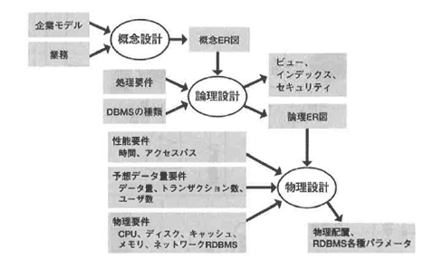
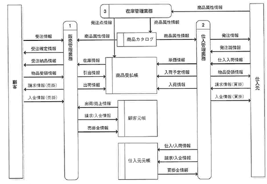

<html><body><h2 id="dbdesignTtl">5.2 データベース設計の手順</h2>

第1章から第4章にかけて学習したデータベース設計の手順に従って、概念設計から物理設計まで行います。

図5-2 データベース設計の手順

<!--/.grayBox-->

図5-3 概念設計

<!--/.grayBox-->

まず、概念設計ですが、ここでは次の2段階の手順を踏みます。

<ul>
<li>● 概略ER図の作成</li>
<li>● 詳細ER図の作成</li>
</ul>

重要なのは、最初から詳細部分を分析するのではなく、まず大きく業務の流れをつかみ、必要なエンティティを抽出することです。

<!--/section-->

<h3>5.2.1 概略ER図の作成</h3>

大きくエンティティの抽出を行うフェーズでは、概略ER図の作成を行います。 
ここでは、エンティティと、わかる範囲で一意識別子、リレーションシップをざっくり抽出します。 
経験をつんでくると、この段階で、現行の業務からだけでは抽出できない創造的なエンティティを抽出することができるようになります。

このフェーズでは、企業の戦略を立てている経営層に対して、システムで管理すべきデータが現在どのように設計されているかを説明します。 
その上で、企業として今後どのような分野の情報が必要になるかをヒアリングし、大きな視点から必要なエンティティを提言してもらうことが重要です。

この作業をしっかり行っておくと、将来アプリケーションの追加や拡張を行う場合に対応しやすい、拡張性の高いモデルを作成することができます。 
また、現状の分析という意味では、関連のある複数の部門に説明を行い、同じようなデータを使用していないか、一元管理ができないか、といった確認を行う必要もあります。

<!--/section-->

<h3>5.2.1 概略ER図の作成</h3>

このフェーズの目的は、業務を分析した結果を忠実にER図に表し、正規化することによって、メンテナンス性の高いER図を作成することです。
データベース設計者として、システム化のアプリケーションを理解し、仕様の細かい部分や例外的処理にも対応できるよう、きめの細かい分析を行う必要があります。

概略ER図を作成するにせよ、詳細ER図を作成するにせよ、大切なのは、

<strong>こちらがほしい情報をいかにインタビュー対象の相手から引き出すか</strong>

という点です。
どのようなデータベース設計になるか、ひいてはどのようなシステムを構築できるか、ここが重要な分岐点になります。

そのためには、以下のような幅広い能力が求められています。

<ul>
<li>● 一業務分野だけではなく、現在の企業の戦略や今後の企業の戦略を展望できる幅広い業界知識と想像力</li>
<li>● 業務の中で起きるさまざまなケースを想定できる繊細な分析力</li>
<li>● 話をする相手に気づきを与え、さらに積極的にシステム構築に参加し、情報を提供する気にさせるコミュニケーションカ</li>
</ul>
<!--/section-->

<h4 class="caption">STEP1 対象領域を明確にする</h4>

本書で行う開発では、商品の受発注処理をシステム化します。 
アプリケーション開発チームは、概要設計フェーズで次のことを明らかにしています。

<ul>
<li>● 現状の基本業務</li>
<li>● 問題点やニーズの分析</li>
<li>● 新システムで解決すべき問題点</li>
</ul>

その上で、実現すべきシステムの構造や要求仕様（主要なインプット情報、アウトプット情報）を明らかにしています。 
次の図は、本書でシステム化を行う範囲の中で最も基本的な業務の流れです。

図5-4 基本的な業務の流れ

<!--/.grayBox-->

アプリケーション間発チームでは、現行の業務フローとユーザインタビューを元にDFDというモデリング手法を使って、データの流れと業務の分割を次のように分析しました（図5-5参照）。 
データベースの概念設計フェーズでは、次の情報を元に現状を分析し、管理すべきデータを抽出します。 
以降、必要な情報は、各業務ごとにそのつど提供しますので、その情報に従ってER図を作成してみてください。

<ul>
<li>● 現行の業務フロー</li>
<li>● ユーザインタビューの結果</li>
<li>● 現在使われている伝票や帳票類</li>
</ul>

図5-5 データの流れと業務の分割

<!--/.grayBox-->

<!--/section-->

<h4 class="caption">STEP2 トップダウンで概略ER図を作成する</h4>

ここから、図を交えて業務の内容を具体的に見ながらモデリングをしてみましょう。 
ただし、まだ概略ER図の作成段階なので、業務はおおまかにつかむ程度に説明します。 
モデリングする業務を図5-6の5つのフェーズに分けてアプローチします。

図5-6 5つのフェーズ

<!--/.grayBox-->

<!--/section-->

</body></html>