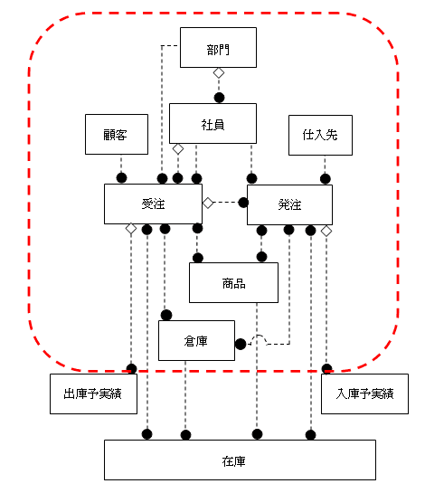
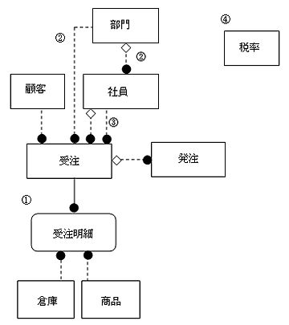
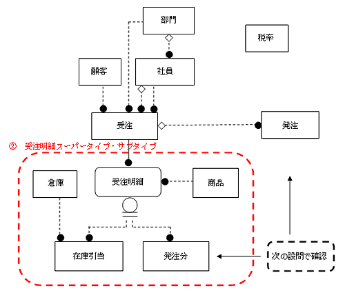

<html><body><h2 id="dbdesignTtl">第6章のはじめに</h2>

第6章では、実際の業務を詳細に分析してモデリングをしてみます。 
第5章までに学んだことに注意して、概念設計のアウトプットとして冗長性のない、正規形を満たしたER図を作成します。

開発チームとの連携という意味では、このフェーズは業務要件の分析を行い、詳細な仕様を詰めていく段階です。 
疑問点やあやふやな点が出てきたら、自分達の思い込みで勝手に仕様を作成してしまうのではなく、必要な人、もしくはグループとの意識合わせを行ってください。 
間違った仕様を元に概念設計を行うと、後での修正はたいへんな作業になってしまうことを肝に命じておいてください。

まず、第2章で学んだことを復習しておきましょう。
概念設計の詳細ER図作成で行うことは以下のとおりです。

<ul>
<li>● 業務で使用するデータ項目をすべて属性として洗い出す</li>
<li>● 正規形を満たしている</li>
<li>● 一意識別子は、この段階では人工的なキーは考えない</li>
<li>● エンティティ名や属性名にはわかりやすい、重複しない名前をつける</li>
<li>● ドメインが決まるものについて検討する</li>
</ul>

実業務の場合は、以下の観点に留意してください。

<ul>
<li>● 受注から入金までのデータのターンアラウンドを考えたとき、処理忘れを管理するために<strong>「残」が確認できる</strong>よう意識して設計します</li>
<li>● 導出項目や重複項目は、正規化の観点からは排除すべきです 
ただし、一度排除してしまうと、元にどのような項目があったかを再度検討することは難しいため、導出、重複、という説明書とともに残しておくことをお勧めします</li>
<li>● 業務に必要な属性はすべて管理する必要があります 
もし、業務で必要な属性が不足していたことが後の工程で分かった場合、データベースの設計し直し、すなわちアプリケーションの作り直しというたいへんな手戻り作業が発生します 
概念設計の詳細設計フェーズですべての業務要件を満たすデータベースを目指して設計してください</li>
</ul>

<h2 id="H1">6.1 【設問】受発注（1/3）</h2>

受発注に関する詳細ER図を作成するには、以下の項目に分けてアプローチします。 
受発注エンティティの詳細分析では、在庫も「引当」という観点で分析すべきですが、受発注処理と在庫処理を一緒に分析するとわかりにくくなるため、在庫は「<a href="../../06_02/index.md">6.2 【設問】受発注～入出荷</a>」で分析します。

<!--/section-->

<table class="tableBox">
<tr>
<th style="width:150px;">項目</th>
<th>業務内容または要求仕様</th>
</tr>
<tr>
<td rowspan="3">6.1.1 受発注エンティティの見直し</td>
<td>例題1　受注エンティティの正規化をする</td>
</tr>
<tr>
<td><a href="#h4_2">例題2　受注のステータス管理ができるようにする</a></td>
</tr>
<tr>
<td><a href="#h4_3">例題3　受発注エンティティ問にリレーションを引く</a></td>
</tr>
<tr>
<td rowspan="3">6.1.2 商品エンティティの見直し</td>
<td><a href="../02/index.md">例題4　商品に対する値引きをモデルで表す</a></td>
</tr>
<tr>
<td><a href="../02/index.md#h4_5">例題5　営業判断による値引きを可能にする</a></td>
</tr>
<tr>
<td><a href="../02/index.md#h4_6">例題6　商品の価格を分析する</a></td>
</tr>
<tr>
<td rowspan="3">6.1.3 その他の詳細な属性の見直し</td>
<td><a href="../03/index.md">例題7　受注ヘッダの膜客属性を見直す</a></td>
</tr>
<tr>
<td><a href="../03/index.md#h4_8">例題8　受注ヘッダ、受注明細の属性を見直す</a></td>
</tr>
</table>

表6-1 受発注に関する設問

<!--/section-->

<h3>6.1.1 受発注エンティティの見直し</h3>
<h4 class="caption">題1 受注エンティティの正規化をする</h4>

以下に、受発注処理での分析対象範囲と注文伝票を示します。

図6-1 分析対象範囲

<!--/.grayBox-->

図6-2 注文伝票

<!--/.grayBox-->

<!--/section-->

<h5 class="quiz-title">Ｑ&nbsp;問題</h5>

受注エンティティの属性を抽出し、必要に応じて正規化してください。

<!--/section-->

<h5 class="answer-title">Ｈ&nbsp;ヒント</h5>

このような明細形式の注文書は、注文番号を一意に管理する番号として、伝票単位に情報が管理されています。 
注文番号ごとにすべての情報を同じように管理しようとすると、客先情報や、注文番号などの「見出し項目＝ヘッダ情報」に対して、明細の商品情報が注文した商品の数分繰り返し対応している形になります。

管理すべき情報の頻度別に、伝票ごとに1回だけ出現する「ヘッダ情報」と具体的な「明細情報」に分けて管理することによって、重複を排除し、更新時の矛盾が起きないようにします（第1正規化。受注ヘッダと受注明細に分割します）。

<!--/section-->

<h5 class="answer-title">Ａ&nbsp;解答</h5>

図6-3 解答

<!--/.grayBox-->

エンティティと属性、一意識別子、外部キーの表記法は以下のとおりです。

<strong>エンティティ名</strong>

属性名1 属性名2

一意識別子 *印 外部キー （FKn） ※リレーションが同じであればnは同じ数値 導出項目 （導出）

<!--/section-->

<table>
<tr><td colspan="4"><strong>受注</strong></td></tr>
<tr><td style="width:20px;">*</td><td style="width:150px;">受注注文番号</td><td style="width:80px;">&nbsp;</td><td style="width:50px;">&nbsp;</td></tr>
<tr><td>&nbsp;</td><td>客先注文番号</td><td>&nbsp;</td><td>&nbsp;</td></tr>
<tr><td>&nbsp;</td><td>受注日付</td><td>&nbsp;</td><td>&nbsp;</td></tr>
<tr><td>&nbsp;</td><td>受注顧客コード</td><td>（FK1）</td><td>&nbsp;</td></tr>
<tr><td>&nbsp;</td><td>受注社員コード</td><td>（FK2）</td><td>3.</td></tr>
<tr><td>&nbsp;</td><td>値引き承認社員コード</td><td>（FK3）</td><td>3.</td></tr>
<tr><td>&nbsp;</td><td>受注部門コード</td><td>（FK4）</td><td>2.</td></tr>
<tr><td>&nbsp;</td><td>全体値引き額</td><td>&nbsp;</td><td>5.</td></tr>
<tr><td>&nbsp;</td><td>消費税額</td><td>（導出）</td><td>&nbsp;</td></tr>
<tr><td>&nbsp;</td><td>税抜受注金額合計</td><td>（導出）</td><td>5.</td></tr>
<tr><td>&nbsp;</td><td>納入希望日</td><td>&nbsp;</td><td>&nbsp;</td></tr>
<tr><td>&nbsp;</td><td>摘要</td><td>&nbsp;</td><td>&nbsp;</td></tr>
<tr><td colspan="4">&nbsp;</td></tr>
<tr><td colspan="4"><strong>受注明細</strong></td></tr>
<tr><td>*</td><td>受注注文番号</td><td>（FK1）</td><td>5.</td></tr>
<tr><td>*</td><td>商品コード</td><td>（FK2）</td><td>5.</td></tr>
<tr><td>*</td><td>倉庫コード</td><td>（FK3）</td><td>5.</td></tr>
<tr><td>&nbsp;</td><td>数量</td><td>&nbsp;</td><td>&nbsp;</td></tr>
<tr><td>&nbsp;</td><td>値引き額</td><td>&nbsp;</td><td>&nbsp;</td></tr>
<tr><td>&nbsp;</td><td>消費税額</td><td>（導出）</td><td>&nbsp;</td></tr>
<tr><td>&nbsp;</td><td>金額</td><td>（導出）</td><td>&nbsp;</td></tr>
<tr><td colspan="4">&nbsp;</td></tr>
<tr><td colspan="4"><strong>税率</strong></td></tr>
<tr><td>&nbsp;</td><td>消費税率</td><td>&nbsp;</td><td>4.</td></tr>
<tr><td>&nbsp;</td><td>適用開始日</td><td>&nbsp;</td><td>&nbsp;</td></tr>
<tr><td>&nbsp;</td><td>適用終了日</td><td>&nbsp;</td><td>&nbsp;</td></tr>
</table>

<!-- /commandBox -->

<h4>解説 （注：番号は解答中の番号と対応します。番号が記載されていない解説は全体に当てはまります）</h4>

<ul>
<li>1. 詳細設計では、正規化された冗長性のないデータベースを設計します。 
マスタ系のエンティティは今回ほとんど概略設計で抽出されていますが、受注エンティティの部分に着目して、第1正規化の作業を行います。 
注文伝票の中で1回しか出てこない情報を「受注」で管理し、繰り返し出てくる情報を「受注明細」で管理します。 
関連する、互いのオカレンスは、生成・更新・削除のライフサイクルが同一であり、依存関係にあるということができます</li>
<li>● 一意識別子の決定、外部キーの決定、属性の決定方法やリレーションの分析の詳細など、正規化の詳細手順については、「<a href="../../01_05/index.md">1.5 正規化の手順</a>」や「<a href="../../02_03/01/index.md">2.3 概念設計の手順</a>」などを参照してください</li>
<li>2. 受注エンティティから「社員」「部門」の両方にリレーションが引いてありますが、これは冗長ではありません 
受注を受けた「社員」が所属する「部門」を管理したいわけではなく、この受注を受けた部門を管理したいという要件から、直接「受注」と「部門」の間にリレーションが引いてあります</li>
<li>3. 「受注」から「社員」へ2本のリレーションが引いてありますが、これは受注を受けた社員と、受注時の値引きを承認する社員という意味の異なる2つのリレーションです</li>
<li>4. 「消費税率」は、他のアプリケーションからも共通で参照されるべき、独立したエンティティとして抽出します</li>
<li>● 注文伝票から読み取れる、業務で使用されるすべての項目を属性として抽出し、エンティティの属性と一意識別子、属性、外部キーなどを表記します</li>
<li>5. 商品の在庫引当は、1つの「倉庫」からすべて引き当てられるとは限りません 
同じ商品を複数の倉庫から引き当てた場合、受注明細行の一意識別子は、「受注注文番号」「商品コード」「倉庫コード」の3つの属性の組み合わせになります</li>
</ul>
<!--/section-->

<h4>参考</h4>

ここまで詳細に属性を検討してくると、業務の詳細な部分や、さまざまなケースにどう対応しているのか、対応できるようにするためには、どのような項目を管理すべきか、といった疑問がわいてきます。 
業務を理解し、あらゆる角度から検討した結果、場合に応じた解決策を事前に提案できるようになると、モデリングに付加価値を提供することができるようになります。

また、必要に応じて、アプリケーション的な観点から、開発チームとすり合わせるべき具体的な項目を列挙し、必要に応じて開発チームや開発依頼元に問い合わせをします。

<ul>
<li>1. 金額の桁数はそれぞれ何桁まで管理するのか</li>
<li>2. 値引きは金額で管理するのか、パーセントで管理するのか</li>
<li>3. 日付は時分秒まで管理するのか</li>
</ul>

たとえば、倉庫に十分在庫がある場合はこれだけでよいでしょうが、もしいくつかの商品の在庫が足らなくて、仕入れしなければならない場合、受注時に顧客に言われた希望納期に納品できるかはわかりません。 
もし、納期に間に合わない場合、顧客の了解を得て商品ごとに納期の異なる出荷処理を行うことになります。 
次の問題でこれに対応できるモデルを考えてみましょう。

<!--/section-->

<h4 class="caption" id="h4_2">例題2 受注のステータス管理ができるようにする</h4>

まず、業務の現状と要望事項を説明します。 
それを把握した上で、続く問題に答えなさい。

営業所の社員にインタビューを行ったところ、受注業務では「仮受注→受注確定（納期、数量確定）→納品確認」というステータスの管理が必要であることがわかりました。
それぞれの意味を以下に説明します。

<table class="tableBox">
<tr>
<th style="width:100px;" abbr="ステータス">ステータス</th>
<th abbr="説明">説明</th></tr>
<tr><td>仮受注</td>
<td>注文伝票に記載されている商品のうち、いくつかは希望数量の在庫引当ができておらず、仮引当のみ行った状態 顧客への確認、仕入処理が必要</td></tr>
<tr><td>受注確定</td>
<td>次のうちのいずれか
<ol>
<li>受注した商品の在庫がすべて引き当られた</li>
<li>在庫が不足していたため、数を減らして受注を受けた</li>
<li>不足分については、顧客に納期延長交渉をして、仕入処理が行われた</li>
</ol>
</td></tr>
<tr><td>納品確認</td>
<td>受注確定状態3.の処理後、仕入先から注文請書が返送され、納期が確定した状態</td></tr>
</table>

表6-2 ステータス

実際の業務では、どの場合にどのステータスが該当するかを説明します。

<strong>【CASE1】</strong> 
在庫を確認したところ、出荷可能在庫数が十分あったため引当を行い、その倉庫にある在庫を押さえた 
この状態は受注確定

<strong>【CASE2】</strong> 
在庫不足のため、現在の在庫をすべて仮引当し、顧客に納期確認をする 
この状態は仮受注

<strong>【CASE3】</strong> 
顧客に確認した結果、現在倉庫にある在庫数だけでよいことになったので、数を変更して受注確定

<strong>【CASE4】</strong> 
在庫不足のため、在庫品をすべて仮引当し、顧客に納期確認をする 
顧客に確認した結果、不足分は納期を延期しても取り寄せてほしいといわれ、仕入処理をした 
仕入処理を行った結果、納期が決まり、受注するために十分な数量を確保できることが確認できた 
この状態が受注確定 
その後、仕入先から注文請書が送付されてきて、仕入納期が確定した 
この状態が納品確認

また、営業担当からは、次のようなリクエストが発生しています。 
「在庫が不足していたために、顧客が当初希望した数量より少ない数で受注した場合の機会損失をなるべく避けたい。そのため、機会損失の情報を後で確認できるようにしてほしい」。

<!--/section-->

<h5 class="quiz-title">Ｑ&nbsp;問題</h5>

業務を時系列に捉えたときに、受注処理の中の各ステータスが管理できるようにモデリングしてください。 
他の必要な条件が決まらないために属性が決まらない部分については、保留にしておいてください。

<!--/section-->

<h5 class="answer-title">Ｈ&nbsp;ヒント</h5>

「ステータス」はどのエンティティで管理すればよいでしょうか。 
次のことを念頭に置いて考えてみてください。

ステータス管理は、多くの場合、正規化した結果の属性を組み合わせて利用すれば、管理できる内容です。 
このため、「ステータス」という属性を追加した場合、それが導出属性であれば、ある処理を行った結果として連携して更新する必要がある場合が多いといえます。 
ステータスを管理するための追加のアプリケーションと、ステータスを確認する要件のコストとパフォーマンスを考慮に入れ、どうやってステータスを管理する方法が最適かを決めます。

たとえば、ステータス管理の例としては以下が挙げられます。

<ul>
<li>● 「ステータス」などの追加の属性はもたせず、既存の属性のみで管理する</li>
<li>● 「ステータス」という導出属性を追加する</li>
<li>● 「受注ステータス」というエンティティを作成する</li>
</ul>
<!--/section-->

<h5 class="answer-title">Ａ&nbsp;解答</h5>

図6-4 解答

<!--/.grayBox-->

<!--/section-->

<table>
<tr><td colspan="4"><strong>受注</strong></td></tr>
<tr><td style="width:20px;">*</td><td style="width:150px;">受注注文番号</td><td style="width:80px;">&nbsp;</td><td style="width:50px;">&nbsp;</td></tr>
<tr><td>&nbsp;</td><td>客先注文番号</td><td>&nbsp;</td><td>&nbsp;</td></tr>
<tr><td>&nbsp;</td><td>受注日付</td><td>&nbsp;</td><td>&nbsp;</td></tr>
<tr><td>&nbsp;</td><td>受注顧客コード</td><td>（FK1）</td><td>&nbsp;</td></tr>
<tr><td>&nbsp;</td><td>受注社員コード</td><td>（FK2）</td><td>&nbsp;</td></tr>
<tr><td>&nbsp;</td><td>値引き承認社員コード</td><td>（FK3）</td><td>&nbsp;</td></tr>
<tr><td>&nbsp;</td><td>受注部門コード</td><td>（FK4）</td><td>&nbsp;</td></tr>
<tr><td>&nbsp;</td><td>全体値引き額</td><td>&nbsp;</td><td>&nbsp;</td></tr>
<tr><td>&nbsp;</td><td>消費税額</td><td>（導出）</td><td>1.</td></tr>
<tr><td>&nbsp;</td><td>税抜受注金額合計</td><td>（導出）</td><td>1.</td></tr>
<tr><td>&nbsp;</td><td>納入希望日</td><td>&nbsp;</td><td>&nbsp;</td></tr>
<tr><td>&nbsp;</td><td>摘要</td><td>&nbsp;</td><td>&nbsp;</td></tr>
<tr><td colspan="4">&nbsp;</td></tr>
<tr><td colspan="3">スーパータイプ：<strong>受注明細</strong></td>
<td>3.</td></tr>
<tr><td>*</td><td>受注注文番号</td><td>（FK1）</td><td>5.</td></tr>
<tr><td>*</td><td>商品コード</td><td>（FK2）</td><td>5.</td></tr>
<tr><td>&nbsp;</td><td>値引き額</td><td>&nbsp;</td><td>&nbsp;</td></tr>
<tr><td>&nbsp;</td><td>消費税額</td><td>（導出）</td><td>1.</td></tr>
<tr><td>&nbsp;</td><td>金額</td><td>（導出）</td><td>1.</td></tr>
<tr><td>&nbsp;</td><td>予定納付日付</td><td>&nbsp;</td><td>&nbsp;</td></tr>
<tr><td>&nbsp;</td><td>受注数量</td><td>&nbsp;</td><td>4.</td></tr>
<tr><td>&nbsp;</td><td>変更後最終受注数量</td><td>&nbsp;</td><td>4.</td></tr>
<tr><td>&nbsp;</td><td>ステータス</td><td>&nbsp;</td><td>4.</td></tr>
<tr><td colspan="4">&nbsp;</td></tr>
<tr><td colspan="3">サブタイプ：<strong>在庫引当</strong></td>
<td>3.</td></tr>
<tr><td>*</td><td>受注注文番号</td><td>（FK1）</td><td>&nbsp;</td></tr>
<tr><td>*</td><td>商品コード</td><td>（FK2）</td><td>&nbsp;</td></tr>
<tr><td>*</td><td>倉庫コード</td><td>（FK3）</td><td>&nbsp;</td></tr>
<tr><td>&nbsp;</td><td>引当数量</td><td>&nbsp;</td><td>&nbsp;</td></tr>
<tr><td colspan="4">&nbsp;</td></tr>
<tr><td colspan="2">サブタイプ：<strong>発注分</strong></td>
<td>&nbsp;</td>
<td>3.</td></tr>
<tr><td>*</td><td>受注注文番号</td><td>（FK1）</td><td>&nbsp;</td></tr>
<tr><td>*</td><td>商品コード</td><td>（FK2）</td><td>&nbsp;</td></tr>
<tr><td>*</td><td>発注注文番号</td><td>（FK3）</td><td>&nbsp;</td></tr>
<tr><td>&nbsp;</td><td>不足分数量</td><td>&nbsp;</td><td>&nbsp;</td></tr>
<tr><td>&nbsp;</td><td>確定納期日付</td><td>&nbsp;</td><td>&nbsp;</td></tr>
</table>

<!-- /commandBox -->

<h4>解説 （注：番号は解答中の番号と対応します。番号が記載されていない解説は全体に当てはまります）</h4>

<ul>
<li>1. 「受注」エンティティの「合計金額」、「消費税額」と「受注明細」エンティティの「金額」、「消費税額」は導出属性として概念設計では残しておきます</li>
<li>2. 「受注明細」エンティティのオカレンスは、以下の2つに分類できます</li>
<li>

● 在庫が引当できた在庫引当受注

● 在庫の引当数が不足したため、仕入れ処理を行い受注を受けた「発注分」 
また、この2つに共通の属性およびリレーションと、個別に管理される属性およびリレーションに分けることができます 
そこで、「受注明細」エンティティを、共通に管理すべきスーパータイプと2つの受注種別のサブタイプに分けます

</li>
<li>3. 共通属性がスーパータイプの属性になります。各サブタイプ固有の属性としては、「倉庫コード」が「在庫引当」サブタイプの、「不足分数量」と「確定納期日付」が「発注分」サブタイプに固有の属性となります。概念設計では、サブタイプの一意識別子はスーパータイプと同一のものにしておきます。それぞれどのようなテーブル構成にするかは論理設計時に検討します</li>
<li>4. ステータスは、商品単位に在庫状況を確認して管理することから、「受注明細」スーパータイプで管理します</li>
<li>

● 仮受注：「受注明細」スーパータイプの「変更後最終受注数量」の値と、「在庫引当」サブタイプの同じ受注注文番号をもつ各「引当数量」の値の和を比較して、引当数量の和の方が小さい場合です（複数の倉庫から引当をしている場合があるため、和をとる必要があります） 
「受注数量」は、顧客が最初に発注した数量です 
在庫不足のため、「受注数量」を「変更後最終受注数量」に変更した場合、営業としては機会損失しているわけですから、その値を後で調べるために「最初の受注数量」を属性として管理すべきと判断しています

● 受注確定：「受注明細」スーパータイプの「変更後最終受注数量」の値と、「在庫引当」サブタイプの「引当数量」属性と、「発注分」サブタイプの「不足分数量」属性の値の和を比較して、等しい状態です
ただし、まだ「発注分」サブタイプの「確定納期日付」に値が入っていない状態を指します

● 納期確定：受注確定の条件の中で、「発注分」サブタイプとリレーションをもつ「発注明細」エンティティの「確定納期日付」に値が入った状態です

</li>
<li>5. 概念設計では、一意識別子は、あえて人工的なキーは用いません 
人工的なキーを早めに用いてしまうと、本来のオカレンスのもつ意味（どのような属性の組み合わせで一意なオカレンスが決まるか）がわかりにくくなってしまうためです 
一意識別子の検討は、表への変換を行う論理設計の段階で決めます</li>
<li>● 受注ヘッダエンティティや出荷/売上ヘッダエンティティ等の一意識別子は、すでに管理する属性として受注注文番号などが使用されているため、これらはそのまま一意識別子として使用します</li>
<li>● 属性名には、エンティティ名を接頭辞として付けることにより、明確に意味がわかるようにします</li>
</ul>
<!--/section-->

<h4 class="caption" id="h4_3">例題3 受発注エンティティ間にリレーションを引く</h4>

まず、業務の現状を説明します。 
それを把握した上で、続く問題に答えなさい。

受注のうち、倉庫で在庫引当ができなかった分については、仕入先に発注します。 
発注時に数量と納期を決めます。 
仕入先から注文講書が到着した時点で、納期確定となります。 
仕入時に使用する発注伝票は、受注時に使用する注文伝票と同じ内容のものを使用します。

<!--/section-->

<h5 class="quiz-title">Ｑ&nbsp;問題</h5>

商品ごとに仕入先は1箇所だけという前提でモデルを考えてください。

<!--/section-->

<h5 class="answer-title">Ｈ&nbsp;ヒント</h5>

まず、「発注」エンティティを「受注」エンティティと同様、正規化してください。 
その際、「発注」エンティティ、「発注明細」エンティティの一意識別子と、オカレンスが何を示しているかを確認してください。 
その上で、「発注」エンティティヘのリレーションシップが、「受注」側のどのエンティティとの間に引かれるかを考えてください。

また、その際、どちらのオカレンスが時系列で先に発生するかを考えて、オブショナリティを設定してください。

<h4>参考</h4>

本記事では、属性名で使用する「番号」と「コード」を使い分けています。 
「番号」は意味をもたない順序番号などを想定しており、「コード」は何らかの意味のある場合に用います。 
このような命名規則なども、ドキュメントとして残すことによって、管理すべき名前を整理することができます。

<!--/section-->

<h5 class="answer-title">Ａ&nbsp;解答</h5>

図6-5 解答

<!--/.grayBox-->

<!--/section-->

<table>
<tr><td colspan="4"><strong>受注</strong></td></tr>
<tr><td style="width:20px;">*</td><td style="width:150px;">受注注文番号</td><td style="width:80px;">&nbsp;</td><td style="width:50px;">&nbsp;</td></tr>
<tr><td>&nbsp;</td><td>客先注文番号</td><td>&nbsp;</td><td>&nbsp;</td></tr>
<tr><td>&nbsp;</td><td>受注日付</td><td>&nbsp;</td><td>&nbsp;</td></tr>
<tr><td>&nbsp;</td><td>受注顧客コード</td><td>（FK1）</td><td>&nbsp;</td></tr>
<tr><td>&nbsp;</td><td>受注社員コード</td><td>（FK2）</td><td>&nbsp;</td></tr>
<tr><td>&nbsp;</td><td>値引き承認社員コード</td><td>（FK3）</td><td>&nbsp;</td></tr>
<tr><td>&nbsp;</td><td>受注部門コード</td><td>（FK4）</td><td>&nbsp;</td></tr>
<tr><td>&nbsp;</td><td>全体値引き額</td><td>&nbsp;</td><td>&nbsp;</td></tr>
<tr><td>&nbsp;</td><td>消費税額</td><td>（導出）</td><td>&nbsp;</td></tr>
<tr><td>&nbsp;</td><td>税抜受注金額合計</td><td>（導出）</td><td>&nbsp;</td></tr>
<tr><td>&nbsp;</td><td>納入希望日</td><td>&nbsp;</td><td>&nbsp;</td></tr>
<tr><td>&nbsp;</td><td>摘要</td><td>&nbsp;</td><td>&nbsp;</td></tr>
<tr><td colspan="4">&nbsp;</td></tr>
<tr><td colspan="4">スーパータイプ：<strong>受注明細</strong></td></tr>
<tr><td style="width:20px;">*</td><td style="width:150px;">受注注文番号</td><td style="width:80px;">（FK1）</td><td style="width:50px;">&nbsp;</td></tr>
<tr><td>*</td><td>商品コード</td><td>（FK2）</td><td>&nbsp;</td></tr>
<tr><td>&nbsp;</td><td>値引き額</td><td>&nbsp;</td><td>&nbsp;</td></tr>
<tr><td>&nbsp;</td><td>消費税額</td><td>（導出）</td><td>&nbsp;</td></tr>
<tr><td>&nbsp;</td><td>金額</td><td>（導出）</td><td>&nbsp;</td></tr>
<tr><td>&nbsp;</td><td>予定納期日付</td><td>&nbsp;</td><td>&nbsp;</td></tr>
<tr><td>&nbsp;</td><td>受注数量</td><td>&nbsp;</td><td>&nbsp;</td></tr>
<tr><td>&nbsp;</td><td>変更後最終受注数量</td><td>&nbsp;</td><td>&nbsp;</td></tr>
<tr><td>&nbsp;</td><td>ステータス</td><td>&nbsp;</td><td>&nbsp;</td></tr>
<tr><td colspan="4">&nbsp;</td></tr>
<tr><td colspan="4">サブタイプ：<strong>在庫引当</strong></td></tr>
<tr><td style="width:20px;">*</td><td style="width:150px;">受注注文番号</td><td style="width:80px;">（FK1）</td><td style="width:50px;"></td></tr>
<tr><td>*</td><td>商品コード</td><td>（FK2）</td><td>&nbsp;</td></tr>
<tr><td>*</td><td>倉庫コード</td><td>（FK3）</td><td>&nbsp;</td></tr>
<tr><td>&nbsp;</td><td>引当数量</td><td>&nbsp;</td><td>&nbsp;</td></tr>
<tr><td colspan="4">&nbsp;</td></tr>
<tr><td colspan="4">サブタイプ：<strong>発注分</strong></td></tr>
<tr><td style="width:20px;">*</td><td style="width:150px;">受注注文番号</td><td style="width:80px;">（FK1）</td><td style="width:50px;">&nbsp;</td></tr>
<tr><td>*</td><td>商品コード</td><td>（FK2）</td><td>&nbsp;</td></tr>
<tr><td>*</td><td>発注注文番号</td><td>（FK3）</td><td>&nbsp;</td></tr>
<tr><td>&nbsp;</td><td>発注商品コード</td><td>（FK4）</td><td>&nbsp;</td></tr>
<tr><td>&nbsp;</td><td>不足分数量</td><td>&nbsp;</td><td>3.</td></tr>
<tr><td colspan="4">&nbsp;</td></tr>
<tr><td colspan="4"><strong>発注</strong></td></tr>
<tr><td style="width:20px;">*</td><td style="width:150px;">発注注文番号</td><td style="width:80px;">&nbsp;</td><td style="width:50px;">&nbsp;</td></tr>
<tr><td>&nbsp;</td><td>発注日付</td><td>&nbsp;</td><td>&nbsp;</td></tr>
<tr><td>&nbsp;</td><td>仕入先コード</td><td>（FK1）</td><td>&nbsp;</td></tr>
<tr><td>&nbsp;</td><td>発注社員番号</td><td>（FK2）</td><td>&nbsp;</td></tr>
<tr><td>&nbsp;</td><td>発注金額合計</td><td>（導出）</td><td>&nbsp;</td></tr>
<tr><td>&nbsp;</td><td>受注注文番号</td><td>（FK3）</td><td>&nbsp;</td></tr>
<tr><td>&nbsp;</td><td>倉庫コード</td><td>（FK4）</td><td>&nbsp;</td></tr>
<tr><td>&nbsp;</td><td>全体値引き額</td><td>&nbsp;</td><td>&nbsp;</td></tr>
<tr><td>&nbsp;</td><td>消費税額</td><td>（導出）</td><td>&nbsp;</td></tr>
<tr><td>&nbsp;</td><td>税込発注金額合計</td><td>（導出）</td><td>&nbsp;</td></tr>
<tr><td>&nbsp;</td><td>納入希望日付</td><td>&nbsp;</td><td>3.</td></tr>
<tr><td colspan="4">&nbsp;</td></tr>
<tr><td colspan="4"><strong>発注明細</strong></td></tr>
<tr><td style="width:20px;">*</td><td style="width:150px;">発注注文番号</td><td style="width:80px;">（FK1）</td><td style="width:50px;">&nbsp;</td></tr>
<tr><td>*</td><td>商品コード</td><td>（FK2）</td><td>&nbsp;</td></tr>
<tr><td>&nbsp;</td><td>発注数量</td><td>&nbsp;</td><td>3.</td></tr>
<tr><td>&nbsp;</td><td>値引き額</td><td>&nbsp;</td><td>&nbsp;</td></tr>
<tr><td>&nbsp;</td><td>消費税額</td><td>（導出）</td><td>&nbsp;</td></tr>
<tr><td>&nbsp;</td><td>発注金額計</td><td>（導出）</td><td>&nbsp;</td></tr>
<tr><td>&nbsp;</td><td>受注注文番号</td><td>（FK3）</td><td>&nbsp;</td></tr>
<tr><td>&nbsp;</td><td>確定納期日付</td><td>&nbsp;</td><td>3.</td></tr>
<tr><td colspan="4">&nbsp;</td></tr>
<tr><td colspan="4"><strong>社員エンティティ</strong></td></tr>
<tr><td style="width:20px;">*</td><td style="width:150px;">社員コード</td><td style="width:80px;">&nbsp;</td><td style="width:50px;">&nbsp;</td></tr>
<tr><td>&nbsp;</td><td>社員氏名</td><td>&nbsp;</td><td>&nbsp;</td></tr>
<tr><td>&nbsp;</td><td>所属部門コード</td><td>（FK）</td><td></td></tr>
<tr><td colspan="4">&nbsp;</td></tr>
<tr><td colspan="4"><strong>部門エンティティ</strong></td></tr>
<tr><td style="width:20px;">*</td><td style="width:150px;">部門コード</td><td style="width:80px;">&nbsp;</td><td style="width:50px;">&nbsp;</td></tr>
<tr><td>&nbsp;</td><td>部門名前</td><td>&nbsp;</td><td>&nbsp;</td></tr>
<tr><td>&nbsp;</td><td>部門住所</td><td>&nbsp;</td><td>&nbsp;</td></tr>
<tr><td>&nbsp;</td><td>部門電話番号</td><td>&nbsp;</td><td>&nbsp;</td></tr>
<tr><td>&nbsp;</td><td>部長社員コード</td><td>（FK1）</td><td>&nbsp;</td></tr>
<tr><td colspan="4">&nbsp;</td></tr>
<tr><td colspan="4"><strong>倉庫エンティティ</strong></td></tr>
<tr><td style="width:20px;">*</td><td style="width:150px;">倉庫コード</td><td style="width:80px;">&nbsp;</td><td style="width:50px;">&nbsp;</td></tr>
<tr><td>&nbsp;</td><td>倉庫名前</td><td>&nbsp;</td><td>&nbsp;</td></tr>
<tr><td>&nbsp;</td><td>倉庫住所</td><td>&nbsp;</td><td>&nbsp;</td></tr>
<tr><td>&nbsp;</td><td>倉庫電話番号</td><td>&nbsp;</td><td>&nbsp;</td></tr>
<tr><td colspan="4">&nbsp;</td></tr>
<tr><td colspan="4"><strong>在庫エンティティ</strong></td></tr>
<tr><td style="width:20px;">*</td><td style="width:150px;">倉庫コード</td><td style="width:80px;">&nbsp;</td><td style="width:50px;">&nbsp;</td></tr>
<tr><td>*</td><td>商品コード</td><td>&nbsp;</td><td>&nbsp;</td></tr>
<tr><td></td><td>日付</td><td>&nbsp;</td><td>&nbsp;</td></tr>
<tr><td>&nbsp;</td><td>現在庫数</td><td>&nbsp;</td><td>&nbsp;</td></tr>
<tr><td>&nbsp;</td><td>出荷引当可能量</td><td>&nbsp;</td><td>&nbsp;</td></tr>
</table>

<!-- /commandBox -->

<h4>解説 （注：番号は解答中の番号と対応します。番号が記載されていない解説は全体に当てはまります）</h4>

<ul>
<li>1. 「発注」エンティティの正規化については、「受注」エンティティの考え方と同じです</li>
<li>2. 商品ごとに、仕入先が1箇所に決まっていることから、「受注」1件に対し、複数の商品在庫に不足があった場合、「発注」が複数対応する場合が考えられます 
「発注」エンティティは、受注時の在庫不足による発注だけではなく、計画発注も含まれます 
これらから、「受注」と「発注」の間のリレーションは、1対多で「受注側」のオブショナリティは任意となります</li>
<li>3. 「発注明細」とリレーションをもつのは、「受注明細」の「発注分」サブタイプになります 
不足した各受注商品明細ごとに「発注明細」1行が対応します 
正規化をした場合、それぞれの属性がどこで管理されるかを下記に示します </li>
<li>

● 商品ごとの発注数皇：「発注明細」の「発注数量」

● 不足分の発注数量：「受注明細」の「発注分」サブタイプの「不足分数量」

● 納期確定：受注確定の条件の中で、「発注分」サブタイプとリレーションをもつ「発注明細」エンティティの「確定納期日付」に値が入った状態です

● 納入希望日付：「発注」の「納入希望日付」

● 確定納期日付：「発注明細」の「確定納期日付」

</li>
<li>● 「社員」「部門」「倉庫」などのマスタ系のエンティティは、必要最小限の属性のみ抽出しています</li>
<li>● 「在庫」エンティティについては、6．1．2「商品エンティティの見直し」で詳細に分析します</li>
</ul>
<!--/section-->

</body></html>