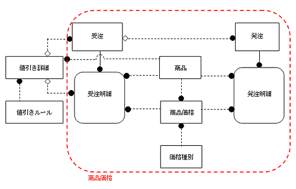

<html><body><h2 id="dbdesignTtl">第6章のはじめに</h2>

<h3>6.1.2 商品エンティティの見直し</h3>
<h4 class="caption">例題4 商品に対する値引きをモデルで表す</h4>

まず、業務の現状と要望事項を説明します。それを把握した上で、続く問題に答えなさい。

受注時、顧客が、次のような要求をしたとします。

<ul>
<li>1. 「注文全体でx％値引きしてくださいよ！」</li>
<li>2. 「商品単価当たりy円値引きしてくれませんか？」</li>
<li>3. 「これだけたくさん買ったんだから割引してくれてもいいんじゃない？」</li>
</ul>

また、夏物バーゲンとして7/20－8/20まで夏物全品×％OFFなどという企画もあります。 
値引きを単に属性として管理すると、その項目の値を値引き「金額」で表したり、「割引率」で表したりすることになってしまいます。 
また、その商品で「3.」のような値引きをする場合に、企業としてあらかじめ「シャツ10枚以上だったらいくら引く」といったルールがあるならば、エンティティとして「値引きルール」を作成しておくと、さまざまなケースに対応できます。

現在実施されている値引きルールを洗い出してみると、以下のルール、またはルールの組み合わせで値引きが行われていることがわかりました。

<ul>
<li>● 全額による値引き</li>
<li>● ％による値引き</li>
<li>● 単価ごとの値引き</li>
<li>● 全体からの値引き</li>
<li>● ある金額以上のまとめ買い時の値引き（商品に関係なく）</li>
<li>● ある個数以上のまとめ買い時の値引き（商品に関係する）</li>
<li>● 期間を区切ったバーゲン</li>
</ul>
<!--/section-->

<h5 class="quiz-title">Ｑ&nbsp;問題</h5>

企業で、バーゲンなどの企画として設定する値引きに対応できるよう、受注の際の値引きをモデルに反映してください。 
また、大量受注に対するルールも管理できるようにして、受注の際の値引きに対応できるようにしてください。

<!--/section-->

<h5 class="answer-title">Ｈ&nbsp;ヒント</h5>

値引きの単位は受注単位、受注明細単位の両方で起きる可能性があるため、「受注」エンティティ、「受注明細」スーパータイプエンティティに値引きに必要な属性を追加します。 
値引きは受注明細の種類には関係ないため、サブタイプではなく、スーパータイプに追加します。

<!--/section-->

<h5 class="answer-title">Ａ&nbsp;解答</h5>

図6-6 解答

<!--/.grayBox-->

<!--/section-->

<table width="100%">
<tr><td colspan="3"><strong>値引きルール</strong></td>
<td>1.</td></tr>
<tr><td style="width:20px;">*</td><td style="width:150px;">ルール番号</td><td style="width:80px;">&nbsp;</td><td style="width:200px;">&nbsp;</td></tr>
<tr><td>&nbsp;</td><td>コメント</td><td>&nbsp;</td><td>&nbsp;</td></tr>
<tr><td style="background:#ffffbb;">例</td><td colspan="3" style="background:#ffffbb;">10　　商品に関係なく受注伝票全体から一定額値引き 20　　商品による、単価ごとの一定額値引き 30　　商品ごとのまとめ買いによる一定額単価値引き 110　　全体から％引き 120　　単価で％引き 130　　商品ごとのまとめ買いによる単価％引き</td></tr>
<tr><td colspan="4" >&nbsp;</td></tr>
<tr><td colspan="3"><strong>値引き詳細</strong></td>
<td>2.</td></tr>
<tr><td>*</td><td>値引き詳細番号</td><td>&nbsp;</td><td>&nbsp;</td></tr>
<tr><td>&nbsp;</td><td>ルール番号</td><td>（FK1）</td><td>&nbsp;</td></tr>
<tr><td>&nbsp;</td><td>値引き名前</td><td>&nbsp;</td><td>&nbsp;</td></tr>
<tr><td>&nbsp;</td><td>全体値引き時、合計金額下限</td><td>&nbsp;</td><td>（全体値引きの際に使用）</td></tr>
<tr><td>&nbsp;</td><td>全体値引き時、合計金額上限</td><td>&nbsp;</td><td>（全体値引きの際に使用）</td></tr>
<tr><td>&nbsp;</td><td>値引き商品コード</td><td>（FK2）</td><td>（単価値引きの際に使用）</td></tr>
<tr><td>&nbsp;</td><td>値引き商品個数下限値</td><td>&nbsp;</td><td>（まとめ買いの際に使用）</td></tr>
<tr><td>&nbsp;</td><td>値引き商品個数上限値</td><td>&nbsp;</td><td>（まとめ買いの際に使用）</td></tr>
<tr><td>&nbsp;</td><td>値引き期間開始日付</td><td>&nbsp;</td><td>（期間限定の際に使用、単価でも全体でも）</td></tr>
<tr><td>&nbsp;</td><td>値引き期間終了日付</td><td>&nbsp;</td><td>（期間限定の際に使用、単価でも全体でも）</td></tr>
<tr><td>&nbsp;</td><td>値引き額</td><td>&nbsp;</td><td>&nbsp;</td></tr>
<tr><td>&nbsp;</td><td>値引きパーセント</td><td>&nbsp;</td><td>&nbsp;</td></tr>
<tr><td>&nbsp;</td><td>値引きルールコメント</td><td>&nbsp;</td><td>&nbsp;</td></tr>
<tr><td colspan="4" >&nbsp;</td></tr>
<tr><td colspan="4"><strong>受注</strong></td></tr>
<tr><td>*</td><td>受注注文番号</td><td>&nbsp;</td><td>&nbsp;</td></tr>
<tr><td>&nbsp;</td><td>客先注文番号</td><td>&nbsp;</td><td>&nbsp;</td></tr>
<tr><td>&nbsp;</td><td>受注日付</td><td>&nbsp;</td><td>&nbsp;</td></tr>
<tr><td>&nbsp;</td><td>受注顧客コード</td><td>（FK1）</td><td>&nbsp;</td></tr>
<tr><td>&nbsp;</td><td>受注社員コード</td><td>（FK2）</td><td>&nbsp;</td></tr>
<tr><td>&nbsp;</td><td>値引き承認社員コード</td><td>（FK3）</td><td>&nbsp;</td></tr>
<tr><td>&nbsp;</td><td>受注部門コード</td><td>（FK4）</td><td>&nbsp;</td></tr>
<tr><td>&nbsp;</td><td>値引き詳細番号</td><td>（FK5）</td><td>3.</td></tr>
<tr><td>&nbsp;</td><td>消費税額</td><td>（導出）</td><td>&nbsp;</td></tr>
<tr><td>&nbsp;</td><td>税抜受注金額合計</td><td>（導出）</td><td>&nbsp;</td></tr>
<tr><td>&nbsp;</td><td>納入希望日</td><td>&nbsp;</td><td>&nbsp;</td></tr>
<tr><td>&nbsp;</td><td>摘要</td><td>&nbsp;</td><td>&nbsp;</td></tr>
<tr><td colspan="4" >&nbsp;</td></tr>
<tr><td colspan="4">スーパータイプ：<strong>受注明細</strong></td></tr>
<tr><td>*</td><td>受注注文番号</td><td>（FK1）</td><td>&nbsp;</td></tr>
<tr><td>*</td><td>商品コード</td><td>（FK2）</td><td>&nbsp;</td></tr>
<tr><td>&nbsp;</td><td>値引き詳細番号</td><td>（FK3）</td><td>4.</td></tr>
<tr><td>&nbsp;</td><td>消費税額</td><td>（導出）</td><td>&nbsp;</td></tr>
<tr><td>&nbsp;</td><td>税抜金額</td><td>（導出）</td><td>&nbsp;</td></tr>
<tr><td>&nbsp;</td><td>予定納期日付</td><td>&nbsp;</td><td>&nbsp;</td></tr>
<tr><td>&nbsp;</td><td>受注数量</td><td>&nbsp;</td><td>&nbsp;</td></tr>
<tr><td>&nbsp;</td><td>変更後最終受注数量</td><td>&nbsp;</td><td>&nbsp;</td></tr>
<tr><td>&nbsp;</td><td>ステータス</td><td>&nbsp;</td><td>&nbsp;</td></tr>
</table>

<!-- /commandBox -->

<h4>解説 （注：番号は解答中の番号と対応します。番号が記載されていない解説は全体に当てはまります）</h4>

<ul>
<li>1. 「値引きルール」エンティティは、<strong>値引きルールの種類</strong>を管理するエンティティとして作成し、<strong>具体的な値引きの値</strong>を「値引き詳細」エンティティで管理できるように設計しました 
値引きの種矩は、要件より以下のような項目、またはその組み合わせを考えます 
その結果、「値引きルール」では、一意識別子が1桁～2桁の場合は金額による値引きを、3桁の場合は％による値引きを表し、考えられる組み合わせをルールとして作成しました
</li>
<li style="padding-left:2em;">● 金額による値引き</li>
<li style="padding-left:2em;">● ％による値引き</li>
<li style="padding-left:2em;">● 単価ごとの値引き</li>
<li style="padding-left:2em;">● 全体からの値引き</li>
<li style="padding-left:2em;">● ある金額以上のまとめ買い時の値引き（商品に関係ない値引き）</li>
<li style="padding-left:2em;">● ある個数以上のまとめ買い時の値引き（商品に関係する値引き）</li>
<li><strong>ルールが追加される場合には</strong>、この「値引きルール」エンティティに新しいルールのオカレンスを追加するだけで対応でき、<strong>拡張性を考慮した設計になっています</strong></li>
<li>2. 「値引き詳細」エンティティには、「値引きルール」に対応した具体的な値を設定し、「値引き詳細」に設定された値引きの種類を選択できるようにしています</li>
<li>3. 受注の単位で全体からの値引きをする場合、「受注」エンティティの属性「値引き詳細」に適切な値引き詳細オカレンスを選択します。この場合、注意しなければならないことは、受注明細の商品ごとに売上計上日が異なる場合です。売上計上日が、経理上の締め日をまたがってしまう場合を想定して、値引き額を商品ごとの売上比率で割る、または売上計上日が同一の商品のみ同一伝票に起票するなどの業務上のルールを決めておく必要があります</li>
<li>4. 「受注明細」の商品単位で値引きをする場合、「受注明細」スーパータイプに「値引き詳細」への外部キーをもたせます</li>
</ul>
<!--/section-->

<h3>6.1.1 受発注エンティティの見直し</h3>
<h4 class="caption" id="h4_5">例題5 営業判断による値引きを可能にする</h4>

まず、業務の現状と要望事項を説明します。それを把握した上で、続く問題に答えなさい。

企業全体の値引き企画を適用するだけでなく、営業判断で交渉価格を設定できる柔軟性をもたせたい、という要件があります。 
また、その場合、上司の承認を経た上で値引きを確定できるようにする必要がある、という要求がありました。

この仕様を満たすため、アプリケーション開発チームから次の要望がでました。

<ul>
<li>● 営業判断による値引き承認がわかるような設計にしてほしい</li>
<li>● 営業判断による値引きが生じた場合、承認を確認できるような属性を考慮してほしい</li>
</ul>
<!--/section-->

<h5 class="quiz-title">Ｑ&nbsp;問題</h5>

上記の要件を考慮して、今まで作成したモデルを見直してください。

<!--/section-->

<h5 class="answer-title">Ｈ&nbsp;ヒント</h5>

営業判断による値引きというルールの追加処理は値引きルールエンティティに1行追加するだけで実装できます。 
ただし、「90 営業判断による値引き」の場合、受注明細単位で上司の承認を必要とする部分に関しては、アプリケーション開発チームから新たな要望が出ています。 
これに対応します。

営業判断による値引き「金額」「理由」は、受注単位、または明細単位で管理すべき情報です。 
モデルにどのように反映させるべきでしょうか。

<!--/section-->

<h5 class="answer-title">Ａ&nbsp;解答</h5>

ER図に変更はありません。

<!--/section-->

<table width="100%">
<tr><td colspan="2"><strong>値引きルール</strong></td><td colspan="2">：定義変更なし</td></tr>
<tr><td style="width:20px;">*</td><td style="width:150px;">ルール番号</td><td style="width:80px;">&nbsp;</td><td style="width:200px;">&nbsp;</td></tr>
<tr><td>&nbsp;</td><td>コメント</td><td>&nbsp;</td><td>&nbsp;</td></tr>
<tr><td style="background:#ffffbb;">例</td><td colspan="3" style="background:#ffffbb;">10　　商品に関係なく受注伝票全体から一定額値引き 20　　商品による、単価ごとの一定額値引き 30　　商品ごとのまとめ買いによる一定額単価値引き 90　　営業判断による値引き 110　　全体から％引き 120　　単価で％引き 130　　商品ごとのまとめ買いによる単価％引き</td></tr>
<tr><td colspan="4" >&nbsp;</td></tr>
<tr><td colspan="2"><strong>値引き詳細</strong></td>
<td colspan="2">：変更なし</td></tr>
<tr><td>*</td><td>値引き詳細番号</td><td>&nbsp;</td><td>&nbsp;</td></tr>
<tr><td>&nbsp;</td><td>ルール番号</td><td>（FK1）</td><td>&nbsp;</td></tr>
<tr><td>&nbsp;</td><td>値引き名前</td><td>&nbsp;</td><td>&nbsp;</td></tr>
<tr><td>&nbsp;</td><td>全体値引き時、合計金額下限</td><td>&nbsp;</td><td>（全体値引きの際に使用）</td></tr>
<tr><td>&nbsp;</td><td>全体値引き時、合計金額上限</td><td>&nbsp;</td><td>（全体値引きの際に使用）</td></tr>
<tr><td>&nbsp;</td><td>値引き商品コード</td><td>（FK2）</td><td>（単価値引きの際に使用）</td></tr>
<tr><td>&nbsp;</td><td>値引き商品個数下限値</td><td>&nbsp;</td><td>（まとめ買いの際に使用）</td></tr>
<tr><td>&nbsp;</td><td>値引き商品個数上限値</td><td>&nbsp;</td><td>（まとめ買いの際に使用）</td></tr>
<tr><td>&nbsp;</td><td>値引き期間開始日付</td><td>&nbsp;</td><td>（期間限定の際に使用、単価でも全体でも）</td></tr>
<tr><td>&nbsp;</td><td>値引き期間終了日付</td><td>&nbsp;</td><td>（期間限定の際に使用、単価でも全体でも）</td></tr>
<tr><td>&nbsp;</td><td>値引き額</td><td>&nbsp;</td><td>&nbsp;</td></tr>
<tr><td>&nbsp;</td><td>値引きパーセント</td><td>&nbsp;</td><td>&nbsp;</td></tr>
<tr><td>&nbsp;</td><td>値引きルールコメント</td><td>&nbsp;</td><td>&nbsp;</td></tr>
<tr><td colspan="4" >&nbsp;</td></tr>
<tr><td colspan="2"><strong>受注</strong></td>
<td colspan="2">：属性追加</td></tr>
<tr><td>*</td><td>受注注文番号</td><td>&nbsp;</td><td>&nbsp;</td></tr>
<tr><td>&nbsp;</td><td>客先注文番号</td><td>&nbsp;</td><td>&nbsp;</td></tr>
<tr><td>&nbsp;</td><td>受注日付</td><td>&nbsp;</td><td>&nbsp;</td></tr>
<tr><td>&nbsp;</td><td>受注顧客コード</td><td>（FK1）</td><td>&nbsp;</td></tr>
<tr><td>&nbsp;</td><td>受注社員コード</td><td>（FK2）</td><td>&nbsp;</td></tr>
<tr><td>&nbsp;</td><td>値引き承認社員コード</td><td>（FK3）</td><td>&nbsp;</td></tr>
<tr><td>&nbsp;</td><td>受注部門コード</td><td>（FK4）</td><td>&nbsp;</td></tr>
<tr><td>&nbsp;</td><td>値引き詳細番号</td><td>（FK5）</td><td>&nbsp;</td></tr>
<tr><td>&nbsp;</td><td>営業値引き承認フラグ</td><td>&nbsp;</td><td>1.</td></tr>
<tr><td>&nbsp;</td><td>営業値引き理由</td><td>&nbsp;</td><td>2.</td></tr>
<tr><td>&nbsp;</td><td>営業値引き非承認理由</td><td>&nbsp;</td><td>3.</td></tr>
<tr><td>&nbsp;</td><td>消費税額</td><td>（導出）</td><td>&nbsp;</td></tr>
<tr><td>&nbsp;</td><td>税抜受注金額合計</td><td>（導出）</td><td>&nbsp;</td></tr>
<tr><td>&nbsp;</td><td>納入希望日</td><td>&nbsp;</td><td>&nbsp;</td></tr>
<tr><td>&nbsp;</td><td>摘要</td><td>&nbsp;</td><td>&nbsp;</td></tr>
<tr><td colspan="4" >&nbsp;</td></tr><tr>
<td colspan="2">スーパータイプ：<strong>受注明細</strong></td>
<td colspan="2">：属性追加</td></tr>
<tr><td>*</td><td>受注注文番号</td><td>（FK1）</td><td>&nbsp;</td></tr>
<tr><td>*</td><td>商品コード</td><td>（FK2）</td><td>&nbsp;</td></tr>
<tr><td>&nbsp;</td><td>値引き詳細番号</td><td>（FK3）</td><td>&nbsp;</td></tr>
<tr><td>&nbsp;</td><td>営業値引き承認フラグ</td><td>&nbsp;</td><td>1.</td></tr>
<tr><td>&nbsp;</td><td>営業値引き理由</td><td>&nbsp;</td><td>2.</td></tr>
<tr><td>&nbsp;</td><td>営業値引き非承認理由</td><td>&nbsp;</td><td>3.</td></tr>
<tr><td>&nbsp;</td><td>消費税額</td><td>（導出）</td><td>&nbsp;</td></tr>
<tr><td>&nbsp;</td><td>税抜金額</td><td>（導出）</td><td>&nbsp;</td></tr>
<tr><td>&nbsp;</td><td>予定納期日付</td><td>&nbsp;</td><td>&nbsp;</td></tr>
<tr><td>&nbsp;</td><td>受注数量</td><td>&nbsp;</td><td>&nbsp;</td></tr>
<tr><td>&nbsp;</td><td>変更後最終受注数量</td><td>&nbsp;</td><td>&nbsp;</td></tr>
<tr><td>&nbsp;</td><td>ステータス</td><td>&nbsp;</td><td>&nbsp;</td></tr>
</table>

<!-- /commandBox -->

<h4>解説 （注：番号は解答中の番号と対応します。番号が記載されていない解説は全体に当てはまります）</h4>

どのような値引きの種類であれ、値引きの計算方法については、前述の「値引きルール」と「値引き詳細」で選択できます。 
営業判断による値引きに関する属性として、以下を考慮します。

<ul>
<li>1. 営業判断による値引きであれば値引きルールの「90」を選択する</li>
<li>2. 営業判断による値引きであれば値引きルールの「90」を選択する</li>
<li>3. 承認できない場合、非承認の理由を記述する属性が必要</li>
<li>● 営業値引きをする単位は、伝票1枚の場合も、商品単位の場合も考えられる</li>
</ul>

上記より、「受注」エンティティと「受注明細」スーパータイプエンティティに属性「値引き詳細番号」、「営業値引き理由」、「営業値引き非承認理由」を追加しました。

<!--/section-->

<h4 class="caption" id="h4_6">例題6 商品の価格を分析する</h4>

まず、業務の現状と要望事項を説明します。 
それを把捉した上で、続く問題に答えなさい。

商品マスタを管理する場合、商品ごとに次のような価格を管理する必要があります。

<ul>
<li>● 販売単価：標準販売価格（いわゆる定価です）</li>
<li>● 仕入れ単価：標準仕入れ価格</li>
<li>● 売上原価：仕入れ単価が常に固定であれば、仕入れ単価＝売上原価となりますが、実際には仕入れ単価は市場環境などによって変動します。 
仕入れのたびに異なる商品仕入れ単価を元に、<strong>在庫している商品の在庫評価額</strong>としての単価をそれに合わせて再計算します 
これを商品の売上原価といいます 
<strong>利益の計算をする際、販売単価－売上原価</strong>という形で使用します</li>
</ul>
<!--/section-->

<h5 class="quiz-title">Ｑ&nbsp;問題</h5>

商品の価格を管理するために必要なエンティティを考慮してER図を見直してください。

<!--/section-->

<h5 class="answer-title">Ａ&nbsp;解答</h5>

図6-7 解答

<!--/.grayBox-->

<!--/section-->

<table width="100%">
<tr><td colspan="2"><strong>商品</strong></td><td colspan="2">：属性削除</td></tr>
<tr><td style="width:20px;">*</td><td style="width:150px;">商品コード</td><td style="width:80px;">&nbsp;</td><td style="width:200px;">&nbsp;</td></tr>
<tr><td>&nbsp;</td><td>商品名前</td><td>&nbsp;</td><td>&nbsp;</td></tr>
<tr><td colspan="4" >&nbsp;</td></tr>
<tr><td colspan="4"><strong>価格種別</strong></td></tr>
<tr><td>*</td><td>価格種別コード</td><td>&nbsp;</td><td>&nbsp;</td></tr>
<tr><td>*</td><td>価格種別名称</td><td>&nbsp;</td><td>&nbsp;</td></tr>
<tr><td>&nbsp;</td><td>価格種別コメント</td><td>&nbsp;</td><td>&nbsp;</td></tr>
<tr><td colspan="4" style="border:none;background:#ffffbb;">価格種別（例） 　　1.標準販売価格 　　2.仕入単価 　　3.売上原価</td></tr>
<tr><td colspan="4" >&nbsp;</td></tr>
<tr><td colspan="4"><strong>商品価格</strong></td></tr>
<tr><td>*</td><td>商品コード</td><td>（FK1）</td><td>&nbsp;</td></tr>
<tr><td>*</td><td>価格種別コード</td><td>&nbsp;</td><td>&nbsp;</td></tr>
<tr><td>*</td><td>商品価格適用開始日</td><td>&nbsp;</td><td>&nbsp;</td></tr>
<tr><td>&nbsp;</td><td>商品価格適用終了日</td><td>&nbsp;</td><td>&nbsp;</td></tr>
<tr><td>&nbsp;</td><td>単価</td><td>&nbsp;</td><td>&nbsp;</td></tr>
<tr><td colspan="4" >&nbsp;</td></tr>
<tr><td colspan="2">スーパータイプ：<strong>受注明細</strong></td>
<td colspan="2">：属性追加</td></tr>
<tr><td>*</td><td>受注注文番号</td><td>（FK1）</td><td>&nbsp;</td></tr>
<tr><td>*</td><td>商品コード</td><td>（FK2、FK3）</td><td>3.</td></tr>
<tr><td>&nbsp;</td><td>価格種別コード</td><td>（FK3）</td><td>3.</td></tr>
<tr><td>&nbsp;</td><td>商品価格適用開始日</td><td>（FK3）</td><td>3.</td></tr>
<tr><td>&nbsp;</td><td>営業値引き承認フラグ</td><td>&nbsp;</td><td>&nbsp;</td></tr>
<tr><td>&nbsp;</td><td>営業値引き理由</td><td>&nbsp;</td><td>&nbsp;</td></tr>
<tr><td>&nbsp;</td><td>営業値引き非承認理由</td><td>&nbsp;</td><td>&nbsp;</td></tr>
<tr><td>&nbsp;</td><td>値引き詳細番号</td><td>（FK4）</td><td>&nbsp;</td></tr>
<tr><td>&nbsp;</td><td>消費税額</td><td>（導出）</td><td>&nbsp;</td></tr>
<tr><td>&nbsp;</td><td>税抜金額</td><td>（導出）</td><td>&nbsp;</td></tr>
<tr><td>&nbsp;</td><td>予定納期日付</td><td>&nbsp;</td><td>&nbsp;</td></tr>
<tr><td>&nbsp;</td><td>受注数量</td><td>&nbsp;</td><td>&nbsp;</td></tr>
<tr><td>&nbsp;</td><td>変更後最終受注数量</td><td>&nbsp;</td><td>&nbsp;</td></tr>
<tr><td>&nbsp;</td><td>ステータス</td><td>&nbsp;</td><td>&nbsp;</td></tr>
<tr><td colspan="4" >&nbsp;</td></tr>
<tr><td colspan="2"><strong>発注明細</strong></td><td colspan="2">：属性追加</td></tr>
<tr><td>*</td><td>発注注文番号</td><td>（FK1）</td><td>&nbsp;</td></tr>
<tr><td>*</td><td>商品コード</td><td>（FK2）</td><td>3.</td></tr>
<tr><td>&nbsp;</td><td>価格種別コード</td><td>（FK3）</td><td>3.</td></tr>
<tr><td>&nbsp;</td><td>商品価格適用開始日</td><td>（FK3）</td><td>3.</td></tr>
<tr><td>&nbsp;</td><td>発注数量</td><td>&nbsp;</td><td>&nbsp;</td></tr>
<tr><td>&nbsp;</td><td>値引き額</td><td>&nbsp;</td><td>&nbsp;</td></tr>
<tr><td>&nbsp;</td><td>消費税額</td><td>（導出）</td><td>&nbsp;</td></tr>
<tr><td>&nbsp;</td><td>発注金額計</td><td>（導出）</td><td>&nbsp;</td></tr>
<tr><td>&nbsp;</td><td>受注注文番号</td><td>（FK3）</td><td>&nbsp;</td></tr>
<tr><td>&nbsp;</td><td>確定納期日付</td><td>&nbsp;</td><td>&nbsp;</td></tr>
</table>

<!-- /commandBox -->

<h4>解説 （注：番号は解答中の番号と対応します。番号が記載されていない解説は全体に当てはまります）</h4>

<ul>
<li>1. 商品単価には複数の性格があり、その単価の種類によって利用する部門も異なります 
「価格種別」エンティティを作成することによって、さまざまな価格体系に柔軟に対応することができます 
新しい価格種別ができたときには、「価格種別」エンティティに行を追加するだけでよいため、エンティティの追加や属性の追加、といった大幅な変更作業が不要になります</li>
<li>2. それに伴って、「商品」エンティティと「価格種別」エンティティ間に多対多のリレーションができるため、間に交差エンティティ、「商品価格」エンティティを追加しました</li>
<li>3. 「商品」エンティティからは商品価格という属性はなくなり、代わりに商品価格を参照する必要のある「受注明細」エンティティと「発注明細」エンティティから、「商品価格」エンティティヘのリレーションを引きます</li>
</ul>
<!--/section-->

</body></html>