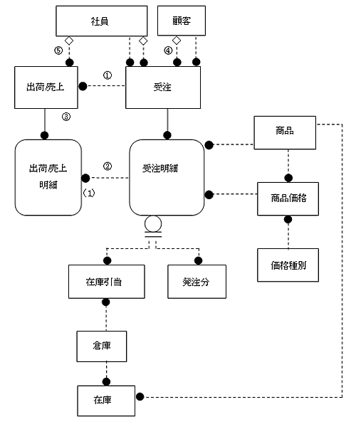
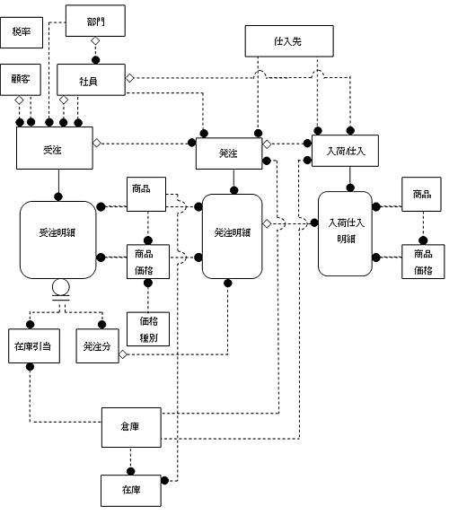
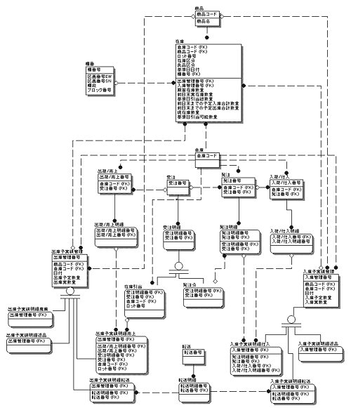

<html><body><h2 id="dbdesignTtl">6.2 【設問】受発注～入出荷</h2>

受注してから出荷、発注してから入荷までの詳細ER図は、以下の項目に分けてアプローチします。

<table class="tableBox">
<tr><th abbr="項目">項目</th><th abbr="業務内容または要求仕様">業務内容または要求仕様</th></tr>
<tr><td>6.2.1 受注～出荷/売上</td><td>例題9　出荷/売上の正規化をする</td></tr>
<tr><td>6.2.2 出荷/売上エンティティの見直し</td><td><a href="#h4_10">例題10　出荷/売上の属性を見直す</a></td></tr>
<tr><td>6.2.3 発注～入荷/仕入</td><td><a href="#h4_11">例題11　発注、入荷/仕入エンティティの正規化をする</a></td></tr>
<tr><td>6.2.4 倉庫、入出庫エンティティの検討</td><td><a href="#h4_12">例題12　倉庫、入出庫エンティティの分析をする</a></td></tr>
<tr><td>6.2.5 在庫エンティティの分析</td><td><a href="#h4_13">例題13　在庫エンティティの分析をする</a></td></tr>
</table>

表6-3 受発注～入出荷に関する設問

<!--/section-->

<h3>6.2.1 受注～出荷/売上</h3>

<h4 class="caption">例題9 出荷/売上の正規化をする</h4>

現状の受注・受注明細エンティティの属性、ER図を見て、続く問題に答えなさい。

図6-9 現状のER図

<!--/.grayBox-->

<!--/section-->

<table>
<tr><td colspan="4" style="border:none;"><strong>受注</strong></td></tr>
<tr><td style="width:20px;">*</td><td style="width:150px;">受注注文番号</td><td style="width:80px;">&nbsp;</td><td style="width:200px;">&nbsp;</td></tr>
<tr><td>&nbsp;</td><td>客先注文番号</td><td>&nbsp;</td><td>&nbsp;</td></tr>
<tr><td>&nbsp;</td><td>受注日付</td><td>&nbsp;</td><td>&nbsp;</td></tr>
<tr><td>&nbsp;</td><td>受注顧客コード</td><td>（FK1）</td><td>&nbsp;</td></tr>
<tr><td>&nbsp;</td><td>出荷先顧客コード</td><td>（FK2）</td><td>&nbsp;</td></tr>
<tr><td>&nbsp;</td><td>受注社員コード</td><td>（FK3）</td><td>&nbsp;</td></tr>
<tr><td>&nbsp;</td><td>値引き承認社員コード</td><td>（FK4）</td><td>&nbsp;</td></tr>
<tr><td>&nbsp;</td><td>受注部門コード</td><td>（FK5）</td><td>&nbsp;</td></tr>
<tr><td>&nbsp;</td><td>営業値引き承認フラグ</td><td>&nbsp;</td><td>&nbsp;</td></tr>
<tr><td>&nbsp;</td><td>営業値引き理由</td><td>&nbsp;</td><td>&nbsp;</td></tr>
<tr><td>&nbsp;</td><td>営業値引き非承認理由</td><td>&nbsp;</td><td>&nbsp;</td></tr>
<tr><td>&nbsp;</td><td>値引き詳細番号</td><td>（FK6）</td><td>&nbsp;</td></tr>
<tr><td>&nbsp;</td><td>消費税額</td><td>（導出）</td><td>&nbsp;</td></tr>
<tr><td>&nbsp;</td><td>税抜受注金額合計</td><td>（導出）</td><td>&nbsp;</td></tr>
<tr><td>&nbsp;</td><td>キャンセルフラグ</td><td>&nbsp;</td><td>&nbsp;</td></tr>
<tr><td>&nbsp;</td><td>摘要</td><td>&nbsp;</td><td>&nbsp;</td></tr>
<tr><td colspan="4" >&nbsp;</td></tr>
<tr><td colspan="4" style="border:none;">スーパータイプ：<strong>受注明細</strong></td></tr>
<tr><td>*</td><td>受注注文番号</td><td>（FK1）</td><td>&nbsp;</td></tr>
<tr><td>*</td><td>商品コード</td><td>（FK2、FK3）</td><td>&nbsp;</td></tr>
<tr><td>*</td><td>客先希望納期日付</td><td>&nbsp;</td><td>&nbsp;</td></tr>
<tr><td>&nbsp;</td><td>価格種別コード</td><td>（FK3）</td><td>&nbsp;</td></tr>
<tr><td>&nbsp;</td><td>商品価格適用開始日</td><td>（FK3）</td><td>&nbsp;</td></tr>
<tr><td>&nbsp;</td><td>営業値引き承認フラグ</td><td>&nbsp;</td><td>&nbsp;</td></tr>
<tr><td>&nbsp;</td><td>営業値引き理由</td><td>&nbsp;</td><td>&nbsp;</td></tr>
<tr><td>&nbsp;</td><td>営業値引き非承認理由</td><td>&nbsp;</td><td>&nbsp;</td></tr>
<tr><td>&nbsp;</td><td>値引き詳細番号</td><td>（FK4）</td><td>&nbsp;</td></tr>
<tr><td>&nbsp;</td><td>消費税額</td><td>（導出）</td><td>&nbsp;</td></tr>
<tr><td>&nbsp;</td><td>税抜金額</td><td>（導出）</td><td>&nbsp;</td></tr>
<tr><td>&nbsp;</td><td>予定納期日付</td><td>&nbsp;</td><td>&nbsp;</td></tr>
<tr><td>&nbsp;</td><td>受注数量</td><td>&nbsp;</td><td>&nbsp;</td></tr>
<tr><td>&nbsp;</td><td>変更後最終受注数量</td><td>&nbsp;</td><td>&nbsp;</td></tr>
<tr><td>&nbsp;</td><td>キャンセルフラグ</td><td>&nbsp;</td><td>&nbsp;</td></tr>
<tr><td>&nbsp;</td><td>ステータス</td><td>&nbsp;</td><td>&nbsp;</td></tr>
<tr><td colspan="4" >&nbsp;</td></tr>
<tr><td colspan="4" style="border:none;">サブタイプ：<strong>在庫引当</strong></td></tr>
<tr><td>*</td><td>受注注文番号</td><td>（FK1）</td><td>&nbsp;</td></tr>
<tr><td>*</td><td>商品コード</td><td>（FK1）</td><td>&nbsp;</td></tr>
<tr><td>*</td><td>客先希望納期日付</td><td>（FK1）</td><td>&nbsp;</td></tr>
<tr><td>*</td><td>倉庫コード</td><td>（FK2）</td><td>&nbsp;</td></tr>
<tr><td>&nbsp;</td><td>引当数量</td><td>&nbsp;</td><td>&nbsp;</td></tr>
<tr><td colspan="4" >&nbsp;</td></tr>
<tr><td colspan="4" style="border:none;">サブタイプ：<strong>発注分</strong></td></tr>
<tr><td>*</td><td>受注注文番号</td><td>（FK1）</td><td>&nbsp;</td></tr>
<tr><td>*</td><td>商品コード</td><td>（FK1）</td><td>&nbsp;</td></tr>
<tr><td>*</td><td>客先希望納期日付</td><td>（FK1）</td><td>&nbsp;</td></tr>
<tr><td>*</td><td>発注注文番号</td><td>（FK2）</td><td>&nbsp;</td></tr>
<tr><td>&nbsp;</td><td>発注商品コード</td><td>（FK2）</td><td>&nbsp;</td></tr>
<tr><td>&nbsp;</td><td>不足分数量</td><td>&nbsp;</td><td>&nbsp;</td></tr>
</table>

<!-- /commandBox -->

「出荷/売上」エンティティも、「受注」エンティティと同様、正規化をしてみましょう。 
出荷伝票をもとに、ヘッダ的なエンティティと明細エンティティに分けることができます。

出荷伝票は、1枚の受注伝票の中で、<strong>出荷日が同じ「受注明細」データをまとめて</strong>1枚の伝票をおこしています。 
「出荷/売上」伝票のヘッダでは、受注注文番号、売上番号、顧客情報、出荷日などの情報を管理しています。 
一方、「出荷/売上明細」は、同じ受注の中で出荷日が同じ各「受注明細」に対応した出荷明細情報を管理します。

なお、現在出荷業務で使用している出荷伝票は以下のとおりです。

図6-10 出荷伝票

<!--/.grayBox-->

<!--/section-->

<h5 class="quiz-title">Ｑ&nbsp;問題</h5>

上記伝票を確認して、「出荷/売上」エンティティで管理すべき属性を抽出し、「出荷/売上」エンティティを正規化してください。

<!--/section-->

<h5 class="answer-title">Ｈ&nbsp;ヒント</h5>

「受注」の各オカレンスと「出荷/売上」の各オカレンスのリレーションを検討してください。 
また、「受注明細」のオカレンスに対して、「出荷/売上明細」オカレンスのリレーションはどう定義できるかを検討してください。

「受注」エンティティで定義した属性は、「出荷/売上」エンティティで定義する必要はありません。

<!--/section-->

<h5 class="answer-title">Ａ&nbsp;解答</h5>

図6-11 解答

<!--/.grayBox-->

<!--/section-->

<table>
<tr><td colspan="4" style="border:none;"><strong>出荷/売上</strong></td></tr>
<tr><td style="width:20px;">*</td><td style="width:150px;">出荷売上番号</td><td style="width:80px;">&nbsp;</td><td style="width:200px;">&nbsp;</td></tr>
<tr><td>&nbsp;</td><td>出荷売上日付</td><td>&nbsp;</td><td>&nbsp;</td></tr>
<tr><td>&nbsp;</td><td>受注注文番号</td><td>（FK1）</td><td>&nbsp;</td></tr>
<tr><td>&nbsp;</td><td>消費税合計</td><td>（導出）</td><td>&nbsp;</td></tr>
<tr><td>&nbsp;</td><td>出荷/売上金額合計</td><td>（導出）</td><td>&nbsp;</td></tr>
<tr><td colspan="4" >&nbsp;</td></tr>
<tr><td colspan="4" style="border:none;"><strong>出荷/売上明細</strong></td></tr>
<tr><td>*</td><td>出荷売上番号</td><td>（FK1）</td><td>&nbsp;</td></tr>
<tr><td>*</td><td>商品コード</td><td>（FK2、FK3）</td><td>&nbsp;</td></tr>
<tr><td>&nbsp;</td><td>受注注文番号</td><td>（FK3）</td><td>&nbsp;</td></tr>
<tr><td>&nbsp;</td><td>客先希望納期</td><td>（FK3）</td><td>&nbsp;</td></tr>
<tr><td>&nbsp;</td><td>消費税</td><td>（導出）</td><td>&nbsp;</td></tr>
<tr><td>&nbsp;</td><td>税抜金額</td><td>（導出）</td><td>&nbsp;</td></tr>
</table>

<!-- /commandBox -->

<h4>解説 （注：番号は解答中の番号と対応します。番号が記載されていない解説は、全体に当てはまります）</h4>

<ul>
<li>1. 「受注」1オカレンスに対して、納期が異なる複数の「出荷/売上」オカレンスが対応するため、1対多のカーディナリティになります。
また、「出荷/売上」は、必ず「受注」を経て実施される、という前提にたてば、「受注」側のオブショナリティは、必須となります</li>
<li>2. 1.と同様、受注の後に出荷されるという前提に立てば、「出荷席上明細」の1オカレンスに対して、「受注明細」オカレンスは必ず1対応します</li>
<li>3. 「出荷/売上」と「出荷/売上明細」のリレーションは、「受注」と「受注明細」と同じく、1対多で、ライフサイクルがまったく同じ、依存関係にあります</li>
<li>4. 「出荷先顧客」は「受注」で管理しているため、「出荷/売上」で改めて管理する必要はありません</li>
<li>5. 「社員」へのリレーションは、検品および出荷印を押す社員という意味です
出荷伝票を作成した時点ではまだこの社員の印は押されていないため、「社員」側のオブショナリティは任意です</li>
</ul>
<!--/section-->

<h3>6.2.2 出荷/売上エンティティの見直し</h3>
<h4 class="caption" id="h4_10">例題10 出荷/売上の属性を見直す</h4>

まず、業務の現状と要望事項を説明します。 
それを把握した上で、続く問題に答えなさい。

<ul>
<li>● 出荷指示が出た時点で、「出荷/売上」オカレンスと「出荷/売上明細」オカレンスが同時に作成されます 
その後、「出荷確認」処理を行い、出荷先から物品受領書が返送されて、「納品確認」となります 
倉庫担当者は、このステータスを確認し、必要に応じて適切な処理を行う必要があります（たとえば、出荷確認から納品確認のステータスに移行しない出荷商品を追跡調査する、など）</li>
<li>● 売上の管理としては、出荷した後、顧客側で模晶が行われた結果、返品された場合の処理をする、といった場合も考えられます。</li>
<li>● また、受注を経ずに、いきなり出荷席上に対応する場合もあります 
このような場合、受注と同じ項目を出荷/売上にも用意しておけば、わざわざ受注への新規データを作成する必要はありません。</li>
</ul>
<!--/section-->

<h5 class="quiz-title">Ｑ&nbsp;問題</h5>

上記のような要件に対応できるよう、モデルを見直してください。

<!--/section-->

<h5 class="answer-title">Ａ&nbsp;解答</h5>

図6-12 解答

<!--/.grayBox-->

<!--/section-->

<table width="100%">
<tr><td colspan="4"><strong>出荷/売上</strong></td></tr>
<tr><td style="width:20px;">*</td><td style="width:150px;">出荷売上番号</td><td style="width:80px;"></td><td style="width:200px;"></td></tr>
<tr><td>&nbsp;</td><td>出荷売上日付</td><td>&nbsp;</td><td>&nbsp;</td></tr>
<tr><td>&nbsp;</td><td>出荷先顧客コード</td><td>（FK1）</td><td>&nbsp;</td></tr>
<tr><td>&nbsp;</td><td>出荷売上区分</td><td>&nbsp;</td><td>1.</td></tr>
<tr><td>&nbsp;</td><td>売上社員コード</td><td>（FK2）</td><td>&nbsp;</td></tr>
<tr><td>&nbsp;</td><td>値引き承認社員コード</td><td>（FK3）</td><td>&nbsp;</td></tr>
<tr><td>&nbsp;</td><td>売上部門コード</td><td>（FK4）</td><td>&nbsp;</td></tr>
<tr><td>&nbsp;</td><td>受注注文番号</td><td>（FK5）</td><td>&nbsp;</td></tr>
<tr><td>&nbsp;</td><td>客先希望納期日付</td><td>&nbsp;</td><td>&nbsp;</td></tr>
<tr><td>&nbsp;</td><td>営業値引き承認フラグ</td><td>&nbsp;</td><td>&nbsp;</td></tr>
<tr><td>&nbsp;</td><td>営業値引き理由</td><td>&nbsp;</td><td>&nbsp;</td></tr>
<tr><td>&nbsp;</td><td>営業値引き非承認理由</td><td>&nbsp;</td><td>&nbsp;</td></tr>
<tr><td>&nbsp;</td><td>値引き詳細番号</td><td>（FK6）</td><td>&nbsp;</td></tr>
<tr><td>&nbsp;</td><td>出荷検印社員コード</td><td>（FK7）</td><td>&nbsp;</td></tr>
<tr><td>&nbsp;</td><td>消費税額</td><td>（導出）</td><td>&nbsp;</td></tr>
<tr><td>&nbsp;</td><td>税抜売上全額合計</td><td>（導出）</td><td>4.</td></tr>
<tr><td>&nbsp;</td><td>税込売上金額合計</td><td>（導出）</td><td>4.</td></tr>
<tr><td>&nbsp;</td><td>売上返品元出荷売上番号</td><td>（FK8）</td><td>1.</td></tr>
<tr><td>&nbsp;</td><td>ステータス</td><td>&nbsp;</td><td>5.</td></tr>
<tr><td colspan="4" >&nbsp;</td></tr>
<tr><td colspan="4" style="border:none;"><strong>出荷/売上明細</strong></td></tr>
<tr><td>*</td><td>出荷売上番号</td><td>（FK1）&nbsp;</td><td>&nbsp;</td></tr>
<tr><td>*</td><td>出荷売上明細番号</td><td>&nbsp;</td><td>2.</td></tr>
<tr><td>&nbsp;</td><td>受注注文番号</td><td>（FK2）</td><td>&nbsp;</td></tr>
<tr><td>&nbsp;</td><td>商品コード</td><td>（FK2、FK3）</td><td>&nbsp;</td></tr>
<tr><td>&nbsp;</td><td>客先希望納期日付</td><td>（FK2）</td><td>&nbsp;</td></tr>
<tr><td>&nbsp;</td><td>売上数量</td><td>&nbsp;</td><td>&nbsp;</td></tr>
<tr><td>&nbsp;</td><td>倉庫コード</td><td>（FK4）</td><td>3.</td></tr>
<tr><td>&nbsp;</td><td>ステータス</td><td>&nbsp;</td><td>&nbsp;</td></tr>
<tr><td>&nbsp;</td><td>価格種別コード</td><td>（FK3）</td><td>&nbsp;</td></tr>
<tr><td>&nbsp;</td><td>商品価格適用開始日</td><td>（FK3）</td><td>&nbsp;</td></tr>
<tr><td>&nbsp;</td><td>営業値引き承認フラグ</td><td>&nbsp;</td><td>&nbsp;</td></tr>
<tr><td>&nbsp;</td><td>営業値引き理由</td><td>&nbsp;</td><td>&nbsp;</td></tr>
<tr><td>&nbsp;</td><td>営業値引き非承認理由</td><td>&nbsp;</td><td>&nbsp;</td></tr>
<tr><td>&nbsp;</td><td>値引き詳細番号</td><td>（FK4）</td><td>&nbsp;</td></tr>
<tr><td>&nbsp;</td><td>消費税額</td><td>（導出）</td><td>&nbsp;</td></tr>
<tr><td>&nbsp;</td><td>税抜金額</td><td>（導出）</td><td>&nbsp;</td></tr>
</table>

<!-- /commandBox -->

<h4>解説 （注：番号は解答中の番号と対応します。番号が記載されていない解説は、全体に当てはまります）</h4>

<ul>
<li>● 受注を経ずに、いきなり注文がきて出荷/売上に対応できるようにするために、「受注」と同じ項目を「出荷/売上」にも用意しています 
これは「受注」との重複項目ではありません 
「受注」で得られる情報は、リレーションで関連づけられていますから、「受注」から取得されます 
「出荷/売上」エンティティで管理される、「受注」で管理されているのと同じ属性の値は、受注した後の出荷の場合、値をもちません。</li>
<li>1. 「出荷/売上」エンティティの属性「出荷売上区分」の値によって、通常の出荷/売上か、返品か、売上情朝の変更か、といった識別を行います 
通常出荷は0、返品は1、変更は2などの値を考えます。返品の場合、次のような処理を考えることができます 
すでに出荷されているため、返品されて戻ってきたオカレンスは「出荷/売上」オカンレンスとしてすでに存在しています 
これを打ち消すために、次の処理を行います </li>
<li>a. 返品用の新規「出荷/売上」オカレンスを作成し、「出荷売上区分」を1とし、商品情報を「出荷/売上明細」にもちます 
その時、1.ですでに売上が計上されていた売上計上額を取り消すための再計算が必要であるため、返品する場合の「出荷/売上」オカレンスは、「売上返品元出荷売上番号」属性に、返品の元となった「出荷/売上番号」の値を入力します</li>
<li>b. 返品された商品に対して、返品のままとするのか、代替の商品を送るのか、を顧客と相談して決めます</li>
<li>c. 返品分を送付しないのであれば、受注数と納品数が異なったままの状態で出荷処理完了とする必要があります 
「ステータス」属性の値として、納品完了というステータスを追加し、アプリケーション側で、強制的にステータスを変更させる処理を追加してもらいます</li>
<li>d. 返品分を再送するのであれば、「出荷席上」に新規にオカレンスを追加します 
そのとき、「売上返品元出荷売上番号」に返品の元となった出荷/売上番号を入力し、最終的に処理が完了したことを確認できるようにします</li>
<li>2. 受注を経ずに、いきなり出荷/売上処理ができるようにすると、必ずしも出荷/売上に対応する受注オカレンスが存在するわけではない、ということになります 
つまり、「出荷売上明細」エンティティの一意識別子の一部に「受注明細」の一意識別子を入れることはできません 
このため、出荷売上明細エンティティの一意識別子は、人工的なキー「出荷売上明細番号」を作ります</li>
<li>3. 「出荷/売上明細」では、受注を経ない出荷/売上は、倉庫からの出荷のみを考慮すればよいと考えられるので、「発注」エンティティヘのリレーションはなく、「倉庫」エンティティヘのリレーションだけをもちます</li>
<li>4. 「出荷/売上明細」の全板を合計して、出荷/売上金額合計をヘッダにもたせます。これは導出項目なので、但し書きをしておきます</li>
<li>● ステータス属性は、「出荷/売上」にもたせます 
「出荷/売上」の単位で、次のステータスを管理します </li>
<li>● 出荷指示済、出荷済、納品完了、返品処理中</li>
</ul>
<!--/section-->

<h3>6.2.3 発注～入荷/仕入</h3>
<h4 class="caption" id="h4_11">例題11 発注、入荷/仕入エンティティの正規化をする</h4>

発注関係、入荷/仕入れ関係のエンティティも正規化を行いましょう。 
また、入荷業務に関して調査しているうちに、次のことがわかりました。 
仕入を担当している調達部門の社員にヒアリングをしたところ、<strong>仕入れた商品は、早く仕入れたものから順に出荷する仕組みが必要</strong>だが、今まで手作業で管理していてうまく管理できていない、ということがわかりました。 
そこで、<strong>商品の先入れ先出し</strong>をスムーズに実現するために、商品を入荷した際、入荷日ごと、ロット番号ごとに、実在庫数量、引当可能数量を管理することにしました。

ロット番号とは、たとえば、工場などで製造された商品に、製造の単位ごとに管理するためにつけられる番号です。 
製造ロット番号の場合、これを使うことによって、製造年月日や有効期限、製造ラインなどを特定することができ、いつ、どこで製造された製品かをさかのぼって調査することができます。

今回の業務では、入荷時にロット番号を付番することによって、受注時の引当は、入荷年月日の早いものを先に引き当てる、先入れ先出し法を使うことができるようにします。

また、<strong>物理的には、入荷された商品を、ロット単位で管理するための棚の位置を管理する必要</strong>があります。 
棚の情報としては、倉庫の中の東西南北の位置、上下位置を管理する必要があります。 
同じロット番号の商品が、複数の棚に納められる可能性がある、という前提でモデリングをしてください。

<!--/section-->

<h5 class="quiz-title">Ｑ&nbsp;問題</h5>

「受注」エンティティと同様に「発注」から「入荷/仕入」エンティティまでをモデルに表してください。 
属性を考える際、発注時に仕入先に送った、図6-13の注文伝票を参考にしてください。

図6-13 注文伝票

<!--/.grayBox-->

<!--/section-->

<h5 class="answer-title">Ａ&nbsp;解答</h5>

図6-14 解答

<!--/.grayBox-->

<!--/section-->

<table width="100%">
<tr><td colspan="4"><strong>発注</strong></td></tr>
<tr><td style="width:20px;">*</td><td style="width:150px;">発注注文番号</td><td style="width:80px;">&nbsp;</td><td style="width:200px;">&nbsp;</td></tr>
<tr><td>&nbsp;</td><td>発注日付</td><td>&nbsp;</td><td>&nbsp;</td></tr>
<tr><td>&nbsp;</td><td>仕入先コード</td><td>（FK1）</td><td>&nbsp;</td></tr>
<tr><td>&nbsp;</td><td>発注社員番号</td><td>（FK2）</td><td>&nbsp;</td></tr>
<tr><td>&nbsp;</td><td>発注金額合計</td><td>（導出）</td><td>&nbsp;</td></tr>
<tr><td>&nbsp;</td><td>受注注文番号</td><td>（FK3）</td><td>&nbsp;</td></tr>
<tr><td>&nbsp;</td><td>倉庫コード</td><td>（FK4）</td><td>&nbsp;</td></tr>
<tr><td>&nbsp;</td><td>全体値引き額</td><td>&nbsp;</td><td>&nbsp;</td></tr>
<tr><td>&nbsp;</td><td>消費税額</td><td>（導出）</td><td>&nbsp;</td></tr>
<tr><td>&nbsp;</td><td>税込発注金額合計</td><td>（導出）</td><td>&nbsp;</td></tr>
<tr><td>&nbsp;</td><td>納入希望日</td><td></td><td>&nbsp;</td></tr>
<tr><td colspan="4" >&nbsp;</td></tr>
<tr><td colspan="4"><strong>発注明細</strong></td></tr>
<tr><td>&nbsp;</td><td>発注注文番号</td><td>（FK1）</td><td>&nbsp;</td></tr>
<tr><td>&nbsp;</td><td>発注明細注文番号</td><td>&nbsp;</td><td>&nbsp;</td></tr>
<tr><td>&nbsp;</td><td>受注注文番号</td><td>（FK2）</td><td>&nbsp;</td></tr>
<tr><td>&nbsp;</td><td>商品コード</td><td>（FK2、FK3）</td><td>&nbsp;</td></tr>
<tr><td>&nbsp;</td><td>客先希望納期日付</td><td>（FK2）</td><td>2.</td></tr>
<tr><td>&nbsp;</td><td>価格種別コード</td><td>（FK3）</td><td>&nbsp;</td></tr>
<tr><td>&nbsp;</td><td>商品価格適用開始日</td><td>（FK3）</td><td>&nbsp;</td></tr>
<tr><td>&nbsp;</td><td>発注数量</td><td>&nbsp;</td><td>&nbsp;</td></tr>
<tr><td>&nbsp;</td><td>値引き額</td><td>&nbsp;</td><td>&nbsp;</td></tr>
<tr><td>&nbsp;</td><td>消費税額</td><td>（導出）</td><td>&nbsp;</td></tr>
<tr><td>&nbsp;</td><td>発注金額計</td><td>（導出）</td><td>&nbsp;</td></tr>
<tr><td>&nbsp;</td><td>確定納期日付</td><td>&nbsp;</td><td>&nbsp;</td></tr>
<tr><td colspan="4" >&nbsp;</td></tr>
<tr><td colspan="4" style="border:none;"><strong>入荷仕入</strong></td></tr>
<tr><td>&nbsp;</td><td>入荷仕入番号</td><td>&nbsp;</td><td>&nbsp;</td></tr>
<tr><td>&nbsp;</td><td>発注注文番号</td><td>（FK1）</td><td>&nbsp;</td></tr>
<tr><td>&nbsp;</td><td>入荷日付</td><td>&nbsp;</td><td>&nbsp;</td></tr>
<tr><td>&nbsp;</td><td>仕入先コード</td><td>（FK2）</td><td>&nbsp;</td></tr>
<tr><td>&nbsp;</td><td>仕入検品社員番号</td><td>（FK3）</td><td>&nbsp;</td></tr>
<tr><td>&nbsp;</td><td>入荷仕入れ区分</td><td>&nbsp;</td><td>3.</td></tr>
<tr><td>&nbsp;</td><td>倉庫コード</td><td>（FK4）</td><td>&nbsp;</td></tr>
<tr><td>&nbsp;</td><td>全体値引き額</td><td>&nbsp;</td><td>&nbsp;</td></tr>
<tr><td>&nbsp;</td><td>消費税額</td><td>（導出）</td><td>&nbsp;</td></tr>
<tr><td>&nbsp;</td><td>税抜仕入金額合計</td><td>（導出）</td><td>&nbsp;</td></tr>
<tr><td colspan="4" >&nbsp;</td></tr>
<tr><td colspan="4" style="border:none;"><strong>入荷仕入明細</strong></td></tr>
<tr><td>*</td><td>入荷仕入番号</td><td>（FK1）</td><td>&nbsp;</td></tr>
<tr><td>*</td><td>入荷仕入明細番号</td><td>&nbsp;</td><td>1.</td></tr>
<tr><td>&nbsp;</td><td>発注注文番号</td><td>（FK2）</td><td>&nbsp;</td></tr>
<tr><td>&nbsp;</td><td>発注明細注文番号</td><td>（FK2）</td><td>&nbsp;</td></tr>
<tr><td>&nbsp;</td><td>商品コード</td><td>（FK3、FK4）</td><td>&nbsp;</td></tr>
<tr><td>&nbsp;</td><td>価格種別コード</td><td>（FK4）</td><td>&nbsp;</td></tr>
<tr><td>&nbsp;</td><td>商品価格適用開始日</td><td>（FK4）</td><td>&nbsp;</td></tr>
<tr><td>&nbsp;</td><td>仕入数量</td><td>&nbsp;</td><td>&nbsp;</td></tr>
<tr><td>&nbsp;</td><td>値引き額</td><td>&nbsp;</td><td>&nbsp;</td></tr>
<tr><td>&nbsp;</td><td>消費税額</td><td>（導出）</td><td>&nbsp;</td></tr>
<tr><td>&nbsp;</td><td>発注金額計</td><td>（導出）</td><td>&nbsp;</td></tr>
</table>

<!-- /commandBox -->

<h4>解説 （注：番号は解答中の番号と対応します。番号が記載されていない解説は、全体に当てはまります）</h4>

<ul>
<li>● 発注を経ずに、入荷/仕入から処理ができるようにするために、発注と同じ項目を入荷/仕入にも用意しています 
これは発注との重複項目ではありません 
発注で得られる情報は、リレーションで関連づけられていますから、発注後の入荷の場合、これらの属性には値は入りません</li>
<li>1. 「発注」を経ずに、「入荷/仕入」から処理ができるようにしたため、「入荷/仕入明細」は必ずしも「発注明細」に対応するとは限りません 
このため、「入荷/仕入明細」の一意識別子の一部に、「発注明細」の一意識別子を入れることはできません 
「入荷/仕入明細」の一意識別子は「入荷/仕入番号」と「入荷/仕入」の明細ごとに人工的に一意な番号を生成する、「入荷/仕入明細番号」の複合一意識別子となります</li>
<li>2. また、前述の問題で、受注明細の一意識別子に「客先希望納期日付」が追加されているので、「発注明細」から「受注明細」を参照する外部キーにこの属性を加えます</li>
<li>3. 「入荷仕入」エンティティの属性「入荷仕入区分」の値によって、通常の入荷仕入か、発注の変更か、検収の結果の返品か、といった識別を行います</li>
</ul>

以上で、受注一出荷/売上、発注一入荷/仕入の詳細な分析は一区切りです。 
次は実際の商品在庫をどのように管理するかを考えていきましょう。

<!--/section-->

<h3>6.2.4 倉庫、入出庫エンティティの検討</h3>
<h4 class="caption" id="h4_12">例題12 倉庫、入出庫エンティティの分析をする</h4>

これまでは、倉庫にある商品の在庫を管理するために「商品有高表」を使用していました。 
これは、倉庫ごと、商品ごとに入庫と出庫を管理しており、ある時点での在庫数量を確認できるようにしていました。

図6-15 商品有高表例 （図中では「商品在高表」と表示）

<!--/.grayBox-->

しかし、実際の商品在庫数は、ほかにも次のようなイベントによって常に変動しています。

<ul>
<li>● 仕入による入庫</li>
<li>● 返品による入庫</li>
<li>● 売上による出庫</li>
<li>● 返品による出庫</li>
<li>● 廃棄処分による出庫</li>
<li>● 倉庫間移動による入出庫</li>
</ul>

また、商品在庫として管理すべき情報は、現在の在庫数だけでは足りません。 
顧客から受注を受ける際には、在庫商品ごとに、すでに引き当てられている在庫数を実在庫数から減算した、引当可能数量を確実に把握しておく必要があります。

<!--/section-->

<h5 class="quiz-title">Ｑ&nbsp;問題</h5>

「倉庫」エンティティで管理されるべき一般的な属性を検討してください。 
そして、倉庫に在庫される商品の入出庫個数を管理するために、入出庫を管理するためのエンティティを考えてください。 
「商品」エンティティの分析は後ほど行いますので、必要最低限の属性だけ挙げておいてください。 
「在庫」エンティティの分析は次の単元で行います。

<!--/section-->

<h5 class="answer-title">Ａ&nbsp;解答</h5>
<!--/section-->

<table width="100%">
<tr><td colspan="3"><strong>倉庫</strong></td><td>1.</td></tr>
<tr><td>*</td><td>倉庫コード</td><td>&nbsp;</td><td>&nbsp;</td></tr>
<tr><td>&nbsp;</td><td>倉庫名前</td><td>&nbsp;</td><td>&nbsp;</td></tr>
<tr><td>&nbsp;</td><td>倉庫住所</td><td>&nbsp;</td><td>&nbsp;</td></tr>
<tr><td>&nbsp;</td><td>倉庫電話番号</td><td>&nbsp;</td><td>&nbsp;</td></tr>
<tr><td>&nbsp;</td><td>倉庫FAX番号</td><td>&nbsp;</td><td>&nbsp;</td></tr>
<tr><td>&nbsp;</td><td>倉庫担当部門</td><td>（FK）</td><td>&nbsp;</td></tr>
<tr><td>&nbsp;</td><td>倉庫担当責任者</td><td>（FK）</td><td>&nbsp;</td></tr>
<tr><td colspan="4">&nbsp;</td></tr>
<tr><td colspan="4"><strong>商品（仮）</strong></td></tr>
<tr><td>*</td><td>商品コード</td><td>&nbsp;</td><td>&nbsp;</td></tr>
<tr><td>&nbsp;</td><td>商品名前</td><td>&nbsp;</td><td>&nbsp;</td></tr>
<tr><td colspan="4">&nbsp;</td></tr>
<tr><td colspan="3">スーパータイプ：<strong>入庫予実績管理</strong></td>
<td>2.</td></tr>
<tr><td>*</td><td>入庫管理番号</td><td>&nbsp;</td><td>&nbsp;</td></tr>
<tr><td>&nbsp;</td><td>倉庫コード</td><td>（FK1）</td><td>&nbsp;</td></tr>
<tr><td>&nbsp;</td><td>商品コード</td><td>（FK2）</td><td>&nbsp;</td></tr>
<tr><td>&nbsp;</td><td>日付</td><td>&nbsp;</td><td>&nbsp;</td></tr>
<tr><td>&nbsp;</td><td>入庫予定数量</td><td>&nbsp;</td><td>&nbsp;</td></tr>
<tr><td>&nbsp;</td><td>入庫実数量</td><td>&nbsp;</td><td>&nbsp;</td></tr>
<tr><td colspan="4">&nbsp;</td></tr>
<tr><td colspan="3">サブタイプ：<strong>入庫予実績明細仕入</strong></td>
<td>3.</td></tr>
<tr><td>*</td><td>入庫管理番号</td><td>（FK1）</td><td>&nbsp;</td></tr>
<tr><td>&nbsp;</td><td>倉庫コード</td><td>（FK1）</td><td>&nbsp;</td></tr>
<tr><td>&nbsp;</td><td>発注番号</td><td>（FK2）</td><td>&nbsp;</td></tr>
<tr><td>&nbsp;</td><td>発注明細番号</td><td>（FK2）</td><td>&nbsp;</td></tr>
<tr><td>&nbsp;</td><td>入荷仕入番号</td><td>（FK3）</td><td>&nbsp;</td></tr>
<tr><td>&nbsp;</td><td>入荷仕入明細番号</td><td>（FK3）</td><td>&nbsp;</td></tr>
<tr><td colspan="4">&nbsp;</td></tr>
<tr><td colspan="3">サブタイプ：<strong>入庫予実績明細返品</strong></td>
<td>4.</td></tr>
<tr><td>*</td><td>入庫管理番号</td><td>（FK1）</td><td>&nbsp;</td></tr>
<tr><td>*</td><td>倉庫コード</td><td>（FK1）</td><td>&nbsp;</td></tr>
<tr><td>&nbsp;</td><td>入荷仕入番号</td><td>（FK2）</td><td>&nbsp;</td></tr>
<tr><td>&nbsp;</td><td>入荷仕入明細番号</td><td>（FK2）</td><td>&nbsp;</td></tr>
<tr><td>&nbsp;</td><td>返品数量</td><td>&nbsp;</td><td>&nbsp;</td></tr>
<tr><td colspan="4">&nbsp;</td></tr>
<tr><td colspan="3">サブタイプ：<strong>入庫予実績明細転送</strong></td>
<td>5.</td></tr>
<tr><td>*</td><td>入庫管理番号</td><td>（FK1）</td><td>&nbsp;</td></tr>
<tr><td>*</td><td>倉庫コード</td><td>（FK1）</td><td>&nbsp;</td></tr>
<tr><td>&nbsp;</td><td>転送番号</td><td>（FK2）</td><td>&nbsp;</td></tr>
<tr><td>&nbsp;</td><td>転送明細番号</td><td>（FK2）</td><td>&nbsp;</td></tr>
<tr><td colspan="4">&nbsp;</td></tr>
<tr><td colspan="3">スーパータイプ：<strong>出庫予実績管理</strong></td>
<td>6.</td></tr>
<tr><td>*</td><td>出庫管理番号</td><td>&nbsp;</td><td>&nbsp;</td></tr>
<tr><td>&nbsp;</td><td>倉庫コード</td><td>（FK1）</td><td>&nbsp;</td></tr>
<tr><td>&nbsp;</td><td>商品コード</td><td>（FK2）</td><td>&nbsp;</td></tr>
<tr><td>&nbsp;</td><td>日付</td><td>&nbsp;</td><td>&nbsp;</td></tr>
<tr><td>&nbsp;</td><td>出庫予定数量</td><td>（導出）</td><td>&nbsp;</td></tr>
<tr><td>&nbsp;</td><td>出庫実数量</td><td>（導出）</td><td>&nbsp;</td></tr>
<tr><td colspan="4">&nbsp;</td></tr>
<tr><td colspan="3">サブタイプ：<strong>出庫予実績明細売上</strong></td>
<td>7.</td></tr>
<tr><td>*</td><td>出庫管理番号</td><td>（FK1）</td><td>&nbsp;</td></tr>
<tr><td>*</td><td>倉庫コード</td><td>（FK1）</td><td>&nbsp;</td></tr>
<tr><td>&nbsp;</td><td>受注番号</td><td>（FK2）</td><td>&nbsp;</td></tr>
<tr><td>&nbsp;</td><td>受注明細番号</td><td>（FK2）</td><td>&nbsp;</td></tr>
<tr><td>&nbsp;</td><td>売上番号</td><td>（FK3）</td><td>&nbsp;</td></tr>
<tr><td>&nbsp;</td><td>売上明細番号</td><td>（FK3）</td><td>&nbsp;</td></tr>
<tr><td colspan="4">&nbsp;</td></tr>
<tr><td colspan="4">サブタイプ：<strong>出庫予実績明細返品</strong></td></tr>
<tr><td>*</td><td>出庫管理番号</td><td>（FK1）</td><td>&nbsp;</td></tr>
<tr><td>*</td><td>倉庫コード</td><td>（FK1）</td><td>&nbsp;</td></tr>
<tr><td>&nbsp;</td><td>仕入番号</td><td>（FK2）</td><td>&nbsp;</td></tr>
<tr><td>&nbsp;</td><td>仕入明細番号</td><td>（FK2）</td><td>&nbsp;</td></tr>
<tr><td>&nbsp;</td><td>返品数量</td><td>&nbsp;</td><td>&nbsp;</td></tr>
<tr><td colspan="4">&nbsp;</td></tr>
<tr><td colspan="4">サブタイプ：<strong>出庫予実績明細転送</strong></td></tr>
<tr><td>*</td><td>出庫管理番号</td><td>（FK1）</td><td>&nbsp;</td></tr>
<tr><td>*</td><td>倉庫コード</td><td>（FK1）</td><td>&nbsp;</td></tr>
<tr><td>&nbsp;</td><td>転送番号</td><td>（FK2）</td><td>&nbsp;</td></tr>
<tr><td>&nbsp;</td><td>転送明細番号</td><td>（FK2）</td><td>&nbsp;</td></tr>
<tr><td colspan="4">&nbsp;</td></tr>
<tr><td colspan="4">サブタイプ：<strong>出庫予実績明細廃棄</strong></td></tr>
<tr><td>*</td><td>出庫管理番号</td><td>（FK1）</td><td>&nbsp;</td></tr>
<tr><td>*</td><td>倉庫コード</td><td>（FK1）</td><td>&nbsp;</td></tr>
<tr><td>&nbsp;</td><td>商品コード</td><td>（FK2）</td><td>&nbsp;</td></tr>
<tr><td>&nbsp;</td><td>数量</td><td>&nbsp;</td><td>&nbsp;</td></tr>
<tr><td colspan="4">&nbsp;</td></tr>
<tr><td colspan="3"><strong>転送</strong></td>
<td>8.</td></tr>
<tr><td>*</td><td>転送番号</td><td>&nbsp;</td><td>&nbsp;</td></tr>
<tr><td>&nbsp;</td><td>日付</td><td>&nbsp;</td><td>&nbsp;</td></tr>
<tr><td>&nbsp;</td><td>FROM倉庫</td><td>（FK1）</td><td>&nbsp;</td></tr>
<tr><td>&nbsp;</td><td>TO倉庫</td><td>（FK2）</td><td>&nbsp;</td></tr>
<tr><td colspan="4">&nbsp;</td></tr>
<tr><td colspan="4"><strong>転送明細</strong></td></tr>
<tr><td>*</td><td>転送番号</td><td>（FK1）</td><td>&nbsp;</td></tr>
<tr><td>*</td><td>転送明細番号</td><td>&nbsp;</td><td>&nbsp;</td></tr>
<tr><td>&nbsp;</td><td>商品ID</td><td>（FK2）</td><td>&nbsp;</td></tr>
<tr><td>&nbsp;</td><td>数量</td><td>&nbsp;</td><td>&nbsp;</td></tr>
</table>

<!-- /commandBox -->

<h4>解説 （注：番号は解答中の番号と対応します。番号が記載されていない解説は、全体に当てはまります）</h4>

<ul>
<li>1. 倉庫エンティティの属性は、一般的に管理されているものだけを抽出しています</li>
<li>2. 「入庫予実績管理」エンティティでは、日付ごとに入庫予定のオカレンス、実入庫のオカレンスを管理し、導出属性として、日ごとの入庫予定数、実入庫数の合計数を管理します</li>
<li>3. 「入庫予実績明細仕入」エンティティでは、発注による入庫予定数と、入荷/仕入による実入庫数を管理します</li>
<li>4. 「入庫予実績明細返品」エンティティでは、顧客に出荷した商品が返品されてきたものを管理します
この後、返品された商品は、自社内で再度検品され、商品価値の見直しを行う必要があります</li>
<li>5. 「入庫予実績明細転送」エンティティでは、転送処理によって他の倉庫から移動してきた商品の入庫を管理します
8.で「転送」エンティティを新たに加えています</li>
<li>6. 「出庫予実績管理」エンティティでは、日付ごとに出庫予定のオカレンス、実出庫のオカレンスを管理し、導出属性として、日ごとの出庫予定数、実出庫数の合計数を管理します</li>
<li>7. 「出庫予実績明細売上」エンティティでは、受注による出庫予定数と、出荷/売上による実出庫数を管理します</li>
</ul>
<!--/section-->

<h3>6.2.5 在庫エンティティの分析</h3>
<h4 class="caption" id="h4_13">例題13 在庫エンティティの分析</h4>

在庫も数の管理とカネの管理をする必要があります。 
在庫は、受注された商品を納期どおりに出荷するために、ある程度の手もち在庫を確保しておく必要があります。 
しかし、一方で不必要に大量在庫をもつと、場所を確保するための費用がかさみ、短期的には財務状況を悪化させる要因にもなります。

在庫管理を行うためには、一般的に次のような情報を管理します。

<ul>
<li>● 商品ごとの期首（会計期間の最初）の在庫数</li>
<li>● 期間内の入庫数</li>
<li>● 期間内の出庫数</li>
<li>● 現在庫数（現在庫数＝期首在庫数＋総入庫数―総出庫数）</li>
</ul>

<h5 class="subtitle">売上原価について</h5>

<strong>在庫商品の単価を在庫評価額と呼び、これが売上原価と同じ意味</strong>をもちます。 
仕入値は、業態によっては時の経過とともに変化する場合があり、その変化に応じて売上原価を適切に算出する必要があります。 
この算出方法は企業ごとに決めることができますが、大きく3とおりの方法があります。

<ul class="last">
<li>1. 原価法： 
仕入時の商品単価を基礎として算出式を決め、算出した結果を売上原価とします 
算出式の代表的なものを後で紹介します</li>
<li>2. 時価法： 
会計上の締め処理を行う時点の時価で評価する方法です</li>
<li>3. 低価法： 
「原価法」と「時価法」の両方の基準で評価した上で、金頗の小さい方を採用します</li>
</ul>

よく使用されるのは1.の原価法ですが、その計算方法のうち代表的なものを次に紹介します。

<ul class="last">
<li>● 移動平均法： 
現在庫金額を現在庫数で割った値を売上原価とします 
比較的合理的な単価が与えられ、コンピュータによる計算は随時簡単に処理できることから、よく使われています</li>
<li>● 最終仕入原価法： 
最終仕入時の単価を売上原価とします 
計算方法が簡単という理由もあってよく使われますが、場合によっては不合理な在庫金額になります</li>
<li>● 総平均法： 
月初在庫金額と月間仕入全額の合計を、月初在庫数と月間仕入数の合計で割り、その値を翌月の売上原価とします 
手計算の場合には便利な計算方法ですが、コンピュータ化された現在、日々の平均単価は容易に計算できるため、あまり意味があると思えません</li>
<li>● 先入先出法： 
仕入日ごとに仕入単価と数量を管理し、仕入日の古いものの順に出庫し、その際には仕入時の仕入単価を売上原価とする方法です 
同一のタイミングで異なる単価の同一商品が入庫することもある場合、管理はたいへん難しくなるため、現在ではあまり使われていません。</li>
</ul>

在庫の確認という意味では、どんな企業も最低1年に一回、決算期には、全商品数をカウントする一斉棚卸という作業を行い、<strong>会社の期末資産を表す必要</strong>があります。 
在庫数には、その棚卸の際に確認された実在庫数と、帳簿上の入出庫によって管理される帳簿在庫（論理在庫）があり、この差異をきちんと管理する必要があります。

また、在庫管理は数の管理だけではなく、<strong>在庫金額を管理</strong>し、決算の際に「棚卸資産」として貸借対照表に示したり、損益計算書上の「売上原価」を計算する必要があります。

翼商事では、これまで商品受払い帳を使って、手処理による先入先出法を使っていましたが、システム化によって移動平均法を採用する、という提案が採用されています。

在庫を管理する理由として、受注を受けたときに、それに応えられるだけの十分な在庫数を確保することによって、販売機会の損失を極力少なくする、というものがあります。 
受注を受けたときに、その商品を倉庫に確保しておき、他の受注によって勝手に出荷されてしまわないよう、引当処理を行います。 
ところが、この引当処理を行うには、出荷日に合わせて該当商品が倉庫にどれだけ存在するか、を管理しておく必要があることがわかります。

<!--/section-->

<h5 class="quiz-title">Ｑ&nbsp;問題</h5>

上記のような要件を満たすために、在庫エンティティを見直してください。

<!--/section-->

<h5 class="answer-title">Ｈ&nbsp;ヒント</h5>

在庫は、過去からの累積情報（期首在庫情報）を考慮する必要があります。 
期首在庫数に、今期の入出庫情報を加味した値が管理できるようにしてください。

帳簿上の論理的な商品在庫数は、前の単元で作成した「入出庫予実績」エンティティで管理されている情報と連携をとることで、管理できると考えられます。 
倉庫ごと、商品ごと、ロットごとの引当可能在庫数、実在庫数は、導出項目として、各倉庫ごと商品ごとの「在庫」エンティティで管理します。 
その際、在庫の数と同時に在庫金額も管理できるようにします。 
ロット単位で、先入先出法による在庫管理を行うのであれば、ロットが管理されている棚の位置も合わせて管理する必要があります。

在庫管理では、在庫区分という属性を管理する場合が多いです。 
在庫区分とは、たとえば「0：自社在庫」か「1：預かり在庫」かという違いを管理します。 
翼商事の場合、「預かり在庫」とは、「入庫はしたけれども、まだ入荷確認をしていない」＝「仕入計上していない」という状態を指します。

今回のケースとは異なりますが、たとえば、商品が届いて入庫はしたけれど、請求書が届くまで仕入計上されない場合は、その間の在庫状態は「預かり在庫」になります。 
「預かり在庫」は棚卸チェックの対象となりますが、在庫金額には計上しません。

在庫管理では、良品区分という属性も管理します。 
良品区分とは、たとえば「0：良品」、「1：不良品」のほかに、検品前の「2：未検品」という区分が考えられます。 
たとえば、客先から返品された商品をとりあえず「2：未検品」としておき、検品後に、倉庫担当者が「0：良品」か「1：不良品」に振り替えるという具合に使用します。

<!--/section-->

<h5 class="answer-title">Ａ&nbsp;解答</h5>
<!--/section-->

<table width="100%">
<tr>
<td colspan="4"><strong>在庫</strong></td></tr><tr><td>*</td><td>倉庫コード</td><td>（FK1）（FK3）</td><td>&nbsp;</td></tr>
<tr><td>*</td><td>商品コード</td><td>（FK2）</td><td>&nbsp;</td></tr>
<tr><td>*</td><td>ロット番号</td><td>&nbsp;</td><td>&nbsp;</td></tr>
<tr><td>*</td><td>在庫区分</td><td>&nbsp;</td><td>1.</td></tr>
<tr><td>*</td><td>良品区分</td><td>&nbsp;</td><td>2.</td></tr>
<tr><td>*</td><td>棚番号</td><td>（FK3）</td><td>&nbsp;</td></tr>
<tr><td>*</td><td>基準日日付</td><td>&nbsp;</td><td>3.</td></tr>
<tr><td>&nbsp;</td><td>期首在庫数量</td><td>（固定）</td><td>4.</td></tr>
<tr><td>&nbsp;</td><td>前日末実在庫数量</td><td>（0＝前日に値が計算される：その後固定）</td><td>&nbsp;</td></tr>
<tr><td>&nbsp;</td><td>基準日引当総数量</td><td>（基準日の引当処理が行われるたびに増加）</td><td>&nbsp;</td></tr>
<tr><td>&nbsp;</td><td>前日末の予定入庫合計数量</td><td>（期首からの予定入庫数量累計値：発注のたびに増加）</td><td>&nbsp;</td></tr>
<tr><td>&nbsp;</td><td>前日末の予定出庫合計数量</td><td>（期首からの予定出庫数量累計値：受注のたびに増加）</td><td>&nbsp;</td></tr>
<tr><td>&nbsp;</td><td>当日予定入庫数量</td><td>（発注による入庫）</td><td>5.</td></tr>
<tr><td>&nbsp;</td><td>当日実入庫数量</td><td>（発注による実際の入庫数量、0＝入庫確認後増加）</td><td>5.</td></tr>
<tr><td>&nbsp;</td><td>当日予定出庫数量</td><td>&nbsp;</td><td>6.</td></tr>
<tr><td>&nbsp;</td><td>基準日引当総数量</td><td>（受注による出庫）</td><td>&nbsp;</td></tr>
<tr><td>&nbsp;</td><td>当日実出庫数量</td><td>（受注による実際の出庫数量、0＝出庫確認後増加）</td><td>6.</td></tr>
<tr><td>&nbsp;</td><td>現在庫数量</td><td>（導出） （0＝前日末実在庫数量＝ 前日末実在庫数量＋当日実入庫数量－当日実出庫数量）</td><td>&nbsp;</td></tr>
<tr><td>&nbsp;</td><td>基準日引当可能数量</td><td>（導出） （前日末引当可能数量＋当日入庫数量－当日出庫数量）</td><td>7.</td></tr>
<tr><td>&nbsp;</td><td>売上原価</td><td>（仕入れ単価が変更されるごとに再計算）</td><td>8.</td></tr>
<tr><td colspan="4"><strong>棚番</strong></td></tr><tr><td>*</td><td>倉庫コード</td><td>&nbsp;</td><td>&nbsp;</td></tr>
<tr><td>*</td><td>棚番号</td><td>&nbsp;</td><td>&nbsp;</td></tr>
<tr><td>&nbsp;</td><td>区画番号EW</td><td>&nbsp;</td><td>&nbsp;</td></tr>
<tr><td>&nbsp;</td><td>区画番号NS</td><td>&nbsp;</td><td>&nbsp;</td></tr>
<tr><td>&nbsp;</td><td>棚段</td><td>&nbsp;</td><td>&nbsp;</td></tr>
<tr><td>&nbsp;</td><td>ブロック番号</td><td>&nbsp;</td><td>&nbsp;</td></tr>
</table>

<!-- /commandBox -->

<h4>解説 （注：番号は解答中の番号と対応します。番号が記載されていない解説は、全体に当てはまります）</h4>

<ul>
<li>1. ヒント参照</li>
<li>2. ヒント参照</li>
<li>3. 基準日とは、在庫を確認したい対象の日付のことです 
その日の在庫状況を他の属性で管理します</li>
<li>4. 期首在庫数量は、会計年度の最初の在庫数量を管理します 
在庫は累積個数を管理するため、この値を管理する必要があります</li>
<li>5. この2つの属性は、属性を作成するのではなく、日付と倉庫コード、商品コードを指定し、入庫予実績管理を参照して獲得します 
ここでは、何を属性として管理したいかをわかりやすくするために記述しました</li>
<li>6. この2つの属性は、属性を作成するのではなく、日付と倉庫コード、商品コードを指定し、出庫予実績管理を参照して獲得します 
ここでは、何を属性として管理したいかをわかりやすくするために記述しました</li>
<li>●. 引当可能数量は、基準日が当日の場合と将来の場合で計算方法が異なります 
基準日が将来の場合、実在庫数が確定していないため、計算しようとしている日付の実在庫数に、その日以降の入出庫予定数を積み上げて計算します 
一方、基準日当日の場合は、実在庫数が確定しているため、実数量を使用して計算します</li>
</ul>
<!--/section-->

<h4>基準日を将来とした場合の引当可能数量計算</h4>

前日未引当可能数量＝前日末の予定在庫合計数量(*)－ 基準日引当総数量

(*)前日末の予定在庫合計数量＝計算日の実在庫数 
　　　　　　　　　　　　　　　　　　　　　＋Σ計算日から前日末までの予定入庫数量 
　　　　　　　　　　　　　　　　　　　　　－Σ計算日から前日末の予定出庫数量

<!--/section-->

<h4>基準日の0時時点での引当可能数量計算</h4>

前日末引当可能数量＝基準日引当可能数量＝前日未実在庫数一基準日引当総数量

商品ごとの引当可能数量を迅速に照会できるようにするために、この後、論理設計フェーズで在庫関係のエンティティを見直す必要があります。 
この作業は、在庫の引き当てを行う担当者が必要としている情報が何であるか（ロットまで必要とするか等）、画面設計と連動して、良好なパフォーマンスが維持できるように行う必要があります。

図6-16　6.2節全体のER図 <a href="./images/625-01l.gif" class="fancybox">【クリックで拡大します】</a>

<!--/.grayBox-->

</body></html>