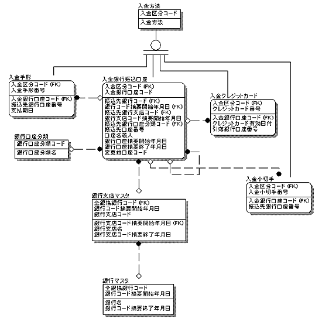
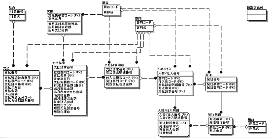
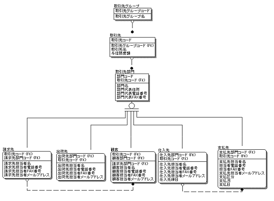

<html><body><h2 id="dbdesignTtl">6.4 【設問】請求～入金、請求～支払</h2>

請求してから入金されるまで、請求されてから支払いするまでの詳細ER図は、以下の項目に分けてアプローチします。

<table class="tableBox">
	<tr>
		<th>項目</th>
		<th>業務内容または要求仕様</th>
	</tr>
	<tr>
		<td rowspan="2">6.4.1	受注～入金</td>
		<td>例題19 	入金方法を管理するエンティティを検討する</td>
	</tr>
	<tr>
		<td><a href="#h4_20">例題20 	入金を管理するエンティティを検討する</a></td>
	</tr>
	<tr>
		<td rowspan="2">6.4.2	発注～支払</td>
		<td><a href="#h4_21">例題21	支払方法を管理するエンティティを検討する</a></td>
	</tr>
	<tr>
		<td><a href="#h4_22">例題22 	支払を管理するエンティティを検討する</a></td>
	</tr>
	<tr>
		<td rowspan="2">6.4.3	入金と支払の見直し</td>
		<td><a href="#h4_23">例題23 	顧客エンティティの見直しをする</a></td>
	</tr>
</table>

表6-13 請求～入金、請求～支払に関する設問

<!--/section-->

<h3>6.4.1 受注～入金</h3>

<h4 class="caption">例題19 入金方法を管理するエンティティを検討する</h4>

請求書を送った後、顧客から入金されたかどうかを確認し、その入金情報をもとに請求消し込み、 売掛残高更新等の処理を行う必要があります。

ここでは、顧客からの入金を管理するために、入金口座エンティティを考えます。 
入金と一言でい っても、入金方法は、銀行振込だけとは限りません。 
現金、銀行振込、小切手、手形、クレジットカードなどによる振込にも対応できる必要があります。 
各種タイプの振込、支払に対応できるよう、設計してください。

また、銀行と銀行支店には、全国銀行協会によって、銀行番号（4桁）と、銀行支店番号（3桁）がつけられています。 
銀行の合併などに伴い、銀行コードが変更されたり、支店コードが変更になる場合にも柔軟に変更できるよう、入金口座エンティティを設計してください。

<strong>例）2001年4月1日 さくら銀行と住友銀行が合併して三井住友銀行となる</strong>

さくら銀行　銀行コード002 
住友銀行　　銀行コード009 
　　　→ 住友銀行 銀行コード009

<strong>例）支店の統廃合</strong>

三井住友銀行 赤坂見附支店 825 
三井住友銀行 赤坂支店 805 
　　　→ 三井住友銀行 赤坂見附支店 825

<ul>
<li>● 銀行振込の場合に必要な情報（＝口座情報）： 銀行番号、銀行名、銀行支店番号、銀行支店名、口座種類、振込口座番号、振込口座名義人</li>
<li>● 小切手の場合に必要な情報： 小切手番号、引落銀行口座情報</li>
<li>● 手形の場合に必要な情報： 手形番号、手形発行日付、手形支払期日、引落銀行口座情報</li>
<li>● クレジットカードの場合に必要な情報： クレジットカード番号、クレジットカード有効日付、クレジットカード発行会社情報、引落銀行口座情報</li>
</ul>
<!--/section-->

<h5 class="quiz-title">Ｑ&nbsp;問題</h5>

入金方法を管理するために必要な情報と、入金方法の違いによって必要な情報を考えてエンティティを抽出してください。

<!--/section-->

<h5 class="answer-title">Ａ&nbsp;解答</h5>

図6-24 解答

<!--/.grayBox-->

<!--/section-->

<table>
<tr>
<td colspan="3"><strong>銀行マスタ</strong></td>
<td>1.</td>
</tr>
<tr>
<td style="width:20px;">*</td><td style="width:200px;">全銀協銀行コード</td><td style="width:80px;"></td><td style="width:200px;"></td>
</tr>
<tr>
<td>*</td><td>銀行コード摘要開始年月日</td><td>&nbsp;</td><td>&nbsp;</td>
</tr>
<tr>
<td>&nbsp;</td><td>銀行名</td><td>&nbsp;</td><td>&nbsp;</td>
</tr>
<tr>
<td>&nbsp;</td><td>銀行コード摘要終了年月日</td><td>&nbsp;</td><td>&nbsp;</td>
</tr>

<tr>
<td colspan="4" >&nbsp;</td>
</tr>
<tr>
<td colspan="3"><strong>銀行支店マスタ</strong></td>
<td>1.</td>
</tr>
<tr>
<td>*</td><td>全銀協銀行コード</td><td>（FK1）</td><td>&nbsp;</td>
</tr>
<tr>
<td>*</td><td>銀行支店コード</td><td>&nbsp;</td><td>&nbsp;</td>
</tr>
<tr>
<td>*</td><td>銀行支店コード摘要開始年月日</td><td>&nbsp;</td><td>&nbsp;</td>
</tr>
<tr>
<td>&nbsp;</td><td>銀行支店名</td><td>&nbsp;</td><td>&nbsp;</td>
</tr>
<tr>
<td>&nbsp;</td><td>銀行支店コード摘要終了年月日</td><td>&nbsp;</td><td>&nbsp;</td>
</tr>

<tr>
<td colspan="4" >&nbsp;</td>
</tr>
<tr>
<td colspan="3"><strong>口座分類マスタ</strong></td>
<td>2.</td>
</tr>
<tr>
<td>*</td><td>口座分類コード</td><td>&nbsp;</td><td>&nbsp;</td>
</tr>
<tr>
<td>*</td><td>口座分類名</td><td>&nbsp;</td><td>&nbsp;</td>
</tr>

<tr>
<td colspan="4" >&nbsp;</td>
</tr>
<tr>
<td colspan="4">スーパータイプ：<strong>入金方法</strong></td>
</tr>
<tr>
<td>*</td><td>入金区分コード</td><td>&nbsp;</td><td>&nbsp;</td>
</tr>
<tr>
<td>&nbsp;</td><td>入金方法名</td><td>&nbsp;</td><td>&nbsp;</td>
</tr>

<tr>
<td colspan="4" >&nbsp;</td>
</tr>
<tr>
<td colspan="4">サブタイプ：<strong>入金銀行振込口座</strong></td>
</tr>
<tr>
<td>*</td><td>入金区分コード</td><td>（FK1）</td><td>&nbsp;</td>
</tr>
<tr>
<td>*</td><td>入金銀行口座コード</td><td>&nbsp;</td><td>3.</td>
</tr>
<tr>
<td>&nbsp;</td><td>振込先銀行コード</td><td>（FK2）</td><td>&nbsp;</td>
</tr>
<tr>
<td>&nbsp;</td><td>銀行コード摘要開始年月日</td><td>（FK2）</td><td>&nbsp;</td>
</tr>
<tr>
<td>&nbsp;</td><td>振込先銀行支店コード</td><td>（FK3）</td><td>&nbsp;</td>
</tr>
<tr>
<td>&nbsp;</td><td>銀行支店コード摘要開始年月日</td><td>（FK3）</td><td>&nbsp;</td>
</tr>
<tr>
<td>&nbsp;</td><td>振込先口座分類コード</td><td>（FK4）</td><td>2.</td>
</tr>
<tr>
<td>&nbsp;</td><td>振込先口座番号</td><td>&nbsp;</td><td>&nbsp;</td>
</tr>
<tr>
<td>&nbsp;</td><td>口座名義人</td><td>&nbsp;</td><td>&nbsp;</td>
</tr>
<tr>
<td>&nbsp;</td><td>銀行口座摘要開始日</td><td>&nbsp;</td><td>&nbsp;</td>
</tr>
<tr>
<td>&nbsp;</td><td>銀行口座摘要終了日</td><td>&nbsp;</td><td>&nbsp;</td>
</tr>
<tr>
<td>&nbsp;</td><td>変更前口座コード</td><td>（FK5）</td><td>4.</td>
</tr>

<tr>
<td colspan="4" >&nbsp;</td>
</tr>
<tr>
<td colspan="4">サブタイプ：<strong>入金小切手</strong></td>
</tr>
<tr>
<td>*</td><td>入金区分コード</td><td>（FK1）</td><td>&nbsp;</td>
</tr>
<tr>
<td>*</td><td>入金小切手番号</td><td>&nbsp;</td><td>&nbsp;</td>
</tr>
<tr>
<td>&nbsp;</td><td>引落銀行口座カード</td><td>（FK2）</td><td>5.</td>
</tr>

<tr>
<td colspan="4" >&nbsp;</td>
</tr>
<tr>
<td colspan="4">サブタイプ：<strong>入金手形</strong></td>
</tr>
<tr>
<td>*</td><td>入金区分コード</td><td>（FK1）</td><td>&nbsp;</td>
</tr>
<tr>
<td>*</td><td>入金手形番号</td><td>&nbsp;</td><td>&nbsp;</td>
</tr>
<tr>
<td>&nbsp;</td><td>引落銀行口座コード</td><td>（FK2）</td><td>5.</td>
</tr>
<tr>
<td>&nbsp;</td><td>手形発行年月日</td><td>&nbsp;</td><td>&nbsp;</td>
</tr>
<tr>
<td>&nbsp;</td><td>支払期日</td><td>&nbsp;</td><td>&nbsp;</td>
</tr>

<tr>
<td colspan="4" >&nbsp;</td>
</tr>
<tr>
<td colspan="4">サブタイプ：<strong>入金クレジットカード</strong></td>
</tr>
<tr>
<td>*</td><td>入金区分コード</td><td>（FK1）</td><td>&nbsp;</td>
</tr>
<tr>
<td>*</td><td>クレジットカード番号</td><td>&nbsp;</td><td>&nbsp;</td>
</tr>
<tr>
<td>&nbsp;</td><td>クレジットカード有効日付</td><td>&nbsp;</td><td>&nbsp;</td>
</tr>
<tr>
<td>&nbsp;</td><td>クレジットカード会社コード</td><td>（FK2）</td><td>&nbsp;</td>
</tr>
<tr>
<td>&nbsp;</td><td>引落銀行口座コード</td><td>（FK2）</td><td>5.</td>
</tr>
</table>

<!-- /commandBox -->

<h4>解説 （注：番号は解答中の番号と対応します。番号が記載されていない解説は、全体に当てはまります）</h4>

<ul>
<li>1. 銀行マスタと銀行支店マスタは、必要最小限の属性を管理しています 
銀行の統廃合が進む状況を鑑みて、両方のマスタに履歴を管理するためのコード摘要開始日という属性を設けています 
コードだけでは一意にならないため、コードと摘要開始日の組み合わせで一意識別子としています 
銀行が統合されて新しい銀行名と銀行コードの組み合わせができる場合、新規の銀行マスタオカレンスを作成します 
統合によって、使用されなくなるオカレンスは、コード摘要終了日に値を指定して、その日以降、間違って使用されないようにします</li>
<li>2. 口座分類コードは、アプリケーションで使用する口座の種頬を口座分類マスタで管理し、そこを参照します 
ある企業で同じ銀行、同じ支店で2つ以上口座をもつことはまれですが、口座の種類によって複数もつ可能性はあります</li>
</ul>

<strong>【例】</strong>

01：普通預金 
02：当座預金

<ul>
<li>3. 入金銀行振込口座は、顧客が入金に使用する、振込用の口座情報を格納します 
銀行の続廃合や支店の変更があった場合には、新しい口座オカレンスを作成し、新しいオカレンスは「銀行口座摘要開始日」に開始日を記入します 
使用されなくなるオカレンスには、「銀行口座摘要終了日」に終了日を入れ、誤って使用されないようにします</li>
<li>4. 新規口座用のオカレンスを作成した後、以前の口座情報を参照する必要性が生じるかもしれないので、更新前の口座への参照リレーションを残しておきます</li>
<li>5. 手形やクレジットカードを使用する際に必要な引き落とし銀行口座情報は、顧客の銀行口座情報を参照して取得します。</li>
</ul>
<!--/section-->

<h4 class="caption" id="h4_20">例題20 入金を管理するエンティティの検討</h4>

次に、請求から入金に関するエンティティを検討します。 
顧客は、受け取った請求書に基づき、支払処理を行います。 
顧客が支払うときに取得する情報として、請求書番号を管理する必要があります。 
また、売掛金に関する情報も、入金処理によって残高が更新されます。

これまでのER図から請求～入金に関係するER図を示します。

図6-25 請求～入金に関係するエンティティ

<!--/.grayBox-->

<!--/section-->

<table>
<tr>
<td colspan="4"><strong>請求</strong></td>
</tr>
<tr>
<td style="width:20px;">*</td><td style="width:150px;">請求番号</td><td style="width:80px;"></td><td style="width:200px;"></td>
</tr>
<tr>
<td>&nbsp;</td><td>請求日付</td><td>&nbsp;</td><td>&nbsp;</td>
</tr>
<tr>
<td>&nbsp;</td><td>請求先顧客コード</td><td>（FK1）</td><td>&nbsp;</td>
</tr>
<tr>
<td>&nbsp;</td><td>前月請求金額</td><td>&nbsp;</td><td>&nbsp;</td>
</tr>
<tr>
<td>&nbsp;</td><td>当月入金額</td><td>&nbsp;</td><td>&nbsp;</td>
</tr>
<tr>
<td>&nbsp;</td><td>当月税抜売上額</td><td>&nbsp;</td><td>&nbsp;</td>
</tr>
<tr>
<td>&nbsp;</td><td>消費税金額</td><td>（導出）</td><td>&nbsp;</td>
</tr>
<tr>
<td>&nbsp;</td><td>当月請求金額</td><td>（導出）</td><td>&nbsp;</td>
</tr>
<tr>
<td>&nbsp;</td><td>請求元経理部門コード</td><td>（FK2）</td><td>&nbsp;</td>
</tr>
<tr>
<td>&nbsp;</td><td>無効化フラグ</td><td>&nbsp;</td><td>&nbsp;</td>
</tr>
<tr>
<td>&nbsp;</td><td>無効化元請求番号</td><td>（FK3）</td><td>&nbsp;</td>
</tr>
<tr>
<td>&nbsp;</td><td>無効化理由</td><td>&nbsp;</td><td>&nbsp;</td>
</tr>

<tr>
<td colspan="4" >&nbsp;</td>
</tr>
<tr>
<td colspan="4"><strong>請求明細</strong></td>
</tr>
<tr>
<td>*</td><td>請求番号</td><td>（FK1）</td><td>&nbsp;</td>
</tr>
<tr>
<td>*</td><td>請求明細番号</td><td>（FK2）</td><td>&nbsp;</td>
</tr>
<tr>
<td>&nbsp;</td><td>税抜合計金額</td><td>（導出）</td><td>&nbsp;</td>
</tr>
<tr>
<td>&nbsp;</td><td>受注顧客コード</td><td>（FK3）</td><td>&nbsp;</td>
</tr>
<tr>
<td>&nbsp;</td><td>受注営業所部門コード</td><td>（FK4）</td><td>&nbsp;</td>
</tr>
<tr>
<td>&nbsp;</td><td>希望請求締月</td><td>&nbsp;</td><td>&nbsp;</td>
</tr>
<tr>
<td>&nbsp;</td><td>請求完了フラグ</td><td>&nbsp;</td><td>&nbsp;</td>
</tr>
</table>

<!-- /commandBox -->

入金時に管理すべき情報には、次のようなものがあげられます。

入全日、入金確認部門情報、入金確認社員情報、入金顧客情報、入金方法、入金金額、入金元請求書番号

入金時、請求した金額が正確に入金されていれば問題はないのですが、入金額が不足している場合、または自社側の勘違いで二重請求に顧客が気づかず、余分に振り込まれてしまった、という場合があります。

<!--/section-->

<h5 class="quiz-title">Ｑ&nbsp;問題</h5>

上記のような、入金の過不足にも対応できるようなモデルを作成してください。

<!--/section-->

<h5 class="answer-title">Ａ&nbsp;解答</h5>

図6-26 解答

<!--/.grayBox-->

<!--/section-->

<table>
<tr>
<td colspan="4"><strong>入金</strong></td>
</tr>
<tr>
<td style="width:20px;">*</td><td style="width:150px;">入金番号</td><td style="width:80px;">&nbsp;</td><td style="width:200px;">&nbsp;</td>
</tr>
<tr>
<td>&nbsp;</td><td>入金年月日</td><td>&nbsp;</td><td>&nbsp;</td>
</tr>
<tr>
<td>&nbsp;</td><td>入金確認部門コード</td><td>（FK1）</td><td>&nbsp;</td>
</tr>
<tr>
<td>&nbsp;</td><td>入金確認社員コード</td><td>（FK2）</td><td>&nbsp;</td>
</tr>
<tr>
<td>&nbsp;</td><td>入金方法区分コード</td><td>（FK3）</td><td>1.</td>
</tr>
<tr>
<td>&nbsp;</td><td>入金方法別識別番号</td><td>（FK3）</td><td>1.</td>
</tr>
<tr>
<td>&nbsp;</td><td>入会金額</td><td>&nbsp;</td><td>&nbsp;</td>
</tr>
<tr>
<td>&nbsp;</td><td>請求書番号</td><td>（FK4）</td><td>&nbsp;</td>
</tr>
<tr>
<td>&nbsp;</td><td>消込金額</td><td>&nbsp;</td><td>&nbsp;</td>
</tr>

<tr>
<td colspan="4" >&nbsp;</td>
</tr>
<tr>
<td colspan="4"><strong>請求</strong></td>
</tr>
<tr>
<td>*</td><td>請求番号</td><td>&nbsp;</td><td>&nbsp;</td>
</tr>
<tr>
<td>&nbsp;</td><td>請求日付</td><td>&nbsp;</td><td>&nbsp;</td>
</tr>
<tr>
<td>&nbsp;</td><td>請求先顧客コード</td><td>（FK1）</td><td>&nbsp;</td>
</tr>
<tr>
<td>&nbsp;</td><td>前月請求金額</td><td>&nbsp;</td><td>&nbsp;</td>
</tr>
<tr>
<td>&nbsp;</td><td>当月入金額</td><td>&nbsp;</td><td>&nbsp;</td>
</tr>
<tr>
<td>&nbsp;</td><td>当月税抜売上額</td><td>&nbsp;</td><td>&nbsp;</td>
</tr>
<tr>
<td>&nbsp;</td><td>消費税金額</td><td>（導出）</td><td>&nbsp;</td>
</tr>
<tr>
<td>&nbsp;</td><td>当月請求全額</td><td>（導出）</td><td>&nbsp;</td>
</tr>
<tr>
<td>&nbsp;</td><td>請求消込金額</td><td>（導出）</td><td>2.</td>
</tr>
<tr>
<td>&nbsp;</td><td>請求元経理部門コード</td><td>（FK2）</td><td>&nbsp;</td>
</tr>
<tr>
<td>&nbsp;</td><td>無効化フラグ</td><td>&nbsp;</td><td>&nbsp;</td>
</tr>
<tr>
<td>&nbsp;</td><td>無効化元請求番号</td><td>（FK3）</td><td>&nbsp;</td>
</tr>
<tr>
<td>&nbsp;</td><td>無効化理由</td><td>&nbsp;</td><td>&nbsp;</td>
</tr>

<tr>
<td colspan="4" >&nbsp;</td>
</tr>
<tr>
<td colspan="4"><strong>請求明細</strong></td>
</tr>
<tr>
<td>*</td><td>請求番号</td><td>（FK1）</td><td>&nbsp;</td>
</tr>
<tr>
<td>*</td><td>請求明細番号</td><td>（FK2）</td><td>&nbsp;</td>
</tr>
<tr>
<td>&nbsp;</td><td>税抜合計金額</td><td>（導出）</td><td>&nbsp;</td>
</tr>
<tr>
<td>&nbsp;</td><td>受注顧客コード</td><td>（FK3）</td><td>&nbsp;</td>
</tr>
<tr>
<td>&nbsp;</td><td>受注営業所部門コード</td><td>（FK4）</td><td>&nbsp;</td>
</tr>
<tr>
<td>&nbsp;</td><td>希望請求締め月</td><td>&nbsp;</td><td>&nbsp;</td>
</tr>
<tr>
<td>&nbsp;</td><td>請求完了フラグ</td><td>&nbsp;</td><td>&nbsp;</td>
</tr>

<tr>
<td colspan="4" >&nbsp;</td>
</tr>
<tr>
<td colspan="4"><strong>売掛</strong></td>
</tr>
<tr>
<td>*</td><td>請求先顧客コード</td><td>（FK1）</td><td>&nbsp;</td>
</tr>
<tr>
<td>*</td><td>請求年月</td><td>&nbsp;</td><td>&nbsp;</td>
</tr>
<tr>
<td>&nbsp;</td><td>前月末繰越売掛残高</td><td>（導出）</td><td>3.</td>
</tr>
<tr>
<td>&nbsp;</td><td>当月請求総額</td><td>（重複）</td><td>&nbsp;&nbsp;</td>
</tr>
<tr>
<td>&nbsp;</td><td>当月入金総額</td><td>（重複）</td><td></td>
</tr>
</table>

<!-- /commandBox -->

<h4>解説 （注：番号は解答中の番号と対応します。番号が記載されていない解説は、全体に当てはまります）</h4>

<ul>
<li>■ 入金確認後、入金エンティティに、入金情報を入力します</li>
<li>1. 入金方法区分ごとに、入金の具体的な情報を識別する一意識別子を指定します</li>
<li>2. 入金後、これまでの未入金分の消し込み処理ができるよう、請求ヘッダエンティティに「請求消込金額」という属性を追加しました 
これは、入金後の売掛金消し込み処理時にセットされる値です 
この属性は、売掛金の残管理に使用されます 
同様に、入金エンティティの「消込金額」も、売掛金消し込み処理時にセットされます 
「入金金額－消込金額」の値が、未振替残として管理されることになります 
未振替残金額がプラスの場合は、顧客の入金金額が多すぎるわけで、次回請求時、請求金額から未振替残分を差し引いて請求することになります</li>
<li>3. 上記2.の末振替残金額がマイナスの場合、「売掛」の「前月末繰越売掛残高」がプラスになり、当月分の請求金額に加算されて請求されることになります 
逆に未振替残金額がプラスの場合、「売掛」の「前月末繰越売掛残高」がマイナスになり、当月分の請求金額から差引かれて請求されることになります</li>
</ul>
<!--/section-->

<h3>6.4.2 発注～支払</h3>

<h4 class="caption" id="h4_21">例題21 支払方法を管理するエンティティを検討する</h4>

入金処理と同様に支払請求から支払の情報を管理するエンティティを抽出します。

図6-27 支払に関係するエンティティ

<!--/.grayBox-->

支払の方法も、銀行振込だけとは限りません。 
現金、銀行振込、小切手、手形、クレジットカードなどによる振込にも対応できる必要があります。 
振込方法は、いずれかひとつの方法を、支払う方の都合で決める場合が多いです。

<ul>
<li>■ 銀行振込の場合に必要な情報（＝口座情報）： 
銀行番号、銀行名、銀行支店番号、銀行支店名、口座種類、振込口座番号、振込口座名義人</li>
<li>■ 小切手の場合に必要な情報： 
小切手番号、引落銀行口座情報</li>
<li>■ 手形の場合に必要な情報： 
手形番号、手形発行日付、手形支払期日、引落銀行口座情報</li>
<li>■ クレジットカードの場合に必要な情報： 
クレジットカード番号、クレジットカード有効日付、クレジットカード発行会社情幸臥 引落銀行口座情報</li>
</ul>
<!--/section-->

<h5 class="quiz-title">Ｑ&nbsp;問題</h5>

支払方法を管理するために必要な情報と、支払方法の違いによって必要な情報を考えてエンティティを抽出してください。

<!--/section-->

<h5 class="answer-title">Ａ&nbsp;解答</h5>

図6-28 解答

<!--/.grayBox-->

<!--/section-->

<table>
<tr>
<td colspan="3"><strong>銀行マスタ</strong></td>
<td>1.</td>
</tr>
<tr>
<td style="width:20px;">*</td><td style="width:150px;">全銀協銀行コード</td><td style="width:80px;"></td><td style="width:200px;"></td>
</tr>
<tr>
<td>*</td><td>銀行コード摘要開始年月日</td><td>&nbsp;</td><td>&nbsp;</td>
</tr>
<tr>
<td>&nbsp;</td><td>銀行名</td><td>&nbsp;</td><td>&nbsp;</td>
</tr>
<tr>
<td>&nbsp;</td><td>銀行コード摘要終了年月日</td><td>&nbsp;</td><td>&nbsp;</td>
</tr>

<tr>
<td colspan="4" >&nbsp;</td>
</tr>
<tr>
<td colspan="3"><strong>銀行支店マスタ</strong></td>
<td>1.</td>
</tr>
<tr>
<td>*</td><td>全銀協銀行コード</td><td>（FK1）</td><td>&nbsp;</td>
</tr>
<tr>
<td>*</td><td>銀行支店コード</td><td>&nbsp;</td><td>&nbsp;</td>
</tr>
<tr>
<td>*</td><td>銀行支店コード摘要開始年月日</td><td>&nbsp;</td><td>&nbsp;</td>
</tr>
<tr>
<td>&nbsp;</td><td>銀行支店名</td><td>&nbsp;</td><td>&nbsp;</td>
</tr>
<tr>
<td>&nbsp;</td><td>銀行支店コード摘要終了年月日</td><td>&nbsp;</td><td>&nbsp;</td>
</tr>

<tr>
<td colspan="4" >&nbsp;</td>
</tr>
<tr>
<td colspan="3"><strong>口座分類マスタ</strong></td>
<td>2.</td>
</tr>
<tr>
<td>*</td><td>口座分類コード</td><td>&nbsp;</td><td>&nbsp;</td>
</tr>
<tr>
<td>*</td><td>口座分類名</td><td>&nbsp;</td><td>&nbsp;</td>
</tr>

<tr>
<td colspan="4" >&nbsp;</td>
</tr>
<tr>
<td colspan="4">スーパータイプ：<strong>支払方法</strong></td>
</tr>
<tr>
<td>*</td><td>支払区分コード</td><td>&nbsp;</td><td>&nbsp;</td>
</tr>
<tr>
<td>&nbsp;</td><td>支払方法</td><td>&nbsp;</td><td>&nbsp;</td>
</tr>

<tr>
<td colspan="4" >&nbsp;</td>
</tr>
<tr>
<td colspan="4">サブタイプ：<strong>支払銀行振込口座</strong></td>
</tr>
<tr>
<td>*</td><td>支払区分コード</td><td>（FK1）</td><td>&nbsp;</td>
</tr>
<tr>
<td>*</td><td>支払銀行口座コード</td><td>&nbsp;</td><td>3.</td>
</tr>
<tr>
<td>&nbsp;</td><td>振込先銀行コード</td><td>（FK2）</td><td>&nbsp;</td>
</tr>
<tr>
<td>&nbsp;</td><td>銀行コード摘要開始年月日</td><td>（FK2）</td><td>&nbsp;</td>
</tr>
<tr>
<td>&nbsp;</td><td>振込先銀行支店コード</td><td>（FK3）</td><td>&nbsp;</td>
</tr>
<tr>
<td>&nbsp;</td><td>銀行支店コード摘要開始年月日</td><td>（FK3）</td><td>&nbsp;</td>
</tr>
<tr>
<td>&nbsp;</td><td>振込先口座分頬コード</td><td>（FK4）</td><td>2.</td>
</tr>
<tr>
<td>&nbsp;</td><td>振込先口座番号</td><td>&nbsp;</td><td>&nbsp;</td>
</tr>
<tr>
<td>&nbsp;</td><td>口座名義人</td><td>&nbsp;</td><td>&nbsp;</td>
</tr>
<tr>
<td>&nbsp;</td><td>銀行口座摘要開始日</td><td>&nbsp;</td><td>&nbsp;</td>
</tr>
<tr>
<td>&nbsp;</td><td>銀行口座摘要終了日</td><td>&nbsp;</td><td>&nbsp;</td>
</tr>
<tr>
<td>&nbsp;</td><td>変更前口座コード</td><td>（FK5）</td><td>4.</td>
</tr>

<tr>
<td colspan="4" >&nbsp;</td>
</tr>
<tr>
<td colspan="4">サブタイプ：<strong>支払小切手</strong></td>
</tr>
<tr>
<td>*</td><td>支払区分コード</td><td>（FK1）</td><td>&nbsp;</td>
</tr>
<tr>
<td>*</td><td>支払小切手番号</td><td>&nbsp;</td><td>&nbsp;</td>
</tr>
<tr>
<td>&nbsp;</td><td>引落銀行口座コード</td><td>（FK2）</td><td>5.</td>
</tr>

<tr>
<td colspan="4" >&nbsp;</td>
</tr>
<tr>
<td colspan="4">サブタイプ：<strong>支払手形</strong></td>
</tr>
<tr>
<td>*</td><td>支払区分コード</td><td>（FK1）</td><td>&nbsp;</td>
</tr>
<tr>
<td>*</td><td>支払手形番号</td><td>&nbsp;</td><td>&nbsp;</td>
</tr>
<tr>
<td>&nbsp;</td><td>引落銀行口座コード</td><td>（FK2）</td><td>☆5.</td>
</tr>
<tr>
<td>&nbsp;</td><td>手形発行年月日</td><td>&nbsp;</td><td>&nbsp;</td>
</tr>
<tr>
<td>&nbsp;</td><td>支払期日</td><td>&nbsp;</td><td>&nbsp;</td>
</tr>

<tr>
<td colspan="4" >&nbsp;</td>
</tr>
<tr>
<td colspan="4">サブタイプ：<strong>支払クレジットカード</strong></td>
</tr>
<tr>
<td>*</td><td>支払区分コード</td><td>（FK1）</td><td>&nbsp;</td>
</tr>
<tr>
<td>*</td><td>クレジットカード番号</td><td>&nbsp;</td><td>&nbsp;</td>
</tr>
<tr>
<td>&nbsp;</td><td>クレジットカード有効日付</td><td>&nbsp;</td><td>&nbsp;</td>
</tr>
<tr>
<td>&nbsp;</td><td>クレジットカード会社コード</td><td>（FK2）</td><td>&nbsp;</td>
</tr>
<tr>
<td>&nbsp;</td><td>引落銀行口座コード</td><td>（FK2）</td><td>5.</td>
</tr>
</table>

<!-- /commandBox -->

<h4 class="caption" id="h4_22">例題22 支払を管理するエンティティを検討する</h4>

支払は、自社の支払条件に基づいて、締処理を行い、請求書と照合します。 
その結果をもとに、調達部門から経理部門に支払を依頼しますが、支払処理を行う際に使用されている支払伝票は以下のとおりです。

図6-29 支払伝票

<!--/section-->

<h5 class="quiz-title">Ｑ&nbsp;問題</h5>

支払を管理するのに必要な情報と、支払方法別に必要な情報をモデリングしてください。

<!--/section-->

<h5 class="answer-title">Ａ&nbsp;解答</h5>

図6-30 解答

<!--/.grayBox-->

<!--/section-->

<table>
<tr>
<td colspan="4"><strong>支払</strong></td>
</tr>
<tr>
<td style="width:20px;">*</td><td style="width:150px;">支払番号</td><td style="width:80px;">&nbsp;</td><td style="width:200px;">&nbsp;</td>
</tr>
<tr>
<td>&nbsp;</td><td>支払年月日</td><td>&nbsp;</td><td>&nbsp;</td>
</tr>
<tr>
<td>&nbsp;</td><td>支払部門コード</td><td>（FK1）</td><td>&nbsp;</td>
</tr>
<tr>
<td>&nbsp;</td><td>支払確認社員番号</td><td>（FK2）</td><td>&nbsp;</td>
</tr>
<tr>
<td>&nbsp;</td><td>支払金額</td><td>&nbsp;</td><td>&nbsp;</td>
</tr>
<tr>
<td>&nbsp;</td><td>消込金額</td><td>&nbsp;</td><td>1.</td>
</tr>
<tr>
<td>&nbsp;</td><td>支払請求番号</td><td>（FK3）</td><td>&nbsp;</td>
</tr>
<tr>
<td>&nbsp;</td><td>支払方法区分コード</td><td>（FK4）</td><td>&nbsp;</td>
</tr>
<tr>
<td>&nbsp;</td><td>支払方法別識別番号</td><td>（FK4）</td><td>&nbsp;</td>
</tr>

<tr>
<td colspan="4" >&nbsp;</td>
</tr>
<tr>
<td colspan="4"><strong>支払請求</strong></td>
</tr>
<tr>
<td>*</td><td>支払請求番号</td><td>&nbsp;</td><td>&nbsp;</td>
</tr>
<tr>
<td>&nbsp;</td><td>請求年月日</td><td>&nbsp;</td><td>&nbsp;</td>
</tr>
<tr>
<td>&nbsp;</td><td>支払先顧客コード</td><td>（FK1）</td><td>&nbsp;</td>
</tr>
<tr>
<td>&nbsp;</td><td>前月請求全額</td><td>（重複）</td><td>&nbsp;</td>
</tr>
<tr>
<td>&nbsp;</td><td>当月支払金額</td><td>（重複）</td><td>&nbsp;</td>
</tr>
<tr>
<td>&nbsp;</td><td>当月税抜支払金額</td><td>（導出）</td><td>&nbsp;</td>
</tr>
<tr>
<td>&nbsp;</td><td>消費税金額</td><td>（導出）</td><td>&nbsp;</td>
</tr>
<tr>
<td>&nbsp;</td><td>当月被請求金額</td><td>（導出）</td><td>&nbsp;</td>
</tr>
<tr>
<td>&nbsp;</td><td>経理部門コード</td><td>（FK2）</td><td>&nbsp;</td>
</tr>
<tr>
<td>&nbsp;</td><td>請求消込金額</td><td>（重複）</td><td>1.</td>
</tr>
<tr>
<td>&nbsp;</td><td>無効化フラグ</td><td>&nbsp;</td><td>&nbsp;</td>
</tr>
<tr>
<td>&nbsp;</td><td>無効化元支払請求番号</td><td>&nbsp;</td><td>&nbsp;</td>
</tr>
<tr>
<td>&nbsp;</td><td>無効化理由</td><td>&nbsp;</td><td>&nbsp;</td>
</tr>

<tr>
<td colspan="4" >&nbsp;</td>
</tr>
<tr>
<td colspan="4"><strong>支払請求明細</strong></td>
</tr>
<tr>
<td>*</td><td>支払請求番号</td><td>（FK1）</td><td>&nbsp;</td>
</tr>
<tr>
<td>*</td><td>支払請求明細番号</td><td>（FK2）</td><td>&nbsp;</td>
</tr>
<tr>
<td>&nbsp;</td><td>税抜支払合計全額</td><td>（導出）</td><td>&nbsp;</td>
</tr>
<tr>
<td>&nbsp;</td><td>仕入先顧客コード</td><td>（FK3）</td><td>&nbsp;</td>
</tr>
<tr>
<td>&nbsp;</td><td>発注部門コード</td><td>（FK4）</td><td>&nbsp;</td>
</tr>

<tr>
<td colspan="4" >&nbsp;</td>
</tr>
<tr>
<td colspan="4"><strong>買掛</strong></td>
</tr>
<tr>
<td>*</td><td>支払先顧客コード</td><td>（FK1）</td><td>&nbsp;</td>
</tr>
<tr>
<td>*</td><td>支払年月</td><td>&nbsp;</td><td>&nbsp;</td>
</tr>
<tr>
<td>&nbsp;</td><td>前月末繰越買掛残高</td><td>（導出）</td><td>2.</td>
</tr>
<tr>
<td>&nbsp;</td><td>当月被請求総額</td><td>（重複）</td><td>&nbsp;</td>
</tr>
<tr>
<td>&nbsp;</td><td>当月支払総額</td><td>（重複）</td><td>&nbsp;</td>
</tr>
</table>

<!-- /commandBox -->

<h4>解説 （注：番号は解答中の番号と対応します。番号が記載されていない解説は、全体に当てはまります）</h4>
<ul>
<li style="text-indent: -1em;">■ 支払完了後、支払エンティティに、支払情報を入力します</li>
<li style="text-indent: -1em;">1. 支払処理完了後、これまでの未入金分の消し込み処理ができるよう、支払請求エンティティに「請求消込金額」という属性を追加しました 
これは、支払後の買掛金消し込み処理時にセットされる値です 
この属性は、買掛金の残管理に使用されます 
同様に、支払エンティティの「消込金額」も、買掛金消し込み処理時にセットされます 
「支払金額－消込金額」の値が、未振替残として管理されることになります 
未振替残金額がプラスの場合は、支払金額が多すぎるわけで、次回支払い時、未振替残分を差し引いて請求されることになります</li>
<li style="text-indent: -1em;">2. 上記1.の末振替残金額がマイナスの場合、「買掛」の「前月末繰越買掛残高」がプラスになり、当月分の請求金額に加算されて請求されることになります 
逆に未振替残全額がプラスの場合、「買掛」の「前月末繰越買掛残高」がマイナスになり、当月分の請求金額から差引かれて請求されることになります</li>
</ul>
<!--/section-->

<h3>6.4.3 入金と支払の見直し</h3>

<h4 class="caption" id="h4_23">例題23 顧客エンティティの見直し</h4>

請求書を発行する先の顧客とこちらから入金する取引先が同一の場合、その金額を差し引くことによって振込手数料や手間を省くことができます（相殺といいます）。

また、掛売りなどを行う業種では、別々の営業所からの注文の与信チェックを行う場合であっても、それらの顧客が同一法人グループであれば、共通の管理項目として与信限度額などをチェックする必要があります。

<!--/section-->

<h5 class="quiz-title">Ｑ&nbsp;問題</h5>

また、掛売りなどを行う業種では、別々の営業所からの注文の与信チェックを行う場合であっても、それらの顧客が同一法人グループであれば、共通の管理項目として与信限度額などをチェックする必要があります。

<!--/section-->

<h5 class="answer-title">Ａ&nbsp;解答</h5>

図6-31 解答

<!--/.grayBox-->

<!--/section-->

<table>
<tr>
<td colspan="3"><strong>取引先グループ</strong></td>
<td>2.</td>
</tr>
<tr>
<td>*</td><td>取引先グループコード</td><td>&nbsp;</td><td>&nbsp;</td>
</tr>
<tr>
<td>&nbsp;</td><td>取引先グループ名</td><td>&nbsp;</td><td>&nbsp;</td>
</tr>

<tr>
<td colspan="4" >&nbsp;</td>
</tr>
<tr>
<td colspan="3"><strong>取引先</strong></td>
<td>1.</td>
</tr>
<tr>
<td>*</td><td>取引先コード</td><td>&nbsp;</td><td>&nbsp;</td>
</tr>
<tr>
<td>&nbsp;</td><td>取引先名</td><td>&nbsp;</td><td>&nbsp;</td>
</tr>
<tr>
<td>&nbsp;</td><td>取引先グループコード</td><td>（FK1）</td><td>&nbsp;</td>
</tr>
<tr>
<td>&nbsp;</td><td>与信限度額</td><td>&nbsp;</td><td>&nbsp;</td>
</tr>

<tr>
<td colspan="4" >&nbsp;</td>
</tr>
<tr>
<td colspan="3">スーパータイプ：<strong>取引先部門</strong></td>
<td>3.</td>
</tr>
<tr>
<td>*</td><td>取引先コード</td><td>（FK1）</td><td>&nbsp;</td>
</tr>
<tr>
<td>*</td><td>部門コード</td><td>&nbsp;</td><td>&nbsp;</td>
</tr>
<tr>
<td>&nbsp;</td><td>部門名</td><td>&nbsp;</td><td>&nbsp;</td>
</tr>
<tr>
<td>&nbsp;</td><td>部門代表住所</td><td>&nbsp;</td><td>&nbsp;</td>
</tr>
<tr>
<td>&nbsp;</td><td>部門代表電話番号</td><td>&nbsp;</td><td>&nbsp;</td>
</tr>
<tr>
<td>&nbsp;</td><td>部門代表FAX番号</td><td>&nbsp;</td><td>&nbsp;</td>
</tr>

<tr>
<td colspan="4" >&nbsp;</td>
</tr>
<tr>
<td colspan="4">サブタイプ：<strong>仕入先</strong></td>
</tr>
<tr>
<td>*</td><td>取引先コード</td><td>（FK1）</td><td>&nbsp;</td>
</tr>
<tr>
<td>*</td><td>仕入先部門コード</td><td>（FK2）</td><td>&nbsp;</td>
</tr>
<tr>
<td>&nbsp;</td><td>仕入先担当者名</td><td>&nbsp;</td><td>&nbsp;</td>
</tr>
<tr>
<td>&nbsp;</td><td>仕入先担当者電話番号</td><td>&nbsp;</td><td>&nbsp;</td>
</tr>
<tr>
<td>&nbsp;</td><td>仕入先担当者FAX番号</td><td>&nbsp;</td><td>&nbsp;</td>
</tr>
<tr>
<td>&nbsp;</td><td>仕入先担当者メールアドレス</td><td>&nbsp;</td><td>&nbsp;</td>
</tr>
<tr>
<td>&nbsp;</td><td>仕入先締め日</td><td>&nbsp;</td><td>&nbsp;</td>
</tr>
<tr>
<td>&nbsp;</td><td>支払先取引先コード</td><td>（FK2）</td><td>&nbsp;</td>
</tr>
<tr>
<td>&nbsp;</td><td>支払先部門コード</td><td>（FK2）</td><td>&nbsp;</td>
</tr>

<tr>
<td colspan="4" >&nbsp;</td>
</tr>
<tr>
<td colspan="4">サブタイプ：<strong>支払先</strong></td>
</tr>
<tr>
<td>*</td><td>取引先コード</td><td>（FK）</td><td>&nbsp;</td>
</tr>
<tr>
<td>*</td><td>支払先部門コード</td><td>&nbsp;</td><td>&nbsp;</td>
</tr>
<tr>
<td>&nbsp;</td><td>支払先担当者名</td><td>&nbsp;</td><td>&nbsp;</td>
</tr>
<tr>
<td>&nbsp;</td><td>担当者電話番号</td><td>&nbsp;</td><td>&nbsp;</td>
</tr>
<tr>
<td>&nbsp;</td><td>担当者FAX番号</td><td>&nbsp;</td><td>&nbsp;</td>
</tr>
<tr>
<td>&nbsp;</td><td>支払い区分</td><td>&nbsp;</td><td>&nbsp;</td>
</tr>
<tr>
<td>&nbsp;</td><td>支払い月</td><td>&nbsp;</td><td>&nbsp;</td>
</tr>
<tr>
<td>&nbsp;</td><td>支払日</td><td>&nbsp;</td><td>&nbsp;</td>
</tr>

<tr>
<td colspan="4" >&nbsp;</td>
</tr>
<tr>
<td colspan="4">サブタイプ：<strong>顧客</strong></td>
</tr>
<tr>
<td>*</td><td>取引先コード</td><td>（FK1）</td><td>&nbsp;</td>
</tr>
<tr>
<td>*</td><td>顧客部門コード</td><td>（FK2）</td><td>&nbsp;</td>
</tr>
<tr>
<td>&nbsp;</td><td>顧客担当者名</td><td>&nbsp;</td><td>&nbsp;</td>
</tr>
<tr>
<td>&nbsp;</td><td>顧客担当者電話番号</td><td>&nbsp;</td><td>&nbsp;</td>
</tr>
<tr>
<td>&nbsp;</td><td>顧客担当者FAX番号</td><td>&nbsp;</td><td>&nbsp;</td>
</tr>
<tr>
<td>&nbsp;</td><td>顧客担当者メールアドレス</td><td>&nbsp;</td><td>&nbsp;</td>
</tr>
<tr>
<td>&nbsp;</td><td>請求先取引先コード</td><td>（FK3）</td><td>&nbsp;</td>
</tr>
<tr>
<td>&nbsp;</td><td>請求先部門コード</td><td>（FK4）</td><td>&nbsp;</td>
</tr>

<tr>
<td colspan="4" >&nbsp;</td>
</tr>
<tr>
<td colspan="4">サブタイプ：<strong>出荷先</strong></td>
</tr>
<tr>
<td>*</td><td>取引先コード</td><td>（FK1）</td><td>&nbsp;</td>
</tr>
<tr>
<td>*</td><td>出荷先部門コード</td><td>（FK2）</td><td>&nbsp;</td>
</tr>
<tr>
<td>*</td><td>出荷先担当者名</td><td>&nbsp;</td><td>&nbsp;</td>
</tr>
<tr>
<td>&nbsp;</td><td>出荷先担当者電話番号</td><td>&nbsp;</td><td>&nbsp;</td>
</tr>
<tr>
<td>&nbsp;</td><td>出荷先担当者FAX番号</td><td>&nbsp;</td><td>&nbsp;</td>
</tr>
<tr>
<td>&nbsp;</td><td>出荷先担当者メールアドレス</td><td>&nbsp;</td><td>&nbsp;</td>
</tr>

<tr>
<td colspan="4" >&nbsp;</td>
</tr>
<tr>
<td colspan="4">サブタイプ：<strong>請求先</strong></td>
</tr>
<tr>
<td>*</td><td>取引先コード</td><td>（FK1）</td><td>&nbsp;</td>
</tr>
<tr>
<td>*</td><td>請求先部門コード</td><td>（FK2）</td><td>&nbsp;</td>
</tr>
<tr>
<td>*</td><td>請求先担当者名</td><td>&nbsp;</td><td>&nbsp;</td>
</tr>
<tr>
<td>&nbsp;</td><td>請求先担当者電話番号</td><td>&nbsp;</td><td>&nbsp;</td>
</tr>
<tr>
<td>&nbsp;</td><td>請求先担当者FAX番号</td><td>&nbsp;</td><td>&nbsp;</td>
</tr>
<tr>
<td>&nbsp;</td><td>請求先担当者メールアドレス</td><td>&nbsp;</td><td>&nbsp;</td>
</tr>
</table>

<!-- /commandBox -->

<h4>解説 （注：番号は解答中の番号と対応します。番号が記載されていない解説は、全体に当てはまります）</h4>
<ul>
<li style="text-indent: -1em;">1. 取引先： 
ある取引先企業で管理すべき項目をまとめます 
今回は、企業ごとに与信限度額が設定されているという想定のもとに「与信限度額」属性を管理することにしました 
同じ企業に対して売上も仕入も計上できる場合、顧客からの売掛金とこちらからの買掛金を相殺することができるようになります</li>
<li style="text-indent: -1em;">2. 取引先グループ： 
いくつかの取引先企業を同じ企業グループとしてグループ化できる場合、複数の取引先に対して1つの取引先グループが対応するようにエンティティを追加します</li>
<li style="text-indent: -1em;">3. 取引先の役割（サブタイプ）： 
顧客、仕入先など、取引先の役割によって、管理すべき項目が異なる場合、それぞれの役割をサブタイプとして管理します</li>
</ul>
<!--/section-->

</body></html>