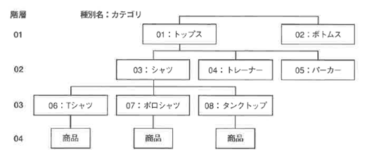
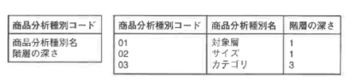
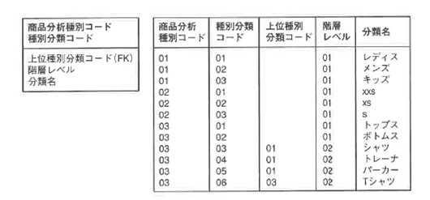
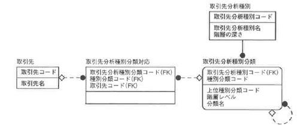
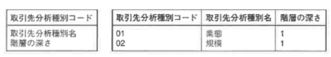
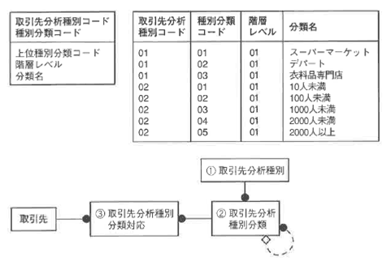
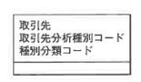
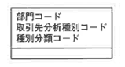
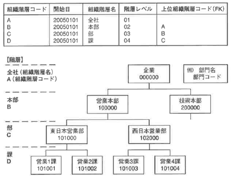

<html><body><h2 id="dbdesignTtl">6.5 【設問】売上分析</h2>

売上分析に関する詳細ER図は、以下の項目に分けてアプローチします。

<table class="tableBox">
	<tr>
		<th>項目</th>
		<th>業務内容または要求仕様</th>
	</tr>
	<tr>
		<td rowspan="4">6.5 売上分析に関する設問</td>
		<td>例題24 商品別売上分析を行うために商品エンティティを見直す</td>
	</tr>
	<tr>
		<td><a href="#h4_25">例題25 顧客別売上分析を行うために顧客エンティティを見直す</a></td>
	</tr>
	<tr>
		<td><a href="#h4_26">例題26 部門別売上分析に対応できるようにする</a></td>
	</tr>
	<tr>
		<td><a href="#h4_27">例題27 組織変更に対応できるよう部門エンティティを見直す</a></td>
	</tr>
</table>

表6-14 売上分析に関する設問

<!--/section-->

<h4 class="caption">例題24 商品別売上分析を行うために商品エンティティを見直す</h4>

経営側のリクエストとして、商品の売上分析を行い、傾向を把握する場合、商品のジャンル別比較、サイズ別比較、色の系統別比較、対象層別比較など、複数の観点から分析したいという要望があります。

<!--/section-->

<h5 class="quiz-title">Ｑ&nbsp;問題</h5>

現在でている比較の観点以外にも、将来的に比較したい分野が増えた場合に対応できるよう、拡張性をもたせたモデルを作成してください。

<!--/section-->

<h5 class="answer-title">Ａ&nbsp;解答</h5>

図6-32 解答

<!--/.grayBox-->

拡張性をもたせるために、次のような汎用的な構造を考えます。 例を示しながら説明します。

<h4>1.商品分析種別エンティティ</h4>

図6-33 商品分析種別エンティティ

<!--/.grayBox-->

種別が01または02の場合、具体的な種別の値は商品種別分類エンティティで管理されます。

<h4>2.商品分析種別分類</h4>

図6-34 商品分析種別分類

<!--/.grayBox-->

<h4>3.商品分析種別分類対応</h4>

図6-35 商品分析種別分類対応

<!--/.grayBox-->

<h4>解説</h4>

商品がどのような商品分析種別分類に属しているかは、3.の交差エンティティで管理します。

分析の種類が増えた場合は、1.商品分析種別および2.商品分析種別分類のオカレンスを増やすことで対応できます。 商品との対応づけも、2.のオカレンスに対応して商品との対応オカレンスを増やすことで対応できるため、エンティティや属性を追加することなく拡張に対応できます。 ところが、商品種別03「カテゴリ」のように、種類を階層構造で管理する場合はどのようなモデルにすれば良いでしょう。

図6-36 階層構造による管理

<!--/.grayBox-->

1.商品分析種別に「階層の深さ」属性を追加します。

図6-37 商品分析種別に属性を追加

<!--/.grayBox-->

2.商品分析種別分類に「階層レベル」「上位種別分類コード（FK）」属性を追加します。

図6-38 商品分析種別分類に属性を追加

<!--/.grayBox-->

<h4>商品分析用のエンティティ</h4>
<!--/section-->

<table>
<tr><td colspan="2"><strong>商品分析種別</strong></td></tr>
<tr><td style="width:20px;">*</td><td style="width:150px;">商品分析種別コード</td></tr>
<tr><td>&nbsp;</td><td>商品分析種別名</td></tr>
<tr><td>&nbsp;</td><td>階層の深さ</td></tr>
<tr><td colspan="2" >&nbsp;</td></tr>
<tr><td colspan="2"><strong>商品分析種別分類</strong></td></tr>
<tr><td>*</td><td>分析種別コード</td></tr>
<tr><td>*</td><td>種別分類コード</td></tr>
<tr><td>&nbsp;</td><td>上位種別分類コード</td></tr>
<tr><td>&nbsp;</td><td>階層レベル</td></tr>
<tr><td>&nbsp;</td><td>分類名</td></tr>
<tr><td colspan="2" >&nbsp;</td></tr>
<tr><td colspan="2"><strong>商品分析種別分類対応</strong></td></tr>
<tr><td>*</td><td>商品コード</td></tr>
<tr><td>*</td><td>分析種別コード</td></tr>
<tr><td>*</td><td>種別分類コード</td></tr>
</table>

<!-- /commandBox -->

<h4 class="caption" id="h4_25">例題25 顧客別売上分析のために顧客エンティティを見直す</h4>

経営側のリクエストとして、取引先（顧客）の業種別比較、規模別比較など、複数の観点から分析したいという要望があります。

<!--/section-->

<h5 class="quiz-title">Ｑ&nbsp;問題</h5>

現在出ている比較の観点以外にも、将来的に比較したい分野が増えた場合に対応できるよう、拡張性をもたせたモデルを作成してください。商品の分析種類を増加させた場合と同様に考えてください。

<!--/section-->

<h5 class="answer-title">Ａ&nbsp;解答</h5>

図6-39 解答

<!--/.grayBox-->

<h4>1.取引先分析種別</h4>

図6-40 取引先分析種別

<!--/.grayBox-->

<h4>2.取引先分析種別分類</h4>

図6-41 取引先分析種別分類

<!--/.grayBox-->

<h4>3.取引先分析種別分類対応</h4>

図6-42 取引先分析種別分類対応

<!--/.grayBox-->

<!--/section-->

<table>
<tr>
<td colspan="2"><strong>取引先分析種別</strong></td>
</tr>
<tr>
<td>*</td><td>取引先分析種別コード</td>
</tr>
<tr>
<td>&nbsp;</td><td>取引先分析種別名</td>
</tr>
<tr>
<td>&nbsp;</td><td>階層の深さ</td>
</tr>

<tr>
<td colspan="2" >&nbsp;</td>
</tr>
<tr>
<td colspan="2"><strong>取引先分析種別分類</strong></td>
</tr>
<tr>
<td>*</td><td>分析種別コード</td>
</tr>
<tr>
<td>*</td><td>種別分類コード</td>
</tr>

<tr>
<td>&nbsp;</td><td>階層レベル</td>
</tr>
<tr>
<td>&nbsp;</td><td>分類名</td>
</tr>

<tr>
<td colspan="4" >&nbsp;</td>
</tr>
<tr>
<td colspan="2"><strong>取引先分析種別分類対応</strong></td>
</tr>
<tr>
<td>*</td><td>取引先コード</td>
</tr>
<tr>
<td>*</td><td>分析種別コード</td>
</tr>
<tr>
<td>*</td><td>種別分類コード</td>
</tr>
</table>

<!-- /commandBox -->

<h4 class="caption" id="h4_26">例題26 部門別売上分析に対応できるようにする</h4>

部門間の売上比較を行ったり、本部単位の分析や課単位の分析など、指定した部門の階層ごとに分析処理を行えるようにしたいというリクエストがあります。

<!--/section-->

<h5 class="quiz-title">Ｑ&nbsp;問題</h5>

売上分析を行うに当たり、現在行われている比較の観点以外にも、将来的に比較分野が増えた場合に対応できるよう、拡張性をもたせたモデルを作成してください。

<!--/section-->

<h5 class="answer-title">Ａ&nbsp;解答</h5>

図6-43 解答

<!--/.grayBox-->

<h4>1.部門分析種別</h4>

図6-44 部門分析種別

<!--/.grayBox-->

<h4>2.部門分析種別分類</h4>

図6-45 部門分析種別分類

<!--/.grayBox-->

<h4>3.部門分析種別分類対応</h4>

図6-46 部門分析種別分類対応

<!--/.grayBox-->

<h4>部門分析用のエンティティ</h4>
<!--/section-->

<table>
<tr>
<td colspan="4"><strong>部門分析種別</strong></td>
</tr>
<tr>
<td style="width:20px;">*</td><td style="width:150px;">部門分析種別コード</td><td style="width:80px;"></td><td style="width:200px;"></td>
</tr>
<tr>
<td>&nbsp;</td><td>部門分析種別名</td><td>&nbsp;</td><td>&nbsp;</td>
</tr>
<tr>
<td>&nbsp;</td><td>階層の深さ</td><td>&nbsp;</td><td>&nbsp;</td>
</tr>

<tr>
<td colspan="4">&nbsp;</td>
</tr>
<tr>
<td colspan="4"><strong>部門分析種別分類</strong></td>
</tr>
<tr>
<td>*</td><td>分析種別コード</td><td>（FK1）</td><td>&nbsp;</td>
</tr>
<tr>
<td>*</td><td>種別分類コード</td><td>&nbsp;</td><td>&nbsp;</td>
</tr>
<tr>
<td>&nbsp;</td><td>上位種別分業頁コード</td><td>（FK2）</td><td>&nbsp;</td>
</tr>
<tr>
<td>&nbsp;</td><td>階層レベル</td><td></td><td>&nbsp;</td>
</tr>
<tr>
<td>&nbsp;</td><td>分類名</td><td></td><td>&nbsp;</td>
</tr>

<tr>
<td colspan="4">&nbsp;</td>
</tr>
<tr>
<td colspan="4"><strong>部門分析種別分類対応エンティティ</strong></td>
</tr>
<tr>
<td>*</td><td>部門コード</td><td>（FK1）</td><td>&nbsp;</td>
</tr>
<tr>
<td>*</td><td>分析種別コード</td><td>（FK2）</td><td>&nbsp;</td>
</tr>
<tr>
<td>*</td><td>種別分類コード</td><td>（FK3）</td><td>&nbsp;</td>
</tr>
</table>

<!-- /commandBox -->

<h4 class="caption" id="h4_27">例題27 組織変更に対応できるよう部門エンティティを見直す</h4>

また、組織変更が頻繁に行われる場合、時系列で、どの部門による売上が計上されたのかが間違いなく把握できる必要があります。 組織変更に対応するという意味では、部の統合や分割、廃止などのさまざまなイベントに柔軟に対応できるモデルを考える必要があります。

<!--/section-->

<h5 class="quiz-title">Ｑ&nbsp;問題</h5>

組織変更による統廃合に柔軟に対応できるようなモデルを考えてください。

<!--/section-->

<h5 class="answer-title">Ａ&nbsp;解答</h5>

図6-47 解答

<!--/.grayBox-->

<!--/section-->

<table>
<tr>
<td colspan="3"><strong>部門</strong></td>
<td>1.</td>

</tr>
<tr>
<td style="width:20px;">*</td><td style="width:180px;">部門コード</td><td style="width:80px;">&nbsp;</td><td style="width:200px;">&nbsp;</td>
</tr>
<tr>
<td>*</td><td>部門開始年月日</td><td>&nbsp;</td><td>&nbsp;</td>
</tr>
<tr>
<td>&nbsp;</td><td>部門終了年月日</td><td></td><td>&nbsp;</td>
</tr>
<tr>
<td>&nbsp;</td><td>部門名</td><td></td><td>&nbsp;</td>
</tr>
<tr>
<td>&nbsp;</td><td>組織階層コード</td><td>（FK1）</td><td>&nbsp;</td>
</tr>
<tr>
<td>&nbsp;</td><td>組織階層開始年月日 </td><td>（FK1）</td><td>&nbsp;</td>
</tr>
<tr>
<td>&nbsp;</td><td>現在部門フラグ</td><td>&nbsp;</td><td>3.</td>
</tr>

<tr>
<td colspan="4">&nbsp;</td>
</tr>
<tr>
<td colspan="3"><strong>部門履歴</strong></td>
<td>2.</td>
</tr>
<tr>
<td>*</td><td>部門履歴管理番号</td><td></td><td>&nbsp;</td>
</tr>

<tr>
<td>&nbsp;</td><td>後部門コード</td><td>（FK1）</td><td>&nbsp;</td>
</tr>
<tr>
<td>&nbsp;</td><td>前部門コード</td><td>（FK2）</td><td>&nbsp;</td>
</tr>
<tr>
<td>&nbsp;</td><td>前部門から後部門への変更年月日</td><td>（FK1）</td><td>&nbsp;</td>
</tr>

<tr>
<td colspan="4">&nbsp;</td>
</tr>
<tr>
<td colspan="3"><strong>組織階層</strong></td>
<td>5.</td>
</tr>
<tr>
<td>*</td><td>組織階層コード</td><td>&nbsp;</td><td>6.</td>
</tr>
<tr>
<td>*</td><td>組織階層開始年月日</td><td>&nbsp;</td><td>&nbsp;</td>
</tr>

<tr>
<td>&nbsp;</td><td>組織階層名</td><td>&nbsp;</td><td>&nbsp;</td>
</tr>
<tr>
<td>&nbsp;</td><td>階層レベル</td><td>&nbsp;</td><td>&nbsp;</td>
</tr>
<tr>
<td>&nbsp;</td><td>上位組織階層コード</td><td>（FK1）</td><td>&nbsp;</td>
</tr>
<tr>
<td>&nbsp;</td><td>組織階層終了年月日</td><td>&nbsp;</td><td>&nbsp;</td>
</tr>
</table>

<!-- /commandBox -->

図6-48 組織階層

<!--/.grayBox-->

<h4>解説</h4>
<ul>
<li style="text-indent: -1em;">1. 2.社内で組織変更が起きた場合、スムーズに業務の引継ぎができるよう、モデルで対応させるためには、組織の情報を履歴で管理する必要があります 部門を管理するエンティティと、部門の統廃合を管理する部門履歴エンティティに分けて管理します 部門エンティティに「部門開始年月日」「部門終了年月日」という属性を加えることによって、時系列で部門情報を管理することができます</li>
<li style="text-indent: -1em;">2. 部門が統合されてできた場合、現在の部門の前部門は2つ以上あることになります その場合、部門履歴エンティティでは、後部門2オカレンスに対してそれぞれ異なる前部門オカレンスが対応します</li>
<li style="text-indent: -1em;">3. 部門の履歴を管理すると、組織変更に従ってオカレンスの数が増えます 現部門のオカレンスを識別しやすくするために、「現在部門フラグ」属性を追加します</li>
<li style="text-indent: -1em;">4. 部門別に売上集計や損益集計を計算した後、その上位の部門単位の集計などの処理に対応できるようにするため、部門エンティティに「上位部門コード」を属性として加えます</li>
<li style="text-indent: -1em;">5. また、組織階層が深くなってくると、階層の管理が複雑になり、場合によっては、上位部門コードを間違えて入力し、ループしてしまうことも考えられます そこで、階層構造のルールを組織階層エンティティという別のエンティティで管理します</li>
<li style="text-indent: -1em;">6. 部門の階層ごとに集計処理を行うことができるようにします 部門の組織階層コード列には、組織を考える際に、組織階層ごとにルールを決めて値を設定します コードを割り当てる際には、階層の深さにも対応させるように考えます 階層ごとに集計する際には、同じ組織階層コードの値をもつ部門ごとに集計処理を行います</li>
</ul>
<!--/section-->

</body></html>
