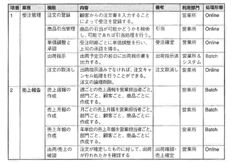
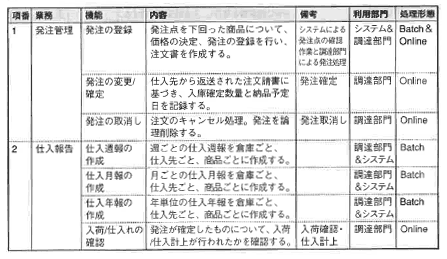
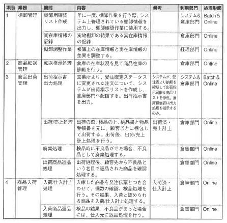
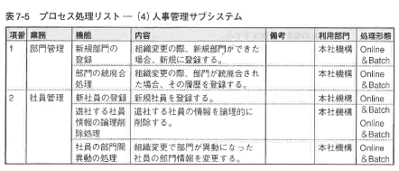
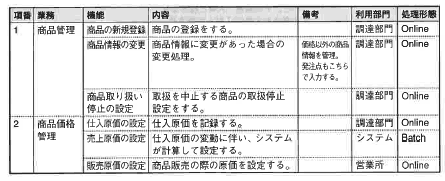
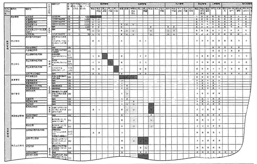
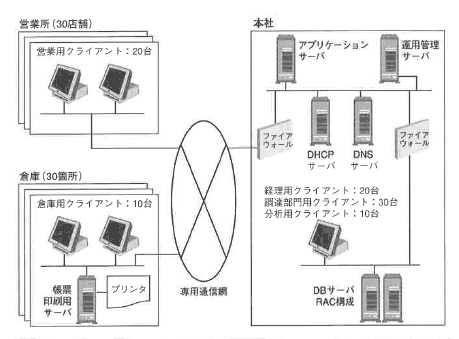

<html><body><h2 id="dbdesignTtl">7.1 論理設計で行うこと</h2>

論理設計では、アプリケーションを考慮した設計を行い、最適化の処理を加え、データベースに実装する最終的なフォーマットを決めます。 アプリケーション開発チームは、概要設計フェーズでシステムの要求仕様に基づき、新業務フローを作成します。 新業務フローを使って、客先のレビューを受け、以下のことを確認します。

<ul>
<li>● システム化によって変更される業務の流れ</li>
<li>● 業務分割と方式設計との照合</li>
</ul>

確認がとれた後、新業務フローに基づいて、画面、帳票などのマンマシンインタフェースが設計されます。 論理設計で行うべきことを以下に示します。

<strong>【STEP1】業務要件から必要な属性を見直す</strong>

<ul>
<li>● アプリケーションから見たときに必要なフラグ類の追加</li>
<li>● アプリケーションから見たときに必要なステータス管理のための属性の追加</li>
<li>● 更新履歴の取得：最後に更新した日付と更新者の情報をエンティティの属性として追加</li>
<li>● 赤黒処理：会計データの場合、訂正する元データはそのまま上書きをするのではなく、赤黒処理を行うことによって訂正の記録を残し、検証性を高くする</li>
<li>● 削除時の処理：会計データ以外のデータも、訂正の履歴を残したい場合、完全にデータを消去するのではなく、削除フラグを設けることを検討
通常のデータはNULL値、削除の場合は1を設定する</li>
<li>● マスタで管理できない項目（一時的な取り扱い商品など）の取り扱いを決める</li>
</ul>

<strong>【STEP2】索引の作成とビューの定義</strong>

<strong>【STEP3】非正規化</strong>

<ul>
<li>● 方式設計によってテーブル分割などが行われることを認識し、設計の見直しを行う</li>
<li>● 導出項目、繰り返し項目、重複項目を表に含めるかどうかを、実際のデータ量に近いボリューム、ピーク時のトランザクション量で検証テストを行った結果決める</li>
</ul>

<strong>【STEP4】表に変換する際に必要なことを決める</strong>

<ul>
<li>● 表、列の名前の決定</li>
<li>● 一意識別子として、必要に応じて人工的な属性を設定する＜ｂｒ
必要に応じて、一意識別子のコード設計を行う</li>
</ul>
<!--/.yellowBox-->

上記のような手順を踏まえ、論理設計を行いますが、重要なのは他の2つの開発工程と同期をとることです。 その内容を確認した上で、アプリケーション開発チーム、方式設計チームと意識あわせを行った上で、論理設計の工程に入ります。

アプリケーション開発工程と方式設計工程で決まったことを次に確認します。

<!--/section-->

<h3>7.1.1　アプリケーション開発の観点から確認すべき内容</h3>

アプリケーション開発の工程から業務分析した結果を、主要な2つのドキュメントを参照しながら説明します。

まず、各アプリケーションを、開発工程の観点からサブシステム分割した結果、各サブシステムでどのような処理を行うかをまとめたものが、以下のプロセス処理リストです。

表7-1 プロセス処理リスト

<!--/.grayBox-->

<!--/section-->

<h4 class="caption">各サブシステムの基本機能</h4>
<h5>プロセス処理リスト－（1）販売管理サブシステム</h5>

表7-2 プロセス処理リスト－（1）販売管理サブシステム

<!--/.grayBox-->

表7-3 プロセス処理リスト－（2）仕入管理サブシステム

<!--/.grayBox-->

表7-4 プロセス処理リスト－（3）在庫管理サブシステム

<!--/.grayBox-->

表7-5 プロセス処理リスト－（4）人事管理サブシステム

<!--/.grayBox-->

表7-6 プロセス処理リスト－（5）取引先管理サブシステム

<!--/.grayBox-->

表7-7 プロセス処理リスト－（6）商品管理サブシステム

<!--/.grayBox-->

表7-8 プロセス処理リスト－（7）財務管理サブシステム

<!--/.grayBox-->

サブシステム間、システムの中の登場人物の間でどのように情報が流れるかを表したものが、図7-1のデータフロー図です。

図7-1 データフロー図 <a href="./images/711-09l.gif" class="fancybox">【クリックで拡大します】</a>

<!--/.grayBox-->

この図から次のようなことが読み取れます。

<ul>
<li>● このシステムの中に登場するすべてのコンポーネント間でどのようなデータが必要とされ、どのように情報が受け渡されるか</li>
<li>● サーバをどこに配置するか、それによってどのようなデータがどこで管理されるか</li>
</ul>

また、プロセス処理リストで記述されたプロセスが、どのエンティティを、いかにアクセスするのかをマトリクスで表したものが図7-2のCRUD図です。

図7-2 受発注システムCRUD図（抜粋） <a href="./images/711-10l.gif" class="fancybox">【クリックで拡大します】</a>

<!--/.grayBox-->

CRUD図を作成する過程で、次のようなことを検証します。

<ul>
<li>● 必要なエンティティがすべて抽出されているか （プロセス側から見て必要なエンティティがすべて揃っているか）</li>
<li>● エンティティを処理するプロセスがすべて揃っているか （Create、Reference、Update、Delete）</li>
<li>● プロセス分割が適切に行われているか （1つのプロセスで複数のエンティティに対する処理が詰め込まれていないか）</li>
<li>● エンティティの正規化が適切に行われているか （1つのエンティティにアクセスが集中していないか）</li>
</ul>

このCRUD図からは、顧客マスタや、商品マスタなどのマスタ表や在庫表へのアクセスが複数のサブシステムから実行されていることがわかります。

もし、必要であれば、このようなマスタ表やイベント表を、営業所や倉庫などの拠点ごとに分散させることを考えます。 各拠点にデータベースサーバを配置し、そこに表を配置します。 その場合、マスタ表やイベント表の同期をとるために、定期的に最新の状態に更新されたデータを、最新の状態になっている表からコピーする必要があります。

<!--/section-->

<h3>7.1.2 方式設計要件定義およぴシステム構成図（概略）</h3>

方式設計の工程から、方式面から分析した、データベース要件に関して次の2つのドキュメントを参照します。 1つは、方式に関するユーザからの要件をまとめたもので、方式設計の要件定義書です。 これをもとに、データベースを含む、ユーザ要件を満たしたシステムを作成していきます。

方式要件定義書と、プロセス処理リスト、データフロー図を元に、データベースサーバの配置、サーバ、クライアントそれぞれの処理要件を考え、システム構成図の概略図を作成します。

図7-3 方式設計要件定義

<!--/.grayBox-->

図7-4 システム構成図の概略図

<!--/.grayBox-->

これらのドキュメントから検討した結果、システム化および適切なデータベースシステムおよびアプリケーションの提案によって、次のような効果をあげることが明確になります。 システム化だけで可能な効果もありますが、システムを提案する側の工夫によって、可能となる部分もあります。 このような「システム化における付加価値を提案」できるか否かが設計者としての価値を決めるといっても過言ではありません。

<!--/section-->

<h4 class="caption">営業所の処理業務の見直し</h4>

これまで、営業所で行っていた請求書の発行、入金確認などの処理は、システム化することによって、大幅に手作業の負荷を削減することができます。 請求以降の会計関係の処理は、営業所では確認のみできるようにしておき、実際の処理は経理部門で一括して行うように提案することができます。 営業所は営業活動に専念することができます。

そして、作業負荷が軽減された時間を使って、蓄積されたデータを分析し、地域特性を活かした販売予測、販売計画をたてることを提案します。 そのために必要な分析のための軸をヒアリングによって収集します。 たとえば、購買する人の性別や年齢層などは、意識して集めないと、販売と連動して分析することはできません。

<!--/section-->

<h4 class="caption">会計処理の一元化</h4>

各部門で起票された仕訳伝票を受け取った経理部門が行っていた総勘定元帳への転記作業を、次のように変更することができます。

仕訳伝票を起票した部門で、その部門の業務処理を行うと、会計に関係する処理の場合、仕訳伝票が同時に作成され、システムの総勘定元帳に自動的に登録されるような仕組みを提案します。 また、これまで手計算で行っていた決算時の損益計算書や貸借対照表の作成処理も、システムでは総勘定元帳を元に四半期ごとに自動的に行うことができます。 これによって、経理部門の作業負荷が大幅に軽減され、誤転記などのミスもなくなります。 単調な転記や計算、誤処理の後処理などに割かれる時間を極力軽減できます。

<!--/section-->

<h4 class="caption">受発注処理の連動</h4>

受注処理における在庫引当処理、発注処理による予定在庫数の管理、入出荷処理による実在庫数の管理がリアルタイムでできることによって、在庫が適正化されます。 在庫を適正に管理できるようになれば、欠損による販売機会の損失は大幅に軽減することができます。 また、在庫の適正化を行うことによって、倉庫のレイアウトも適切に管理することができるようになり、今まで扱うことができなかった商品を加えることもできる可能性があります。

将来日付の予定在庫数と実在庫数が、リアルタイムで管理できるようになるための設計（データベース設計、アプリケーション設計、方式設計）が、このシステムの特徴です。 今回のシステム構成のポイントの1つは、本社で集中管理しているデータベースが1つであることから在庫表も1箇所で管理でき、リアルタイムで最新情報を更新、取得することができる点です。

<!--/section-->

<h4 class="caption">在庫引当時の部門間連携</h4>

受注時に在庫が不足していた場合には、すぐに仕入れ処理ができるように連携をとっています。 システム化によって、部門間連携を迅速に行うことができるようになります。 ただし、仕入れにより倉庫に入庫された商品が他の受注によって引き当てられないよう、データベースで紐付けを行っておく必要があります。 これを実現するためには、データベースの中で、適切なリレーションが設定されている必要があります。

それでは、具体的にアプリケーションで設計している受注画面を参考にしながら、受注に関するテーブル設計と索引の設計を考えてみましょう。 論理設計の範囲は、受注画面からわかる範囲で実施します。 他の部分は、論理設計に関しては、画面レイアウトや帳票レイアウトが決まらないと詳細には検討できないため、範囲を限定して紹介します。

<!--/section-->

</body></html>