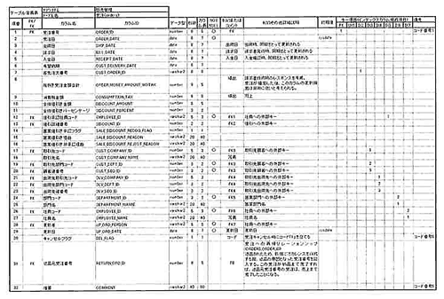

<html><body><h2 id="dbdesignTtl">7.2 受注処理</h2>

まず、「新規注文登録」画面、「注文検索」画面、「注文詳細」画面を示します。

<!--/section-->

<h3>新規注文登録画面</h3>

図7-5 新規注文登録画面

<!--/.grayBox-->

新規注文登録画面の利用方法を以下に示します。

<!--/section-->

<h4 class="caption">注文情報</h4>

<ul>
<li>● 受注日、顧客情報、営業担当情報を入力する</li>
<li>● お客様注文番号、希望納期、支払期日の入力は任意</li>
<li>● 顧客情報、営業担当情報は、ログインユーザの情報から絞り込み条件を付加して処理</li>
<li>● 顧客情報が決まると、現在の顧客の与信限度額と売掛金累計額が表示される</li>
</ul>
<!--/section-->

<h4 class="caption">注文商品情報</h4>

<ul>
<li>● 商品コードまたは商品名によって商品が一意に決まると、単価が自動的に設定される</li>
<li>● 商品大分類と中分類は、商品を絞り込むために使用</li>
<li>● 受注数量を入力して引当ボタンを押下すると、引当可能な数量が引当数量に表示され、引当される</li>
<li>● ステータスは、以下の10種類</li>
<li>
　● 仮引当 
　● 引当 
　● 受注確定 
　● 要承認 
　● 承認済 
　● 出荷指示済 
　● 出荷済 
　● 納品完了 
　● 請求済 
　● 入金完了
</li>
<li>● 引当ボタンを押下した場合、受注行と受注明細行が作成され、必須項目への入力が確認され、OKであればステータス欄の値が「引当」「要承認」または「仮引当」になる </li>
<li>
　● 受注数に満たなかったものは「仮引当」になる 
　● 受注数が引き当てられたものは、「引当」または「要承認」になる 
　● 受注数が引当できても、値下げに関する値が登録されている注文明細は「要承認」ステータスになる
</li>
<li>● 「仮引当」ステータスの注文は、その後、顧客と連絡をとって数の調整を行う必要がある 顧客と連絡をとって「訂正後数量計」の値が「引当数」と同じになった時点で、ステータスは「引当」または「要承認」に変わる 数の調整が決着した後に、上長による承認を行うプロセスに移行する</li>
<li>● 「引当」のステータスになり、値引の必要がない注文明細は、受注確定ボタンを押下して「受注確定」ステータスにする 「受注確定」ステータスになると、納期に合せてバッチ処理によって出荷指示を行うことができる</li>
<li>● 各行の左についているチェックボックスをチェックすると、その行に対する最下行のボタンを押下したときの処理がその行に対して実行される</li>
<li>● 「要承認」ステータスの商品に関しては、上長の承認が必要 「承認」ボタンは権限をもっている社員しか押下できない 上長が「承認」ボタンを押下した場合、ステータスは「承認済」となり、納期に合せてバッチ処理によって出荷指示を行うことができる</li>
</ul>
<!--/section-->

<h3>注文検索画面</h3>

図7-6 注文検索画面

<!--/.grayBox-->

注文検索画面の利用方法を以下に示します。

<!--/section-->

<h4 class="caption">注文情報</h4>

<ul>
<li>● テキストボックスには値を直接入力する</li>
<li>● ドロップダウンリストからは値を選択する</li>
<li>● 検索条件のいずれか、または複数を入力して検索ボタンを押下すると、AND条件で受注表から絞り込みを行い、該当する行集合を受注リストに表示する</li>
</ul>
<!--/section-->

<h4 class="caption">受注リスト</h4>

<ul>
<li>● 受注リストのステータス列には、受注明細行のうち最も処理が遅れている行のステータスが表示される</li>
<li>● 詳細ボタンを押すと、該当する受注行の受注明細行を次画面で表示する</li>
<li>● 受注のステータスが出荷済の場合、出荷日が表示される</li>
</ul>
<!--/section-->

<h3>注文詳細画面</h3>

図7-7 注文詳細画面

<!--/.grayBox-->

注文詳細画面の使用方法を以下に示します。

<!--/section-->

<h4 class="caption">注文情報</h4>

<ul>
<li>● 検索画面で詳細ボタンを押下して指定された受注情報を表示する</li>
<li>● 受注日、納期日、出荷日、請求日、入金予定日、入全日はすでに値が入っているもののみ表示する</li>
<li>● 該当顧客の現在の与信限度額と売掛金累計額が表示される</li>
</ul>
<!--/section-->

<h4 class="caption">注文商品情報</h4>

<ul>
<li>● 左端のチェックボックスをチェックした行のみ「引当」「キャンセル」「受注確定」「承認」「非承認」ボタン押下時の対象になる</li>
<li>● キャンセルは出荷指示を行う以前の受注明細のみ対象とする それ以降のステータスになるとキャンセルボタンは表示されない</li>
<li>● ステータスの値が「仮引当」の行のみ引当ボタンを押下できる 新しい引当数量が引当数量に表示される 訂正後数量計は、引当数量が不足している商品の受注数量を変更する際に使用する</li>
<li>● ステータスの値が引当の行の受注数量を変更したい場合は、その行をキャンセルして再度受注行を入力しなおす</li>
<li>● ステータスは以下の10種類 </li>
<li>
　● 仮引当 
　● 引当 
　● 要承認 
　● 承認済 
　● 出荷指示済 
　● 出荷済 
　● 納品完了 
　● 請求済 
　● 入金完了
</li>
<li>● 引当ボタンを押下した場合、受注行と受注明細行が作成され、必須項目への入力が確認され、OKであれば、ステータス欄の値が「引当」「要承認」または「仮引当」になる </li>
<li>
　● 受注数に満たなかったものは「仮引当」になる 
　● 受注数が引き当てられたものは、「引当」または「要承認」になる 
　● 受注数が引当できても、値下げに関する値が登録されている注文明細は「要承認」ステータスになる
</li>
<li>● 「仮引当」ステータスの注文は、その後、顧客と連絡をとって数の調整を行う必要がある 顧客と連絡をとって「訂正後数量計」の値が「引当数」と同じになった時点で、ステータスは「引当」または「要承認」に変わる 数の調整が決着した後に、上長による承認を行うプロセスに移行する</li>
<li>● 「引当」のステータスになり、値引の必要がない注文明細は、受注確定ボタンを押下して「受注確定」ステータスにする 「受注確定」ステータスになると、納期に合せてバッチ処理によって出荷指示を行うことができる</li>
<li>● 各行の左についているチェックボックスをチェックすると、その行に対する最下行のボタンを押下したときの処理がその行に対して実行される</li>
<li>● 「要承認」ステータスの商品に関しては、上長の承認が必要 「承認」ボタンは権限をもっている社員しか押下できない 上長が「承認」ボタンを押下した場合、ステータスは「承認済」となり、納期に合せてバッチ処理によって出荷指示を行うことができる</li>
</ul>
<!--/section-->

<h4 class="caption">受注業務</h4>

業務の現状を以下に説明しますので、それを把握した上で続く問題に答えなさい。

営業所の社員は、顧客からの注文を受けて受注処理を行います。 受注処理は、方式設計の要件定義より、ピーク時のトランザクションは150件/sec、更新時のレスポンスは5秒以内で返ってくることが要求されます。

<ul>
<li>● 商品名を指定して、受注できるだけの出荷可能在庫が倉庫に存在するかを確認します</li>
<li>● 商品コードと倉庫コードを指定して在庫の引当を行います</li>
<li>● 顧客の要望、または営業の判断で請求月を指定する場合もあります</li>
<li>● 顧客の要望に応じて受注取消し、受注個数変更処理を行う場合があります ただし、この処理は出荷指示が出た後で行うことはできません</li>
<li>● 顧客からの問い合わせで受注商品や受注数の確認作業を行う場合があります</li>
<li>● 受注のステータスを明細情報ごとに確認し、受注後の処理漏れがないかを確認します 受注後のステータスは、次の10種類があります </li>
<li>
　● 仮引当：

注文の商品情報と受注数を最低1件登録した後、「引当」ボタンを押下したが、引当数が受注数より少なく、可能な限り商品を引き当てておいた状態 翼商事では、単品が他の代替商品で注文を置き換えてもらうことが難しい商品を扱っているため、全受注数が引き当てられない場合は、仮引当処理を行うことにした また、値引調整は、情報だけ入力しておくことができるが、引当数量が確定した後に、上長の承認を受けるよう な順にする

　● 引当：

受注数分、引当ができたが、値引情報が未だ入力されていない状態 または、引当数が不足したため、発注処理を行い、受注数に足る数の商品の納期が確定した状態 または、引当数が不足したため、受注数から訂正後数量計に受注数が変更された状態 この後、値引の必要があれば、値引情報を追加する。すると、ステータスは「承認待ち」となり、上長の承認を待つプロセスに入る 値引の必要がなく、出荷指示を出すことができるのであれば、「受注確定」ボタンを押して、「出荷指示待ち」ステータスに変更する必要がある

　● 受注確定：

引当が完了し、値引の必要がないため、手動で出荷指示待ちにした状態

　● 要承認：

引当が完了し、値引の承認が上長からおりるのを待っている状態

　● 承認済：

上長による値引が行われ、出荷指示待ちになっている状態

　● 出荷指示済：

出荷指示処理が終了した状態。これ以降、受注のキャンセルはできない

　● 出荷済み＝売上計上済：

顧客ごとに出荷が完了した状態

　● 納品済：

顧客から納品受領書が返されてきた状態
次の処理は請求書発行

　● 返品：

顧客から返品があり、それに対応した新しい受注がまだ客先に納品されていない状態 返品の場合、返品分だけ以前の売上から売上返品という形で差し引く処理を行う （売上に正常売上と返品売上という区分を設け、返品売上の場合、以前の売上から返品分を差し引く処理を行う。以前に売上が計上されたものは差引かれた額で計上される） 次に、返品された分は、新規に0円受注という形で以前の受注と関連付けて新規の受注が起こされる その受注が納品された状態で納品清になり、請求処理にまわすことがきるようになる

　● 請求済：

請求書発行済

　● 入金済：

請求分の入金が確認された状態

</li>
</ul>
<!--/section-->

<table>
<tr><td colspan="3" ><strong>受注ヘッダ</strong></td></tr>
<tr><td style="width:20px;">*</td><td style="width:150px;">受注注文番号</td><td style="width:80px;">&nbsp;</td></tr>
<tr><td>&nbsp;</td><td>客先注文番号</td><td>&nbsp;</td></tr>
<tr><td>&nbsp;</td><td>受注日付</td><td>&nbsp;</td></tr>
<tr><td>&nbsp;</td><td>受注顧客コード</td><td>（FK1）</td></tr>
<tr><td>&nbsp;</td><td>出荷先顧客コード</td><td>（FK2）</td></tr>
<tr><td>&nbsp;</td><td>受注社員番号</td><td>（FK3）</td></tr>
<tr><td>&nbsp;</td><td>値引き承認社員コード</td><td>（FK4）</td></tr>
<tr><td>&nbsp;</td><td>受注部門コード</td><td>（FK5）</td></tr>
<tr><td>&nbsp;</td><td>営業値引き承認フラグ</td><td>&nbsp;</td></tr>
<tr><td>&nbsp;</td><td>営業値引き理由</td><td>&nbsp;</td></tr>
<tr><td>&nbsp;</td><td>営業値引き非承認理由</td><td>&nbsp;</td></tr>
<tr><td>&nbsp;</td><td>値引き詳細番号</td><td>（FK5）</td></tr>
<tr><td>&nbsp;</td><td>消費税額</td><td>&nbsp;</td></tr>
<tr><td>&nbsp;</td><td>税抜受注全額合計</td><td>（導出）</td></tr>
<tr><td>&nbsp;</td><td>キャンセルフラグ</td><td>&nbsp;</td></tr>
<tr><td>&nbsp;</td><td>適用</td><td>&nbsp;</td></tr>
</table>

<table>
<tr><td colspan="3" >スーパータイプ：<strong>受注明細</strong></td></tr>
<tr><td>*</td><td>受注注文番号</td><td>（FK1）</td></tr>
<tr><td>*</td><td>商品コード</td><td>（FK2）</td></tr>
<tr><td>*</td><td>客先希望納期日付</td><td>&nbsp;</td></tr>
<tr><td>&nbsp;</td><td>価格種別コード</td><td>&nbsp;</td></tr>
<tr><td>&nbsp;</td><td>商品価格適用開始日</td><td>&nbsp;</td></tr>
<tr><td>&nbsp;</td><td>値引き詳細番号</td><td>（FK4）</td></tr>
<tr><td>&nbsp;</td><td>営業値引き承認フラグ</td><td>&nbsp;</td></tr>
<tr><td>&nbsp;</td><td>営業値引き理由</td><td>&nbsp;</td></tr>
<tr><td>&nbsp;</td><td>営業値引き非承認理由</td><td>&nbsp;</td></tr>
<tr><td>&nbsp;</td><td>予定納期日付</td><td>&nbsp;</td></tr>
<tr><td>&nbsp;</td><td>受注数量</td><td>&nbsp;</td></tr>
<tr><td>&nbsp;</td><td>変更後最終受注数量</td><td>&nbsp;</td></tr>
<tr><td>&nbsp;</td><td>キャンセルフラグ</td><td>&nbsp;</td></tr>
<tr><td>&nbsp;</td><td>ステータス</td><td>&nbsp;</td></tr>
<tr><td>&nbsp;</td><td>金額</td><td>（導出）</td></tr>
</table>

<table>
<tr><td colspan="3">サブタイプ：<strong>受注明細・在庫引当</strong></td></tr>
<tr><td>*</td><td>受注注文番号</td><td>（FK1）</td></tr>
<tr><td>*</td><td>商品コード</td><td>（FK1）</td></tr>
<tr><td>*</td><td>客先希望納期日付</td><td>（FK1）</td></tr>
<tr><td>&nbsp;</td><td>倉庫コード</td><td>（FK2）</td></tr>
</table>

<table>
<tr><td colspan="3">サブタイプ：<strong>受注明細・発注分</strong></td></tr>
<tr><td>*</td><td>受注注文番号 </td><td>（FK1）</td></tr>
<tr><td>*</td><td>商品コード </td><td>（FK1）</td></tr>
<tr><td>*</td><td>客先希望納期日付</td><td>（FK1）</td></tr>
<tr><td>*</td><td>発注注文番号</td><td>&nbsp;</td></tr>
<tr><td>&nbsp;</td><td>発注商品コード</td><td>&nbsp;</td></tr>
<tr><td>&nbsp;</td><td>不足分数量</td><td>&nbsp;</td></tr>
<tr><td>&nbsp;</td><td>確定納期日付</td><td>&nbsp;</td></tr>
</table>

<table>
<tr><td colspan="3"><strong>発注</strong></td></tr>
<tr><td>*</td><td>発注注文番号</td><td>&nbsp;</td></tr>
<tr><td>&nbsp;</td><td>発注日付</td><td>&nbsp;</td></tr>
<tr><td>&nbsp;</td><td>取引先コード</td><td>（FK）</td></tr>
<tr><td>&nbsp;</td><td>発注社員番号</td><td>（FK）</td></tr>
<tr><td>&nbsp;</td><td>発注全額合計</td><td>（導出）</td></tr>
<tr><td>&nbsp;</td><td>受注注文番号</td><td>（FK）</td></tr>
</table>

<table>
<tr><td colspan="3"><strong>発注明細</strong></td></tr>
<tr><td>*</td><td>発注注文番号</td><td>（FK1）</td></tr>
<tr><td>*</td><td>受注注文番号</td><td>（FK2）</td></tr>
<tr><td>*</td><td>商品コード</td><td>（FK2、FK3）</td></tr>
<tr><td>*</td><td>予定納期</td><td>（FK2）</td></tr>
<tr><td>&nbsp;</td><td>価格コード</td><td>（FK3）</td></tr>
<tr><td>&nbsp;</td><td>発注金額計</td><td>（導出）</td></tr>
</table>

<!-- /commandBox -->

<h5 class="quiz-title">Ｑ&nbsp;問題1</h5>

受注、受注明細エンティティの表構造を検討しなさい。

<h5 class="quiz-title">Ｑ&nbsp;問題2</h5>

上記処理を確認して、作成した方が良いと考えられる索引を検討しなさい。

<h5 class="quiz-title">Ｑ&nbsp;問題3</h5>

上記処理要件を確認して、導出項目や重複項目を残すかどうかを検討しなさい。

<h5 class="quiz-title">Ｑ&nbsp;問題4</h5>

受注、明細エンティティの一意識別子を決めなさい。

<h5 class="quiz-title">Ｑ&nbsp;問題5</h5>

各エンティティで削除、更新時の処理をどのように扱うかを決めなさい。

<!--/section-->

<h5 class="answer-title">Ａ&nbsp;解答1</h5>

図7-8 受注（order）テーブルの定義<a href="./images/720-04l.gif" class="fancybox">【クリックで拡大します】</a>

<!--/.grayBox-->

図7-9 受注明細（order_detail）テーブルの定義<a href="./images/720-05l.gif" class="fancybox">【クリックで拡大します】</a>

<!--/.grayBox-->

<h4>解説</h4>

受注明細表は、スーパータイプ/サブタイプの構造になっていましたが、今回はすべての行を同時に参照することが多いため、1つの表にまとめた方が検索処理が速いこと、サブタイプの種類がこれ以上増えることは考えにくいという業務側の判断から、1表にまとめることにしました。

<ul>
<li>● 受注明細行を、種禁則こよって次のように分け、それを「受注明細種類コード」で識別します</li>
<li>
● 受注時の受注個数、全額情報などを格納する元の行 
● 倉庫での引当処理によって受注できた行 
● 仕入れを必要とした行
</li>
<li>● 上記明細のうち、引当と仕入れを表す行は、「上位受注明細番号」という列で、元になっている行を参照します</li>
<li>● 引当ができた明細には「倉庫コード」が、仕入れが必要になった明細行には、仕入れのための発注の後に決まった「確定納期」が指定される属性になります</li>
<li>● 倉庫からの引当は、当初複数倉庫からの引当もできるように考えていましたが、業務的な観点から、倉庫は1箇所からの引当のみになりました。エンティティ上の変更は特にありません</li>
</ul>

また、受注明細エンティティには、出荷後に返品が起きた場合に対応する属性も追加しました。 出荷/売上に返品処理が起きた場合、出荷返品分に関しては、新たに受注オカレンスが作成される場合があります。 そのとき、新たな受注ではないことがわかるように、受注エンティティの「返品元受注番号」属性に、今回の返品のための受注の原因となった受注番号を入力します。 （受注エンティティには、返品が生じた場合、返品用に顧客に新たに出荷するための新規受注オカレンスが追加され、返品の原因となった受注を再帰的に参照する再帰リレーションシップが加わることになります） 出荷返品分の出荷が完了すれば、返品のあった受注も出荷/売上完了となります。

<!--/section-->

<h5 class="answer-title">Ａ&nbsp;解答2</h5>

上記、図7-8、図7-9を参照してください。

<h4>解説</h4>

注文検索画面より、検索キーになっている列、他表との結合列になっている列に対して索引の作成を検討します。 受注表には次の索引を作成します。

<ul>
<li>● 主キー</li>
<li>● 客先注文番号（客先で管理している注文番号）</li>
<li>● 顧客情報を特定するための索引（受注した顧客と出荷先の顧客）</li>
<li>● 受注した部門、社員を検索するための索引 部門、社員に関しては、ヒアリングによって、名前から検索されることが多いことがわかりました IDと名前の両方が必要であるため、複合列索引として作成しました</li>
<li>● 検索画面には出てきませんが、承認が必要となる社員がログインした際に、承認が必要な伝票を検索する必要があります その観点から、承認社員IDに索引を作成します</li>
</ul>

受注明細表には、以下の索引を作成します。

<ul>
<li>● 主キー</li>
<li>● 検索画面にはありませんが、出荷管理表から検索する際に必要な情報として、倉庫、商品、ロットの組み合わせに索引を作成します</li>
<li>● 承認が必要となる社員がログインした際に、承認が必要な伝票を検索する必要があります その観点から、承認社員IDに索引を作成します</li>
</ul>
<!--/section-->

<h5 class="answer-title">Ａ&nbsp;解答3</h5>

受注エンティティでは、以下の項目を導出項目として残します。

<ul>
<li>● 税抜受注金額計</li>
<li>● 消費税金額</li>
<li>● 伝票単位での値引金額</li>
<li>● 受注部門名</li>
<li>● 受注社員名</li>
<li>● ステータスコード</li>
</ul>

理由は、受注エンティティの検索頻度が非常に高いこと、併せて受注時に決定した以下の値は、参照先の表では、時間の経過とともに変化する可能性がありますが、ほしい値は受注時の値であるためです。 また、受注が確定した後、この借の変更はほとんどないということがアプリケーションの調査からわかっているため、冗長性を残しても問題はないと判断しました。

また、受注した伝票が最終的に入金処理まで完了したかどうかを管理するために、受注エンティティにキーとなるイベントが実施された日付を記述できるようにしてあります。 それぞれの処理が完了した時点で、受注エンティティにその日付が記入されるようにします。

<ul>
<li>● 出荷日付</li>
<li>● 請求日付</li>
<li>● 入金完了日付</li>
</ul>

受注明細エンティティでも同様の考え方で、次の属性を導出項目として残しておきます。 

<ul>
<li>● 商品名</li>
<li>● 商品売上原価（売上時の利益計算に使用）</li>
<li>● 品販売原価（同上）</li>
<li>● ステータスコード</li>
<li>● 消費税額</li>
<li>● 金額</li>
<li>● キャンセル数量</li>
<li>● 出荷指示日付</li>
</ul>
<!--/section-->

<h5 class="answer-title">Ａ&nbsp;解答4</h5>

受注エンティティの一意識別子は、受注番号で変更はありません。 桁数は、1年で発行される伝票数から8桁とします。

受注明細エンティティの一意識別子は、いろいろなエンティティから参照されて いため、受注番号＋受注明細番号という人工的な番号をふることにします。

<!--/section-->

<h5 class="answer-title">Ａ&nbsp;解答5</h5>

方式設計の要件定義書より、オンラインで1年分のトランザケションは格納しておきます。 受注または受注明細の単位で、キャンセル時、元データの履歴を残しておくため、キャンセルフラグを設定します。 後からキャンセルしたレコードには「1」をたてます。 オンライン格納期間を過ぎたら、それ以降については、テープにバックアップを取得します。

<!--/section-->

</body></html>