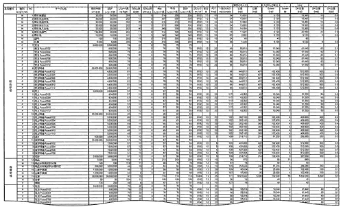
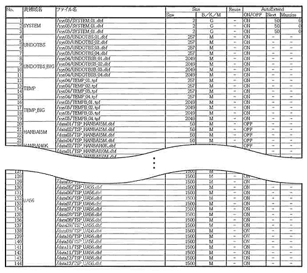

<html><body>

<h2>8.3 Excelの各シートへの記述</h2>

具体的にシートへの記述方法を紹介します。

<!--/section-->

<h4 class="caption">表容量設計例</h4>

図8-1 表容量設計例 【<a href="./images/830-01l.gif" class="fancybox">クリックで拡大します</a>】

<!--/.grayBox-->

<!--/section-->

<h4 class="caption">表配置設計例</h4>

図8-2 表配置設計例 【<a href="./images/830-02l.gif" class="fancybox">クリックで拡大します</a>】

<!--/.grayBox-->

<!--/section-->

<h4 class="caption">表領域設計例</h4>

表8-1 表領域設計例

<!--/.grayBox-->

<!--/section-->

<h4 class="caption">データベースファイル設計例</h4>

図8-3 物理ボリューム

<!--/.grayBox-->

図8-4 制御ファイル

<!--/.grayBox-->

図8-5 REDOログファイル

<!--/.grayBox-->

図8-6 アーカイブログファイル

<!--/.grayBox-->

図8-7 データファイル、一時ファイル

<!--/.grayBox-->

<!--/section-->

<h3>8.3.1 表容量計算シート</h3>

具体的にシートへの記述方法を紹介します。

<!--/section-->

<h4 class="caption">前提</h4>

<h5>設定数値関連</h5>

イベント系の表に関しては、データ保持期限の1年分の容量を見積もっています。

マスタ系の表は、過去のデータも管理しているため、カレントで使用しているデータは80％とします。 営業日は週5日。 設計レコード数はあらかじめ与えられた現状の値を使用しています。 レコード長、カラム数は、論理設計で設計した値を使用していると仮定します。

PCTFREEは以下を想定しています。 マスタ系は10%、イベント系の表では、表に最初にオカレンスが挿入されたときはNULL、後から値が人力される項目のデー夕長に注目します。 最終行長から初期行長を引いた差分の行長が、最終行長に対して何%かを計算して設定するのが原則です。 本例では、だいたい20%と見積もっています。 更新によって行長が長くなるものについては25%、サマリー系で導出（バッチ処理など）で作成される表は5%を設定しています。 パーティションは、元の表（イベント系の表）に準じます。

ブロックサイズは基本的に8K。大きい表は16Kを設定しています。

エクステントサイズは、エクステント数が10以内に収まるよう、5ブロックの倍数で設定しています。 表の種類は、主要なエンティティのみを使用しています。 実際にはもっと多数の表が存在しますが、サンプルとしていくつか抽出したものを使用しています。

<h5>業務関連</h5>

アプリケーション間発チームの要望で、以下の5つのサブシステムが提示されたことを想定しています。 サブシステムは、表領域の分割の際に参考にします。

<ul>
<li>● 販売管理</li>
<li>● 在庫管理</li>
<li>● 仕入れ管理</li>
<li>● 経理管理</li>
<li>● 売上分析</li>
</ul>
<!--/section-->

<h4 class="caption">パーティションの採用</h4>

受注、売上、発注、仕入れ等のイベント系の表に関しては、データ量が非常に多いこと、使用されるSQLから目付単位での絞り込み条件が多いことが予測されるため、パーティション機能の使用を考えました。 1パーティションが数百MBになるものに関して、パーティション化を適用しました。 本例では、2か月につき1パーティションとしていますが、SQLの処理を考慮すると、1か月につき1パーティションが最善だと思われます。

パーティション化する表の容量増加に対する対策としては、年度が替わるごとにパーティションを追加することによって対応します。 パーティション化した表のうち、売上表に関しては、分析業務のために、次の4つのサマリ表をマテリアライズドビューという形であらかじめサマリデータを集計しておくことを考えました。

<ul>
<li>● 日別商品別顧客別売上サマリ</li>
<li>● 日別商品別営業部員別売上サマリ</li>
<li>● 日別商品別部門別売上サマリ</li>
<li>● 日別商品分類別売上サマリ</li>
</ul>

業務要件として、1日前の売上情報を分析するというレベルでよいとの判断から、バッチ更新によるマテリアライズドビューの使用を考えました。 マテリアライズドビューも大規模で日付単位で集計、計算することが多いため、パーティション化します。 マテリアライズドビューの容量増加に対しても、年度をまたがった場合には、パーティションを追加することで対応します。

管理項目として、予算と実績を比較するのであれば予算、利益率を分析したいのであれば利益、日別ではオンラインの処理速度として不足であれば月別といったサマリを作成しておくことも考慮します。 ユーザの戦略と要求に従って、適切な選択をする必要があります。

<!--/section-->

<h3>8.3.2 表配置シート</h3>

<h4 class="caption">前提</h4>

	
ユーザ表に割り当てられているボリュームは12です。 表容量計算シートより、各サブシステムごとにどの程度のボリュームが必要かを試算します。

<!--/section-->

	<table class="tableBox">
	<tr>
		<th>サブシステム名</th>
		<th>容量</th>
	</tr>
	<tr>
		<td>販売管理</td>
		<td>9,159,760KB</td>
	</tr>
	<tr>
		<td>在庫管理</td>
		<td>6,169,720KB</td>
	</tr>
	<tr>
		<td>仕入れ管理</td>
		<td>7,127,040KB</td>
	</tr>
	<tr>
		<td>経理管理</td>
		<td>3,153,920KB</td>
	</tr>
	<tr>
		<td>売上分析</td>
		<td>52,838,400KB</td>
	</tr>
	</table>
	
表8-2 サブシステム別の容量資産表

<!--/section-->

<h4 class="caption">設計例</h4>

	
各サブシステムごとに表領域を分割し、障害の局所化をするために、ボリュームも表領域ごとに分けた方が望ましいといえます。 そこで、1～4までのサブシステムを、同じ程度の容量になるよう3つに分割して、12ボリュームを3分割しました。 各表領域ごとに4ボリュームが割り当てられるため、各表領域のパーティションもその中で並列に分散して読み書きができるように考慮します。

<!--/section-->

<h3>8.3.3 表領域設計書</h3>

	
表領域はサブシステムごとに分割します。 マスタ系とイベント系で分割し、同じ種類の場合でも、エクステントサイズやブロックサイズの違いで分割します。

	
SYSTEM表領域とUNDO表領域のエクステントサイズは自動設定とします。 UNDO表領域とTEMP表領域は、オンライン系とバッチ系で分けて作成します。 バッチ系の表領域は、ブロックサイズもエクステントサイズも大きいものを使用します。 データ用表領域の1エクステントサイズは大きくても100MBを上限としました。

<!--/section-->

<h3>8.3.4 データベースファイル設計書</h3>
<h4 class="caption">前提</h4>

	<ul>
		<li>● システム関係のボリュームのマウントポイントは4つ： /SYS01～04</li>
		<li>● REDO用のボリュームのマウントポイントは4つ： /RED001～04</li>
		<li>● ユーザ用のボリュームのマウントポイントは12： /DATA01～12</li>
	</ul>
<!--/section-->

<h4 class="caption">設計例</h4>

	
制御ファイルは3つ作成し、多重化した上で3つの異なるボリューム（/SYS01～03）上に配置します。 システム表領域は、パーティション表の統計情報を取得すると、非常に大量の領域が必要であることがわかっているため、/SYS01から/SYS04までのボリュームすべてを使用して、あらかじめGB級のファイルを用意します。

	
ブログファイルはローカルに二重化し、2つの異なるボリューム（/SYS01～02）上に配置します。 UNDO表領域と一時表領域は/SYS03～04を使用して、UNDOTBS（オンライン用）とTEMP_BIG（バッチ用）を/SYS03に、UNDOTBS_BIG（バッチ用）とTEMP（オンライン用）を/SYS04に配置します。 このように配置すれば、読み込み、書き込みの競合は起こりにくいと考えられます。

	
REDOログは4グループ作成します。 各グループのメンバーは2つずつ作成し、各グループのメンバーは異なるボリュームに配置します。 次のグループが現在のグループの書き込みボリュームとは異なるボリュームになるようにし、書き込みが完了した後のグループのメンバーが、アーカイブログにコピーされるために読み込まれるのと、カレントのREDOログへの書き込みが競合を起こさないようにします。 REDOログファイルのサイズは本来計測し、30分から1時間に1回ログスイッチがおきるように指定します。 ユーザデータ用の配置は8．3．2「表配置シート」を参照してください。

<!--/section-->

</body></html>