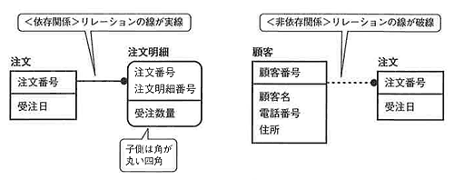
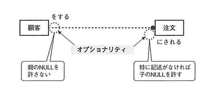
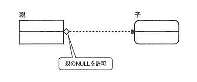

<html><body>

<h2>付録 ER図表記法</h2>

IDEFIXの表記法は、表記から次のことがわかるようになっています。

<ul>
<li>● どちらが親でどちらが子か</li>
<li>● 子のカーディナリティ</li>
<li>● エンティティ間の依存関係、非依存関係</li>
</ul>
<!--/section-->

エンティティ間の依存関係、非依存関係

<!--/.grayBox-->

依存エンティティと独立エンティティ

<!--/.grayBox-->

カーディナリティ

<!--/.grayBox-->

オプショナリティ

<!--/.grayBox-->

親子関係

<!--/.grayBox-->

</body></html>