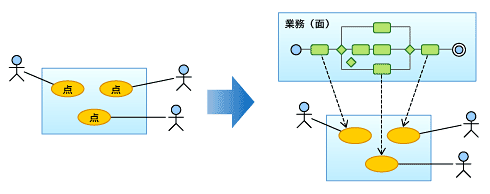
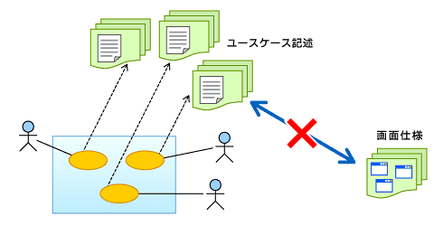
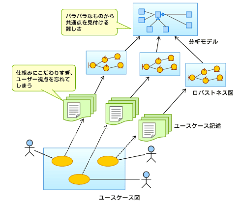

<html><body>
<h2>「ITエンジニアは職人気質を取り戻すべき」</h2>
<!-- cxenseparse_start -->

　「ソフトウェア開発の匠」。このタイトルには、ソフトウェアエンジニアは現代の匠（たくみ）になるべきだという筆者の思いを表現している。現在のソフトウェア開発は、残念ながら多くの人が過去の職人気質（かたぎ）を捨て去り、サラリーマン化しすぎている。ビジネスの価値を高める最適なソフトウェア開発の姿について、自ら描くことをしていない。

<strong>ソフトウェアエンジニアは、 過去の職人気質を取り戻すことが重要なのである。</strong>

　しかし、ただ旧来の職人気質を取り戻すだけでは駄目なのである。ヨーロッパのマイスター（匠）のように尊敬されるためには、<strong>ビジネスを知り、ビジネス価値を高める職種になることが必要である。それが、ITエンジニアの目指すべき匠である。</strong>そのような人材像を「ソフトウェア開発の匠」とし、本連載では、そこに近づくための考え方や解決法を読者にお伝えできればと思う。

　まず<strong>第1巻</strong>（連載第１〜2回）では、現在のソフトウェア開発手法が未熟であることを、さまざまな問題を例に述べる。そして、これらの問題の本質と対処法を説明することにしよう。<strong>第2巻</strong>では、ソフトウェア開発プロセスの未熟さに焦点を当てる。これを、まずは読者の皆さんが理解することが重要である。そして、解決するための“匠の技”を身に付けるべきなのだ。<strong>第3巻</strong>では、ソフトウェア開発を全体的に見たとき、第1〜2巻で挙げた問題がなぜ起こっているのかと、筆者の考える解決策の根本に触れていく。この解決策には、IT業界を変革するパラダイム転換を必要とする内容が含まれる。将来のIT業界をどう形成すべきか、あるいは、未来のIT業界はどうあってほしいのかという観点で読んでいただけるとうれしい。最後に<strong>第4巻</strong>として、開発方法に関するさまざまな問題に対して、どのような意識改革が必要なのか、3つの視点（開発者の視点、IT企業の視点、ユーザー企業の視点）で書いていく。

　本連載に書かれていることは、いままでの技術書籍に書かれていることを否定しているかのように思えるかもしれない。それは正しい。ソフトウェア開発手法は、時代の流れとともに変化している。その変化を肌で感じつつ、普遍性を見いだしながら、自分たちの開発手法を洗練させていくことが重要である。そのためには、既存の開発手法について、常に「なぜ」「なぜ」「なぜ」と問い掛け、最適解を見つけ出すことが必要だ。「なぜ」の習慣を付けるためにも、以下で述べる問題について、じっくりと考えていただきたい。

<h3>第１巻　「現状のソフトウェア開発は間違っていないか？（手法編）」</h3>

　ここでは、ソフトウェア開発手法の問題点を挙げる。この問題は、ソフトウェア開発を真っ当に行っていることが前提となる。というのも、ソフトウェア開発の中には、その場のユーザーの要求どおりにドキュメントレスでソフトウェアを開発する方法が存在する。そのような場合、その開発者（チーム）がいなくなるとメンテナンス不可能となる。そういう開発は、ここでは対象外とし、第2巻（連載第3回）の開発プロセス編で触れることとしたい。

<h4>ユースケースがうまく使えていない</h4>

　まず、大きな問題点として最初に取り上げたいのは、要件定義のフェイズで使われるユースケースについてである。

　ユースケースモデルを使った開発は、読者の多くが経験し、学んでいると思う。ユースケースモデルとは、ご存じのとおり「ユースケース図」と「ユースケース記述」がセットになった、要求定義を行うためのUML記法である。最近では普通に使われているものだ。

　しかし、ソフトウェア開発においてユースケースモデルが、適切かつ有効に使われているかと考えると、かなり疑問がある。

　そこで、ある問題事例を基に、開発者の悩みを表面化し、考察する。以下は、民間における中・大規模システム開発、および政府における大規模システム開発でよく見受けられるユースケースモデルの利用方法だ。

<!-- cxenseparse_start -->
<h4 id="h4_nayami">開発者の悩み</h4>

<h3>その1　「ユースケース図について、ユーザーから『ピンとこない』といわれる」</h3>

　ユースケース図を書いてユーザーに説明しても、「よく分からない」「ピンとこない」といわれてしまう。そのため、ユーザーがシステムをどう使いたいのか整理できないまま開発を進めてしまった。

 

　この問題の本質は、要求を点としてとらえてしまっていることだ。よって、開発者も要求を理解しているとはいい難い状態である。ユーザーの業務は、面（一連の業務の中でシステムを利用する）ととらえるべきである（<strong>図１</strong>）。具体的には、業務フローを可視化することによって実現できる。この問題は、ユースケース図を業務フローとセットで見せることで、緩和される。

<!--CAP-->

<small><strong>図１　業務は面で考えるべき</strong></small>

<!--CAPEND-->

<h3>その2　「ユースケース記述を詳細に書きすぎてメンテナンスができない」</h3>

　ユースケース記述とは、ユースケース図の中の（1つ1つの）ユースケースについて、アクターとシステム双方のやりとりをシナリオ的（イベントフローという）に記述したものである。このユースケース記述を（例外処理や代替処理、あるいはシナリオ記述などまで）細かく書きすぎ、ドキュメント量が膨大になってしまった。書いていることの一貫性が図れなくなり、しまいには管理不能状態に陥った。

　 さらに問題となったのが、画面仕様との乖離（かいり）（<strong>図2</strong>）。ユースケース記述と画面仕様を別々に管理してしまったため、最終的に画面仕様を頼りに開発を進めるはめになった。結果的に、ユースケース記述を何のために書いたのかがまったく分からなくなった。

 

　この問題の本質を理解するには、「なぜ詳細化を図ろうとしているのか」を考えなければならない。ユースケース記述を詳細に書く理由は、要求をシステムの仕様につなげたい意図があるからだ。この典型例として、「ロバストネス分析」がある。ロバストネス分析の問題については後述するが、ユースケース記述を細かく書けば書くほどシステムに対する要求はよく分からなくなることを意識しなければならない。ユーザーも開発者もユースケース記述の細かい論理的矛盾を取り除くことだけに着目し、システムに対する本質的な要求が見えなくなるのである。本来ユースケースとは、システムづくりの観点で記述するものではなく、ユーザーがビジネスを実施するためのシステム利用事例として、簡潔なストーリーを記述するものではないだろうか？ その中で、画面イメージやモックアップなどを有効に活用すべきではないだろうか？ こういう点を考えてみると、本来どうすべきかが見えてくるだろう。

<!--CAP-->

<small><strong>図2　詳細化しすぎるユースケース記述、画面仕様と乖離する</strong></small>

<!--CAPEND-->

<h3>その3　「ロバストネス分析に多大な工数をかけたが成果が出ない」</h3>

　ロバストネス分析から、シーケンス図などを使って動作検証を図り、分析モデルを作り上げる作業までには多くの工数を要した。しかし、その結果作成された分析モデルは設計モデルにつながりにくく、何のためにシーケンス図などを使って検証したのか、作成したエンジニアたちにも分からなかった。

 

　問題の本質は、ロバストネス分析の使い方にある。ロバストネス分析とは、ユースケース記述を基に、B（Boundary）、C（Control）、E（Entity）に分類する手法で、多くのユースケース利用者に使われている。このやり方は、ユースケースから分析モデル（分析レベルのクラス図）につなげていくための、シームレスかつ美しいやり方として教育的にも人気があるようだ。私もシステムに境界を付けるため、画面などをB、制御部分をC、データ部分をEに分離するのはよい方法だと思う。しかし、ユースケース記述から、B、C、Eを導き出し、その中から責務の共通化を図り、分析モデルを完成させるやり方は適切ではない。教育的な手順が開発に向くかというとそうではないのだ。

　このやり方の問題をまとめると、次のページの2点である。 

<!-- cxenseparse_start -->

<strong>（1）ユーザーも開発者も理解しづらい産物を作りかねない</strong>

　ユースケース記述からロバストネス図へつなげると、アクターとシステムの挙動を精密にとらえようとしすぎ、いつの間にか、ユーザーから見たシステムの使われ方をユーザーの視点で説明する観点を忘れてしまう。その結果、ユーザーが理解できないユースケース記述になる。揚句の果てには、システム開発者でさえユースケース（要求）とは程遠い世界にどっぷりと漬かってしまうのである。

<!--CAP-->

<small><strong>図3　ユースケースが要求から仕組みの世界へ変化する</strong></small>

<!--CAPEND-->

<strong>（2）分析モデルを作るまでに多くの工数を要する</strong>

　先にも述べたが、ロバストネス分析は教育的であり、実際の開発には不向きである。なぜなら、ロバストネス活用のゴールは、ビジネスの中で重要な語彙（ごい）をクラス名とした、実装アーキテクチャに依存しない基本構造を分析モデルとして構築することにあるからだ。しかし、分析モデルは、要求開発（注）段階で作成されたビジネスシナリオや業務フローから抽出すれば、容易に作成できるものである。それなのに、多大な時間をかけて、ロバストネス分析で分析モデルを作る意味があるのだろうか？

　また、一度ユースケースに分類した業務概念を、ロバストネス分析でバラバラにし、共通点を見つけながら分析モデルを作り上げるというのは、実は大変難しい作業である。

　もしロバストネス分析を使うとするなら、ToBeビジネスを理解する段階で、概念モデルを作成しておくことが重要である。もちろん、私はそのように教育してきているのであるが、いままでの問題プロジェクトを見ると、概念モデルがなく、ロバストネス分析を介して分析モデルを作成していくやり方がまん延しているようなのだ。

<!--CAP-->

<small><strong>図4　ユースケース記述からロバストネスへつなぐ流れの問題点</strong></small>

<!--CAPEND-->
<!--CAP-->
<small>（注）要求開発：システム開発の前段階でToBeビジネスをデザインしITにつなげていくための考え方で方法論として要求開発アライアンスが提供している。</small>
<!--CAPEND-->
 

　いかがだろうか。ユースケースモデルは使い方を誤ると要件定義の問題だけではなく、設計にも支障がでてしまう。ここでは、解決策のヒントについて少しだけ書いている。読者も、この問題をどう捉え、どうしたら解決できるのか、しっかり考えておいてほしい。さて次回は、分析モデル・設計モデルについて、現状の問題を明らかにする。

</body></html>