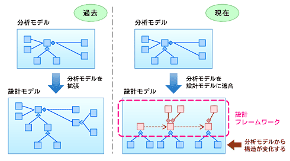
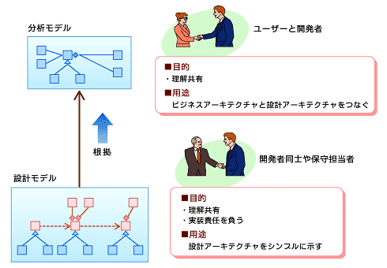

<html><body>
<h2>分析モデルはユーザー視点でシンプルに</h2>
<!-- cxenseparse_start -->

　連載第2回の今回は、現在のソフトウェア開発の問題点（手法編）の続きとして、分析モデル・設計モデルを取り上げる。ここで取り上げる問題の中には、ユースケースモデル作成の流れで発生するものもある。そのために、前回（「<A HREF="../../0811/26/news134.md">『ITエンジニアは職人気質を取り戻すべき』</A>」）の内容も見ながら理解した方がよいだろう。

<h4>分析モデル・設計モデルを有効に生かせていない</h4>

　分析モデル・設計モデルは、両方とも、ビジネスの変化に耐え得るソフトウェアシステムを開発するために作成される。しかし、これもまたユースケースモデル同様、生かされていないことが多い。

　両モデルともソフトウェアシステムの開発ドキュメントの中で何らかの形で埋め込まれる。代表的な分析モデルに、クラス図、シーケンス図、パッケージ図などがある。設計モデルには、これらに加え、状態図、コンポーネント図、配置図などが加えられる。

<h3>開発者の悩みその1　「分析モデルを時間かけて作成したが、まったく生かせなかった」</h3>

　第1回「<A HREF="../../0811/26/news134.md">『ITエンジニアは職人気質を取り戻すべき』</A>」で挙げたロバストネス分析を使って分析モデルを作ってみた。当初、ビジネスドメインを表すモデルの重要性は認識していたはずであった。しかし、結果として、ユーザーも理解できないモデルを作成してしまった（これは前回ロバストネス分析の問題として挙げた）。さらに、分析モデルから設計がうまくつながらず、設計は別で進めてしまった。いま思うと、分析モデルに時間をかけた意味が分からないし、分析モデルの必要性も分からない。

 

　この問題の本質は、分析モデルの有効性がITの進化によって変化してきているのに気が付いていないことだ。いまやオープン系が主流のWebシステム開発においては、設計モデルのベースとなるフレームワークありきで開発を進めるスタイルになっている。

　分析モデルをすでに存在する設計（ベース）モデルに適合することで、設計モデルを作り上げる必要が出てきている。その際、分析モデルは設計の都合で大きく変化することが多い。例えば、分析モデルで抽出されたクラスをサブクラス化すると、分析モデルで表現していた意味的な関連が切れてしまう。つまり、制御がフレームワーク側に移り、スーパークラスの関連によって、サブクラス化されたクラス同士の関連が表現されるのである。あるいは、分析モデルで作成された概念（Entity）は、設計上パフォーマンスを考慮していないこともあるのだ。

　よって、分析モデルの構造と、フレームワークをベースにした設計モデルの構造は、大きく異なる。

　そうなると、分析モデルは何のために作成するのであろうか？ 筆者はこのような状況だからこそ分析モデルが必要になると主張する。それはビジネスアーキテクチャとソフトウェアアーキテクチャをつなぐ懸け橋として重要なのである。

　これに比べて、昔はスクラッチ開発が多く、分析モデルを拡張することで設計モデルにつなげていきやすかった。そのために、分析モデルの動作検証としてシーケンス図を使うことが有効だったのかもしれない。

<!--CAP-->

<small><strong>図1　分析モデルから設計モデルへ移行する（過去と現在）</strong></small>

<!--CAPEND-->

　しかし、いまとなっては、このような箱庭の世界（分析モデル）を動かして何がうれしいのかを考えなければならなくなった。分析モデルは、図1のようにビジネス構造を理解するもの（理解のモデル）としてとらえるべきだ。一方、設計モデルは、設計の構造を理解するためのもの（理解のモデル）に加えて、実装責任を負うモデルとして作らなければならないのだ。

　このように整理していくと、分析モデルを作る際に、実装責任を負うモデルとして作ろうとすることが、ユーザーからは理解不能な産物を作りだしたり、多大なコストがかかかってしまったり、結果的に設計モデルとしては使えないものを作ってしまう、問題の主原因だとお分かりになるだろう。

　分析モデルは、ユーザーの視点で、ビジネス構造を理解するということを大切に、あまり時間をかけずにシンプルに作ることが重要なのである。

<!--CAP-->

<small><strong>図2　分析モデルと設計モデルの違い</strong></small>

<h3>開発者の悩みその2　「設計モデルを時間かけてつくったが、実装段階で大幅に変わってしまった」</h3>

　オブジェクト指向技術を使ってしっかりと設計したつもりでいた。しかし、実際には、実装段階で大幅に設計を変えざるを得ない問題が生じてしまった。いま思えば、設計などせず、実装した方が効率的だったのではないかとさえ思っている。

　さて、これは何がいけなかったのだろうか。このような問題は、未知のドメイン（問題領域）については最初から正しい設計などできるはずがないことを理解していない場合に引き起こる。一度経験しているドメインについては、最初からじっくり設計してもうまくいくだろう。しかし、未経験なドメインについて、最初から正しい設計などできるはずがない<strong>（注）</strong>。よって、アジャイルやTDD（テストドリブンデベロップメント）的な発想が必要となる。つまり最初は動作することを目標に作成し、その後で、リファクタリングを行う方が、最適な設計というゴールに行き着けるのである。

　また、このような問題に陥る場合、設計ドキュメント過多になっていることが多い。その原因の1つに、設計者が設計中に保守ドキュメントを作ろうとすることがある。そもそも設計は、反復しながら洗練していくのだが、保守を考慮し大量のドキュメントを残してしまう。揚句の果てには、開発途中でメンテナンスができず、実装結果と異なる設計書で納品することになりかねない。開発中のドキュメントは開発に必要なものだけにとどめるようにし、保守ドキュメントは、保守に望まれている形態に合わせて作成期間を別途設けるようにするのが現実的なのである。

<!--CAP-->
<small><strong>（注）</strong>これは経験の浅い設計者にも同様のことがいえる。</small>
<!--CAPEND-->
 

<h3>開発者の悩みその3　「ロバストネス分析から設計モデルを作成したが設計的に見ておかしいのではないか？」</h3>

　ユースケースごとにロバストネス分析を行い、その流れでクラスを抽出し、設計につなげたが、ユースケースそれぞれに対し設計を行ってしまった。それによって、後で機能追加およびメンテナンスがほぼ不可能なシステムになってしまった気がする。

　この問題の本質は、すでにお分かりのとおり、ユースケースごとに設計をしていることにある。大規模システムでは、このような開発をしているところを結構見かけたりする。

　そもそもソフトウェアを動かすためのアーキテクチャは、その中で活用する情報の構造（例えばデータベース設計）や、ソフトウェア上で制御を行うための最適な仕組みを設計するものだ。アーキテクチャはシンプルなものから、重たいものまでさまざまだが、アーキテクチャというお皿のうえに、ユースケースとして作成するプログラムを乗せることになるのだ。それなのに、アーキテクチャを考えずに、それぞれにユースケースを実装してしまったら、プログラムの共通部分がバラバラに作成されてしまうのである。

　ロバストネス分析には、このような落とし穴があるのだ。それを回避するために、ユースケース分析の前段階で、ビジネスの分析モデルを確立しておく必要がある。ユースケース記述からの流れでロバストネス分析を使うとしても、ホワイトボードで書く程度の非常にシンプルなものにし、分析モデルをユースケースで叩く（評価する）という観点で使用するのが望ましいのである。

　これで、「現状のソフトウェア開発は間違っていないか？（手法編）」は終わりである。次回からは、第2巻「現状のソフトウェア開発は間違っていないか？（プロセス編）」に入る。プロセス編では、第1巻に引き続き、開発プロジェクトで起こる開発プロセスに関する諸問題について具体的な事例を基に述べることにする。また、その本質的な問題と解決策についても触れていく。

<!-- cmsBodyCtrlBtm -->
</body></html>