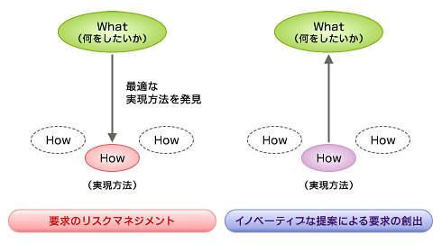
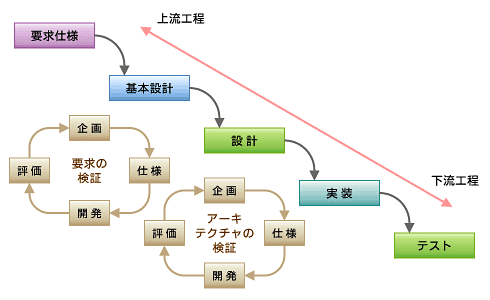

<html><body>
<h2>「現状のソフトウェア開発は間違っていないか？」（プロセス編）</h2>

<!-- cxenseparse_start -->

<strong>萩本</strong>　「皆さんは、ソフトウェアを開発するときに、どのようなプロセスを踏んでいますか？」

<strong>多くの人たち</strong>　（シ〜ン）

<strong>萩本</strong>　「例えば、最初に要件定義をし、基本設計をして、詳細設計に進むとか」

<strong>何人か</strong>　（自信なさげに手を挙げる……）

　これは、講演での筆者の質問に対するお客さまの一般的な反応である。最近では、開発者が開発のプロセスを意識しなくなっている気がする。第2巻では、開発者に開発プロセスを意識させる試みを通じて、匠（たくみ）の技を見つける手掛かりを探してもらう。

<h4>ウォーターフォール開発とは</h4>

　今回は、中規模・大規模開発で使われている開発プロセス「ウォーターフォール開発」を改めて考える。ウォーターフォール開発とは、名前のとおり工程（フェイズ）が滝のように流れる開発手法である。つまり、上流工程で作業をしっかり進め、後戻りしないことを“お約束”としている。しかし、実際にはどんどん後戻りすることを常とする不可解な開発方法である。

　ウォーターフォール開発のイメージを<strong>図1</strong>に示す。ここで示す工程名は、別の名前で呼ばれていたりもする。例えば基本設計や詳細設計が、外部設計、内部設計というふうにだ。名前ではなく、上流工程が終わらない限り下流工程を始めない開発が、ウォーターフォール開発なのである。

　ウォーターフォール開発は、多くの問題を抱える手法だ。しかし、IT業界では、いまだにこのやり方がメジャーなのである。ウォーターフォール開発がメジャーであり続ける限り、IT業界はどんどん無価値化していくと私は考えている。どうしてメジャーであり続けるか、そして、なぜそれがIT業界をダメにするのかといった理由は後で書くことにする。

<!--CAP-->

<small><strong>図1　ウォーターフォール開発</strong></small>

<!--CAPEND-->
<h4>ウォーターフォール開発の失敗</h4>

　ここでは、まずウォーターフォール開発の失敗例をいくつか取り上げ、その中からウォーターフォール開発の問題点を整理していく。

<h3>失敗例その1　「要件定義が終わらない」</h3>

　ユーザーから要求を聞き出し、システム要件に落とし込んでいくのが要件定義だ。要件定義が終わらないかぎり基本設計に移れない。しかし、要件定義がいつになっても終わらない。その理由として、ユーザーからうまく要求を引き出せないことがある。そもそも今回のシステム開発でユーザーが具体的に何をやりたかったか、どんなものをIT化すればよいのかがはっきりしない。3カ月と予定されていた要件定義工程はすでに１カ月オーバーしてしまっている、しかもユーザーが満足するような要件定義書がいまだにできていない。

 

<h3>失敗例その2　「設計工程の無駄」</h3>

　オープン系の開発でウォーターフォール開発を行っている。設計工程は、基本設計、詳細設計に分かれている。基本設計では、要件定義に基づき、主に画面などユーザーがシステムを利用するうえで意識する部分を設計し、詳細設計では、それをプログラムにつなげるための詳細なフローを記述することになった。

　ところが、実装（プログラム）工程に移った段階で、基本設計や詳細設計で書かれたドキュメントが使い物にならないという事実が判明した。結果的に、それらのドキュメントはほとんど使われず、要件定義を基に再設計を行った。このプロジェクトのリーダーであるAさんは次のようにぼやく。

　「またいつものパターンだね。上流工程屋さんの成果物はほとんど使えないよ」

 

<h3>失敗例その3　「使われないシステム」</h3>

　徹夜を繰り返し、ようやくテスト工程を終え、いよいよユーザーの受け入れ検査が始まる。実際にユーザーに使ってもらうこの段階で、ユーザーから厳しい意見がどんどん出てくる。プロジェクトリーダーのAさんは、まあいつものことと思いつつ、要求仕様どおりという一点張りで逃げつつ、ある部分はユーザーからの要求を聞き入れるという方法で逃げ切ることにした。

　しかしAさんにふと次のような疑問がよぎる。

<ul>
<li>「このシステム、本当に使ってもらえるのだろうか？」</li>
<li>「お客のお荷物になるものを苦労して作り出しているのでは？」</li>
<li>「自分たちの仕事は価値をもたらしていないのでは？」</li>
</ul>
 

<h4>ウォーターフォール開発の歴史</h4>

　ウォーターフォール開発プロセスは、開発プロセスの基礎知識と考えるとよい。ウォーターフォール開発は、旧来のCOBOL/PL?などを使ったメインフレーム開発で主流の開発プロセスだった。1980年代から始まり、現在でも使われている。昔は、それぞれの企業が独自の開発手法（ウォーターフォール開発がベース）を用意していた。当時の開発者は、その開発手法をしっかり勉強して開発を行うというのが常識だったのだ。

　このころの開発者は、設計する前にしっかりと要件定義をしていたし、実装する前にきちんと設計をしていた。つまり「要件定義とは何か」「設計とは何か」ということを学んでいた。

　このようなウォーターフォールの開発スタイルは、メインフレーム開発では比較的うまくいっていたように思うし、筆者もメインフレームでのCOBOL言語を使った開発では、しっかりと要件定義を行い設計すれば、ほとんど実装ができるという感覚を持っていた。

<!-- cxenseparse_start -->
<h4>ウォーターフォール開発がうまくいかない理由</h4>

　1990年代、ウォーターフォール開発は、オープン系の開発においても採用されるようになった。筆者もC言語を使っていたころ、ウォーターフォール型のプロセスでプログラム構築をしていた。しかし、筆者は、以前のウォーターフォール開発のようにうまくいかなくなったことを感覚的に理解していた。

　なぜなら、ウォーターフォール開発は、オープン系の開発では、あまりにも楽観的なプロセスのように思えてしまい、そのままだと怖くて使えないと感じたからだ。だから筆者は、ウォーターフォールを改良したものを使っていた。

　では、どうしてオープン系開発ではウォーターフォール開発はうまくいかないのか？　ウォーターフォール開発は、滝のように上流から下流へ手戻りなく開発を進めることを前提にするため、比較的マネジメントしやすいという特徴がある。しかし、これから説明するオープン系特有のリスクに対するリスクマネジメントが欠落しているのである。では、そのリスクとはどのようなものなのか説明しよう。

<strong>●要求が高度であいまい</strong>

　旧来のメインフレーム開発は、データをためて、集計・演算などを行い、画面・帳票に出力するようなものがほとんどであった。そのような制約の中からシステム要求を抽出していたので、要求の実現イメージはある程度明確にできていた。

　しかし、現在のオープン系の場合には、要求自体がどんどん複雑化し、とらえづらくなっている。例えば、部門連携・企業連携などでは、既存の業務をIT化するというだけではなく、業務をIT化することで付加価値を創出するという課題を負うことが多くなっている。要求提案当初、このような要求については非常にあいまいな場合が多い。

　なぜなら、業務をIT化した際にどの程度ビジネス的な価値が高まるかは最初からは分からないし、どのようにIT化すればビジネスの付加価値がどの程度高まるのかが分からない。つまり、ビジネスとITが融合された中に、本質的なシステムの要求が存在している。

　ここで問題となるリスクは、ウォーターフォール開発では要求の実現を検証したり、チューニング<strong>（注1）</strong>したりする方法がないということである。

<!--CAP-->
<small><strong>（注1）</strong>筆者は、現代においては、この実現のチューニングこそが、要求の価値を高めているという事実を見過ごしてはならないと考えている。</small>
<!--CAPEND-->
 

<strong>●さまざまなテクノロジを組み合わせて開発を行う</strong>

　オープン系の開発では、開発言語、ソフトウェア部品、開発環境などの選択肢が非常に多い。これらのデファクトスタンダードになっているさまざまなテクノロジを組み合わせて開発を行っていく。

　このような環境では、システムに対する要求の制約を最小限に留めることができ、ビジネスの変化や高度なビジネス要求に迅速に応えることができる。一見すばらしい環境のようだ。

　しかしデメリットもある。さまざまなテクノロジを組み合わせて開発した結果、ビジネス要求（機能的要求、パフォーマンスなどの非機能的要求）を実現できるかどうかは、やってみないと分からないことが多い。しかも、テクノロジは数カ月ごとに進歩している。安定期に入るような気配はまだない。

　だからオープン系開発においては、作ってみないと分からないということが現在も続いている。よって、技術的リスクを早期にヘッジ（回避、低減、対応）するためには、アーキテクチャを早期に検証する必要がある。しかし、ウォーターフォール開発では、アーキテクチャを早期に検証する方法がないのだ。これもリスクマネジメントの欠落といえよう。

<h4 id="h4_lookatwaterfallfrominobesyon">イノベーションから見たウォーターフォール開発</h4>

　イノベーティブな開発、つまり新しいアイデアを生かしてビジネスの価値を高めようとする開発は、顧客にとってもITエンジニアにとっても大切なことだ。

　「そんなたいそうな開発なんてやったことがない」と考える人も多いだろうが、実はイノベーティブを意識するのはITエンジニアとして常識だ。

　ビジネス価値を高めるための業務の在り方と、そこに必要とされるITの姿、そしてビジネスの継続性を保つためのメンテナンス可能なアーキテクチャ、これらの姿を想像するには、従来の決まりきった業務・開発パターンを打ち破り、新しい姿を業務レベルで考える力が必要である。

　このような手段を実践することは、ITの価値、要求の価値を高めるものとなる。しかし、要求のリスクで挙げたように、ウォーターフォール開発には、イノベーティブな開発ができないという致命傷がある。

　ビジネスで生きるITの姿は、次の2点によって保証される（<strong>図2</strong>）。

　1つ目は、何をしたいかというユーザーのWhatを、実現方法（How）と組み合わせてできるだけ早く検証することである。

　2つ目は、Howのアイデアによって、何をしたいかというユーザーのWhatを作り出すということである。

　前者は、Howの手探り（要求のリスクマネジメント）、後者は、Howからの突き上げ（イノベーティブな提案による要求の創出）によって要求が作り上げられている。これらはウォーターフォール開発ではできない。

<!--CAP-->

<small><strong>図2　要求のリスクマネジメントとイノベーション</strong></small>

<!-- cxenseparse_start -->
<h4>なぜウォーターフォール開発は捨てられないのか</h4>

　上記に挙げたような欠陥があるウォーターフォール開発であるが、捨てられないのには、次のようなわけ（仕組み？）がある。

<strong>●ウォーターフォール開発には裏プロセスが存在する</strong>

　オープン系の開発でウォーターフォール開発をし、それなりに成果を出しているように見えるプロジェクトには、いままで挙げたようなリスクをヘッジするための裏プロセスが存在する。

　その裏プロセスを表プロセス化すると、それはもはやウォーターフォール開発ではない。筆者の感覚でいうと、反復プロセスとも違う。一般的な裏プロセスを含むウォーターフォール開発は、並行開発プロセスのようなものに近い。

　つまり、ユーザーにはウォーターフォール開発でやっていると見せて、裏では先に挙げた要求の検証とアーキテクチャの検証のためのプロトタイプ開発などを並行で走らせているわけである（<strong>図3</strong>）。なぜ裏プロセスかというと、あえてやり方が公表されていない、つまり、プロセスが「見える化」されていないからである。

　オープン系の開発でウォーターフォール開発を行い、それなりに成果を出しているように見えるプロジェクトのマネージャあるいはリーダーは、この裏プロセスを持っていると考えてよい<strong>（注2）</strong>。ただ、それをプロセスとして定義していなかったり、言葉にしていえなかったりする。従って、筆者は裏プロセスと呼ぶ。裏プロセスを持たないウォーターフォールによるシステム開発は、非常にリスクの高いプロジェクトといえる。

　ただ、裏プロセスを持つ開発がよいものかというと、「それなりに成果を出しているように見える」と書いたように、表面上はうまくいっているように見えても、実際は多大なコストを使って開発しており、それが明らかにされていない場合も多い。なぜなら、裏プロセスを表に出し「見える化」しない限り、プロセスの改善は進まないからである。

<!--CAP-->
<small><strong>（注2）</strong>筆者もウォーターフォール開発の裏プロセスを表プロセス化した（開発プロセスを含む）方法論を1996〜1998年に作成したことがある。その名は<A HREF="http://www.mamezou.net/process/drop/index.html" target="_blank">Drop</A>。オブジェクト指向開発に対応するために、プロトタイプと並行プロセスを組み合わせたものとした。</small>
<!--CAPEND-->
 
<!--CAP-->

<small><strong>図3　裏プロセス付き、ウォーターフォール開発</strong></small>

<!--CAPEND-->

<strong>●ビジネスがそれで成立していた</strong>

　ウォーターフォール開発は、マネジメント的にもビジネス的にも楽なのである。計画的に人を積み、要件定義を（価値がなくとも）しっかりやり、それに基づき（必要なくとも）開発要員をどっぷり投入し、誰にも疑問を抱かせず、最初に定義された要求の実現だけを滝の流れに逆らわず行うだけで開発を終えられる。これほど、楽観的なマネジメント手法はない。

　実はこの方法は、ユーザー企業からも歓迎される傾向にある。なぜなら、契約面から考えても、ウォーターフォール開発は、最初に決まっていないリスクを排除できるように見えてしまうからだ。ユーザー企業とITベンダ双方ともリスクを取りたくないという逃げの姿勢の中で成立している開発プロセスなのであるが、実際には、そのリスクが高まっている事実に気が付かないでいるのだろう。あるいは、気が付いていてもこのビジネス形態を壊すのが怖いのかもしれない。

　ウォーターフォール開発がうまくいかないことを見える化できていない状況の中、いまもメジャーな開発プロセスとして残り続けている。IT企業の仕事術は、果たしてこれでよいのだろうか。

　ユーザー企業からは、「提案しないIT企業」というレッテルを貼られている。3K（「きつい」「帰れない」「給料が安い」）という屈辱的な言葉で語られるようになったITの仕事。これらのことを、IT業界の仕事術と絡めて真剣に考えなければならない時期がすでにきている。

　IT企業の仕事術が変わらなければならないのは明白だ。その変革すべき主テーマとしてウォーターフォール開発からの脱却がある。すでに遅いかもしれないが、IT企業がこのことに気が付き、ウォーターフォール開発に代わるべき開発の在り方を見つけ出さなければならない。

<strong>●まだまだ未熟な、反復開発、アジャイル開発</strong>

　IT変革を行うべきところ、残念ながら裏プロセス付きウォーターフォール開発に代わるべきプロセスが存在しないのも事実。ウォーターフォール開発に代わると思われている反復開発やアジャイル開発も、未熟である。

　さて、次回は、反復開発やアジャイル開発にフォーカスを当て、それらの有効性と問題点を考えてみよう。

<!-- cmsBodyCtrlBtm -->
</body></html>