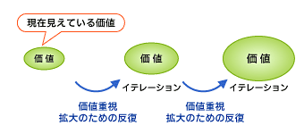
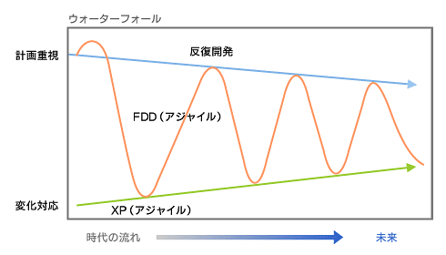
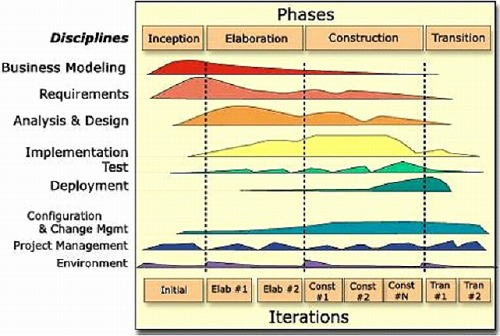
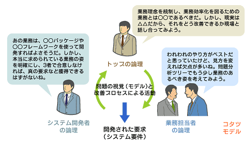

<html><body>
<h2>アジャイル開発と反復開発の落とし穴</h2>
<!-- cxenseparse_start -->

　前回「<A HREF="../../0901/28/news151.md">『現状のソフトウェア開発は間違っていないか？』（プロセス編）</A>」では、ウォーターフォール開発の問題点と改善方法を示した。さて、前回お話ししたようにウォーターフォール開発は本来、いくらプロセス改善をしたとしてもイノベーティブな開発がしにくい。ならば、反復開発<strong>（*1）</strong>やアジャイル開発に変えてしまおう、といいたいところ。しかし、導入するのであれば、それぞれのプロセスの特徴と弱点をしっかりと知っておくことが必要である。

　ウォーターフォール開発からの乗り換えを考えている方々だけではなく、いまアジャイル開発や反復開発を実践している方たちにもぜひ一読してほしい。

<!--CAP-->
<small><strong>（*1）</strong>反復開発とは例えば<strong>RUP（Rational Unified Process）</strong>や<strong>UP（Unified Process）</strong>のこと。</small>
<!--CAPEND-->
 
<h4>反復開発とアジャイル開発の違い</h4>

　反復開発とアジャイル開発は、繰り返し型開発という意味では同じように思われる。しかし、その考え方は大きく異なる。

　簡単にいうと、反復開発は管理重視型開発、アジャイル開発は価値重視型開発といえよう。

　ここでもう少し突っ込んで考えてみよう。管理重視とは、マネージャがしっかりと計画して、計画どおりに実施しているか進ちょくをトレースし、評価する仕組みを導入することである。そのために反復開発は官僚的になりがちで、それが開発者に嫌がられる傾向にある。このことは反復開発の大きな問題となる。

　だが、もっと深い問題がある。反復開発は、最初にソフトウェア化する意義をしっかりと議論する。議論を通じてビジネスモデリングを行い、ビジネス課題の理解を促進する。このような段階が「方向付け」と呼ばれ、必要に応じて「分析・設計・実装・テスト」を繰り返すことになる。この繰り返しには、プロトタイプやビジネス検証という意味も含まれている。

　このようにかっちりビジネス課題を理解したうえで、プロジェクト計画（反復計画）を策定していくため、反復開発は「計画重視型」さらには「価値固定型」といえる。ビジネスにおけるシステム価値の全体像を明確にし、その全体価値を守るように管理しながら、部分集合をユースケースドリブン（ユースケースを束ねるごとに開発をプランする）で開発するのだ（<strong>図1</strong>）。

<!--CAP-->

<small><strong>図1　反復開発は、「計画重視型」「価値固定型」開発</strong></small>

<!--CAPEND-->

　一方、アジャイル開発は、同じ繰り返し型開発であっても、反復開発とは異なり価値重視の印象がある。計画よりもむしろ開発するソフトウェアやソフトウェアが実現するビジネスの価値を重視している気がする。なぜそのように感じるかというと、反復開発よりもイテレーション（繰り返し）の期間が極端に短く（週単位）、計画よりも変化対応を大切にしており、さらに開発プロセス全体についても最小限の説明にとどめているからである<strong>（*2）</strong>。

<!--CAP-->
<small><strong>（*2）</strong>これらは、「<A HREF="http://www.t-doi.org/agile/index.html" target="_blank">アジャイルソフトウェア開発宣言</A>」（2001年2月に米国ユタ州にて採択）の「プロセス・ツールよりも個人と相互作用」「計画に従うよりも変化に対応」から、「どちらかというと価値を大切にすべき」と読み取れるのである。</small>
<!--CAPEND-->
 

　なぜアジャイル開発が計画重視より価値重視と考えるのか説明しよう。プロジェクト当初は、ビジネスの価値を証明するのが難しく、最初に立てた計画どおりにプロジェクトを進めても、ビジネス価値を向上させるのがなかなかできない。なぜなら、ビジネスの価値は計画で決められた「何をすべきか」よりも、実現方法の正しい選択・組み合わせによって、ビジネス価値が保証されるという本質があるからである。また、ビジネス価値を大きく高めるイノベーティブな要求は、実現方法からの突き上げによってハッキリすることが多いのだ。

　このことを、前回の「<A HREF="../../0901/28/news151.md#h4_lookatwaterfallfrominobesyon">イノベーションから見たウォーターフォール開発</A>」で使用した図に、文章を追加して説明しよう（<strong>図2</strong>）。

<!--CAP-->

<small><strong>図2　アジャイル開発の価値主導の本質 </strong></small>

<!--CAPEND-->

　<strong>図2</strong>は、ウォーターフォール開発の最大の弱点として、2つの試行錯誤「Howの手探り」「Howからの突き上げ」ができないことを示している。

　そういう意味では反復開発も、計画主導のお化けであるウォーターフォール開発の親せきといってもよいかもしれない。しかし、反復を入れることでこの問題が緩和されているのは間違いない。

　アジャイル開発はまさに、「Howの手探りによる価値の保証」「Howからの突き上げによる価値の向上」という2つの試行錯誤を実現するために、短期間でイテレーションしていくのである。さらに、ビジネスの価値は状況によって変化するという問題についても敏感である。短期間でイテレーションさせながら「計画に従うよりも変化に対応」という宣言によって、計画に対する開発者の意識に柔軟性をもたらそうとしている。つまり、イテレーションを行いながら最適なプラン（やるべきこと）を探し出す、これぞまさに「Howの手探り」なのである（<strong>図3</strong>）。筆者は、この点にアジャイル開発の可能性を強く感じる。

<!--CAP-->

<small><strong>図3　アジャイル開発は、「価値重視型」「価値拡大型」開発</strong></small>

<!--CAPEND-->
<h4>なぜアジャイル開発は大規模開発から敬遠されるのか？</h4>

　残念ながら、このようなアジャイル開発の考えは、管理志向の強いマネージャやプロジェクトでは敬遠される。また、かっちりと契約を交わすようなビジネスからも敬遠されてしまう。このことは、アジャイル開発を積極的に大規模開発で使ってみようというチャレンジがなされない原因の1つと筆者は考えている。

　大規模システムでは、ビジネス価値が創出できないことよりも、計画が不明確な契約であるというリスクに対して敏感に反応するようである。企業経営的に安全策を取る傾向にあるために、本来あるべきチャレンジやイノベーションがおろそかにされるのである。そのため、実際には中身の薄い計画であるかもしれないというリスクや、ビジネスの価値が上げられないシステムを開発してしまうというリスク、IT不良財産を抱え込むというリスクなどを見逃してしまうのである。

<!-- cxenseparse_start -->
<h4>アジャイル開発は、反復開発のアンチテーゼ？</h4>

　アジャイル開発は、反復開発のアンチテーゼという見方もあるだろう。せっかくウォーターフォール開発という官僚的で、楽観的なプロセスから脱出する時代が到来すると思ったら、また反復開発という親せきがやってきたからだ。

　ITエンジニアとしてはもっとイノベーティブな開発にチャレンジしたいし、本当にユーザーが望んでいる要求を価値重視で開発したいという反発の思いから、アジャイル開発がブームになったのである。

　このようにアンチテーゼとしてとらえると、アジャイル開発コミュニティにおいては極端に特徴を強調しすぎる傾向にあり、アジャイル開発・反復開発それぞれの考えは両極端である。しかし、それらの考えは時代とともにバランスが良くなってきている（<strong>図4</strong>）。例えば、アジャイル開発はXP（Extreme Programming）の時代より、計画性や見積もりが重視されたり、設計やモデル、そしてプロセスを重視する傾向になってきている。また、FDD（Feature Driven Development）といったアジャイル開発プロセスなどが、どちらかというと反復開発に近い考えであるにもかかわらずアジャイル開発の一種とされているのも興味深い。

<!--CAP-->

<small><strong>図4　アジャイルと反復開発の発展</strong></small>

<!--CAPEND-->

　一方、反復開発は、アジャイル開発の思想を取り入れることになる。実際にRUPをアジャイルで適用するような開発手法が出てきている。

　このような状況で、われわれは両者をどうとらえるべきなのか。端的には、アジャイル開発や反復開発といった表面的なもの（名前）にとらわれず、本来あるべき開発プロセスを自ら考えていくべきだと思う。ソフトウェアを開発するプロセスはまだまだ未熟なのだ。

　さて次は、反復開発とアジャイル開発の弱点に迫る。弱点を知ることで、それらの弱点をカバーしたプロセスを確立してほしい。

<h4>反復開発の落とし穴</h4>

<strong>●1．要求が収束しない</strong>

　反復開発であるRUPでは、要求定義が下位フェイズまで続いている。<strong>図5</strong>でいうと、要求定義（Requirements）が、Inception（方向付け）から始まり、Elaboration（推敲）、Construction（作成）、Transition（移行）まで続いている。曲線で描かれた面は作業量を示している。方向付けフェイズと推敲フェイズに多くの要求が定義され、移行フェイズまで続くということである。

　これは、ビジネスの変化に対応するための対処としては自然であるが、実際に日本的なシステム開発で使う場合、要求定義が収束しないためにプロジェクトが破たんする恐れがある。そういう観点で見ると、この絵には矛盾がある。本来ならば、ビジネスの変化から要求が永遠に出続け、その要求に対して永遠に開発を進めるような並行ラインのプロセスの絵にしなければならない。

　しかし、この絵ではライフサイクルが1プロジェクトに収まっている。つまりいずれはプロジェクトが終わり、納品され、実際に使われる環境に移行しなければならない。だとすれば、推敲フェイズの第1反復辺りで要求をコミットさせる必要がある。それ以降の要求は調整・変更程度にとどめない限り、プロジェクトは破たんする。

<!--CAP-->

<small><strong>図5　RUPの概要。出典：『The Rational Unified Process』（Philippe Kruchten著、2000、Addison Wesley）</strong></small>

<!--CAPEND-->

<strong>●2．ビジネスモデリングの位置付けが問題となる</strong>

　<strong>図5</strong>の中に「Business Modeling」があるが、少なくともシステム開発プロジェクトのスコープでビジネスモデリングを行う価値はあまりない。逆に弊害の方が多いかもしれない。中途半端が一番よくないのだ。

　ビジネスモデリングを行うプロセスは、プロジェクトライフサイクルや範囲が、システム開発プロセスとは異なる。よって、本来、RUPの方向付けフェイズは、システム開発プロジェクトよりも大きなスコープであるビジネス開発プロセスで行うべきだ。つまりは、筆者の推進している要求開発の視点で行うべきなのである。

　このビジネス開発プロセスでは、そもそもシステム開発プロジェクトの単位を決めたり、必要性を判断したりするのである。それをシステム開発プロジェクトが始まってからビジネスモデリングということで行っても意味がない。

　しかしながらRUPプロセス提唱者は開発プロセスにビジネスモデリングを入れてしまった。この気持ちは分からなくもないが、非常に安易な決断だったと思われる。

　またビジネスモデリングという言葉自体、現在のビジネスをモデリングするといった誤解を招きかねないものである。実際は、システムの対象となるビジネスの姿をモデリングするのであるが、そこには通常、現状モデル（AsIs）、将来モデル（ToBe）といったモデルをどのようにプロセスとして扱うのか明確な指針が必要となるはずだ。

　取って付けた感のあるビジネスモデリングによって、多くの利用者に誤解を生み、視野の狭いビジネスモデルによって投資コストの割には成果が出せないでいるのではないかと心配になる。

<strong>●3．推敲フェイズにおけるミッションが多すぎて動きが鈍くなる</strong>

　推敲フェイズは、ユースケースドリブンと、アーキテクチャセントリック（アーキテクチャ重視）で開発を計画するという、相反する2つの観点で反復計画を立てることになる。この際、リスクの高そうなアーキテクチャとユースケースを、できるだけ早い段階で開発の対象とするだろう。このことから、推敲フェイズの最初の反復は、主要なユースケースやリスクの高いユースケースを動かすことと同時に、アーキテクチャの全体像を確立するというミッションを抱えることになり、慣れていないと結構大変なことになる。不慣れなアーキテクチャや新規アーキテクチャで開発が必要な場合は、前段階、例えば方向付けフェイズの段階で検証・試作が必要とされる。

<strong>●4．管理志向が強すぎる（モチベーションダウン）</strong>

　反復開発は管理志向が非常に強いために、開発者のモチベーションを著しく低下させてしまうことがある。この対策はアジャイル開発を大いに見習うべきである。

<strong>●5．モデリングが非効率</strong>

　これは、第1回「<A HREF="../../0811/26/news134.md">『ITエンジニアは職人気質を取り戻すべき』</A>」で取り上げた、ユースケースドリブンによるユースケースからロバストネス分析、そして概念モデル、設計モデルと流れていく方法の冗長性のことをいっている。RUPを行う場合には、このようなやり方を習うのであるが、効果を考え、もう少し洗練させていく必要性がある。

<!-- cxenseparse_start -->
<h4>アジャイル開発の落とし穴</h4>

<strong>●1．要求の根拠が分からない</strong>

　アジャイル開発のプラクティスにはオンサイト顧客とあるが、オンサイトで顧客を置いたとしても、その人が企業のミッションに基づく正しい要求を出せるとは限らない。

　筆者の推進する要求開発では、この問題を解決するために、トップ（オーナー）、IT担当、業務担当と、ロール（役割）を持つ人それぞれが参加する場を「コタツモデル」というメタファで表し、その場の中でビジネス戦略的視点（トップ）、業務視点（業務担当）、IT活用の視点（IT担当）によって要求を開発（開拓）する必要性を唱えている（<strong>図6</strong>）。

　要求はあるものではなく、開発するものである。コタツモデルで要求を開発し、少なくとも現在においてはこの要求が正しいというものをビジネスの視点で合意してこそ要求の根拠が確立される。

　アジャイル開発にもこのような取り組みが必要とされるのではないか？

<!--CAP-->

<small><strong>図6　コタツモデルは3つの知識ロールを使って要求を開発する</strong></small>

<!--CAPEND-->

<strong>●2．ストーリーはどうやって導き出すのか？</strong>

　これも1と同じことであるが、ストーリーの根拠がオンサイト顧客という発想では問題が起こる。オンサイト顧客に振り回されることになったり、オンサイト顧客とは異なる意見を持つ顧客が現れたりしたときに悲惨なことになるだろう。業務をしっかりと把握するために（ユーザー企業が）“見える化”し、最終的にはToBe業務として覚悟するための場（チーム）がユーザー企業の中に必要とされる。

<strong>● 3．ビジネスの道に迷う</strong>

　「要求の根拠が分からない」「ストーリーはどうやって導き出すのか」という問題は、結局のところビジネスの道に迷うことにつながる。アジャイル開発のプロジェクトは「木を見て森を見ない」傾向が出てくるだろう。これを解決しない限り、アジャイル開発は局所的なビジネスの価値はもたらせても、ビジネス全体としての価値をもたらすことはできない。ビジネス全体から狙いを定めてアジャイル開発を行う方法が必要である。

<strong>●4．場当たり的な開発になっていないか</strong>

　場当たり的な開発とは、ここまで話してきたように、計画性の欠如からくるものである。システムの成長性をビジネスの視点で地図として描くような計画性が望まれる。本来アジャイルとはビジネスアジャイルのことであるとわたしは考えている。ビジネスの視点でシステムの戦略および成長性を含めて地図として表しておき（仮説的に骨組みを作成）、その肉となるビジネス、システムの部分を切り出してアジャイルに回すべきではないか。

<strong>●5．モチベーションは高まるが、エンジニアリングは？</strong>

　アジャイル開発はモチベーションアップの天才である。だが、こうした設計やプロセスといったエンジニアリングを軽視している人たちが多いようにも思える。筆者から見たアジャイル開発とは、設計やプロセスなどのエンジニアリングの基礎知識を常識として持っている人が、それらエンジニアリングを最適な状態でシステム開発に適用し、プロジェクトを通して人間の心をもマネジメントしながら進めていく開発プロセスである。また、将来アジャイル開発は、このアプローチの仕方をビジネス開発という広い視点で適用すべきだと考える。よって、アジャイル開発において、設計やプロセスを捨てるような非常識なことがあってはならない。

　さて、今回はここまでとしよう。このような両者の弱点を知り、ぜひ今後の開発に生かしてほしい。

　ところで最近、デベロッパーサミットで「プロセスの心」という講演を行った。その中で、この連載に書いているようなことをお話ししたのであるが、途中からエンジンが掛かりっぱなしで、オーバーヒートするかのごとく熱く語ってしまった。

　それだけ思い入れの強いプロセスという概念。皆さんにもこの原稿から、その思いが伝われば幸いである。

　次回は、いよいよ第3巻（最終巻）「ソフトウェア開発の革命」。第1〜2巻で挙げた諸問題をどう解決するか、筆者なりの考えを述べる。 

</body></html>