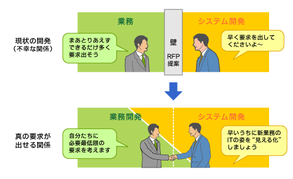
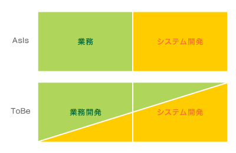
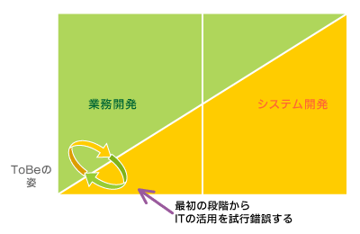
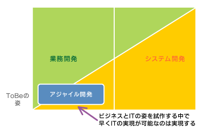
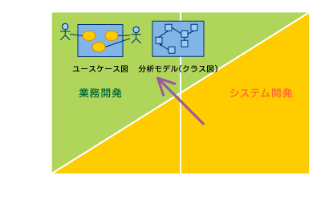

<html><body>
<h2>ソフトウェア開発の革命 (1/3)</h2>

<!-- cxenseparse_start -->

　前回（第4回 <A HREF="../../0903/11/news114.md">アジャイル開発と反復開発の落とし穴</A>）は、ウォーターフォール開発に代わるべく登場した、反復開発<strong>（*1）</strong>やアジャイル開発の問題点、課題、そして落とし穴についてお話しした。最終回は、ここまで説明してきた問題について、IT企業やITエンジニアたちがどう立ち向かうべきなのか、自分なりの考えを述べることとする。

<!--CAP-->
<small><strong>（*1）</strong>反復開発とは例えばRUP（Rational Unified Process）やUP（Unified Process）のこと。</small>
<!--CAPEND-->
 
<h4>ユーザー企業とIT企業の不幸な関係</h4>

　ユーザー企業の求める真の要求は、業務要求がその根拠となる。業務をどのようにデザインするかでシステム要求が決まり、また、システムをどのように活用するかによって、業務に新しいイノベーションを起こせる。業務とシステムの有機的な結びつきが企業の業績に大きな影響を及ぼすのである。しかし、現状は、業務とシステムが分断されたままである。

　ユーザー企業とIT企業の契約の仕方を観察すれば、業務とシステムの不幸な分断状況を俯瞰できる。

　通常、ユーザー企業はIT企業にシステムに関する（開発）提案を求める。IT企業は提案を行い、その提案がユーザー企業に採用されれば、短い期間でユーザー企業からヒアリングを行い、システム要件を固め、ユーザー企業の合意を得て、開発作業に着手する。実は、このステップに多くの問題がある。

　まず、要件定義段階で獲得できる要求は、要求を点でとらえることが多い<strong>（*2）</strong>。この場合、要求の根拠が業務にあるはずなのに、業務が見えないままシステム化してしまう。

<!--CAP-->
<small><strong>（*2）</strong>点としてとらえた要求とは、ユースケースが発端となるような要求のこと。一方、面としてとらえた要求とは、業務フローなどを「見える化」し、その中でITとして必要とされるユースケースが紐付いているもののことである。<A HREF="../../0811/26/news134.md#h4_nayami">連載第1回</A>で説明している。</small>
<!--CAPEND-->
 

　仮に、要求を面で捉えていたとしても、その業務はAsIs（現状）であることが多く、改善すべき点が数多く残ったままシステム化されてしまうことになる。

　改善しようにもIT企業はユーザー企業の業務に口出しをすることができず、また、改善提案をする能力もない。なぜなら、いままで“システム開発の牢屋の中から要求を待ちわびる日々を送っていた”からだ。さらに根深い事情として、そもそもユーザー企業の業務に口出しをして、業務改善・効率化を図り、IT化につなげること自体にIT企業がメリットを感じていないことが多い。業務改善を加えない方が、システム規模の増大につながる可能性が高く、結果的にシステム開発費を多く獲得できるからである。

　しかし、いまこそこの問題をIT企業自身が改善していくべきなのだ。

　業務改善提案が盛り込まれていないシステム開発案件は、余分な要求の山のために肥大化し、その結果、IT企業にとっては、手に負えないシステム開発プロジェクトが増大することになる。このような状況では、多くのプロジェクトは失敗に終わる。仮に“成功”したとしても、開発期間が予想以上に長期化していることが多く、開発が終わった段階で当該システムの存在価値がほとんどなくなっている、ということも少なくない。

　これらのことが、IT企業の「企業力」や「技術力」をどれだけ低下させているか。このようなビジネスの仕方は、市場のIT企業への信頼感を失墜させる。IT投資に疑いの目が向けられ、ビジネスチャンスも減少するだろう。

<!--CAP-->

<small><strong>図1　ユーザー企業とIT企業の関係を改善する</strong></small>

<!--CAPEND-->

<!-- cxenseparse_start -->
<h4>ユーザーと同じ立場に立って開発プロジェクトを考えるべき</h4>

　これからのIT企業は、ユーザーと同じ立場、つまりユーザーの業務開発の目線でシステム開発を提案すべきなのだ。そのためには、ユーザー企業の中に入り、ユーザー業務をユーザーと一緒にデザインしながら、その延長でシステム開発を行うことが必要とされている。

　この考えを表すと<strong>図2</strong>のようになる。現状（AsIs）では、業務とシステムは切り離された状態にある。その結果、ユーザーと開発者間の知識の共有がほとんどなされないままシステム要求を無理に決めていくことになる。これが無意味な要求を出してしまう原因なのである。

<!--CAP-->

<small><strong>図2　ビジネスとITのあるべき姿（AsIsからToBeへ）</strong></small>

<!--CAPEND-->

　この姿を図中のToBeに変えることが必要だ。システム開発が存在するということは、大なり小なり業務開発が存在すると思う必要がある。業務開発の末端にシステム開発が存在している。図中のToBeに変化すると、ユーザーと開発者間の知識の共有がやりやすくなり、双方で本当に必要な要求とは何かをビジネスの視点で考え、提案することができるようになる。また、双方で業務開発プロジェクト（システム開発を含む）を成功させるために、プロジェクトのリスクを減らそうと工夫する。

　このような考え方を持つ方法論としては、筆者も体系化の推進を目指す要求開発<strong>（*3）</strong>がある。

<!--CAP-->
<small><strong>（*3）</strong>要求開発とは、ビジネスを「見える化」し、ITにつなげる方法論である。 ・<A HREF="http://www.openthology.org/" target="_blank">要求開発アライアンス</A> ・<A HREF="http://www.ricoh-soft.co.jp/tech/openthology/" target="_blank">要求開発超入門</A></small>
<!--CAPEND-->
 
<h4>業務開発の段階でシステムの姿を「見える化」せよ</h4>

　業務開発を実施する際に最も困難なことは、ユーザー企業に将来の業務を「見える化」する覚悟を持ってもらうことである。業務開発の初期段階で、できるだけ正確なToBe業務の姿と、ToBeシステムの姿を「見える化」できるようになれば、ビジネス的に見て高付加価値な作業となる。IT企業はこのことに挑戦すべきであり、IT技術もこれが可能となるように発展すべきだ。

　業務開発段階で、正確なToBe業務を業務フローなどで表現できるようにする。そして、ToBeシステムについては、本番に近いプロトタイプなどで試行錯誤しながら、システム仕様を明らかにし、業務をサポートする最適なIT活用の方法を見つけることで高付加価値につなげることができる。

<!--CAP-->

<small><strong>図3　業務開発の早い段階でシステムの姿をイメージさせる</strong></small>

<!--CAPEND-->

<!-- cxenseparse_start -->
<h4>アジャイル開発をビジネスアジャイルに</h4>

　前回指摘したように、現在のアジャイル開発では、ユーザーからの要求が正しいことを前提に開発作業を進める。あるいは、オンサイト顧客から獲得した要求が正しい要求であると考える。しかし、そもそもビジネス要求はもっとビジネス戦略的な視点、業務オペレーション的な視点、IT活用の視点で考えるべきである。これには要求開発のコタツモデルを参考にするとよい。

　また、アジャイル開発が最も必要とされる領域は、システム開発のような後工程ではなく、業務開発段階という最上流であるはずだ。なぜなら、業務開発を行う際に、IT開発も同時に行うことができれば、それは素晴らしく価値の高いものとなるからだ。

　業務開発段階でアジャイル開発を行うためには、現在のアジャイル開発をさらに発展させなければならない。

　どのような点で発展させなければならないかというと、やはり業務開発の戦略的なプランニングの中でアジャイル開発を行えるようにすることである。これを骨と肉にたとえると、業務開発の戦略的なプランニングの部分は全体的な骨格として形成しておき、その肉の部分はアジャイルで回してスピーディに最適解を得るようにする。ビジネス発展の方向性については、形成した骨格のプランニングに基づき、みんなで現在の戦略が指し示す方角を知り、道に迷わないようにしておく。

<!--CAP-->

<small><strong>図4　ビジネスアジャイルを目指せ</strong></small>

<!--CAPEND-->

　アジャイル開発をビジネスの観点で進めることが重要である。システム開発の中でITエンジニアたちがやり甲斐や生き甲斐を持つために、ビジネスの中枢にアジャイルを持ち込み、それで戦うアジャイルチームの登場を期待したい。

　そのための武器として、現在のアジャイル開発には要求開発のような、コタツモデルの形成、ビジネス戦略の「見える化」とプロジェクトゴールの立案などを行う必要がある。

　開発サイクルとしては、1年間というスパンのストラテジ・イテレーション、そしてその中で数カ月ごとに行うビジネス・イテレーション、その配下でアジャイルチームによる開発を行うイテレーションといったプロセスが必要とされ、アジャイルチーム自体は、ビジネス・イテレーションのサイクルで形成するとよい。

<h4>業務とシステムの切り口を正す</h4>

　ビジネスアジャイル開発だけですべてうまくいくわけではない。ビジネスアジャイル開発は、ビジネスの変化が激しいフロントエンド領域で、比較的システムのサイズが小さく、ITをフル活用するようなビジネス領域に向いている。しかし、従来のビジネスのように比較的規模が大きく、バックエンドシステムとの連携などもテーマとなる開発も今後存在し続けるだろう。

　そのような開発は、いままでどおり、システム開発段階で計画的に進めていくことが必要とされる。なぜなら、どうしても契約主導になってしまうからである。しかし、だからといって従来のウォーターフォール開発や反復開発のようなアプローチでよいはずがない。あきらかに両プロセスには多くの問題がある。このことは第1回（<A HREF="../../0811/26/news134.md">ITエンジニアは職人気質を取り戻すべき</A>）で紹介したようにさまざまな手法的な改善が必要とされるのである。

　まずは、いままでのように業務とシステムの関係を縦に切るのではなく、斜めに切ることが重要となる。

　その中でユーザーと開発者が業務のあるべき姿や課題を抽出し、課題を「見える化」し、ToBeの業務も「見える化」することが重要だ。そのToBeの業務の「見える化」の部分としてユースケース図やユースケース記述が必要となる。

　ToBe業務を「見える化」し、ユーザーに覚悟を取り付けるためには、業務フローとシステムを利用する部分のユースケースとユースケース記述、また、その中で使用する画面イメージや操作可能な画面プロトタイプなどが有効とされるのである。

　このことから従来のシステム開発段階でドキュメント化していたユースケースや画面などは、もっと前段階の業務開発に移行すべきなのだ。

　つまり、システムユースケース図の作成などは、システム開発でやるべきことではない。あくまでToBe業務を説明するドキュメントとして、ビジネス視点で整理することが重要となる。クラス図を使った分析モデルの作成も同様である。

　従来の手法では、ユースケースからユースケース記述を抽出し、ロバストネス分析を行い、分析モデルを作成する。このようなやり方は非常に回りくどく、ほとんど非生産的なアプローチであるといえる。それを大量の時間とコストをかけてやってきた。このことは、本連載の第1回、第2回で説明したとおりである。

　分析モデルもビジネス構造として業務開発段階にサラリと低コストかつ短期間で作成可能で、作成したものを開発工程にて有効に使うべきだ。

<!--CAP-->

<small><strong>図5　システムユースケース図は、システム開発でやるべきではない</strong></small>

<!--CAPEND-->
<h4>新たな観点でプロセスを再策定すべき</h4>

　従来の慣習や、システム開発という狭いスコープで定義された古めかしいプロセス（ウォータフォール開発や反復開発）などは捨て去り、新しいプロセスを策定し、その中で、それぞれのモデルや作業について、システム開発に入れておくべきか、それとも業務開発のプロセスに当てはめるべきなのかを見極めることが必要だ。

　開発プロセスの表層的な部分だけを見ることなく、その本質に迫り、もし改善が必要だと感じたら自分たちで開発プロセスの改善を行うことが重要である。現代のITエンジニアにその責務が託されていることを忘れてはならない。これにチャレンジしないかぎりIT産業は衰退していくだろう。もちろん筆者も自社にて、ここで紹介したような業務開発プロセスやシステム開発プロセスを開発中なのである。

　さて、今回で、この連載も最終回となってしまった。皆さんに多くの気付きとやる気を与えることができないかと考えて始めたこの連載、いかがだっただろうか？ 少しでも気付きとやる気が出た方は、ビジネスとITが一体化した新しいプロセスの策定にチャレンジしてみていただけるとうれしい。

　それでは、また、なんらかの連載でお会いすることを楽しみにしている。

<!-- cmsBodyCtrlBtm -->
</body></html>