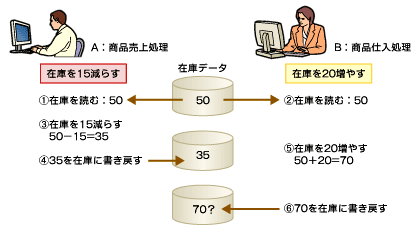
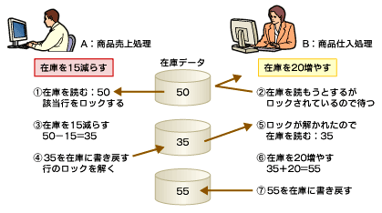

<html>
<body>
<h2>【DB概論】DBMSに求められるもの（1）排他制御とACID属性</h2>

　データベースシステムに求められる要件のうち、DBMSによって提供されるべきものを挙げます。

　ここでは具体的な機能や方法論を説明し、DBMSの基本的な機能が何のために提供されているかを理解することを目指します。これらの機能を理解することによって、物理設計およびメンテナンスフェイズにおいて、適切な判断をくだすことができるようになります。

　なお、具体的な機能の説明はOracleデータベースを想定しています。

<ol>
<li>同時実行制御（排他制御）とトランザクションの設定（ACID属性）</li>
<li>耐障害性</li>
<li>性能を満たすために検討すべきオブジェクト</li>
<li>セキュリティ</li>
</ol>
<h4>1　同時実行制御（排他制御）とトランザクションの設定（ACID属性）</h4>

<strong>●二重更新</strong>

　同時実行制御が適切に設定されていない場合、<strong>二重更新</strong>という事態を引き起こす可能性があります。

<!--CAP-->

<small><strong>図1 二重更新の例</strong></small>

<!--CAPEND-->

　あるデータに対する処理要求は、複数のユーザーやアプリケーションから同時に発生します。同じデータに対して、複数のユーザーまたはアプリケーションが同時に更新処理要求を出した場合、適切に同時実行制御を管理しないと二重更新が発生します。

　以下に二重更新が発生する例を示します。

<strong>Aさんの商品売上処理</strong>

「在庫は50ケースだな」

「お客さんから15ケース発注があったので、この商品在庫は35ケースに変更しよう」

 

<strong>Bさんの商品仕入処理</strong>

「在庫は50ケースだな」

「メーカーから20ケース納品されたので今の在庫は70ケースに更新しよう」

 

　二重更新とは、同じデータに対して、あるユーザー（またはアプリケーション）による更新処理が完了しないうちに、同時に他のユーザー（またはアプリケーション）によって更新される現象のことをいいます。あるユーザー（またはアプリケーション）がデータを更新しようとする場合に、そのデータが他のユーザーからも更新可能な状態（つまり、同時実行制御が機能していない状態）である場合、この現象が起こる可能性があります。

<strong>●同時実行制御：排他制御</strong>

　<strong>排他制御</strong>とは、二重更新などによってデータの不整合が生じないように、あるトランザクションAがデータを更新している間、他のトランザクションBが同じデータを更新できないようにする機能のことです。

　DBMSは、排他制御のために<strong>ロック</strong>という仕組みを実装しています。

　<strong>ロック</strong>とは、表の行データなど（<strong>リソース</strong>と呼びます。ロックをかける対象範囲は、行や表など、いくつかのレベルがあります）に対して、他からアクセスできないように錠をかけることです。ロックをかけたトランザクションがデータの更新を完了し、ロックを解く（<strong>アンロック</strong>）まで、他のトランザクションは待ち状態になります。

　トランザクションがコミットあるいはロールバックされた時点で、そのトランザクションがかけていたすべてのロックは解放されます。一般的に、ロックはDBMSが自動的に管理してくれますが、ユーザーが明示的に取得する場合もあります。

<!--CAP-->

<small><strong>図2 排他制御の例</strong></small>

<!--CAPEND-->

<strong>●ロックの粒度</strong>

　DBMSによってロックをかける対象範囲は、データベース、表、行といった論理的な単位やブロック、ページといった物理的な単位があります。どの単位でロックがかけられるか（ロックの粒度といいます）は、DBMSによって異なりますが、ほとんどのDBMSで行レベルのロックが実装されています。

　ロックの粒度を細かくすると、トランザクション間でロックが重複する確率が低くなり、結果としてトランザクション間の更新時の競合時間を短くすることができます。

　ロックの粒度を大きくすると、ロックが競合する確率が高くなり、他のトランザクションがデータにアクセスできず、同時実行処理の効率が低下する可能性が高くなります。

<strong>●トランザクションとACID属性</strong>

　<strong>トランザクション</strong>とは、「処理が論理的に1つのまとまりをもち、かつ、それ以上分割すると意味をなさなくなる一連の操作」のことです。

　以下にトランザクションの例を示します。

<strong>トランザクションの開始</strong>

Select from 在庫；　営業が受注を受けると、まず商品在庫を確認

Insert into 受注～；　在庫が十分あることが確認できたら、新規の受注データを受注表にinsert

Update 在庫 set～；　在庫表をupdateして、その商品の在庫を引き当てます

Insert into 売上～；　売上表に仮売上として売上データをinsert

<strong>トランザクションの終了</strong>

Commit；またはRollback；

 

　この受注トランザクションは、3つの表に対する更新処理の同期をとる必要があります。3つの表に対する更新処理は、「受注」という1つの処理に対して同時に実行される必要があり、かつ、どれか1つでも失敗した場合には、すべての処理が実行されなかった状態に戻さないと、データベース中の関係する表の整合性がとれなくなってしまう危険性があります。

　このような処理は、1つのトランザクションとして定義し、その中の処理は同時に更新が確定するか（コミッり、またはどれか1つでも失敗した場合にはすべて更新を取り消す（ロールバック）必要があります。トランザクションの区切りは、SQL文の中のCOMMIT文またはROLLBACK文によって明示的に示されます。

　次に、トランザクションの性質を説明する4つの属性、すなわちACID属性（エイキッドまたはアシッドと読みます）を説明します。

</body></html>

