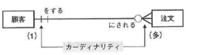
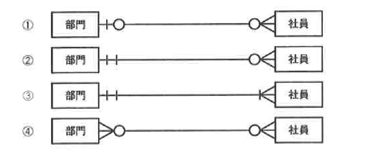
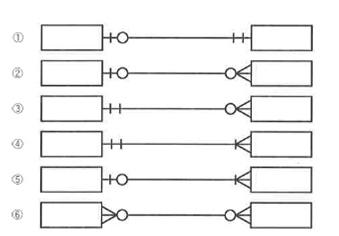
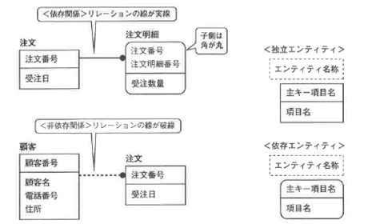
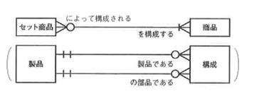
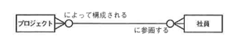
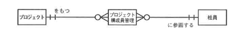
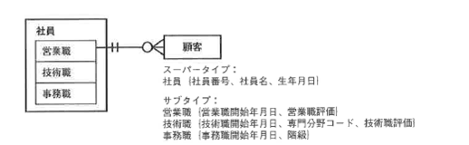

<html><body>
<h2>2.3 概念設計の手順（2/3）</h2>

<h4 class="caption">カーディナリティ</h4>

図2-8 リレーションの表記方法：カーディナリティ

<!--/.grayBox-->

<ul>
<li>●リレーションの相手のエンティティオカレンスが1つ特定されたときに、対応するこちらのエンティティオカレンスは 　「最大でも1」もしくは「複数を許す」のどちらか</li>
<li>●1つのリレーションにつき、一方から見た場合と他方から見た場合の2つがある</li>
<li>●最大数を表す：「最大でも1」または「多の場合がある」</li>
</ul>

カーディナリティやオプショナリティを検討する際、各エンティティの1オカレンスが具体的に特定できないと分析はできません。 オカレンスを特定するためには、まず一意識別子が決まっている必要があります。

このように、エンティティやリレーションシップを検討する場合には、並行して他の構成要素も考慮する必要があります。 また、カーディナリティやオプショナリティは、2つのエンティティそれぞれの立場から分析する必要があります。

いずれの場合も、相手のエンティティのオカレンスを1つ特定したときに、自分側のエンティティオカレンスがどのように対応するかというルールを自分に近い位置に記述します。

<!--/.section-->

<h4 class="caption">オプショナリティ</h4>

図2-9 リレーションの表記方法：オプショナリティ

<!--/.grayBox-->

<ul>
<li>●リレーションの相手のエンティティオカレンスが1つ特定されたときに、対応するこちらのエンティティオカレンスは 　「最大でも1」もしくは「複数を許す」のどちらか</li>
<li>●1つのリレーションにつき、一方から見た場合と他方から見た場合の2つがある</li>
<li>●最大数を表す：「最大でも1」または「多の場合がある」</li>
</ul>

オプショナリティは、「相手のいずれのエンティティオカレンスを特定した場合でも自分側のエンティティオカレンスが必ず1以上対応する必要があるか」を検討します。 また、「相手のオカレンスが作成されたとき、最初から自分側のオカレンスが対応する必要があるか」という検討も必要です。 最終的に必要という場合は、必須であるとはいえません。 時系列で考えて、作成時から常に必要であれば必須と判断します。

リレーションシップは、一般化できるものではありません。 業種が同じでも、ビジネスルールが異なれば、おのずとリレーションシップは異なるためです。 システム化しようとしている会社がどのようなビジネスルールを適用しているか、どのように運用しているかを十分ヒアリングする必要があります。 誤ったリレーションシップを記述すると、制約が多すぎて使いにくいデータベースになる可能性があります。 特に必須のリレーションは実装が難しくなる可能性が高いため、慎重に検討してください。

これまで解説してきたエンティティとリレーションの説明を受けて、次のクイズに挑戦してください。 クイズに答えながら、カーディナリティ、オプショナリティの意味を整理してみてください。

<!--/.section-->

<h5 class="quiz-title">クイズ1</h5>

社員エンティティと部門エンティティを管理します。 あなたの会社で2つのエンティティを管理する場合、どのようなリレーションになるか考えてください。 ただし、リレーション名は以下のとおりとします。また、過去の所属履歴まで管理する必要はありません。

<ul>
<li>●社員は部門に所属する</li>
</ul>

図2-10 クイズ1

<!--/.grayBox-->

<!--/.section-->

<h5 class="answer-title">クイズ1の解答例</h5>

図2-11 解答例1

<!--/.grayBox-->

１．社員は1つの部門にしか所属できない

<ul>
<li>●社員はどの部門にも所属しないという状態が考えられる</li>
<li>●新規社員オカレンスの登録をする際、その社員が所属する部門はまだ決まっている必要はない</li>
<li>●1つの部門には複数の社員が所属する可能性がある</li>
<li>●社員が1人も所属していない部門は存在し得る</li>
<li>●新規部門オカレンスの登録をする際の制約は特にない</li>
</ul>

２．社員は必ず1つの部門に所属する必要がある 

<ul>
<li>●新規社員オカレンスの登録をする際は、その社員が所属する部門が1つ決まっている必要がある かつ、その部門はすでに登録されているか同時に登録する必要がある</li>
<li>●1つの部門には複数の社員が所属する可能性がある</li>
<li>●新規部門オカレンスの登銀をする際の制約はない</li>
<li>●社員が1人も所属していない部門が存在し得る</li>
</ul>

３．社員は必ず1つの部門に所属する 

<ul>
<li>●新規社員オカレンスの登録をする際には、その社員が所属する部門がすでに決まっている必要がある 　かつ、その部門はすでに登録されているか、対象の部門オカレンスがまだ存在しないのであれば、 　同時に登録する必要がある</li>
<li>●どの部門にも、最低1人以上の社員が所属する必要がある</li>
<li>●1つの部門には複数の社員が所属する可能性がある</li>
<li>●新規部門オカレンスの登録をする際は、同時に最低1人の社員オカレンスを登録する必要がある</li>
</ul>

４．社員は複数の部門に所属する可能性がある 

<ul>
<li>●社員はどの部門にも所属しない状態もあり得る</li>
<li>●新規社員オカレンスの登録をする際には、その社員が所属する部門はまだ決まっている必要はない</li>
<li>●部門には、複数の社員が所属する可能性がある</li>
<li>●社員が1人も所属していない部門は存在し得る</li>
<li>●新規部門オカレンスの登銀をする際の制約はない</li>
</ul>
<!--/.section-->

<h4 class="caption">リレーションの種類</h4>

エンティティ間のリレーションを考えるうえで、たとえばどのような例があるのか、また、パターン化できるとすれば、そのリレーションのパターンにはどのような特徴があるのかを順次見ていき、リレーションに慣れましょう。

<!--/.section-->

<h5 class="quiz-title">クイズ2</h5>

以下のリレーションシップのパターンにあてはまるエンティティをいくつか考えてみてください。

図2-12 クイズ2

<!--/.grayBox-->

<!--/.section-->

<h5 class="answer-title">クイズ2の解答例</h5>

2つのエンティティ間のリレーションシップを考えた場合、代表的なパターンとして以下の6つを考えることができます。

図2-13 解答例2

<!--/.grayBox-->

以降の項目で、順を追ってご説明していきます。

<!--/.section-->

<h4 class="caption">1対1のリレーションシップ</h4>

①のパターンは1対1のリレーションシップで、正規化するときにはこれを1つのエンティティに統合できないかを検討します。 ただし、次のような理由でエンティティを分ける理由が明確になっている場合は、エンティティを統合せず、分けます。

<ul>
<li>●エンティティを配置する物理的なロケーションが異なる</li>
<li>●各エンティティによって管理すべき属性やリレーションが異なる</li>
<li>●それぞれのエンティティのライフサイクルが異なる</li>
</ul>
<!--/.section-->

<h4 class="caption">1対多のリレーションシップ</h4>

解答例の中で最も多いパターンは②です。 つまり、1対多で任意対任意の組み合わせです。

②のパターンの両端のエンティティは、お互いの依存度が低く、独立性が高いエンティティ（そのエンティティのみで存在できる）ということができます。 このように依存性が低いエンティティのことを基本エンティティまたは独立エンティティといいます。

このパターンはお互いのオカレンスの存在が依存していないため、データベースヘのオカレンスの挿入、更新、削除等の処理が自由に実行でき、実装としては最も自由度を高く設計できます。

③と④のパターンは、1側のオカレンスが多側に対して必須になっており、多側のオカレンスが生成される場合には、対応する値が1側に必ず存在している必要があります。 また、多側のオカレンスを変更、削除する場合は、1側の値と整合性がとれている必要があり、制約が強い性格のリレーションということができます。

<!--/.section-->

<h4 class="caption">依存関係と非依存関係</h4>

③と④のパターンのうち、依存関係と非依存関係について説明します。

依存関係とは、すべての子側のオカレンスから見て、必ず親が存在する必要があり、かつ、すべての親のオカレンスから見ても、必ず子のオカレンスが1以上存在する必要があるという関係を表します。 これを別の表現で表すと、子のオカレンスの一意識別子の一部に親のオカレンスの一意識別子が含まれ（外部キーとして）、子側のオカレンスはNULLを許されないという関係になります。

依存関係にある2つのエンティティは、図2-14に示すように、IDEFlX表記では子側のエンティティを角の丸い四角形で表し、リレーションを実線で表します。 非依存関係のリレーションは破線で表され、親のオカレンスに対する子側のオカレンスは0を許すという意味になります。

図2-14 依存関係と非依存関係

<!--/.grayBox-->

<!--/.section-->

<h4 class="caption">多対多のリレーションシップ</h4>

⑥に表される多対多のリレーションシップは、正規化をしていない概念設計の最初のフェーズではよく出てきます。設計の初期段階において、業務を良く理解しているユーザヘのヒアリングを行いますが、その際リソース系のエンティティだけが抽出され、そのリソース系のエンティティ間に直接リレーションシップをはると、66 第2章 概念設計この多対多のパターンが出てきます。その他、次のような場合も多対多のリレーションシップが発生します。

<ul>
<li>●リソース系のエンティティ間のリレーションを、履歴管理の観点も追加して管理する必要がある場合</li>
<li>●エンティティの管理に時系列の考え方を取り入れて、拡張性をもたせた場合</li>
</ul>

初期概要設計では顧客とのコミュニケーションをはかりやすくするためにこのパターンを残しておくことが多いのですが、RDBに実装する際には、多対多のリレーションは、このままではテーブルに実装することができません。 そこで、エンティティ間に交差エンティティを作成して、最終的には多対多の関連は残さないようにします。この処理を行うのは、概念設計の詳細設計フェーズです。

<!--/.section-->

<h4 class="caption">リレーションのパターン</h4>

リレーションの代表的な種類がいくつか理解できたところで、具体的なパターン例をいくつか挙げてみましょう。

図2-15 セット商品管理や部品表管理

<!--/.grayBox-->

セット商品や部品表の特徴は、セット商品や部品の組み合わせでできた他の部品が、さらにほかの商品や部品の一部として組み込まれる可能性があるという点です。 このため、セット商品と商品の間のリレーションは多対多になり、それを分解すると、図2-15の下側の図のようになります。

具体的には、1つ1つの製品または部品の組み合わせによる製品が左側のエンティティのオカレンスにあたり、その製品がどのような部品の組み合わせでできているかという構成が右側のエンティティで管理されます。 具体的には図2-16のオカレンスとオカレンスをイメージ化した図で確認してみてください。

図2-16 オカレンスとオカレンスをイメージ化

<!--/.grayBox-->

部品表の具体的な見方を説明します。製品表の一意識別子は製品番号です。 構成表の一意識別子は、構成される製品番号と、それを構成する1つの部品番号の組み合わせになります。

製品番号A000lという製品の構成は、構成表の1行目と2行目を見るとわかります。 構成表には、構成する部品の数量も管理しています。 製品番号B000lという製品の構成は、構成表の3行目から5行目を見るとわかりますが、部品となっている製品A000lが2個、E000lが1個、D000lが3個で構成されています。

<!--/.section-->

<h4 class="caption">多対多のリレーションシップ</h4>

リレーションの代表的な種類がいくつか理解できたところで、具体的なパターン例をいくつか挙げてみましょう。

図2-17 多対多のリレーションシップ

<!--/.grayBox-->

このER図上で、たとえば、次のような情報はどこで管理できるのでしょうか。

社員がプロジェクトに参画した時期（開始年月日、終了年月日）やそのプロジェクトでの役割はどうやって管理するか？

<!--/.yellowBox-->

これは、プロジェクトを管理するエンティティでも、社員を管理するエンティティでも管理することができない情報です。 1つのプロジェクトに複数の社員が対応するのであれば、その値は1つのプロジェクトに複数対応します。 1人の社員に複数のプロジェクトが対応するのであれば、1人の社員に複数の値が対応するからです。 そこで、多対多のリレーションシップをもつ2つのエンティティの間で管理すべき項目は、間に1つエンティティを設けてそこで管理することを考えます。 このようなエンティティを交差エンティティと呼びます。

図2-18 交差エンティティ

<!--/.grayBox-->

交差エンティティの一意識別子は、その両端のエンティティの一意識別子の組み合わせを考えます。 そうすることによって、交差エンティティ「プロジェクト構成員管理」では、ある社員があるプロジェクトに参画し始めた時期や、役割を管理することができます。

このように、多対多のリレーションシップが存在した場合は、間に交差エンティティを設け、1対多のリレーションに分解します。理由は以下のとおりです。

<ul>
<li>●そのままではデータベース表に変換できない</li>
<li>●両端のエンティティで管理できない属性がでてくる</li>
</ul>

多対多のリレーションシップを分解して、交差エンティティを設ける手順は、以下のとおり、ある程度一般化することができます。

<ul>
<li>１．多対多のリレーションシップをもつエンティティ間に交差エンティティを追加する</li>
<li>２．交差エンティティの識別子として、両端のエンティティの一意識別子を組み合わせた複合一意識別子を指定する</li>
<li>３．交差エンティティで管理すべき、その他の属性がないか検討する</li>
<li>４．交差エンティティと元のエンティティの間のリレーションを検討する</li>
</ul>

図2-18のプロジェクトと社員の間のリレーションの場合、以下のように説明できます。

プロジェクトは複数の社員によって構成される。社員は複数のプロジ工クトに参画する可能性がある。

<!--/.yellowBox-->

したがって、多対多のリレーションであることがわかります。

<ul>
<li>１．間に交差エンティティ「プロジ工クト構成員管理」を設ける</li>
<li>２．このエンティティの一意識別子はプロジ工クトIDと社員IDの複合一意識別子とする</li>
<li>３．管理すべき属性として、構成員がそのプロジ工クトに参画し始めた日付、プロジ工クトでの役割などを管理することができる</li>
<li>４．リレーションは、交差エンティティから元のエンティティに対しては、多対1で1側が必須。多側は任意</li>
</ul>
<!--/.section-->

<h4 class="caption">その他のエンティティとリレーション</h4>

エンティティとリレーションの少し変わった表現をするパターンを2つ紹介します。

<ul>
<li>●スーパータイプ/サブタイプ</li>
<li>●再帰リレーション</li>
</ul>
<!--/.section-->

<h4 class="caption">スーパータイプ/サブタイプ</h4>

エンティティを考える際、同じ識別子をもち、属性は一部異なるオカレンスをもついくつかのエンティティが抽出される場合があります。 それらのエンティティ間では、共通のデータ項目をもつエンティティと、各エンティティに固有のデータ項目のみをもつエンティティに分けることができます。 共通のデータ項目、リレーションをもつエンティティをスーパータイプ、それぞれ国有の属性をもつエンティティをサブタイプと呼びます。

図2-19は、社員の職種を管理するエンティティで、社員の共通管理項目を「社員」スーパータイプ、職種ごとの管理項目をサブタイプで表している図です。

図2-19 スーパータイプ/サブタイプの表記例

<!--/.grayBox-->

サブタイプにはさらに次のような特徴があり、この要件を満たさないとサブタイプということはできません。

<!--/.section-->

<table class="tableBox">
<tr>
<th abbr="特徴">特徴</th>
<th abbr="説明">説明</th>
</tr>
<tr>
<td>継承</td>
<td>サブタイプはスーパータイプのすべての属性とリレーションシップを受け継ぐ</td>
</tr>
<tr>
<td>特殊化</td>
<td>サブタイプはスーパータイプに属性やそのサブタイプのみに関係するリレーションシップを追加する</td>
</tr>
<tr>
<td>サブタイプ</td>
<td>実装時、スーパータイプにサブタイプの分類を特定するための属性を識別子としてもたせる場合がある</td>
</tr>
<tr>
<td>排他関係</td>
<td>すべてのオカレンスはいずれかのサブタイプに属するが、重複することはない</td>
</tr>
</table>

表2-2 サブタイプの特徴

<!--/.section-->

こうしてみてくると、ほとんどのエンティティがスーパータイプ/サブタイプで表すことができるように思えてくるのですが、スーパータイプ/サブタイプで表すかどうかは、次の点に注意して、その必要があるかを判断してください。 共通性が高いが違いがあり、その違いをシステムとして管理する必要がある場合にスーパータイプ/サブタイプを使用します。

たとえば、企業の売掛処理をする場合に、各支店で生じた売掛金額の総計が与信限度額を超えていないかを管理するような場合を考えてみましょう。

企業として管理される総計の与信限度額と各支店の売掛金額総計はスーパータイプで、各支店の売掛金額はサブタイプで管理します。 概念設計では、スーパータイプ/サブタイプとして表すべきエンティティを抽出しておきます。 実際にどのような表として実装するかは、物理設計のフェーズで考えます。

<!--/.section-->

<h4 class="caption">再帰リレーション</h4>

同一のエンティティを再帰的に結んでいるリレーションのことを指します。 このリレーションは、あるエンティティオカレンスから、同じエンティティに属する別のエンティティオカレンスとの間に何らかの関連をもつことを示します。

図2-20 再帰リレーションの表記例

<!--/.grayBox-->

なお、再帰リレーションを分析する際、オプショナリティは両側で任意になります。

これは、実際にオカレンスを挿入する場合を考えてみるとわかるのですが、いずれか一方でも必須のリレーションがあると、最初にオカレンスを挿入する際、同時に自身のオカレンスとリレーションの対象先のオカレンスの最低でも2オカレンスを挿入する必要が生じてしまいます。 しっかり分析すると、再帰リレーションの両端は常にオプションになっているはずです。

<!--/.section-->

<h4 class="caption">リレーションの実装と制約</h4>

以上がエンティティとリレーションに関する概要説明です。 次に、エンティティとリレーションが実装時にはどのように表現されるのかを見てみましょう。

すべてのリレーションが1対多に分解された後、リレーションの多側のエンティティには1側の一意識別子が属性として追加されます。 この属性を外部キーと呼びます。 外部キーに値が入ることによって、多側のオカレンスがどの1側のオカレンスに対応するのかを知ることができます。

以下の例は、2つのエンティティ間にリレーションシップがあり、それを表現するために多側のオカレンスの属性に1側の一意識別子を外部キーとしてとり込んでいます。

図2-21 リレーションの実装例1

<!--/.grayBox-->

また、リレーションのオプショナリティから、オカレンスの生成時や削除時の制約（ルール）を読み取ることができます。

図2-21のようにリレーションの1側が必須の場合、多側のオカレンスが生成される際、外部キーの値は、もう一方のエンティティの識別子の値として、あらかじめ存在している必要があることを示しています。 また、1側の顧客オカレンスを削除するとき、顧客が注文していた注文オカレンスが残っていれば、その顧客オカレンスは削除はできないことがわかります。

もう1つ、特別なリレーションを見てみましょう。

図2-22 リレーションの実装例2

<!--/.grayBox-->

1側が必須の場合、1側の一意識別子を外部キーとし、かつ多側の一意識別子の一部とする場合があります。 この場合、多側のエンティティを従属エンティティと呼びます。 このような場合、オカレンス生成時のルールとして以下のことが読み取れます。

<ul>
<li>●1側のオカレンス「注文」を作成するとき、必ず「注文明細」のオカレンスが1つ以上存在する必要がある</li>
<li>●注文明細を作成するときには、必ずそれに対応する注文が存在する</li>
</ul>

また、削除時のルールとしては、以下のようなことがいえます。

<ul>
<li>●注文を削除すると、それに対応する明細はすべて削除される</li>
<li>●注文明細を削除するときには、そのオカレンスが対応する注文の最後の明細であれば、注文も削除される</li>
</ul>

このような場合、2つのエンティティはライフサイクルが同じであることがわかります。 エンティティとリレーションの全体像をつかんだところで、次に属性について見てみましょう。

<!--/.section-->

</body></html>