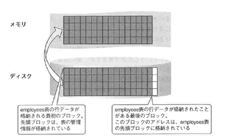
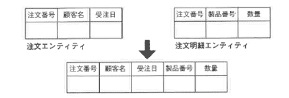

<html><body>
<h2>3.3 論理設計の手順（2/4）</h2>

<h3>3.3.3 最適化</h3>

収集された業務に関するデータと、アプリケーション開発側で定義された処理要件より、性能を発揮するための最適化処理を考えます。 最適化のポイントは、プロセス側で変更が起きた場合の影響を最小限にし、正規化をなるべく崩さないことです。 具体的な方法として、論理設計では索引と非正規化を考えます。

<!--/.section-->

<h4 class="caption">索引の検討</h4>

<h5 class="caption">B*treeインデックスとは</h5>

B*treeインデックスは、RDBMSで使用されている最も標準的なインデックスです。 実際にはB-tree、B+tree、そしてB*treeという進化の過程がありますが、現在一般的に使われているB*treeを説明します。 下記に構造のイメージ図を示します。

図3-2 B*Tree

<!--/.grayBox-->

木をひっくり返した階層構造になっています。 一番上のレベルが根、真ん中が枝、一番下の階層を葉と呼びます。

B*treeインデックスは、RDBMSで使用されている最も標準的なインデックスです。 実際にはB-tree、B+tree、そしてB*treeという進化の過程がありますが、現在一般的に使われているB*treeを説明します。 下記に構造のイメージ図を示します。

<h5 class="caption">インデックス作成時</h5>

まず、この構造がどうやって作成されるかを説明します。 図3-2は、employees表（従業員表）のename列に索引を作成した結果、作成されたものです。

<ul>
<li>１．すべてのename列の列値をソートして、列値とその列値をもつ行のアドレス＝rowidを、ソート順にリーフノードに格納します。 　　列値とその列値をもつ行のアドレス＝rowidを索引エントリと呼びます。
索引作成時の注意書項を示します。</li>
<li>　　●B*treeインデックスにはnull値は格納されません。 　　　つまり、条件式にnull値を検索する場合、索引を使用することはできないことになります。</li>
<li>　　●ブロック内に新規索引エントリを挿入する際、新しい索引エントリのために、ブロック内に空き領域を確保しておきます。 　　　これは、索引作成時のパラメータPCTFREEで設定することができます。</li>
<li>　　●リーフノードには双方向にお互いのブロックアドレスが格納されていて、範囲検索を行う場合でも、 　　　上位のブロックに戻って検索しなくてもすむようになっています。</li>
<li>２．リーフノードが満たされると、リーフノードの先頭の列値と、リーフノードのブロックアドレスを順次ブランチノードの 　　エントリに格納していきます。</li>
<li>３．必要な数だけブランチブロックが作成されると、最後にブランチブロックを参照するルートノードのブロック内の 　　エントリを作成します。</li>
</ul>
<h5 class="caption">検索時：インデックス使用時</h5>
<ul>
<li>１．検索条件に指定された値をルートノードから比較して探していき、最終的にリーフノードで該当の列値を 　　もつ行アドレス（rowid）を取得します。 　　行アドレス（rowid）からブロックアドレスを取得することができます。 　　ブロックアドレスから、まずメモリ上に該当行を含むブロックがあるかを探します。 　　次に、アクセスすべきブロックがメモリ上になければ、ブロックをディスクから読み込むことになります。</li>
<li>２．ブロックをメモリ上に読み込んだら、当該ブロックにアクセスして行データを取得します。 　　アクセスする対象となるブロック数が少なければ、索引によるアクセスの効果は高いということができますが、 　　逆に対象となる行数が多く、それに伴ってアクセスブロック数が多い場合には、1ブロックごとにアクセスする 　　必要があり、連続した複数ブロックの読み込みができる全表検索と比べて索引の効果があまり高くならない場合もあります。</li>
</ul>
<h5 class="caption">インデックスを作成した表にDML文が発行されたとき</h5>
<ul>
<li>●Insert時：索引を作成した列傾が新規に入ってきたときは、ソートされた順に、該当するブロックに索引エントリが 　挿入される必要があります。 　もしリーフブロックがいっぱいになっていた場合、新規に索引用のブロックをリーフノードに追加し、 　前後のブロックの空き領域の割合が同等になるように索引エントリの数が調整されます。 　次に、ブランチブロックに新しいブロックの先頭エントリとブロックアドレスを追加します。</li>
<li>●Delete時：Oracleではエントリの物理削除は行わず、論理削除のみ行います。 　論理削除では、削除されたエントリ領域の再使用はできません。 　ブロック領域が再使用できるのは、すべてのエントリが論理削除されたときなので、 　論理削除が多くなると、領域の使用効率が悪くなります。</li>
<li>●Update時：索引のエントリはソートされているので、同じ索引エントリの列値だけ更新することはできません。 　その索引エントリの論理削除と新規索引エントリのInsertを実行することになります。</li>
</ul>

仕組みがわかったところで、次に索引を使ったときとそうでないときの検索の仕組みの違いを説明します。 それが理解できると、どのような列に索引を作成すべきか、いつ索引を使用すると効果的なのかがわかります。

<!--/.section-->

<h5 class="caption">索引を使うとなぜパフォーマンスが良くなるのか</h5>
<ul>
<li>１．次のようなSQL文による問い合わせが実行されると…… 　　SELECT ename,job,deptno 　　FROM employee 　　WHERE ename='SCOTT';　←条件で行を選択</li>
<li>２．索引がなければ、表の行データを含むすべてのブロックがメモリに読み込まれ、該当の行が探索される（図3-3）</li>
<li>３．索引があって使用される場合、索引を使って行が存在するブロックを特定し、該当ブロックのみがメモリに読み込まれる（図3-4）</li>
</ul>

図3-3 ディスクからメモリヘの読み込み

<!--/.grayBox-->

図3-4 該当ブロックのみがメモリに読み込まれる

<!--/.grayBox-->

<h5 class="caption">索引を使うと常に速い？</h5>

索引がある場合とない場合の処理の違いを確認しました。 索引を使用すると常に最も速い検索ができるわけではないことがわかったと思います。 違いを、以下にもう少し解説します。

2.と3.を比較して、アクセスするブロック数が少ない方が、パフォーマンスはよさそうであることがわかるでしょう。 実際には、発生する物理Ⅰ/0数、メモリ上でアクセスするブロック数が少ないほどパフォーマンスはよいということができます。

各種DBでは、SQL文をチェックした後、最適なアクセスパスを選択するため、オプティマイザと呼ばれる機能を使って複数のアクセスパスを比較し、最適な解を導き出します。 DB設計者は、このアクセスパスの選択肢を適切なものにできるよう、適切な種類のインデックスや表を作成する必要があります。 その指針として、次のような点が挙げられます。

<ul>
<li>１，SQL文のWHERE条件句で使用される列で、対象となる行を絞り込むために使用される列に索引を作成する</li>
<li>２，1.において、WHERE条件旬で対象となる行の絞り込みが有効な列（一意性が高い、カーディナリティが高いという）に 　　索引を作成する</li>
<li>３，一意性を高くするために、列を組み合わせた複合列に索引を作る</li>
</ul>

一方、小さい表をアクセスする場合は索引を使用しない場合がほとんどです。 Oracleでは、パフォーマンスをよくするために、「表全体を読み込む」というアクセスパスが選択された場合、複数のブロックをまとめて1回のIOで読み込む「マルチブロック読み込み」を行います。 ディスクから読み込みを行う場合、1回のIOで複数のブロックをまとめて読み込むことができます。 初期化パラメータ（db_file_multiblock_read_count）で設定します。 デフォルトは8ブロックです。

<ul>
<li>●索引を使用したときは1ブロック単位の読み込み</li>
<li>●全表検索を選択したときはマルチブロック読み込み</li>
</ul>

索引を使用しても、アクセスするブロック数（索引+表）が多ければ、かえって全表検索の方が効率がよい場合もあります。 したがって、下記のようなケースはB*tree索引は有効ではないということができます。

<ul>
<li>●小さい表を検索する場合</li>
<li>●一意性が高くないため、たくさんの行がヒットする（アクセスするブロック数が増える）場合</li>
</ul>
<h5 class="caption">索引作成の目的</h5>

索引を作成する目的としては、これまでに紹介した検索処理の高速化を含め、次の2つを挙げることができます。

<ul>
<li>１．検索処理の高速化</li>
<li>２．データの一意性を保証データの一意性を保証</li>
</ul>

データの一意性を保証するために、Oracleデータベースは、列または列の組み合わせ（複数列）に対して、Primary Key制約またはUnique制約をつけると、自動的に一意索引を作成します。 そして、DML文（INSERTまたはUPDATE）が発行されると、索引を使用して、「挿入または更新後の列借」と「既存の索引のソートされた列値」が比較され、同じ値がないかどうかを高速に確認できるようになっています。 列値がソートされていないと、値を比較する際に、最初から最後まで検索する必要があり、検索に時間がかかることになります。

<h5 class="caption">B*treeインデックスの特徴</h5>

B*treeインデックスの特徴から、どのように使用すべきかをまとめます。

<ul>
<li>●where句の条件式で頻繁に使用される列または列の組み合わせに作成する</li>
<li>●一意性が高い列または列の組み合わせに有効</li>
<li>　等価条件が最も有効ということができるが、範囲検索でも指定した値の一意性が高ければ効果的</li>
<li>●小さい表では使用されない</li>
<li>●not検索、null値権索、or条件を多用するような検索では使用されない</li>
<li>●sort対象の列、結合列に作成すると有効</li>
<li>●更新によって、索引の構造が崩れてしまうと効率が悪くなる</li>
</ul>
<h5 class="caption">一意性を高くするために</h5>

1列のみでは一意性が高くない場合でも、複数列を組み合わせると一意性が高くなる場合、複数列の組み合わせで索引を作成することを検討します。

一般的に、条件検索の値を指定した場合に、該当する検索対象の行が表全体の行の2％〜4％未満になる場合、その列に索引を作成するのは有効だといわれます。 一方、5％以上15％未満になる場合は、テストしてみます。 特に、SELECT句で問い合わされている列が索引の一部に組み込まれていて、値を取得するのに表へのアクセスが必要ない場合、パフォーマンスは非常に良くなります。 同じ表の複数列に索引を別々に作成していた場合、1つの複合索引にできないかを検討してみましょう。

ただし、複合索引を作成する場合、索引に指定する列の順序がパフォーマンスに影響を与えるので、その点は十分考慮してください。

<h5 class="caption">条件式の記述を誤ると索引を使わない</h5>

せっかく索引を作成しても、SQL文の書き方が誤っていると、オプティマイザは索引を使うことができません。 次の点に注意してください（ただし、各DBのバージョンによっては下記のように記述しても索引を使う場合もあるので確認が必要です）。 WHERE条件文中で、以下のように、列に対する条件式が記述されている場合、その列に作成された索引は使用されません。

<ul>
<li>●列名！＝値</li>
<li>●関数（列名）＝値 （例）UPPER（列名）＝'SUZUKl'(*)</li>
<li>●列名LIKE'％値' 文字列検索で中間一致または後方一致)</li>
</ul>

(*)Oracle9iでは関数つきの列に索引を作成できるようになっています。

<!--/.yellowBox-->

このケースと同様、複合索引を作成する際、複合索引の一番初めに指定される列が検索条件に指定されないと、複合索引も使用されません。 この理由から、複合索引を作成する場合、一番先に指定される列は、条件式に指定される確率が最も高いものを選択する必要があります。 指定される確率が同じ場合には、一意性の高い列を先頭にもってきます。(*)

(*)Oracle9iでは中間一致・後方一致も索引を使用できるようになっていますがパフォーマンスはよくありません。

<!--/.yellowBox-->

<ul>
<li>●列で定義されたデータ型！＝指定された値のデータ型</li>
</ul>
<!--/.section-->

<h5 class="caption">B*treeインデックスのメンテナンス</h5>

B*treeインデックスは、検索時のパフォーマンスに対しては、使用方法によって劇的に効果をあげることがわかっています。 一方、更新時や挿入時には、思わぬパフォーマンスの劣化を伴う場合があります。 特に一括して大量のデータをロードする際や、大量データの更新時に、索引があるために数倍から十数倍もの時間がかかってしまう場合があります。

<ul>
<li>●大量なデータのロードやimpon、大量なデータのinsenを行う前に索引を削除し、importまたは 　大量inse止処理完了後、索引を再作成することを検討してみる</li>
<li>●バッチジョブなどでしか使用しない索引は、オンライン処理暗は削除しておき、ジョブ実行直前に作成する</li>
<li>●更新によって、索引の構造が崩れた場合、索引による効果が低くなる</li>
</ul>

「alterindex〜rebuild;」文を実行することによって高速に索引の再編成を実行することができます。 下記のような状態になると、結果的にアクセスする必要のあるブロック数が増え、パフォーマンスが悪くなります。

<ul>
<li>●階層構造が深くなる</li>
<li>●論理削除が増えて、ブロックの格納効率が悪くなる</li>
</ul>

上記の状態を確認するために、以下の処理を行います。

<strong>【STEP1】</strong> 「analyze index 索引名 estimate statistics validate structure;」文でインデックスの統計情報をindex_stats表に収集する

<strong>【STEP2】</strong> index_stats表のdel_if_rowsは論理削除された索引エントリの数、if_rows列はリーフブロック内の索引エントリの数を表す 全索引エントリの数に対して論理削除の割合が20％を超えた場合、索引再作成文を発行し、最初から索引を作成しなおす

<strong>【STEP3】</strong> index_stats表のheight列はB*tree索引の階層の高さを表す 論理削除が増加すると、それに伴って階層が高くなることがある height列の値が4以上だった場合、索引再作成文を発行し、最初から索引を作成しなおす

索引再作成文：alter index索引名rebuild；

<!--/.yellowBox-->

索引再作成文によって高速に索引を再編成できるのは、すでにソートされた状態の索引エントリ（既存の索引）を参照して新規に索引を作成しなおすからです。 ただし、同様の理由から、一時的に索引を格納する表領域の領域が索引サイズの2倍必要になることに注意してください。

<h5 class="caption">Bitmapインデックスとは</h5>

Bitmapインデックスは、一意性の高くない列に作成しても有効に使うことができるとされています。 B*treeインデックス同様、どのような構造になっているのか、どのような場合に有効なのかを確認しましょう。

車体情報を管理する表cars表（行数10，000件）には車体の特徴を管理する列「color」「body」「door_num」「tire_num」などがあります。 これらの列の値は、一般的にすべて一意性はかなり低いと考えることができる列です。 これらの列にビットマップインデックスを作成した状態が図3-5です。

図3-5 ビットマップインデックスを作成した結果の状態

<!--/.grayBox-->

<h5 class="caption">Bitmapインデックス作成時</h5>

B*treeインデックスとの違いはリーフノードの部分です。 リーフノードには、索引を作成した列の値と、このビットマップブロックで管理される最初のrowid、最後のrowid、表の各行がそれぞれその列値をもつ「1」か、もたない「0」かを表すビットが行数分格納されています。

また、連続するビット値は圧縮されて格納されます。 このため、ほとんどの場合、B*treeインデックスよりも領域は少なくてすみます。

<h5 class="caption">インデックス使用時</h5>

検索条件に指定された値をもつ行は、リーフノードで値1をもつrowidです。 その後の処理はB*treeと同じです。B*treeとの違いは、主に下記の点です。

<ul>
<li>●複数の検索条件を組み合わせた場合、それぞれの結果の論理積をとれば、該当するrowidを特定できる</li>
<li>●not条件式の場合も、ビットを反転させることによって索引を使用できる</li>
<li>●or条件の場合、B*treeインデックスは使用されない可能性が高かったが、 　Bitmapインデックスでは論理和を求めることによって使用することができる</li>
<li>●null値も列値の1つとして自動的に作成するため、null値検索も索引を使用できる</li>
</ul>
<h5 class="caption">Bitmapインデックスの有効な使い方</h5>

SELECT 列名1, 列名2, 列名3 FROM 表名 WHERE color IN ('赤','黄') and body !='wagon' and tire_num=4 and door_num IN (4,5);

<!--/.yellowBox-->

単体の列に対する問い合わせだけではなく、例のように、複数の列に対する条件式を組み合わせて問い合わせを行う場合、Bitmapインデックスの効果が発揮されます。

<ul>
<li>１．まず、各条件式ごとに、条件式の値に応じて行数分の0または1のあてはまるビットの組み合わせが作成される</li>
<li>２．次に各条件式をandまたはorで結合する 　　この結合処理が、Bitmapインデックスが高速処理できる部分になる 　　結合処理も、各条件式結果のビット行をビット演算で実行できるため、 　　瞬時に結合した結果の該当行が特定できる</li>
</ul>
<h5 class="caption">Bitmapインデックスを作成した表にDML文が発行されたとき</h5>

Bitmapインデックスは更新処理を実行する際のパフォーマンスが悪いといわれます。

列値に対して更新処理が発生すると、関係するすべての列値を格納するブロックの圧縮が解凍されてからビット値が変更されます。 このとき、関係するすべての列値単位にロックがかけられるため、B*treeインデックスに比べてロックの範囲が大きくなります。 ビットマップ索引は、ロックがかけられる範囲が広いことから、B*treeインデックスに比較して更新系の処理が多発する表にはあまり向かないということができます。

<h5 class="caption">Bitmapインデックスの特徴</h5>
<ul>
<li>●索引を作成する対象の列が、一意性が低い列でも、複数の条件式を組み合わせて使用する場合、効果的</li>
<li>●条件式が複数組み合わされていても（結合条件が多くても）パフォーマンスがよい</li>
<li>●not検索、null値模索、or条件を多用するような模索でも効果的</li>
<li>●B*treeと比較すると、更新ではコストがかかる</li>
<li>●B*treeと比較すると、格納効率がよい</li>
<li>●コストベースオプティマイザが有効になっていないと使用されない</li>
<li>●ユニークインデックスは作成できない</li>
</ul>
<!--/.section-->

<table class="tableBox">
<tr>
<th abbr="null">&nbsp;</th>
<th abbr="B*treeインデックス">B*treeインデックス</th>
<th abbr="Bitmapインデックス">Bitmapインデックス</th>
</tr>
<tr>
<td>作成するのに適した列</td>
<td>一意性の高い列または列の組み合わせ</td>
<td>一意性の低い列でも効果的</td>
</tr>
<tr>
<td>更新処理</td>
<td>比較的コストは低い</td>
<td>比較的コストが高い</td>
</tr>
<tr>
<td>更新時ロックの範囲 （索引の範囲）</td>
<td>索引エントリ単位</td>
<td>ビットマップセグメント単位</td>
</tr>
<tr>
<td>WHERE句の制限</td>
<td>null値の比較はできない or条件は使われない not条件は使われない</td>
<td>null値の比較も可能 or条件も使用 not条件も使用</td>
</tr>
<tr>
<td>適しているアプリケーション</td>
<td>少ない行を検索対象として処理するOLTP系</td>
<td>大量データをさまざまな角度から分析するDSS系</td>
</tr>
</table>

表3-10 B*treeインデックス v.s. Bitmapインデックス

<!--/.section-->

<h5>クイズ1</h5>

この表に索引をつけるとしたら、どのような索引を作成するのが最も適切かa〜dから選びなさい。

<ul>
<li>●EMPLOYEES表 　列名empno(primary key),ename,job,salary,comm,mgrno,deptno</li>
<li>●アプリケーションで頻繁に実行されるselect文</li>
<li>　　１．select*from employees where deptno=20 and job="manager"; 　　２．select*from employees where deptno=20; 　　３．select*from employees where ename is null; 　　４．select*from employees where empno=1043; 　　５．従業員数10,000人、部門数100、1レコード約75バイト</li>
<li>●選択肢（複数選択可）</li>
<li>　　ａ．deptno列に1つ、job列に1つずつ作成する 　　ｂ．deptno列とjob列の複合索引を1つ 　　ｃ．ename列にlつ 　　ｄ．empno列に1つ</li>
</ul>
<!--/.section-->

<h5>クイズ1の解答例</h5>

正解はbです。

deptno列とjob列をwhere条件式の中で使用しているので、この2つに索引をつけることを考えます。

a.は、それぞれの列に別に索引をつけています。 b.は複合索引という形で1つの索引にまとめています。 この場合、単独でも検索時に指定されるdeptno列を先頭にして、deptno列とjob列の複合索引を作成すると、2つの索引を作るよりも検索時のパフォーマンスはよくなります。 理由は、アクセスしなければならない索引の数が異なるため、必然的にアクセスするブロック数も少なくてすむからです。
ename列の条件式は、null値を探す問い合わせであるため、索引を使いません。 empno列は、empnoO列が主キーであるため、すでに索引は作成されているため、わざわざ作成する必要はありません。

<!--/.section-->

<h4 class="caption">非正規化の検討</h4>

それでは、性能を出すための方策として、次に非正規化を検討してみます。 まず、非正規化とは何をすることなのか、注意すべき点は何かを明らかにします。

<h5 class="caption">非正規化とは</h5>

非正規化とは、性能を上げるために「正規化を崩す」処理のことをいいます。 結果として設計に冗長性を追加することになるため、整合性を維持するための追加のアプリケーションが必要になります。

<h5 class="caption">非正規化処理を行う際のルール</h5>
<ul>
<li>１．正規化を行った後に実施する</li>
<li>２．最適化の最後の手段として使用する</li>
<li>３．正規化を崩した箇所、理由などのドキュメントを残す</li>
</ul>

1.を行わないと、正規化と異なる部分が正確に特定できません。 冗長な部分が残っていると、更新時に整合性がとれなくなり、データベースとしての信頼性がなくなります。 2.については、先輩から教わってあらかじめ「こういう場合にはこうする」、と安易に最初から非正規化を選択する場合が多いのですが、冗長性は極力なくした方が、将来的なアプリケーションの拡張性を考えればよいといえます。 非正規化を行っても他に影響がない場合や非正規化をした方がよい場合を除いては、非正規化は必要悪と考えてください（詳細は後述）。 くれぐれも安易に非正規化を行わないようにしてください。

そして、非正規化を実施した場合には、後でメンテナンスをする人のために必ずドキュメントを残してください。

<h5 class="caption">非正規化の種類</h5>

次のような非正規化の種類を考えることができます。 順に紹介しながら、非正規化を行う場合の注意点を説明すると同時に、非正規化をしてもよいかどうかについても考察します。

<ul>
<li>●エンティティの統合</li>
<li>●繰り返し構造の使用</li>
<li>●テーブルの分割</li>
<li>●導出項目をもたせる</li>
<li>●重複項目をもたせる</li>
</ul>
<h5 class="caption">エンティティの統合</h5>

正規化されたエンティティでは、結合処理に非常にコストがかかるため、結合エンティティ数が5を超えた場合、下記の条件にあてはまるようであれば複数エンティティの統合を検討します。

【条件】

１．エンティティどうしの結合処理が非常に多い

２．検索で使用される場合がほとんどで更新系の処理は少ない

<!--/.yellowBox-->

図3-6 複数エンティティの統合

<!--/.grayBox-->

第1正規化された形から、繰り返し項目が再度出現してしまうため、繰り返し項目の部分（この場合だと顧客に関する部分）に変更が頻繁な場合には、お薦めできません。 Oracleデータベースの場合、正規化したまま元表は維持しておいて、マテリアライズドビューを作成し、参照時にはマテリアライズドビューを参照する方法を採ることができます。

マテリアライズドビューについては、<a href="../../04_01/index.md">第4章「物理設計」</a>で紹介します。

<h5 class="caption">繰り返し構造の使用</h5>

【条件】

繰り返し項目の回数が固定または一定数以下の場合、決まった回数分、繰り返し項目の格納を許す。

<!--/.yellowBox-->

図3-7 繰り返し項目のあるエンティティ

<!--/.grayBox-->

Oracleデータベースの場合、データの格納パターンとして、レコード長が時の経過とともに長くなっていくのは、構造的にあまりお勧めできません。 それは、このパターンに関しては、限界を超えて行長が伸びていくことに無制限に対応できるような仕組みにはなっていないからです。 （詳しくは<a href="../../04_01/index.md">第4章「物理設計」</a>で説明します）

ところが、正規化された形（囲3-7の矢印の上部のような表のもち方）で値を管理していると、レポート処理などで矢印の下部のような表形式で出力するためにはUNIONという結合をせざるを得ず、パフォーマンス上非常にコストがかかることがわかっています。 そこで、このようなパターンでデータを格納するには、次のいずれかの方法を考えます。

<ul>
<li>●繰り返し項目の回数が決まっているのであれば、その回数を決めてあらかじめ列数を定義する 　その場合、あらかじめ領域を確保しておくために、ダミーの値を入力する</li>
<li>●Oracleデータベースの場合、正規化したまま元表は維持しておいて、成形した形でマテリアライズドビューを作成する 　参照時にはマテリアライズドビューを参照する方法を採る （マテリアライズドビューについては<a href="../../04_01/index.md">第4章「物理設計」</a>で紹介します）</li>
</ul>
<h5 class="caption">テーブルの分割</h5>

【条件】

１．ピーク時のアクセス件数が非常に多く、10競合がおきやすい

２．1テーブル当たりのデータ量が非常に多い

３．サーバのロケーション条件によって、アクセスするテーブルの種類を分けることができる

<!--/.yellowBox-->

図3-8 水平分割の例

<!--/.grayBox-->

ある表に対して、更新処理が集中して実行されるため、ディスクIOが集中するような場合、テーブルを分割して物理的に別のボリュームに配置することを考えます。

図3-8の例では、在庫エンティティにアクセスが集中するため、倉庫ごとに在庫表を分けて別表としています。
これは、在庫表は倉庫別に異なるレコードを格納することが要件で明らかになっており、ユーザによってどの倉庫にアクセスするかがほほ固定されていることがわかっていたため、分けて管理してもよいという判断ができたためです。

ただし、全倉庫を串刺しにして在庫状態を検索したい場合には、分割した表をUNION句で結合するなどの必要がでてきます。 ¥今回の場合、そのような在庫レコードを複数の倉庫をまたがって検索する要件の頻度が低かったため、実装できると判断しています。

また、Oracleデータベースの場合、表はあくまでも1つの表として定義しておき、格納するレコードを物理的に分けて格納する機能としてパーティション機能が提供されています。 在庫表の場合、表は在庫表として1つ定義しておき、倉庫番号によってパーティション分けをするリストパーティションを使用することができます。

<h5 class="caption">導出項目をもたせる</h5>

図3-9 導出項目のあるエンティティ

<!--/.grayBox-->

図3-9の例では、上段の商品エンティティと受注明細エンティティの関係をまず考えてみます。

受注明細から商品エンティティを参照して商品単価を取得することになっていますが、受注明細エンティティと商品エンティティでは、オカレンスのライフサイクルが異なります。 商品価格が変更されるタイミングと、注文処理に商品の価格が登録されて請求処理に回るまでのタイミングは同期しておらず、受注明細エンティティには受注時の商品単価の値が入っている必要があります。 受注後に商品価格が変更されたとしても、同期をとって商品単価が変ってしまうと契約違反になってしまいます。

正規化の観点からすると、両方のエンティティに目付データをもたせ、受注日付の商品単価を参照するようにするのが本来のやり方です。

しかし、それではパフォーマンス上の観点からコストがかかり過ぎるため、図3-9の「変更後 受注明細エンティティ」にあるように、単価という属性を設け、その時点の商品単価を挿入することにしました。
また、「変更確度牲エンティティ」にあるように、それぞれの受注伝票ごとの「合計金額」も、その時点での合計金額値が決まったらその後変更される可能性はほとんどないため、導出値ですが属性として加えました。 「可能性がほとんどない」というのは、ユーザへのヒアリングの時点で顧客からの受注情報変更頻度がたいへん低いという情報を得ているからです。 また、受注確定後は、出荷指示までの間にキャンセルが生じるか、返品処理などが発生しない限り、受注に関する変更はないからです。 しかも、キャンセルや返品処理の場合には、合計金額値には変更は加えず、キャンセルの場合には受注自体のキャンセル処理、返品処理の場合は合計金額値は変更せず、売上情報の変更と0円の新たな受注処理を追加することが決まっているため、変更処理はほとんどないことがわかります。

このように、導出項目を追加する際には、導出項目に関する変更処理が非常にまれな場合であることが明確にわかっている必要があります。

次に、導出項目を属性として加えている例をクイズで確認してください。

<!--/.section-->

<h5>クイズ2</h5>

図3-10は製品価格のモデルである。違いを説明しなさい。

図3-10 製品価格のモデル

<!--/.grayBox-->

<!--/.section-->

<h5>クイズ2の解答例</h5>

図3-10 製品価格のモデル

<!--/.grayBox-->

①は正規化したER図です。 製品価格が変更になった場合、価格エンティティに新しい価格情報を追加するだけでよい設計になっています。 ただし、製品の価格を検索したい場合、いつの時点の価格を知りたいのかという情報を入力し、その時点の価格情報を開始日と終了日を比較しつつ、該当製品のすべてのオカレンスと比較しつつ探す必要があります。

②は「価格」表に現在と過去の価格の両方を含めています。 1つの表の中に両方の情報を格納しておき、必要に応じて参照できるようにしてあります。

また、②では製品エンティティに冗長な属性「現在の価格」を含めることによって、現在価格を知りたいときに処理時間が最短になるようにしています。 ただし、製品価格が変更になった場合、価格エンティティにオカレンスを追加するとともに、製品エンティティには毎日日付が変わるごとに最新の価格情報が提供されているようにメンテナンス用のアプリケーションを追加しておく必要があります。

③は「価格」町中で親水の価栖を揺すためのコストを下げるため、「価格」表側に列「カレント指標」をもたせています。 製品価格が変更になった場合、価格エンティティにオカレンスを追加するとともに、毎日目付が変わるごとにその目付の価格情報が何であるかを示すためのカレント指標をメンテナンスするアプリケーションを追加しておく必要があります。

<!--/.section-->

<h5 class="caption">重複項目をもたせる</h5>

図3-12 重複項目をもつ例

<!--/.grayBox-->

画面上で常に検索される項目で、頻繁に更新される可能性の低い項目については、複数のエンティティに重複してもたせておくのが一般的です。 特に、結合してもってくる属性が1または2の場合、結合するコストを避けるために重複項目をもたせます。

ただし、元のエンティティで変更された場合には、同期をとって変更するアプリケーションを追加する必要があります。

<!--/.section-->

<table class="tableBox">
<tr>
<td style="width:200px; border-top:1px solid #CCCCCC;">同一エンティティ内の導出</td>
<td style="width:200px; border-top:1px solid #CCCCCC;">導出項目はもたない</td>
<td style="width:200px; border-top:1px solid #CCCCCC;">&nbsp;</td>
</tr>
<tr>
<td>別エンティティからの導出でライフサイクルが異なるもの</td>
<td>導出項目をもたせる</td>
<td>DBトリガーなどを使い、整合性を維持</td>
</tr>
<tr>
<td>別エンティティからの導出でライフサイクルが同一のもの</td>
<td>導出項目を可能な限りもたせない</td>
<td>&nbsp;</td>
</tr>
</table>

表3-11 導出項目をもたせるかもたせないかの判断基準

以上、性能を上げるための最適化の方法をいくつか紹介しました。

最適化に関する手法は、論理設計だけで行うものだけではありません。 物理設計でも方策として考えられることがいくつもあります。 あくまでも性能を上げるための非正規化は最後の手段と考えてください。

<!--/.section-->

</body></html>