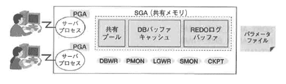
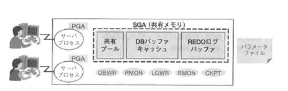
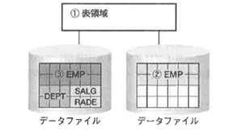

<html><body><h2 id="dbdesignTtl">4.4 データベースの構成要素</h2>

物理的な構成要素の具体例としてOracleデータベースの以下の要素について紹介します。

<ul>
<li>● メモリ</li>
<li>● ファイル</li>
<li>● データファイルと表領域の関係</li>
</ul>

まず、Oracleサーバ全体のイメージを以下に示します。

図4-5 Oracleサーバの全体のイメージ

<!--/.grayBox-->

<!--/section-->

<h3>4.4.1 メモリ</h3>

メモリ領域は、SGAとPGAの領域に大別できます。 
SGAはShared Global Areaの略で、共有メモリ領域を指します。 
PGAはProgram Global Areaの略で、クライアントからの要求に対する処理を行うサーバプロセスの排他的メモリ領域を指します。 
SGAの代表的な構成要素には、共有プール、DBバッファキャッシュ、REDOログバッファ、LARGEプール、JAVAプールなどがあります。

<h4 class="caption">メモリ全体</h4>

図4-6 メモリ要件の検討

<!--/.grayBox-->

メモリサイズは初期化パラメータで設定します。 
最初に設定した値で実際にアプリケーションを実行してみて、統計情報の取得、パラメータ値の変更、再稼動という手順を繰り返すことによって最適な値を求めます。 
このとき、値の変更は1コンポーネントごとに行います。 
値が最適かどうかを判断するには、1つずつ検証しないと、どのパラメータの変更が有効だったかわからないからです。

Oracleが使用できるメモリ領域が大きいほど、データベース処理の性能は向上します。 
実メモリからOSが使用するメモリ領域を除き、他のアプリケーションとの割合で決めます。

メモリ要件を決めるのは、パラメータファイル内のパラメータ値です。 
Oracle9iから、データベース稼働中に動的にパタメータを変更することが可能になりました。

<!--/section-->

<h4 class="caption">PGA</h4>

図4-7 PGA

<!--/.grayBox-->

<h4>PGAサイズ</h4>

SQL作業領域（XXX_AREA_SIZEパラメータで指定できる領域）およびスタック領域をもとに算出します。

SORT_AREA_SIZE=nMB 
HASH_AREA_SIZE=nMB 
BITMAP_MERGE_AREA_SIZE=nMB

<!-- /yellowBox -->

PGAの自動調整機能を使用します（共有サーバの場合は不可）。

PGA_AGGREGATE_JARGET=nMB（PGAサイズの合計値） 
WORKAREA_SIZE_POLICY=AUTO（自動チューニングを有効化）

<!-- /yellowBox -->
<h4>PGAの初期サイズ</h4>

PGAに割り当てる初期メモリサイズは、大まかに見積って以下のように考えることができます。 
ただし、初期値は必ず実稼動後の統計情報を確認して補正する必要があります。

アプリケーションによるメモリ要件として、DSS系のアプリケーションの場合は、大量のデータを読み込んで大規模なソートなどを行う領域としてPGAが使用されます。 
そこで、DSS系のアプリケーションを実行する場合には、共有メモリ領域は最小限にして、なるべく多くの領域をPGAに割り当てるようにします。

PGAの領域を割り当てるためのパラメータは、XXX_AREA_SIZEという命名規則をもちます。 
統計情報などから適切に見積ることができる場合は、手動でこの値を設定します。 
見積ることが難しい場合は、PGAの集計値の最大サイズだけ指定しておいて（PGA_AGGREGATE_TARGET）、PGAの最適化をOracleサーバに任せることもできます。

<ul>
<li>● OLTP系はOracleに割り当てるメモリサイズの20％くらいから</li>
<li>● DSS系はOracleに割り当てるメモリサイズの70％くらいから</li>
</ul>
<!--/section-->

<h4 class="caption">SGA</h4>

図4-8 SGA

<!--/.grayBox-->

<h4>SGAサイズ</h4>

SGAの最大サイズは以下の式に当てはめて求めます。

SGA_MAX_SIZE=Oracleで使用する総メモリ量-PGAメモリ量

<!-- /yellowBox -->

SGAに割り当てるメモリは、主に以下のパラメータで設定します。

<!--/section-->

<table class="tableBox">
<tr>
<th abbr="メモリ">メモリ</th>
<th abbr="パラメータ">パラメータ</th>
</tr>
<tr>
<td>共有プール</td>
<td>SHARED_POOL_SIZE</td>
</tr>
<tr>
<td>DBバッファキャッシュ</td>
<td>DB_CACHE_SIZE</td>
</tr>
<tr>
<td>REDOログバッファ</td>
<td>LOG_BUFFER</td>
</tr>
<tr>
<td>ラージプール</td>
<td>LARGE_POOL_SIZE</td>
</tr>
<tr>
<td>JAVAプール</td>
<td>JAVA_POOL_SIZE</td>
</tr>
</table>

表4-2 SGAに割り当てるメモリと初期化パラメータ

<!--/section-->

<h4>SGAの初期サイズ</h4>

SGAに割り当てる初期メモリサイズはPGAの割合の反対になります。 
OLTP系のトランザクションがメインで実行される環境の場合、共有メモリ領域SGAをなるべく大きく取得します。 
ただし、初期値は必ず実稼動後の統計情報を確認して修正する必要があります。

<ul>
<li>● OLTP系はOracleに割り当てるメモリサイズの80％くらいから</li>
<li>● DSS系はOracleに割り当てるメモリサイズの30％くらいから</li>
</ul>

なお、SGAに割り当てるメモリサイズはグラニュルサイズの倍数にする必要があります。 
<strong>グラニュル</strong>とは、連続する仮想メモリの単位で、以下の基準に基づき自動的に設定されます。

<ul>
<li>● SGA_MAX_SIZE（初期化パラメータ）＜128MB →グラニュルサイズ：4MB</li>
<li>● SGA_MAX_SIZE＞128MB →16MB</li>
</ul>

SHARED_POOL_SIZE、DB_CACHE_SIZEは、グラニユルサイズの倍数に指定します。 
倍数にならない場合、切り上げて領域が取得されます。

Oracle9iから、データベースをシャットダウンしなくても、SGAサイズの一部を動的に変更できるようになりました。 
これによって、日中はオンラインアプリケーションに有利なメモリサイズを指定しておき（SGAを大きく）、オンラインが収束したころにバッチに有利なメモリ割り当てを設定するように（PGAを大きく）、データベースを停止することなく、変更できるようになりました。

<h4>SGAサイズの変更</h4>

DBバッファキャッシュのサイズ変更は、初期パラメータでDB_CACHE_SIZEを指定したときのみ、動的変更が可能になります。 
Oracle8iまでの初期化パラメータDB_BLOCK_BUFFERSを指定した場合は、動的に変更することはできません。

<!--/section-->

<h3>4.4.2 ファイル</h3>

図4-9 信頼性を考慮すべきファイルの配置

<!--/.grayBox-->

<!--/section-->

<h4 class="caption">制御ファイル</h4>

データベースを構成する物理的なファイルの情報と、データベースの一貫性に関する情報を記録しています。 
データベース起動時にはインスタンスを起動した後、制御ファイルを読み込みます。 
その際、そこに記述されているすべてのファイルの存在と、ファイル間で一貫性がとれていることを確認した後、ファイルをオープンし、データベースをオープン状態にします。

起動時に制御ファイルが読み込めないと、データベースをオープンすることができません。 
このため、制御ファイルは多重化しておくことをお勧めします。 
制御ファイルを多重化するには、データベース作成時に、初期化パラメータのCONTROL_FILESに多重化するファイル名をカンマで区切って指定します。

control_files = （'ファイル名1', 'ファイル名2', 'ファイル名3'）

<!-- /yellowBox -->

制御ファイルを追加する手順を以下に示します。

<strong>【STEP1】</strong> データベースをabort以外の手順でシャットダウン

<strong>【STEP2】</strong> 制御ファイルをコピー

<strong>【STEP3】</strong> コピーしたファイル名を初期化パラメータに追加

<strong>【STEP4】</strong> データベースのstartup

制御ファイルは、多重化したファイルのうちの1つでも障害を起こすと、Oracleサーバのインスタンスが停止します。 
障害が起きた場合でも、正常な制御ファイルが1つでもあれば、障害を起こしたファイルに正常なファイルをコピーして上書きすることによって、障害は回復できます。

制御ファイルに障害が起き、多重化されていない場合、かつ現在の物理構成の状態を保持している制御ファイルのバックアップが存在しない場合、全データベースのファイル構造を確認し、制御ファイルの再作成文を発行しなければなりません。 
そこで、制御ファイルをバックアップする場合は、多重化し、データベースの物理構成が変更された場合にも対応できるように、次の2種類のバックアップを取得しておきます。

<ul>
<li>● OSのコピーコマンドによる物理バックアップ</li>
<li>● 現在の物理的なデータベースの状態を元に、制御ファイルを再作成するコマンドを作成するための論理バックアップを以下のコマンドで作成する 
alter system backup control file to 'ファイル名';</li>
</ul>
<!--/section-->

<h4 class="caption">REDOログファイル</h4>

データベースに対するすべての更新処理を記録するファイルです。 
更新処理そのもの（REDO情報）と、その更新を元に戻すための処理（ロールバック情報）の両方が記録されます。

書き込みのタイミングとして、トランザクションがコミットされた時点では、トランザクションすべての更新ログの書き込みが完了していることを保証しています。 
このため、コミットが完了した更新処理に関してはREDOログファイルが障害を起こさない限り、障害から回復されることが保証されています。

REDOログファイルが多重化されている場合、多重化された1つのメンバーが障害を起こしてもインスタンスは障害を起こさず、稼動を続けることができます。

インスタンス障害が起きたときに必要なのは、オンラインのREDOログファイルです。 
インスタンス障害後、次回起動時に、オンラインのREDOログファイルが読み込まれ、すべての更新処理を再実行します（<strong>ロールフォワード処理</strong>）。 
その後、トランザクションが仕掛中の更新処理は、更新を元に戻す処理を実行して（<strong>ロールバック処理</strong>）データベースを整合性のとれた状態に回復させます。 
この処理は、SMONと呼ばれるバックグランドプロセスによって自動的に実行されます。

<!--/section-->

<h4 class="caption">アーカイブログファイル</h4>

REDOログファイルをコピーしたファイルです。 
REDOログファイルの、あるロググループへの書き込みがいっぱいになってログスイッチが起きた後に、元のロググループをアーカイブログファイルへコピーします。コピー処理を行うのはARCHプロセスです。

履歴レコードが蓄積されたアーカイブファイルは、時系列で順序がわかるように、アーカイブファイルのファイル名の一部に、ログ順序番号が記述するように指定できます。 
初期化パラメータlog_archive_file='ファイル名'の「ファイル名」の記述の中に％sまたは％Sを指定することによって、ログ順序番号を埋め込むことが可能です。

アーカイブログファイルは、ディスク障害が起きたとき、回復作業のために必要となります。 
ディスク障害が起きた場合の回復手順は以下のとおりです。

障害の原因を突き止めた後、以下の手順を実行します。

<strong>【STEP1】</strong> 障害の起きたディスクを、以前取得したバックアップディスクに置き換える。 
このとき、コントローラが破損していた場合は、別のコントローラ上のディスクにバックアップファイルを配置する必要がある。

<strong>【STEP2】</strong> その後、バックアップディスクが作成された時点から、ブロックに対して変更された順番にREDOログを再実行することによって、最新の状態に戻す。 
再実行するのに必要なREDOログをコピーしてあるのがアーカイブログファイル。 
どのアーカイブファイルが必要かは、制御ファイルの情報から自動的に指示される。 
アーカイブファイルが破損している場合、ログの適用が実行できず、データベースの障害回復は困難になる。

<!-- /yellowBox -->

アーカイブファイルが破損してログの適用が実行できず、データベースの障害回復は困難になることを、<strong>不完全回復</strong>といいます。

アーカイブログファイルが破損するとディスク障害からの完全回復は困難になるので、アーカイブファイルは多重化することをお勧めします。 
ディスクの障害が一部であっても、そのディスクを回復するためのアーカイブファイルがすべて揃っていなければ、データベース全体の障害に広がってしまいます。 
これは、データベースの同期をとる必要があるためであり、一部のディスクのみが古いバージョンであることは許されないからです。

そのため、アーカイブファイルは必ず多重化するようにしてください。 
初期化パラメータに以下のように指定することによって多重化できます（以下は二重化）。

log_archive_dest_1='ディレクトリ名1' 
log_archive_dest_2='ディレクトリ名2'

<!-- /yellowBox -->
<!--/section-->

<h3>4.4.3 データファイルと表領域の関係</h3>

Oracleのデータベースファイルのうち、データファイルと、データファイルを複数まとめて管理する表領域について説明します。

<!--/section-->

<h4 class="caption">データファイル</h4>

データファイルとは、データベースで実際の表や索引といったオブジェクトを格納するファイルのことを指します。 
論理的な構造である<strong>表領域</strong>には、最低1つの物理ファイルとしての<strong>データファイル</strong>が対応します。 
バックアップ取得時/リストア時の最小単位になるので、大きすぎないサイズで設計しておくようにすると、バックアップ取得時問および障害回復時間を短縮することができます。

<!--/section-->

<h4 class="caption">表領域</h4>

表領域とは論理的な管理単位のことです。 
作成時に物理的なデータファイルを1つ以上指定する必要があります。表領域単位でブロックサイズを指定することができます。 
<strong>ブロックサイズ</strong>とは、Oracleで管理する論理的な単位のことです。 
OSのブロックサイズの倍数である必要があり、OracleでカウントするIOの最小単位です。

Oracle9iからは、表領域のデフォルトの管理方法はローカル管理です。 
ローカル管理の場合、表領域単位でエクステントサイズを指定します。 
<strong>エクステント</strong>とは、連続した複数ブロックの領域のことを指します。表や索引などのセグメントを作成する際、連続領域を確保することによって、効率よくデータの挿入や参照時のメモリへの読み込みを実行できます。

図4-10 表領域とデータファイル

<!--/.grayBox-->

<strong>ローカル管理の表領域</strong>とは、Oracle8iから追加された機能です。 
それ以前は、表領域内の空き領域と使用済みの領域（何らかのセグメントによって定義済）の定義は、SYSTEM表領域のデータディクショナリですべて管理されていました。

ローカル管理の表領域では、領域管理はすべてデータファイル内のビットマップで行います。 
このため、ローカル管理の表領域による領域管理は、領域情報の変更のたびにSYSTEM表領域のデータディクショナリにアクセスを行う必要がなくなり、パフォーマンスが向上します。

CREATE TABLESPACE表領域名 
DATAFILE 'ファイル名1' SIZE 500M, 
　　　　　　　　'ファイル名2 ' SIZE 500M 
EXTENT MANAGEMENT LOCAL　<strong>←ローカル管理の表領域の指定</strong> 
UNIFORM SIZE 500K　　　　　　　　<strong>←ローカル管理の表領域の指定</strong> 
BLOCKSIZE 8K;　　　　　　　　　　　　<strong>←ローカル管理の表領域の指定</strong> 

<!-- /yellowBox -->

ローカル管理の表領域のエクステントサイズは、ユーザ指定の固定値にするか、Oracleの自動管理にするかを指定することができます。

<!--/section-->

<table class="tableBox">
<tr>
<th style="width:120px;" abbr="パラメータ">パラメータ</th>
<th abbr="説明">説明</th>
</tr>
<tr>
<td>UNIFORM SIZE</td>
<td>管理者が指定したサイズで、スキーマオブジ工クトの連続領域エクステン卜を獲得する すべてのエクステントが指定されたサイズで取得される</td>
</tr>
<tr>
<td>AUTOALLOCATE</td>
<td>エクステントサイズはシステムによって自動的に管理される エクステントサイズは、スキーマオブジェクトの拡張に従って、64KB、1MB、8MB、64MBと拡張する</td>
</tr>
</table>

表4-3 ローカル管理の表領域のエクステントサイズ

<!--/section-->

<h4 class="caption">表領域の設計</h4>

管理の容易性を考慮して表領域を分割する場合は、以下の点に注意してください。

<ul>
<li>● 表や索引は、作成時にどの表領域に作成するかを指定する</li>
<li>● 表領域を作成する際、まずアプリケーション単位に表領域を分ける 
理由は、障害時の局所化のため 
ディスク障害が起きた場合、障害の起きたボリュームを含む表領域は、障害回復のためにオフラインにする 
当該ボリュームを使用していた表領域のアプリケーションは、回復作業のため使用できなくなるが、それ以外のアプリケーションは処理を続行できる</li>
<li>● 更新頻度によって分ける。更新頻度が0のものは読み取り専用表領域にし、更新頻度の低いものと高いものを分けて、バックアップを取得する頻度を変える</li>
<li>● オンラインバックアップを取得する際、表領域が業務ごとに分かれていれば、それぞれの業務のピーク時を避けて、表領域のバックアップ取得のタイミングをずらしてスケジュールを立てることができる</li>
</ul>

表領域の特性と表の特性に応じて表領域を分書ける場合は、以下の点に注意してください。

<ul>
<li>● 表領域単位でブロックサイズが同じアプリケーションでも、エクステントサイズやブロックサイズを考慮して、大きい表と小さい表で表領域を分けるようにする</li>
</ul>

競合を意識して分割する場合は、以下の点に注意してください。

<ul>
<li>● 索引を使用するアプリケーションは、表と索引はほぼ同時にアクセスするため、表領域を分ける 
また、表領域を分けただけでは意味がなく、物理ボリュームも分けるようにすること</li>
<li>● 同時にアクセスする可能性の高いオブジ工クトは、異なる表領域に格納し、ボリュームも分ける 
パーティション化した表の各パーティションなど</li>
</ul>

バックアップ取得の最小単位がデータファイルです。 
障害の局所化、バックアップ取得の時間などを考慮して、データファイルのサイズはあまり大きくしないようにしてください。

図4-11 表領域とデータファイル

<!--/.grayBox-->

<!--/section-->

<h4 class="caption">特別な表領域</h4>

データベースサーバがデータベースを管理するために使用する表領域を指します。

<h4>SYSTEM表領域</h4>

データベース作成時に作成されます。 
データベース内のすべてのオブジェクトに関する定義情報をもちます（<strong>データディクショナリ</strong>）。 
システム表領域のサイズは、Oracleのオプション製品の数とユーザ作成のストアドプロシージャの量によって決まります。 
特にオプション製品を選択せず、ストアドプロシージャも作成しない場合は、約200MBで作成されます。 
通常200MBから500MBくらいまでの間で設定し、調整します。

<h4>SYSAUX表領域</h4>

SYSTEM表領域の補助表領域としてOracle10gから登場しました。 
セッションごとに実行されるSQLの各種統計情報を、デフォルトでディスク上のSYSAUX表領域に書き込んでいます。 
パラメータを設定することによって、統計情報の取得を制御できます。 
制御できるのは、統計情報の詳細レベル、保持期間、統計差分を取得する間隔です。 
格納するログ情報によって、ディスク容量は大量に必要になりますので、チューニングの必要性を考慮して適切なパラメータを設定する必要があります。

<h4>UNDO表領域</h4>

更新前の状態に戻すための処理を、トランザクション単位で管理します。 
OLTP系（更新が多い）システムでは、更新前情報を書き込むため、IOが頻繁になる可能性が高くなります。 
Oracle8iまでは、表領域に管理者が明示的にRBS（ロールバックセグメント）を作成する必要がありました。 
ロールバックセグメントの設計は、パフォーマンスに関係する部分が多いため、若干補足説明をします。 
Oracle9iからは自動UNDO管理機能が追加され、管理者がロールバックセグメントを作成する必要はなくなり、サーバが自動的にロールバックセグメントを作成し、エクステントサイズの拡張などの管理を自動的に行います。

自動UNDO管理を実装する場合には、以下の設定を行います。

<ul>
<li>● UNDO表領域の作成</li>
<li>● 初期パラメータの設定 
UNDO_TABLESPACE=表領域名　　　　　 UNDO_MANAGEMENT=AUTO 
UNDO_SUPRESS_ERRORS=TRUE　　　UNDO_RETENTION=n（秒）</li>
</ul>

ロールバックセグメントを作成する場合には、次の点に注意して設計を行います。

<ul>
<li>● ロールバックセグメントの数 
ピーク時の同時接続セッション数÷4</li>
<li>● ロールバックセグメントのエクステントサイズ 
1トランザクションで必要なロールバック情報の領域サイズをブロック単位で切り上げて求める</li>
<li>● ロールバックセグメント当りのエクステント数 
10から20個（エクステントの拡張をおこさないための数）</li>
<li>● 長いトランザクション用のロールバックセグメントは別に作成して、トランザクション開始時に明示的にロールバックセグメント名を指定して使用する 
ALTER SESSION SET use_rollback_segment=RBS名;</li>
</ul>

UNDO表領域もローカル管理表領域として作成します。UNDO表領域のサイズは、100MB以上、最低でも、作成されるテーブルのうち最も大きいサイズの表の大きさを指定します。

<h4>一時表領域</h4>

メモリ上（PGA）でソートできないような大規模なソートが発生した場合、ソート結果を一時的にディスク上に書き出し、最終的にメモリ上でマージした結果をユーザに戻します。 
頻繁に大規模なソートを行うDSS系のシステムでは、I/Oが頻発する可能性があります。 
Oracle8i以降の一時表領域は、自動的にローカル管理の一時表領域を使用します。 
この場合、一時表領域内で実行されるDML文はREDOエントリを生成しないため、パフォーマンス上、改善されています。

Oracle9iからは、デフォルトー時表領域を作成することができるようになりました。 
これは、ユーザが大規模ソートを実行して一時表領域を使うことになった場合、明示的に各ユーザごとに一時表領域を指定しておかなくても、自動的にデフォルトー時表領域を使用することができるようになる機能です。 
この機能によって、一時表領域としてSYSTEM表領域を使用するリスクを回避することができるようになりました。

一時表領域のサイズの指針としては、最低でも作成されるテーブルのうち最大サイズの表の2倍の大きさを指定してください。 
また、エクステントサイズは、大容量のソートを行うための初期化パラメータSORT_AREA_SIZEの整数倍に設定します。

<h4>表サイズの求め方</h4>

物理設計では、表容量の見積りを行い、表を格納する表領域を決め、最終的には、ボリュームごとの物理ファイルの配置、容量見積り、ディスク分割を行います。 
その一番元になる表容量の見積りについて説明します。

見積りに必要な情報は、表に含まれる行数（予測値）、各列の平均的な長さとデータ型、ブロック内空き領域の割合（PCTFREE：表作成時に指定するパラメータ）の3つです。 
データブロック当たりに利用可能なデータ領域は、以下の式で求めます。

利用可能データ領域＝ブロックサイズ－約100バイト（ブロック管理領域） 
　　　　　　　　　　　　　－（ブロックサイズ－約100バイト）×PCTFREE/100）

図4-12 利用可能なデータ領域の計算

<!--/.grayBox-->

<h4>PCTFREEと行移行</h4>

PCTFREEの値は、ブロック内の空き容量の割合を示します。
表と索引では、この空き領域の使用方法が異なります。

表の場合、行データがUPDATEされて行長が拡張された場合に、その拡張分をブロック内に収めるために使用される空き領域として設定されます。
表によって、挿入時の行長と、後からUPDATE文によって拡張される行長の差分は異なるので表ごとに指定します。
ブロックに初めて行が挿入されるとき、空き領域で指定された部分まで行データは挿入されますが、それを超えることはありません。

PCTFREEの値はデフォルトが10％です。 
行長が長くなるのに対してPCTFREEの値が小さい場合、ブロック内の空き領域は不足します。 
いずれかのタイミングで、更新後の行が同じブロックに書き込めなくなると、新しいブロックに、長くなった行データを移し、そこへのボインタを元のブロックに置きます。 
これを<strong>行移行</strong>と呼びます。 
行移行が起きると、索引を使って行を特定しようとしたとき、該当のブロックに行はなく、移行先のブロックを走査する必要があるため、パフォーマンスが低下します。

図4-13 行移行

<!--/.grayBox-->

平均的な行長は以下の式で求めます。

平均的な行サイズ＝行ヘッダ＋Σ（列ヘッダの長さ＋列値の長さ） 
　　　　　　　　　　　 ＝3＋Σ（1＋列値の長さ）

<!-- /yellowBox -->

<!--/section-->

<table class="tableBox">
<tr>
<th style="width:100px;" abbr="データ型">データ型</th>
<th abbr="列長の計算式">列長の計算式</th>
<th abbr="備考">備考</th></tr>
<tr>
<td>NUMBER</td>
<td>桁数÷2＋1</td>
<td>&nbsp;</td>
</tr>
<tr>
<td>CHAR</td>
<td>データ型で宣言したバイト数</td>
<td>CHARは固定長</td>
</tr>
<tr>
<td>VARCHAR2</td>
<td>データ型で宣言したバイト数÷2</td>
<td>およその想定値</td>
</tr>
<tr>
<td>DATE</td>
<td>7バイト</td>
<td>DATE型は固定長7バイト</td>
</tr>
</table>

データ型と列長の計算式

<!--/section-->

図4-14 列長の計算

<!--/.grayBox-->

必要なブロック数は以下の式で求めます。 
（注：実際には、最終的に求められたブロック数の10％から20％大きめに見積る）

ブロック当たりの平均行数（切り捨て）＝利用可能データ領域÷平均的な行サイズ 
必要なブロック数（切り上げ）＝表に含まれる行数÷ブロック当たりの平均行数）

<!-- /yellowBox -->

図4-15 ブロック数の計算

<!--/.grayBox-->

<!--/section-->

</body></html>