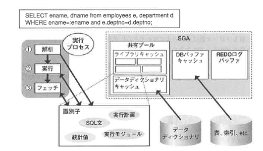
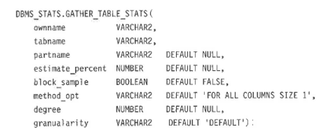
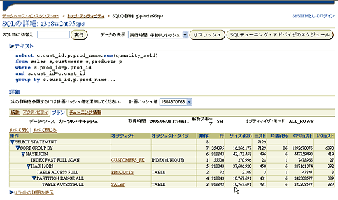
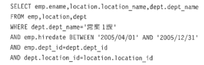
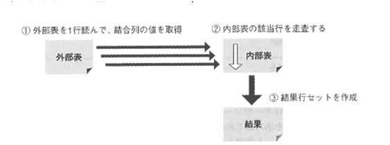
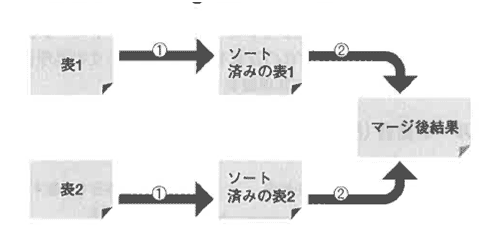
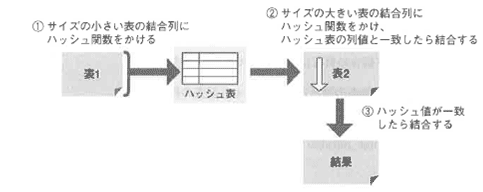

<html><body><h2 id="dbdesignTtl">4.5 パフォーマンスアップ</h2>

SQLが実行される際に、性能をあげるためには以下の点を理解している必要があります。

<ul>
<li>● SQLはOracleサーバ内でどのような手順を踏んで実行されるのか</li>
<li>● 性能を発揮するためには何をすべきか</li>
</ul>

図4-16 SQLが実行されるまでのフロー

<!--/.grayBox-->

効率のよいデータベースを設計するためには、データベース管理者として、SQLが実行される仕組みを理解し、アプリケーションに応じた設定を行う必要があります。 
ここでは、パフォーマンスに関係するSQLの処理について、以下の順に説明します。

<ul>
<li>● SQL文実行の流れ</li>
<li>● 実行計画作成のために必要な統計情報の取得方法</li>
<li>● 実行計画の確認方法</li>
<li>● 実行計画の読み方とSQLチューニングのための考慮点</li>
</ul>
<!--/section-->

<h3>4.5.1 SQL文実行の流れ</h3>

まず、SQL文が実行されるまでの処理の流れを確認します。 
SQL文そのものはテキスト文ですから、SQL文を実行できる形の<strong>実行モジュール</strong>に変換する必要があります。 
処理は大きく<strong>解析</strong>、<strong>実行</strong>、<strong>フェッチ</strong>の3つのフェーズに分けられます。

<ul>
<li>● <strong>解析フェーズ</strong>：解析処理では、SQL文の文法のチェックや、構文中に含まれるオブジェクトの存在や権限に関するチェックを行います。 
また、表や索引の統計情報より、SQL文を実行するのに最適なアクセスバスや結合処理を選択し、実行計画を作成します。 
作成された実行計画を元に実行モジュールが作成され、これらのオブジェクトがSGA上の共有プール内のライブラリキャッシュに格納されます。 
格納されたオブジェクトは、まったく同じSQL文が次に実行される際に再利用されます。</li>
<li>● <strong>実行フェーズ</strong>：解析フェーズで取得された実行モジュールに、必要に応じて変数を代入し、実行します。 
実行フェーズで「物理読み込みブロック数が多い」「アクセスするブロック数が多い」「ソート処理でIOが頻発する」などの状況を読みとれる場合が多い傾向にあります。</li>
<li>● <strong>フェッチフェーズ</strong>：配列をうまく使用していないと、1回のフェッチで1行しか取得しないなどの効率の悪い処理を行っていることがわかります。</li>
</ul>

処理手順を詳しく迫っていき、その中でチューニングのポイントを紹介します。

<strong>【STEP1】</strong> 
まず、ライブラリキャッシュ上に同じSQL文（またはPL/SQLプロシージャ）がないかどうかを調べます。 
一度解析されたSQL文（またはPL/SQLプロシージャ）は、他のプロセスと共有できるようにするため、共有プール上のライブラリキャッシュに格納されます。 
共有プールが小さすぎると、せっかく解析された結果が上書きされてしまいます。 
共有プールのサイズは、管理者がメモリパラメータSHARED_POOL_SIZEを指定することによって決められます。 
共有プールのサイズが適切であるかどうかを調べるためにv$library_cache動的パフォーマンスビューを問い合わせます。 
列pinsの値は総実行回数を、pin列の値は実行時に共有できるSQLがライブラリキャッシュ上に存在した回数を示します。 
v$library_cacheの1-pin/pinsの値が1％を超えていたら、領域が不足しているため、解析済みのSQLが上書きされていることを示します。

<strong>【STEP2】</strong> 
もし、ライブラリキャッシュに同一のSQL文がある場合、すでに存在する実行モジュールを実行するだけで、解析フェーズの処理を割愛することができます。 
この解析処理をSOFT PARSEと呼びます。 
同様のSQLを大量に処理するようなOLTP系の処理では、ここがひとつのチューニングポイントになります。 
同一のSQL文かどうかの比較は、テキスト形式のSQLをASCIIのコードに変換し、そのコード値を使用して行います。 
そこで、完全に同じSQL文である必要があり、スペースの数、大文字小文字もすべて一致している必要があります。 
WHERE条件式も、値のレベルまで一致している必要があるため、条件式の値はパインド変数を使用することによって、同じ式であると思わせるようにします。 
パインド変数の代入は、解析フェーズの後で行うため、代入前の式は同一のSQL文として実行されます。

<!-- /yellowBox -->
<!--/section-->

<h4 class="caption">パインド変数の使い方の例</h4>

<ul>
<li>● PL/SQLの場合：変数をそのまま使う 
</li>
<li>● Javaの場合：PreparedStatementを使用する。""で囲まれた部分に変数を代入する。 
</li>
<li>● Pro*シリーズの場合：変数を使用してEXEC SQLキーワードの後にSQL文を埋め込む例を記述。ソースで最初に宣言された変数は、SQL文中で「：変数名」という形で使用される。 
</li>
</ul>

<strong>【STEP3】</strong> 
ライブラリキャッシュにSQL文が存在しなかった場合、図4-17の手順でSQL文を解析します。 
この解析処理をHARD PARSEと呼びます。

<!-- /yellowBox -->

図4-17 HARD PARSE

<!--/.grayBox-->

このように、解析フェーズでコストをかけて作成された実行計画や実行モジュールは、比較元となるSQL文本体とともに共有プールのライブラリキャッシュに格納され、共有できるようになります。

<!--/section-->

<h3 id="h3_4_5_2">4.5.2 統計情報の収集</h3>

統計情報を収集するための代表的な2つの方法を説明します。 
ANALYZEコマンドとDBMS_STATSパッケージです。

2つともほぼ同じ機能をもっていますが、DBMS_STATSパッケージを使用すると、統計情報を収集する単位を指定して、まとめて収集することができます。 
収集する単位とは、表単位、ユーザ単位、データベース単位などを指し、どの単位でまとめて統計情報を収集するかによって、プロシージャを使い分けます。

<ul>
<li>● ANALYZEコマンド
テーブルの全行情報を収集（小さい表の場合）</li>
<li>● ANALYZE TABLEスキーマ名.テーブル名[PARTIT10N（パーティション名）] 
COMPUTE STATISTICS［for_clause］; 
テーブル内サンプリング情幸別文集（大規模な表の場合、サンプリングしないと、統計情報収集のみで数時間かかる可能性がある。サンプリング率は5％～10％）</li>
<li>● ANALYZE TABLEスキーマ名.テーブル名[PARTITlON（パーティション名）] 
ESTIMATE STATISTICS[（for_clause）SAMPLE integer｛ROWS | PERCENT｝］；</li>
</ul>

<strong>【for_clause句構文】</strong> 
FOR {TABLE | ALL INDEXED COLUMNS SIZE integer | 
COLUMNS SIZE integer column SIZE integer * | ALL LOCAL INDEXES}

<strong>SIZE integerはヒストグラムのバケット数</strong> 
ヒストグラムの統計情報は、値によって該当する行数が著しく異なるような列に対して作成すると効果的です。 
たとえば、「性別」という列の値に「男性」と「女性」しかない場合でも、「女性」の行が全体の1％だった場合、WHERE条件式で「WHERE 性別＝'女性'」のような指定があった場合、「性別」列に索引を作成しておき、ヒストグラム統計をとることによって、値に「女性」と指定された場合のみ索引を使用するという選択ができます。 
SIZE句で指定するintegerは、バケット数を指定します。 
バケット数が多いほど正確な統計値を取得できますが、統計の取得に時間がかかります。 
ヒストグラム統計はすべての列に取得する必要はなく、値によって索引の使用が効果的だと思われる列にだけ作成してください。

<!-- /yellowBox -->

<!-- /yellowBox -->
<ul>
<li>● DBMS_STATS.GATHER_TABLE_STATS 
表、列、索引の情報を収集 
</li>
<li>● partname：
パーティション名</li>
<li>● estimate_percent： 
サンプリングする行のパーセンテージ 
適切な統計を行うための最適なサンプルサイズを0racleで決定するためには、定数DBMS_STATS．AUTO_SAMPLE_SIZEを使用</li>
<li>● block_sample： 
ランダム行サンプリングの代わりにランダムブロックサンプリングを使用する</li>
<li>● method_opt： 
ヒストグラムのサンプリング 
FOR ALL INDEXED COLUMNS SIZE｛integer | AUTO｝ 
（AUTOと指定すると、列のデータ配分とワークロードに基づいて、ヒストグラムを収集する列を判断する</li>
<li>● degree： 
並列度</li>
<li>● granualarity： 
パーティションの場合のみ指定</li>
<li>● subpartition： 
サブパーティションレベルの統計情報を収集</li>
</ul>
<!--/section-->

<h4 class="caption">SQL統計情報の見方</h4>

SQL統計情報を分析する場合には、以下の点に注意して確認してください。

<ul>
<li>● 最終的に必要とされる行数に対して、アクセスしたブロック数： 
索引を使用していないと、無駄なブロックのアクセス数が増える</li>
<li>● 最終的に必要とされる行数に対してフエッチした回数： 
配列による結果行の取得を行っていないと、1回のフェッチで1行の読み込みしか行っていない場合がある</li>
<li>● アクセスしたブロック数に対して、ディスクから物理的に読み込んだブロック数： 
DBバッファキャッシュ上で、ブロックの共有ができていないと、物理読み込みの回数が増える 
OLTP系のアプリケーションでは、90％以上のブロック共有が理想的といわれるが、共有できない理由として、次のような理由が考えられる </li>
<li>● DBバッファキャッシュのサイズが小さいため上書きされる</li>
<li>● 適切な索引が作成されていないため、全表検索が選択される</li>
<li>● パインド変数などが使われず、SQLの共有ができていない</li>
<li>● ディスクソートが必要だった回数： 
大量の行データに対してソートを行うのに対して、PGAに割り当てられた領域「SORTJREA_SIZEで指定」が小さく、一時表領域への読み書きが発生したことが考えられる</li>
<li>● CPU時間に対するELAPSED TIME： 
ELAPSED TIMEがCPU時間に対して長い場合、実際に処理をしているCPU時間よりもディスクIOの読み込み待ちや、ネットワークによる待ちに時間がかかっていることが考えられる
これは、並行処理を行ううえで多重度が高くなったため、ディスクIOなどで競合が起きている可能性を示す</li>
<li>● 再解析が行われたか： 
OLTP系のアプリケーションでは、なるべくSQL文が共有されている方が望ましい 
再解析が行われていた場合、SQL文が共有できる記述になっていない、共有するための共有プールのサイズが不足していたなどの理由が考えられる</li>
</ul>
<!--/section-->

<h3>4.5.3 実行計画の確認方法</h3>

次に実際に実行された実行計画を確認し、どのくらいリソースが使用されたか、どのようなアクセスパスが使用されたかを確認します。 
実行計画の確認方法として、以下のような方法があります。

<ul>
<li>● EXPLAIN PLAN文（1SQL文単位に確認）</li>
<li>● SQLトレースの取得＋TKPROFによる解析</li>
<li>● STATSPACKレポート</li>
<li>● AUTO TRACEオプションの使用</li>
<li>● v$sql_planを参照</li>
<li>● Oracle Enterprise ManageのGUlツールの使用</li>
</ul>

上記について、使用方法、特徴、サンプルを紹介します。 
まず、それぞれの文を実行する前に、実行するユーザの所有表として、実行計画および結果を格納するPLAN_TABLEを作成します。 
ORACLE_HOME/rdbms/admin/utlxplan.sqlを実行して作成します。

<!--/section-->

<h4 class="caption">EXPLAIN PLAN文（1SQL文単位に確認）</h4>

SQL*Plusにて、次の文を実行します。

<strong>【STEP1】</strong> 
EXPLAIN PLAN FOR分析したいSQL文； 
その結果がPLAN_TABLE表に格納されます。 
実行結果は取得されず、解析のみを行います。 
格納された情報はそのままでは理解しにくいため、結果を成形し、実行結果を確認します。 
結果を成形するには以下のSQL文を実行します。

<strong>【STEP2】</strong> 
ORACLE_HOME/rdbms/admin/utlxpls.sql

<!-- /yellowBox -->

EXPLAIN PLAN文と、utlxpls.salで成形した実行計画は、次のように表示されます。

<!--/section-->

<h4 class="caption">表SQLトレースの取得＋TKPROFによる解析（複数のSQLをまとめて分析）</h4>

この方法は、実際に処理にかかったCPUタイムやアクセスしたブロック数が、各フェーズ（解析、実行、フエッチ）ごとに表示される点が特徴です。 
SQLのトレースを取得する範囲は、初期化パラメータで指定します。 
SQL_TRACEパラメータの値をTRUEにしてからFALSEに戻すまでの間のSQL文のトレースがすべて取得されます。

SQLを実行しているインスタンスレベルで取得したい場合には初期化パラメータファイルでSQLTRACE=TRUEを指定します。 
SQL文を実行するセッション単位でトレースを取得するには、以下を指定します。

ALTER SESSION SET SQL_TRACE:TRUE

<!-- /yellowBox -->

トレースファイルは、初期化パラメータ「user_dump_dest=ディレクトリ名」で指定したディレクトリに取得されます。

TKPROFユーティリティを使用すると、取得されたファイルを分析する際、問題のあるSQL文を抽出して、分析結果をレポートすることができます。 
問題のあるSQL文とは、たとえば、以下のような点に注目してレポートに抽出します。

<ul>
<li>● 物理IOが大量に必要なSQL</li>
<li>● 大量にブロックアクセスを行ったSQL（物理IOなしのアクセスを含む）</li>
<li>● CPU時間が長くかかったSQL</li>
</ul>

TKPROFはOSプロンプトで実行します。 
上記のような問題のあるSQLを、物理IO数が多い順やCPU時間の長い順にソートし、上位n個を出力ファイルに列挙するという指定をオプションで指定します。 
実行の構文は次のとおりです。

TKPROF取得したトレースファイル名アウトプットファイル名オプション;

<!-- /yellowBox -->
<!--/section-->

<h4 class="caption">STATSPACKレポート</h4>

STATSPACKレポートは、指定した時間帯でリソース使用率の高いSQL文を見つけ出すために使用することができます。 
レポートには、「物理読み込みブロック数の多い順」「アクセスするブロック数の多い順」「解析に時間のかかった順」にSQL文がリストされているため、どのSQL文がボトルネックになっているか特定することができます。

また、統計情報は、統計情報のスナップショットを随時取得しておき、統計情報を取得したいインターバルを決めます（たとえば、トランザクションピーク時の午前10：00から12：00まで）。 
そして、レポートを作成するときに、開始時に取得したスナップショットのIDと、終了時に取得したスナップショットのIDをパラメータで指定し、その間の差分をレポートとして作成します。

また、レポートの詳細さを示すレベルを指定することもできます。 
デフォルト値は5です。 
レベル7を指定すると、RACのチューニングをする際に必要な統計情報も収集することができます。

STATSPACKレポートの作成方法を以下に示します。 
詳細はOracleのマニュアル「パフォーマンスガイドおよびリファレンス」を参照してください。

<strong>【STEP1】</strong> 
SQL*Plusを起動し、Sysdba権限をもつユーザで接続

<strong>【STEP2】</strong> 
ORACLE_HOME/rdbms/admin/spcreate.sqlを実行して環境を作成 
（スクリプト実行中に下記内容を対話式に聞かれる）

<strong>【STEP3】</strong> 
スキーマユーザ「perfstatユーザ」の作成 
（途中でパスワードを指定する必要あり）

<strong>【STEP4】</strong> 
指定した表領域に必要なオブジ工クトを作成 
（オブジ工クトを作成する表領域と一時表領域を途中で指定する必要あり）

</blockquote>

環境を構築したら、スナップショットを取得します。 
また、時間の統計情報を収集するために、初期化パラメータTIMED_STATISTICSを設定します。

<!-- /yellowBox -->

環境を構築したら、スナップショットを取得します。 
また、時間の統計情報を収集するために、初期化パラメータTIMED_STATISTICSを設定します。

<strong>【STEP1】</strong> 
SQL*PIusを起動し、SySdbaの権限をもつユーザで接続し、時間の統計情報取得の設定を行う 
ALTER SYSTEM SET TIMED STATISTICS＝true; 
（時間統計情報は負荷が高いため、統計情報を収集しないときはFALSEを指定しておくこと）

<strong>【STEP2】</strong> 
SQL*PIusを起動し、Perfstatユーザで接続 
perfstat.snapプロシージャを実行（適切な間隔で収集し続ける） 
EXECUTE perfstat.snap; 
スナップショットを自動収集するためには、DBMSJOBパッケージを使用しますが、その他の設定も必要です。 
詳しくはマニュアルを参照してください。 
スナップショットを取得した後、開始スナップショットIDと終了スナップショットIDを指定してレポートを出力します。

<strong>【STEP3】</strong> 
SQL*PIusを起動し、Perfstatユーザで接続。次のSQL文を実行します。 
ORACLE_HOME/rdbms/admin/spreport.sql; 
このSQLを実行すると、これまでに取得されたスナップショットのリストが表示されます。 
レポートを作成する際に必要な開始と終了のスナップショットを指定するプロンプトに答えます。

<!-- /yellowBox -->
<!--/section-->

<h4 class="caption">AUTOTRACEオプションの使用</h4>

AUTOTRACEオプションはSQL*Plusから簡易に実行計画を確認できる機能です。 
このオプションを指定することによって、実行結果の出力を抑制し、実行計画と統計情報のみを表示することができます。

ただし、詳細な統計情報までは取得できないので、索引などのオブジェクトを追加した後、実行計画が変更されたかを確認するためなどに使うことができます。 
また、AUTOTRACEオプションはデフォルトで使用できるようにはなっていないため、使用する場合には以下の準備が必要です。

<strong>【STEP1】</strong> 
sysdba権限をもっているユーザで、以下のSQL文を実行します。 
ORACLE_HOME/sqlplus/admin/plustrce.sql

<strong>【STEP2】</strong> 
STEPlのSQL文の実行によって作成されたロールplustraceを、AUTOTRACEオプションを使用するユーザに付与します。 
GRANT plustrace TOユーザ名:

<strong>【STEP3】</strong> 
plustraceロールを付与されたユーザで、AUTOTRACEオプションの使用を可能にします。

<strong>【STEP4】</strong> 
SQL*Plusで以下を実行します。 
set auto trace{on|on explain| on statistics | traceonly|}

<strong>【STEP5】</strong> 
SQL文を実行します。

<!-- /yellowBox -->

まず、どのSQL文がリソース使用上問題があるかを突き止める必要があります。 
そのためには、インスタンス全体の統計情報を確認しなければなりません。 
その意味で、まずSTATSPACKレポートを取得し、実行回数が多く、リソースを多く使用しているSQL文を抽出します。 
そして、問題をもつSQL文にめぼしをつけ、そのSQL文を分析するセッションを決め、EXPLAIN PLAN文を実行するか、そのセッションでSQL文のトレースを取得して分析します。

<!--/section-->

<h4 class="caption">v$sql_planを参照</h4>

Oracle10gから、v$sql_planを問い合わせて、任意の文の実行計画、コスト計算結果を取得することができるようになりました。 
実行した文のSQL_ID（データベース内で管理されているSQL文の識別子）を取得するためには、v$sqlを問い合わせます。

上記SQL文で取得したsql_idを使用してv$sql_planを問い合わせるためには、DBMS_XPLAN.DISPLAY_CURSOR()ファンクションを使用します。

非常に見やすく、有効な情報を取得することができますが、v$sql_planへの問い合わせは、それ自体がコストのかかる処理であるため、ピーク時に大量の文を発行することは避けてください。

<!--/section-->

<h4 class="caption">Oracle Enterprse ManagerのGUlツールの使用</h4>

Oracle10gのDBコンソール機能から取得されたSQL情報の一部を以下に表示します。 
ここでは、過去に実行されたSQLのうち、リソース消費率が高かったものをリスト表示し、その実行計画をGUI画面から確認することができます。 
DBコンソール機能を使用して、SQLチューニングアドバイザによるSQLチューニング推奨事項を取得することもできます。

<!--/section-->

<h3>4.5.4 実行計画の読み方とSQLチューニングのための考慮点</h3>

実行計画を読む場合に、着目すべきポイントを以下に示します。

<table class="tableBox">
<tr>
<th style="width:120px;" abbr="アクセス方法">アクセス方法</th>
<th abbr="実行計画での表示">実行計画での表示</th>
</tr>
<tr>
<td>全件検索</td>
<td>TABLE FULL SCAN</td>
</tr>
<tr>
<td rowspan="2">索引によるアクセス</td>
<td>INDEX UNIQUE SCAN（ユニークインデックス）＋TABLE ACCESS BY INDEX ROWID（索引エントリのROWIDを使って表のブロックにアクセス）</td>
</tr>
<tr>
<td>lNDEX RANGE SCAN（範囲検索、1つの値で複数の索引エントリがある場合）＋TABLE ACCESS BY INDEX ROWID（索引エントリのROWIDを使って表のブロックにアクセス）
</td>
</tr>
<tr>
<td>索引の高速スキャン</td>
<td>INDEX FAST FULL SCAN</td>
</tr>
</table>

表4-4 表へのアクセス方法

最終的に取得する行が表の全行でない場合、適切な索引によって行を絞り込み、アクセスするブロック数を減らすことができます。 
全件検索、索引検索については<a href="../03_01/index.md">第3章「論理設計」</a>で詳細に説明したので、ここでは適切な索引を作成するポイントを説明します。

全件検索より、索引を使って検索した方がアクセスするブロック数が少ない場合、どちらが高速かは、物理アクセス回数が少ない方が速いといえます。 
全件検索の場合、マルチブロックリードを行うので、対象行を取得するために必要なアクセス回数は、ブロックを取得するための給アクセス回数になります。 
全件検索の場合に1回のアクセスで取得するブロック数は、初期化パラメータdb_file_multiblock_read_countで指定します。 
デフォルトは8ブロックです。 
一方、索引を使った場合、1回のアクセスで取得できるブロック数は1ブロックです。

一般的には、WHERE条件式で列値を指定して、全行のうち10％以下に放り込める場合、索引の作成が有効と考えられています。

複数列の組み合わせで索引を作る場合、索引を作成する際の列の順序が重要です。 
最初に指定する列は、必ずWHERE旬で条件式に使用される列である必要があります。 
どの列も同じ程度に指定される場合は、より一意性の高い列を先に指定します。

<strong>【CASE1】値によって一意性の高い列または列の組み合わせを条件式で指定する</strong> 
「<a href="#h3_4_5_2">4.5.2 統計情報の収集</a>」で説明したように、列にある値を指定した場合のみ、行を絞り込む一意性が高くなる場合、ヒストグラム統計を収集する必要があります。 
このように備によって、索引の使用/未使用をオプティマイザが判断する必要がある場合には、値にパインド変数を使用してはいけません。 
パインド変数を指定した場合、ヒストグラムの統計情報は参照されないためです。

<strong>【CASE2】NULL値を多く含むが、それ以外の値の一意性は高い列</strong> 
B*tree索引ではNULL備には索引エントリを作成しません。 
NULL値の模索には索引を使いませんが、列値を指定した場合に絞り込むことができるのであれば、索引の作成は有効です。

<strong>【CASE3】他表と結合する外部キー列</strong> 
分析業務を行う際のファクト表（売上表など）の、マスタ表と結合する際の外部キー列に、BITMAP索引を作成することは非常に有効です。 
結合のための条件式、および複数の条件式の組み合わせでファクト表の行を絞り込む際、列値の一意性は高くなくても、BITMAP索引の場合、列の組み合わせで行を特定することが容易にできるため、非常に効率よく行を選択することができます。

<!-- /yellowBox -->
<!--/section-->

<h4 class="caption">結合の順番</h4>

代表的な結合の種類としては、ネステッドループ、ハッシュジョイン、ソートマージの3種類を挙げることができます。
結合のコストは、どの表を先に検索するか、表をどの順で結合するかが大きく影響します。
特に、結合の種類として、結合は2表とは限らず、3表以上になる場合も多々あります。
表の行を放り込む条件式も指定されている場合、次のことがいえます（以下の説明はネステッドループを使用した場合を想定しています）。

<ul>
<li>1. 絞り込み条件によって行数が絞り込まれた表の順に結合する</li>
<li>2. 結合する列と絞り込み条件に指定された列の複合索引が有効</li>
</ul>

次のSQL文を考えてください。

emp表が10000行、emp表の列dept_id=21、dept表の列dept_name='営業1課'に該当する行数が4000行、emp表の列hiredateの値が2005/04/01と2005/12/31の間に該当する行が100行、最終的にすべての条件に合う行数は20行である場合の結合の順序を考えてみましょう。

<strong>【CASE1】</strong> 
emp表のhiredate列の値にあてはまる行100行の結果を取得します。 
100行それぞれに含まれるdept_idをもとに、dept表のdept_name='営業1課'にあてはまる行を絞り込むことによって、結果の行集合が20行になります。 
結果として求められた20行それぞれのlocation_idをもとに、location表からcityを求めます。 
このような結合の順番を実現するためには、以下の索引を作成します。

<ul>
<li>emp表のhiredate列に絞り込み用の索引</li>
<li>dept表のdep_id列とdep_name列に結合＆絞り込み用索引</li>
<li>location表のlocation_id列</li>
</ul>

<strong>【CASE2】</strong> 
dept表のdep_name＝'営業1課'に該当する行を絞り込み、4000行の結果行集合を取得します。 
dept表4000行のlocation_id列の値をもとにlocation表を検索し、location_name列を取得します。 
最後に4000行のdep_id列値とemp表のdep_id列の値をつき合わせ、emp表のhiredate列の値が2005/04/01と2005/12/31の間にあてはまる行20行を求めます。 
このような結合の順番を実現するためには、以下の索引を作成します。

<ul class="last">
<li>dept表のdept_name列に絞り込み用の索引</li>
<li>location表のlocation_id列に絞り込み用の索引</li>
<li>emp表のdept_id列とhiredate列に結合＆絞り込み用の索引</li>
</ul>

<!-- /yellowBox -->

CASE1もCASE2も最終的には20行の結果行集合を求めようとしているのですが、CASE2はCASE1の40倍のコストがかかります。 
また、結合する際に、複数の表に対する絞り込み条件がある場合、結合に使用する索引は、絞り込み条件と結合列の複合索引である必要があることに注意してください。 
単一の絞り込み用の索引だけの場合、結合した結果行集合の中から、条件に合うものを索引を使ってフィルタリングすることになってしまいます。

<!--/section-->

<h4 class="caption">結合の種類</h4>

結合の種類は、大きく分けて<strong>ネステッドループ結合</strong>、<strong>ソートマージ結合</strong>、<strong>ハッシュ結合</strong>の3種類があります。 
それぞれの特徴を理解し、SQL文の処理に応じて使い分ける必要があります。 
それぞれの処理概要を説明します。

<h4>ネステッドループ結合（Nested Loop Join:NLJ）</h4>

図4-18 ネステッドループ結合

<!--/.grayBox-->

先に読み取る表を外部表または駆動表、次に読み取る表を内部表といいます。
外部表から1行読み込み、その結合列の値を読み取り、内部表を走査します。
内部表の走査が完了すると、外部表から次の1行を読み込みます。
これを外部表の行がなくなるまで繰り返します。

走査のコストを少なくするためには、以下の点に気をつける必要があります。

<ul>
<li>● 内部表の走査は外部表の行数と同じ回数繰り返されるので、外部表の行数はできるだけ少ないほうがよい</li>
<li>● 内部表へは繰り返しアクセスされるため内部表の結合列に索引があればソート済みの行にアクセスするため、さらに結合効率をあげることができる</li>
</ul>

ネステッドループ結合の負荷は以下の式で求められます。

COST（NLJ）＝外部表の読み込みコスト＋外部表の行数＋内部表の読み込みコスト

<!-- /yellowBox -->

ヒント文は、/*＋use_nl(table名)*/として指定した表を内部表として使用させます。

<!--/section-->

<h4 class="caption">ソートマージ結合（Sort Merge Join：SMJ）</h4>

図4-19 ソートマージ結合

<!--/.grayBox-->

ソートマージ結合のアルゴリズムでは、表1、表2両方の読み込みが必要です。 
さらにそれぞれを結合キーでソートした上で2つの表をマージします。 
このように結合条件の左右両表をあらかじめ結合キーで並び替える必要がありますが、適切な索引がある場合にはソート作業をスキップさせることができます。

索引は、結合列と、SELECT句で指定する列の複合索引を作成すると、より効果的です。ソートマージ結合の負荷は以下の式で求められます。

COST（SMJ）＝表1の読み込みコスト＋表1のソート＋表2の読み込みコスト＋表2のソート

<!-- /yellowBox -->

ヒント文は、/*＋use_merge(table名table名)*/として指定した表を内部表として使用させます。

<!--/section-->

<h4 class="caption">ハッシュ結合（Hush Join：HJ）</h4>

図4-20 ハッシュ結合

<!--/.grayBox-->

等価結合でのみ使用される結合操作です。 
サイズの小さな方の表の結合列にハッシュ関数をかけ、ハッシュ表と呼ばれる結合のための作業表をメモリ内に構築します。 
メモリ内に収まらないときは収納可能なサイズに表を分割して、部分ごとにハッシュ表を作成し、取り替えながら結合を進めます。 
次に大きな表から読み込んだ行の結合列値に対してハッシュをかけ、該当値がハッシュ表に存在すれば結合を行います。 
これを大きな表の行数分線り返します。 
1行に対して読み取り作業は1回しか行いません。 
ハッシュ結合の負荷は以下のとおりです。

COST（HJ）＝表1の読み込みコスト＋表2の読み込みコスト＋ハッシュ表作成コスト 

<!-- /yellowBox -->

ヒント文は/*＋use_hash(table名table名)*/として指定した表をハッシュ結合の対象として使用します。

<!--/section-->

<h4 class="caption">ハッシュ結合とネステッドループ結合の使い分け</h4>

ハッシュ結合は、結果行集合が大量の行となる場合、ハッシュ関数を使用して効率よく結合することができます。 
一方、結果行集合が数行の場合で、内部表（後で検索される表）が索引などを使用して絞り込むことができる場合は、ネステッドループを使用すると、大幅に性能が向上する場合があります。

<!--/section-->

<h4 class="caption">ハッシュ結合とネステッドループ結合の使い分け</h4>

ソート対象の列に索引を作成すると、行ブロックすべてにアクセスする必要がなくなり、すでにソートされた索引ブロックにアクセスすることによって、アクセスブロック数を劇的に減らすことができます。 
しかし、列値にNULLが含まれていて、その行もソート対象の行になっている場合、NULL値には索引エントリが作成されないので、索引が使用できず、全表検索が選択されます。 
もし、ソート対象の列にNULL値を許さない、という制約を付与しても良いのであれば、NOT NULL制約を付与した上でその列に索引を作成してください。 
または、SELECT文中のWHERE条件句のなかで「ソート対象の列IS NOT NULL」式を加えた上で、ソート旬にその列を指定してください。

<!--/section-->

</body></html>
