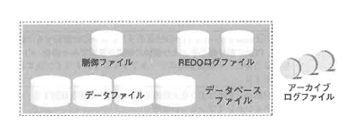
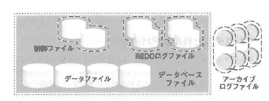

<html><body><h2 id="dbdesignTtl">4.7 物理的なディスク配置</h2>

RDBMSのファイル特性とデータベースの各スキーマへのアクセス頻度に基づき、信頼性とディスクの競合を考慮した配置を検討します。

データを格納する方法として、ファイルシステムかRAWデバイスか、RAIDディスクの使用を考慮します。 
RAID構成は、Oracleの場合0＋1が理想的です。 
RAID5は、可用性を考慮すると、データファイルや制御ファイルには適していますが、REDOファイルには適しません。 
RAID5は、書き込み時にデータ以外にパリティ情報を書き込むため、書き込みのパフォーマンスはよくありません。

<!--/section-->

<h4 class="caption">ファイルシステムとRAWデバイス</h4>

ファイルシステムを使った方がよいのか、RAWデバイスを使った方がよいのか、パフォーマンスを考えればオーバーヘッドが小さいRAWデバイスが有利ですが、管理面を考えれば、ファイルシステムの方が有利といえます。 
一般的には、ファイルシステムのパフォーマンスは日々改善されているため、管理面の有利さからファイルシステムを採用している企業が多いといえます。

<table class="tableBox">
<tr>
<th style="width:100px;" abbr="null">&nbsp;</th>
<th abbr="パフォーマンス">パフォーマンス</th>
<th abbr="管理">管理</th>
</tr>
<tr>
<td>ファイルシステム</td>
<td>処理フローはRDBMS→OS→ディスク オーバーヘッドは大きいため低速</td>
<td>&nbsp;</td>
</tr>
<tr>
<td>RAWデバイス</td>
<td>処理フローはRDBMS→ディスク オーバーヘッドは小さいため高速</td>
<td>データファイルのサイズ自動拡張は不可 
一般的なファイル管理コマンド使用不可</td>
</tr>
</table>

表4-7 ファイルシステムとRAWデバイスの比較

<!--/section-->

<h4 class="caption">物理的なファイルの配置</h4>

図4-21 物理的なファイル

<!--/.grayBox-->

<!--/section-->

<h4 class="caption">Oracleサーバの機能を使って二重化すべきファイル</h4>

障害が起こっても、その影響を最小限に食い止めるため、Oracleの機能を使って多重化すべきファイル群を示します(*)。

(*)いずれのファイルも、二重化する際には、必ず異なるディスク上に配置します。

<!-- /yellowBox -->

多重化した場合、Oracleによって自動的に同じ内容が出力されます。

<ul>
<li>● 制御ファイル</li>
<li>● REDOログファイル：同一グループに最低2メンバーを作成し、各メンバーは別ボリュームに配置する</li>
<li>● アーカイブログファイル：出力先をローカルで二重化する</li>
</ul>

図4-22 ディスク競合を考慮した配置

<!--/.grayBox-->

<ul>
<li>● REDOログファイルとその他のファイル： 
更新処理が多いシステムでは書き込み処理が集中します。 
REDOログファイルに書き込み待ちが生じるとシステム全体がハングアップしてしまうので、他のファイルと競合しないよう、独立させて配置してください。</li>
<li>● REDOログファイルとアーカイブログファイル： 
アーカイブログファイルはREDOログファイルを読み込んで書き込みを行うファイルなので、ほぼ同時にアクセスされます。 
別ボリュームに配置してください。</li>
<li>● 表と同時にアクセスされる索引： 
索引を使用したアクセスでは、索引と表がほぼ同時にアクセスされるため、表と索引は別表領域に、各表領域は別ディスクに配置します。</li>
<li>● 並行処理されるパーティション： 
並行して読み込みが行われるようなオブジェクトは別ボリュームに配置して、より並行処理の効果を高めることができます。</li>
</ul>

パフォーマンスや信頼性を考慮したソリューションとしては、RAIDを挙げることができます。

<!--/section-->

</body></html>