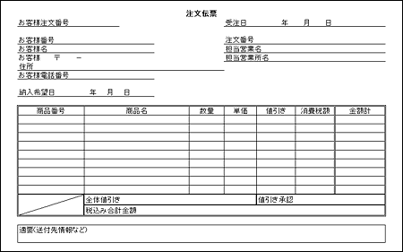

<html><body><h2 id="dbdesignTtl">5.3 【設問】受発注</h2>

まず、業務の現状を説明するので、それを把握した上で、続く問題に答えなさい。

翼商事の営業大谷さんに、顧客であるショッピングモール「青」の山中さんから電話がかかってきました。 
山中さん「やあ、大谷さん、そろそろ夏物の商品を揃えておきたいので電話したよ。詳細は注文書をFAXするから、注文が確定したら注文請書を返送してね」 
FAXで受け取った注文伝票を図5-7に示します。

図5-7 注文伝票

<!--/.grayBox-->

注文書を受け取った大谷さんは、確認作業に入りました。

<ul>
<li>● 商品の在庫はあるか 
それはどの倉庫から手配できるかを確認し、在庫を仮押さえする</li>
</ul>

大谷さんは山中さんに電話をして、「すぐに在庫が確認できなかったものについては、納期が遅くなるが、それでも発注してもらえるか？」を確認しました。 
すると、「多少納期がずれてもいいので、発注したい。」という確認ができたので、次の処理を行いました。

<ul>
<li>● 注文されたすべての商品について、該当する倉庫での在庫の引当処理を行い、他の受注によって勝手に出荷されないようにする</li>
<li>● 在庫が不足している商品については、新規に発注する手続きをとり、納品予定日を決め、顧客に確認をとる</li>
<li>● すべての商品が引き当てられた場合、またはすぐに引当ができない場合でも、仕入れ処理によって納期が確定した受注は、注文請書を顧客に返送する</li>
</ul>
<!--/section-->

<h4 class="quiz-title">Ｑ&nbsp;問題</h4>

ここまでの業務の説明を元に、概略ER図を作成してください。 
概略ER図では、エンティティと一意識別子を記述してください。

<!--/section-->

<h4 class="answer-title">Ｈ&nbsp;ヒント</h4>
<ul>
<li>● 業務の説明から、企業として長期的に管理すべきものは何か、という観点で分析しましょう 
説明の中では、名詞として管理されるべき対象がグループ化されています</li>
<li>● 管理すべき項目は自然と一意に識別できる項目があるはずです 
それを一意識別子としましょう</li>
<li>● 概略ER図では、属性や正規化といった観点での分析はまだしません 
それよりも、大局から見て必要なエンティティをとりこばさないようにしましょう</li>
<li>● マスタ系のエンティティは普遍的なもの、イベント系のエンティティは業務が遂行される中でだんだんオカレンスが増加していくものを管理します</li>
<li>● リレーションシップについては、いずれかのエンティティを主語とし、もう一方のエンティティを目的語として文を作ったとき、動詞にあたる部分をリレーションシップとして表現しましょう</li>
</ul>
<!--/section-->

<h4 class="answer-title">Ａ&nbsp;解答</h4>

図5-8 解答

<!--/.grayBox-->

<h4>解説（注：番号は図中の番号に対応します）</h4>
<ul>
<li>1. 受注の1オカレンスは1枚の注文伝票にあたります</li>
<li>2. 1回の受注で複数の商品の受注を受ける可能性があるので、受注からみて商品は多のカーディナリティとなります
商品1オカレンスが決まると、その商品に対する受注は複数回考えられるので、受注側も多のカーディナリティとなり、多対多のリレーションシップになります</li>
<li>3. 在庫はどんな商品がいくつ格納されているか、を管理するエンティティなので、一意識別子は、倉庫コード、商品コードの複合一意識別子となります
在庫では、どの受注で何個引き当てられたかを管理できるよう、受注とリレーションをもちます</li>
<li>4. 受注に対して在庫の引当ができなかった場合、商品を調達するために仕入先への発注手続きをしますが、1件の注文伝票から複数の発注が必要となる場合があるため、受注と発注は1対多のリレーションシップになります
発注は、受注と関係なく、計画発注を行う場合もあるため、受注側のオブショナリティは任意となります</li>
<li>5. 入庫、出庫の予定と実績を管理し、実在庫数と引当在庫数を確認できる入庫予定実績エンティティ、出庫予定実績エンティティがあった方が望ましいでしょう
これらのデータは、受注エンティティ（出庫）や発注エンティティ（入庫）だけでも管理できますが、既存の業務では、商品数と価格管理という側面から別帳簿として管理されているため、重複しますがエンティティとして抽出します
入出庫のオカレンスは、受発注以外にも、返品による入庫や廃棄による出庫なども考えられるため、入出庫エンティティから受発注エンティティへのリレーションのオブショナリティは、任意としておきます</li>
<li>6. 受注から社員へのリレーションが2本引いてあるのは、受注を受けた社員というリレーションと、値引き承認を行った社員というリレーションで、異なるオカレンスを指すため分けて記述します
受注を受けた社員のリレーションは、受注時に必ず社員の情報を入れる必要があると考えられるので、社員側のオブショナリティは必須です
値引き承認を行った社員については、すべての受注で必ずしも値引き承認を行うわけではないので、社員側のオブショナリティは任意です</li>
</ul>

図5-9に、システム化する前に在庫を管理していた商品受払帳、入出庫を管理していた商品在高帳を示します。

図5-9 商品受払帳と商品在高帳 <a href="./images/530-03l.gif" class="fancybox">【クリックで拡大します】</a>

<!--/.grayBox-->

<!--/section-->

</body></html>