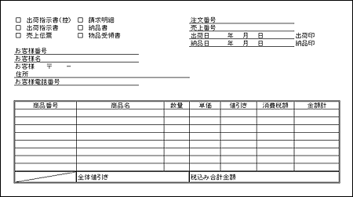
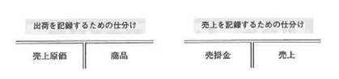
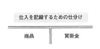

<html><body><h2 id="dbdesignTtl">5.4 【設問】受発注～入出荷</h2>

まず、業務の現状を説明するので、それを把握した上で、続く問題に答えなさい。

受注情報の中の納品日に基づいて、各倉庫では1日2回出荷指示書を出力します。 
倉庫では、以下に示す出荷指示書に基づいて入出荷処理、売上計上処理を行います。

図5-10 出荷指示書(*)

<!--/.grayBox-->

(*)この出荷指示書は、売上伝票、納品書、物品受領書、請求明細を兼ねています 

<!--/section-->

<h4 class="caption">出荷業務</h4>

各倉庫では、出荷指示書に基づいて作成されたピックアップリストを参照しながら、商品ごとにピックアップ作業を行います。 
その後、出荷先別に分け、検品を行います。

検品済商品は、出荷先ごとに梱包作業を行い、納品書および物品受領書を商品に付けてトラックに積み込みます。 
出荷情報を反映し、注文に対する出荷を確定します。

売上を計算する方法は、商品の出荷と同時に売上を計上する「出荷基準」を採用しています。

出荷指示書の複写として作成される売上伝票は、経理部門に渡されます。 
経理部門では、会計処理として売上伝票ごとに、下記に示す2種類の振替伝票を作成します。

図5-11 振替伝票

<!--/.grayBox-->

<!--/section-->

<h4 class="caption">入荷業務</h4>

発注した商品は、納品日に翼商事の倉庫に入庫されます。 納品日に入庫されない場合は、納品日がいつになるか仕入先に確認します。

入庫時は、商品と個数のみ確認して入庫処理を行います。

入庫後検品を行い、仕入計上され、入荷が確定します。

納品書は経理部門に渡されます。経理部門では、会計処理として納品書ごとに振替伝票を作成します（下記参照）。

仕入先に物品受領書を返送します。

図5-12 振替伝票

<!--/.grayBox-->

<!--/section-->

<h4 class="quiz-title">Ｑ&nbsp;問題</h4>

業務の説明から、概略ER図を作成してください。 
概略ER図では、エンティティと一意識別子を記述してください。

<!--/section-->

<h4 class="answer-title">Ｈ&nbsp;ヒント</h4>

業務システムでは、ある業務で入力したデータを別の業務でも使用します。 
これを「データのターンアラウンド」といいます。

今回の販売管理データを考えた場合、受注業務で入力した受注時のデータは、「受注→出荷→売上→請求→入金」と形を変えて使用されます。 
受注時のデータを元にして状態の遷移をデータベースで管理することにより一貫性のある管理を行うことができます。

出荷と受注のリレーションシップに注意してください。 
受注の1オカレンスに対して納期の異なる出荷が複数対応する可能性があります。

出荷と売上のエンティティを分けますか？ 
1対1のリレーションシップは、分ける必要が本当にあるかどうかを検討して決めましょう。

受注後の出荷/売上計上の場合と同様に、仕入先に発注したものを入荷して仕入計上する業務もモデル化しましょう。 
業務の流れは、「受注→出荷→売上→請求→入金」と対をなすように「発注→入荷→仕入→支払」という業務の流れになります。

発注元の部門と納品先が同じとは限りません。発注した顧客と納品先が異なることを前提にモデル化しましょう。

<!--/section-->

<h4 class="answer-title">Ａ&nbsp;解答</h4>

図5-13 解答

<!--/.grayBox-->

<h4>解説（注：番号は図中の番号に対応します）</h4>
<ul>
<li>1. 出荷の確認と同時に売上が計上されるため、出荷のオカレンスと売上のオカレンスは同時に作成され、分ける理由はないので、出荷と売上のエンティティは1つにします</li>
<li>2. 1枚の注文伝票に記載された商品は、すべてを同じ日に出荷できるとは限りません 
1つの受注オカレンスに対して出荷オカレンスが複数対応する可能性があるため、受注1に対して出荷多のリレーションになります 
出荷する際には、必ず対応する受注があるはずなので、1側の受注は必須になります</li>
<li>3. 発注した顧客と出荷先顧客のオカレンスが異なる可能性がある場合、出荷エンティティから顧客エンティティにリレーションを引きます 
このリレーションは、受注から顧客を参照するリレーションとは異なるリレーションになります 
出荷先へのリレーションは、出荷先顧客と発注顧客と同一であれば、出荷エンティティから参照する必要はないため、顧客側オブショナリティは任意とします</li>
<li>4. 会計処理で仕訳されたデータについては、総勘定元帳と呼ばれるテーブルに格納されます 
総勘定元帳には、仕訳されたお金の出入りが1件1レコードとして記録されていきます</li>
<li>5. 売掛金と買掛金は導出的なエンティティです 
総勘定元帳に格納されたデータのうち、一定期間内のレコードを対象として、勘定科目と借方/貸方別に集計したものが残高表と呼ばれるテーブルです 
勘定科目「売上」と「買掛」について、残高を管理するために作成します 
ここでは、一意識別子はまだ明確になっていないので、とりあえずエンティティを挙げるだけにしておきます</li>
<li>6. 在庫と出荷、在庫と入荷の問にリレーションを引きます 
在庫エンティティでは、いつ、何が、どれだけ在庫される予定か、実際に在庫になったか、どれだけ引当可能か、実際にいくつ在庫されているかという数の情報を管理します 
受注を受けた時、発注処理が行われた時、または入荷した時、それに伴って数を更新し、どの受発注、どの入出荷によって値が変更されたかを管理します</li>
</ul>
<!--/section-->

</body></html>