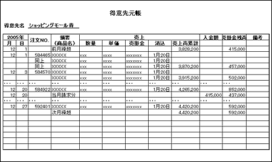

<html><body><h2 id="dbdesignTtl">5.6 【設問】請求～入金</h2>

まず、現状の業務を説明するので、それを把握した上で、続く問題に答えなさい。

<!--/section-->

<h4 class="caption">入金処理</h4>

<ul>
<li>● 顧客は、請求書に記載された期日までに支払います 
翼商事にとっては入金になります</li>
<li>● 支払い方法は銀行振り込みが一般的ですが、手形や期日指定現金などの場合もあります</li>
<li>● 入金が確認された場合、入金額を登録し、請求データの消し込みを行います 
不足の場合は債権残、超過が生じた場合は超過分を前受金という形で管理します</li>
</ul>
<!--/section-->

<h4 class="quiz-title">Ｑ&nbsp;問題</h4>

業務の説明から、概略ER図を作成してください。 
概略ER図では、エンティティと一意識別子を記述してください。

<!--/section-->

<h4 class="answer-title">Ｈ&nbsp;ヒント</h4>
<ul>
<li>● 入金の一意識別子が何になるかを考えましょう</li>
<li>● これまでは、債権残、超過分は得意先元帳を使用して管理していました（下図参照） 
これに代わる適切なエンティティを考えましょう</li>
</ul>

図5-18 得意先元帳

<!--/.grayBox-->

<!--/section-->

<h4 class="answer-title">Ａ&nbsp;解答</h4>

図5-19 解答

<!--/.grayBox-->

<h4>解説</h4>
<ul>
<li>1. 入金の一意識別子は、顧客コードと入金日と考えることができます</li>
<li>2. 売掛エンティティを利用して、超過受け取り分も管理できるようにしましょう 
前受金は、次回請求時に売上額からマイナス計算して請求額に反映するので、不足分と同様、売掛で管理できると考えられます</li>
</ul>
<!--/section-->

</body></html>