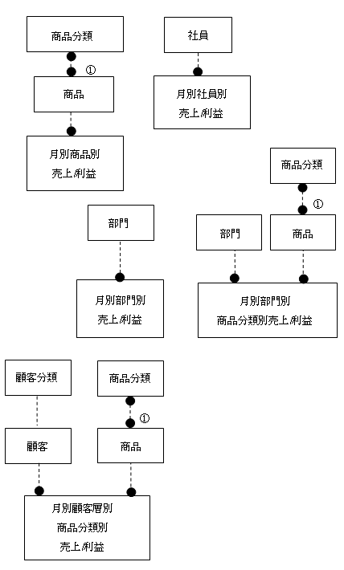

<html><body><h2 id="dbdesignTtl">5.7 【設問】売上/利益分析</h2>

まず、業務の現状を説明するので、それを把握した上で、続く設問に答えなさい。

翼商事では、営業担当者の活動に対して、売上高や利益率による評価を行いたいと考えています。 
また、売上高/利益率の基準から販売分析を行うことによって、効果的な発注、セールなどの販売促進活動を行いたいと考えています。 
そのためには、次のような情報が分析対象として必要です。

<ul>
<li>● 営業担当者別の月別売上高/利益率推移</li>
<li>● 商品分類別の月別売上高/利益率推移</li>
<li>● 部門別の月別売上高/利益率推移</li>
<li>● 部門別、商品分顆別の月別売上高/利益率推移</li>
<li>● 顧客層別、商品分類別の月別売上高/利益率推移</li>
</ul>
<!--/section-->

<h4 class="quiz-title">Ｑ&nbsp;問題</h4>

業務の説明から、概略ER図を提案してください。 
概略ER図では、エンティティと一意識別子を記述してください。

<!--/section-->

<h4 class="answer-title">Ｈ&nbsp;ヒント</h4>
<ul>
<li>● 概念設計なので、企業の戦略的観点から必要だと思われるエンティティを提案することを心がけましょう 
サマリー系のエンティティは、導出エンティティと考えることができますが、それをいかに実現するかはこの後のフェーズで検討していけばよいでしょう</li>
</ul>
<!--/section-->

<h4 class="answer-title">Ａ&nbsp;解答</h4>

図5-20 解答

<!--/.grayBox-->

<h4>解説（注：番号は図中の番号と対応します）</h4>

バッチで月別売上集計を作成し、各エンティティに格納します。 
その際、元データは各売上エンティティで、日付を見て、月ごとに集計します。 
XX別となっているエンティティと結合してその値単位でグルーピングして集計します。 
大量データを集計する際には、結合する際のコストを十分意識して設計する必要があります。

<ul>
<li>1. 商品はいろいろな属性で分類することができます 
商品をどのように分類するかは、この後の詳細ER図で分析していきます</li>
<li>2. 顧客もいろいろな角度から分類することが考えられます 
顧客の属性をどのように管理するかは、この後の詳細ER図で分析していきます</li>
</ul>
<!--/section-->

</body></html>