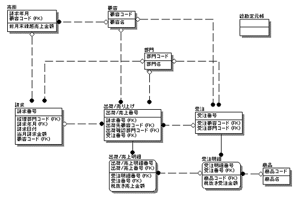
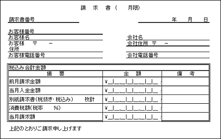
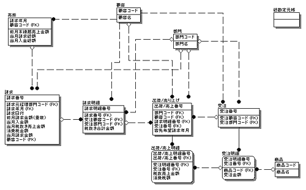
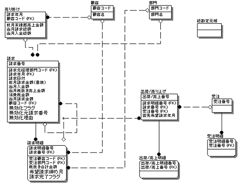
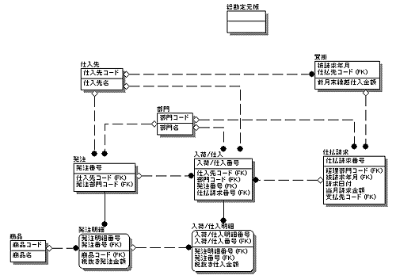
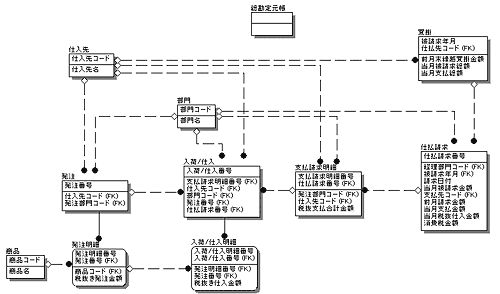
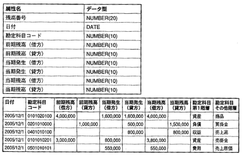

<html><body><h2 id="dbdesignTtl">6.3 【設問】売上～請求、仕入～請求</h2>

売上を計上してから請求するまで、仕入を計上してから請求されるまでの詳細ER図は、以下の項目に分けてアプローチします。

<table class="tableBox">
<tr>
<th abbr="項目">項目</th>
<th abbr="業務内容または要求仕様">業務内容または要求仕様</th>
</tr>
<tr>
<td rowspan="3">6.3.1	売上～請求</td>
<td>例題14　請求をエンティティとする</td>
</tr>
<tr>
<td><a href="#h4_15">例題15　請求月を指定できるようにする</a></td>
</tr>
<tr>
<td><a href="#h4_16">例題16　請求書の再発行に対応できるようにする</a></td>
</tr>
<tr>
<td>6.3.2	仕入～支払</td>
<td><a href="#h4_17">例題17　支払方法 を管理するエンティティを検討する</a></td>
</tr>
<tr>
<td>6.3.3	会計エンティティの分析</td>
<td><a href="#h4_6_3_3">仕訳と総勘定元帳をエンティティとする</a></td>
</tr>
</table>

表6-4 売上～請求、仕入～請求に関する設問

<!--/section-->

<h3>6.3.1 売上～請求</h3>

<h4 class="caption">例題14 請求をエンティティとする</h4>

顧客に出荷され、売上が計上された商品は、顧客によって対価を入金してもらう必要があります。 
企業間の取引は、このように代金より前にモノの取引が先行する<strong>信用取引</strong>で行われているため、計上された売上金額は、<strong>売掛</strong>として管理される必要があります。 
請求書は、売掛金額をまとめて請求するために、顧客に送付されます。 
また、請求先の財務状況に合わせて<strong>借用限度額</strong>を設定し、それ以上の売掛残が発生しないように管理することも必要です。

それでは、管理すべき売掛情報にはどのようなものがあるかを考えてみましょう。 下記、請求書のサンプルと、請求処理をするために関係するその他のエンティティを確認します。

図6-17 請求処理に関係するエンティティ

<!--/.grayBox-->

請求書のフォーマットはさまざまありますが、代表的な請求書フォーマットを以下に示します。

図6-18 請求書

<!--/.grayBox-->

<ul>
<li>● 1枚目は鑑とよばれる、請求書のヘッダ的な情報と請求集計情報をまとめたものです</li>
<li>
● <strong>ヘッダ情報</strong>：請求先顧客名、請求日、請求元（請求元経理部門）情報
</li>
<li>
● <strong>請求内訳</strong>：前月請求全額、当月入金額、当月売上合計額、消費税、当月請求額
</li>
<li>● 枚目以降は、請求明細と呼ばれ、該当月の出荷/売上伝票をバッチ処理などで加工し、整理・集計したものになります 
加工とは、たとえば返品処理があった場合などに売上計上板から減算して集計する、などの処理を指します 
請求明細では、出荷/売上日付、出荷/売上伝票番号、伝票単位の売上金額、請求元（受注を受けた営業部門）情報、伝票単位の売上金額等の情報を管理します</li>
<li>● 請求書の発行は、顧客の会計締め日に合わせて月1回行います。その際、上記請求書鑑といわれる請求集計情報と、日々の業務で作成された出荷/売上明細を加工して請求明細書（またはリスト）が作成されます。請求集計情報については、次に詳しく説明します</li>
</ul>

売掛残高を管理するためには、ある時点での状態だけではなく、累積した会計情報を管理する必要があります。 次に、請求書の集計欄に記載されている、売掛残高を管理するための情報を記述します。

<ul>
<li>● 前年度末時点での売掛残高</li>
<li>● 当期売上総額＝当期の売掛総額＝当期請求総額 （会計期内の売上総額）</li>
<li>● 当期入金総額（会計期内、顧客よりの入金総額）</li>
</ul>

現時点での売掛残高は以下の式で算出することができます。

現時点での売掛残高＝前年度末時点での売掛残高＋当期売上総額－当期入金総額 

「当期」というのは、会計期間を任意に表すためで、これが1か月であれば、1か月単位で値を管理する必要があるということになります。

<!--/section-->

<h5 class="quiz-title">Ｑ&nbsp;問題</h5>

売掛の管理および請求処理を行うことができるように、請求エンティティ、売掛エンティティを分析してください。

<!--/section-->

<h5 class="answer-title">Ａ&nbsp;解答</h5>

図6-19 解答

<!--/.grayBox-->

<!--/section-->

<table>
<tr>
<td colspan="4"><strong>請求</strong></td>
</tr>
<tr>
<td style="width:20px;">*</td><td style="width:150px;">請求番号</td><td style="width:80px;"></td><td style="width:200px;">&nbsp;</td>
</tr>
<tr>
<td>&nbsp;</td><td>請求日付</td><td>&nbsp;</td><td>&nbsp;</td>
</tr>
<tr>
<td>&nbsp;</td><td>請求先顧客コード</td><td>（FK1）</td><td>&nbsp;</td>
</tr>
<tr>
<td>&nbsp;</td><td>前月請求金額</td><td>（重複）</td><td>1.</td>
</tr>
<tr>
<td>&nbsp;</td><td>当月入金額</td><td>（重複）</td><td>2.</td>
</tr>
<tr>
<td>&nbsp;</td><td>当月税抜売上金額</td><td>（導出）</td><td>3.</td>
</tr>
<tr>
<td>&nbsp;</td><td>消費税全額</td><td>（導出）</td><td>&nbsp;</td>
</tr>
<tr>
<td>&nbsp;</td><td>当月請求金額</td><td>（導出）</td><td>4.</td>
</tr>
<tr>
<td>&nbsp;</td><td>請求元経理部門コード</td><td>（FK2）</td><td>&nbsp;</td>
</tr>

<tr>
<td colspan="4" >&nbsp;</td>
</tr>
<tr>
<td colspan="4"><strong>請求明細</strong></td>
</tr>
<tr>
<td>*</td><td>請求番号</td><td>（FK1）</td><td>&nbsp;</td>
</tr>
<tr>
<td>*</td><td>請求明細番号</td><td>（FK2）</td><td>&nbsp;</td>
</tr>
<tr>
<td>&nbsp;</td><td>税抜合計全額</td><td>（導出）</td><td>&nbsp;</td>
</tr>
<tr>
<td>&nbsp;</td><td>受注顧客コード</td><td>（FK4）</td><td>5.</td>
</tr>
<tr>
<td>&nbsp;</td><td>受注営業所部門コード</td><td>（FK5）</td><td>6.</td>
</tr>

<tr>
<td colspan="4" >&nbsp;</td>
</tr>
<tr>
<td colspan="4"><strong>売掛</strong></td>
</tr>
<tr>
<td>*</td><td>請求先顧客コード</td><td>（FK1）</td><td>&nbsp;</td>
</tr>
<tr>
<td>*</td><td>請求年月</td><td>&nbsp;</td><td>&nbsp;</td>
</tr>
<tr>
<td>*</td><td>前月末繰越売掛残高</td><td>（導出）</td><td>&nbsp;</td>
</tr>
<tr>
<td>*</td><td>当月請求総額</td><td>（重複）</td><td>7.</td>
</tr>
<tr>
<td>*</td><td>当月入金総額</td><td>（重複）</td><td>8.</td>
</tr>
</table>

<!-- /commandBox -->

<h4>解説 （注：番号は解答中の番号と対応します。番号が記載されていない解説は、全体に当てはまります）</h4>

<ul>
<li>■ 請求、請求明細、両エンティティともに、出荷/売上エンティティのオカレンスを入力としてバッチ処理などで計算して取得される、導出エンティティになることが多いです。 
請求明細オカレンスは、出荷/売上オカレンスの返品処理などをすべて網羅して最終的に1オカレンスで売上が計上できるように加工されたものです。 
<strong>請求オカレンス</strong>は、請求明細のオカレンスを月単位で集計した売上情報と、それまでに累積された売掛情報を含むオカレンスになります。 
請求明細の一意識別子は、出荷/売上エンティティの一意識別子を参照し、1対多の対応になります</li>
<li>1. 前月請求金額－2.当月入金額より、前月末売掛残高が計算できます</li>
<li>3. 当月の税抜きの売上総額で、当月に発生した売掛合計額です</li>
<li>4. 当月請求全額は、1.－2.＋3.＋（3.の消費税額）で求められます</li>
<li>5. 受注顧客コードは、請求先顧客とは異なる可能性があり、受注処理を行った顧客の情報です</li>
<li>6. 受注営業所コードは、請求部門とは異なり、受注を受けた営業所の部門コードになります</li>
<li>7. 8. 当月請求オカレンスを参照して取得する属性値です</li>
</ul>
<!--/section-->

<h4 class="caption" id="h4_15">例題15 請求月を指定できるようにする</h4>

顧客から、通常の手続きと異なる請求年月を指定される場合や、自社側の都合で請求年月を売上計上月とは異なる月に指定する場合があります。

<!--/section-->

<h5 class="quiz-title">Ｑ&nbsp;問題</h5>

このような要望に対応できるようにモデルを考えてください。

<!--/section-->

<h5 class="answer-title">Ｈ&nbsp;ヒント</h5>

出荷/売上単位で希望請求月を管理できるようにします。

<!--/section-->

<h5 class="answer-title">Ａ&nbsp;解答</h5>
<!--/section-->

<table>
<tr>
<td colspan="2"><strong>出荷/売上</strong></td>
<td colspan="2">：属性追加</td>
</tr>
<tr>
<td style="width:20px;">*</td><td style="width:150px;">出荷売上番号</td><td style="width:80px;"></td><td style="width:200px;"></td>
</tr>
<tr>
<td>&nbsp;</td><td>出荷売上日付</td><td>&nbsp;</td><td>&nbsp;</td>
</tr>
<tr>
<td>&nbsp;</td><td>出荷先顧客コード</td><td>（FK1）</td><td>&nbsp;</td>
</tr><tr>
<td>&nbsp;</td><td>出荷売上区分</td><td>&nbsp;</td><td>&nbsp;</td>
</tr><tr>
<td>&nbsp;</td><td>売上社員コード</td><td>（FK2）</td><td>&nbsp;</td>
</tr><tr>
<td>&nbsp;</td><td>値引き承認社員コード</td><td>（FK3）&nbsp;</td><td>&nbsp;</td>
</tr><tr>
<td>&nbsp;</td><td>売上部門コード</td><td>（FK4）&nbsp;</td><td>&nbsp;</td>
</tr><tr>
<td>&nbsp;</td><td>受注注文番号</td><td>（FK5）&nbsp;</td><td>&nbsp;</td>
</tr><tr>
<td>&nbsp;</td><td>客先希望納期日付</td><td>&nbsp;</td><td>&nbsp;</td>
</tr><tr>
<td>&nbsp;</td><td>営業値引き承認フラグ</td><td>&nbsp;</td><td>&nbsp;</td>
</tr><tr>
<td>&nbsp;</td><td>営業値引き理由</td><td>&nbsp;</td><td>&nbsp;</td>
</tr><tr>
<td>&nbsp;</td><td>営業値引き非承認理由</td><td>&nbsp;</td><td>&nbsp;</td>
</tr><tr>
<td>&nbsp;</td><td>値引き詳細番号</td><td>（FK6）&nbsp;</td><td>&nbsp;</td>
</tr><tr>
<td>&nbsp;</td><td>出荷検印社員コード</td><td>（FK7）&nbsp;</td><td>&nbsp;</td>
</tr><tr>
<td>&nbsp;</td><td>消費税額</td><td>（導出）&nbsp;</td><td>&nbsp;</td>
</tr><tr>
<td>&nbsp;</td><td>税抜売上金額合計</td><td>（導出）</td><td>&nbsp;</td>
</tr><tr>
<td>&nbsp;</td><td>税込売上金額合計</td><td>（導出）</td><td>&nbsp;</td>
</tr><tr>
<td>&nbsp;</td><td>売上返品元出荷売上番号</td><td>（FK8）&nbsp;</td><td>&nbsp;</td>
</tr><tr>
<td>&nbsp;</td><td>ステータス</td><td>&nbsp;</td><td>&nbsp;</td>
</tr><tr>
<td>&nbsp;</td><td>請求書発行希望月</td><td>&nbsp;</td><td>1.</td>
</tr><tr>
<td>&nbsp;</td><td>請求番号</td><td>（FK9）</td><td>&nbsp;</td>
</tr><tr>
<td>&nbsp;</td><td>請求明細番号</td><td>（FK10）</td><td>&nbsp;</td>
</tr>

<tr>
<td colspan="4" >&nbsp;</td>
</tr>
<tr>
<td colspan="4"><strong>請求明細</strong></td>
</tr>
<tr>
<td>*</td><td>請求番号</td><td>（FK1）</td><td>&nbsp;</td>
</tr>
<tr>
<td>*</td><td>請求明細番号</td><td>（FK2）</td><td>&nbsp;</td>
</tr>
<tr>
<td>&nbsp;</td><td>税抜合計金額</td><td>（導出）</td><td>&nbsp;</td>
</tr>
<tr>
<td>&nbsp;</td><td>受注顧客コード</td><td>（FK4）</td><td>&nbsp;</td>
</tr>
<tr>
<td>&nbsp;</td><td>受注営業所部門コード</td><td>（FK5）</td><td>&nbsp;</td>
</tr>
<tr>
<td>&nbsp;</td><td>請求書発行希望月</td><td>&nbsp;</td><td>2.</td>
</tr>
</table>

<!-- /commandBox -->

<h4>解説 （注：番号は解答中の番号と対応します。番号が記載されていない解説は、全体に当てはまります）</h4>

<ul>
<li>1. 出荷/売上エンティティに請求書発行希望月という属性を設け、顧客の請求書発行希望月に合わせて請求書を発行します</li>
<li>2. 請求明細エンティティにも、請求書発行希望月を設けておき、請求明細だけ参照すれば、請求書の当月売上集計が確認できるようにしておきます</li>
</ul>
<!--/section-->

<h4 class="caption" id="h4_16">例題16 請求書の再発行に対応できるようにする</h4>

誤った請求書を発行してしまう場合もあります。 
このような場合、先に発行した請求書を無効化し、訂正後の請求書を再発行する必要があります。

<!--/section-->

会計上の訂正処理は、神経を使って設計する必要があります。 
請求書の再発行ひとつとっても、たとえば以下のような点が考慮されているモデルを提案できることが求められます。

<ul>
<li>■ 2重請求が起きない</li>
<li>■ 誤った請求書の訂正理由を管理できる</li>
<li>■ 請求書発行の履歴が管理できる</li>
</ul>
<!--/section-->

<h5 class="quiz-title">Ｑ&nbsp;問題</h5>

元の請求書を無効化し、まだ請求していない請求明細は漏れなく請求できるよう、請求エンティティを詳細に見直してください。

<!--/section-->

<h5 class="answer-title">Ａ&nbsp;解答</h5>

図6-20 解答

<!--/.grayBox-->

<!--/section-->

<table>
<tr>
<td colspan="4"><strong>請求</strong></td>
</tr>
<tr>
<td style="width:20px;">*</td><td style="width:150px;">請求番号</td><td style="width:80px;"></td><td style="width:200px;"></td>
</tr>
<tr>
<td>&nbsp;</td><td>請求日付</td><td>&nbsp;</td><td>&nbsp;</td>
</tr>
<tr>
<td>&nbsp;</td><td>請求先顧客コード</td><td>（FK1）</td><td>&nbsp;</td>
</tr>
<tr>
<td>&nbsp;</td><td>前月請求金額</td><td>&nbsp;</td><td>&nbsp;</td>
</tr>
<tr>
<td>&nbsp;</td><td>当月入金額</td><td>&nbsp;</td><td>&nbsp;</td>
</tr>
<tr>
<td>&nbsp;</td><td>当月税抜売上額</td><td>&nbsp;</td><td>&nbsp;</td>
</tr>
<tr>
<td>&nbsp;</td><td>消費税金額</td><td>（導出）</td><td>&nbsp;</td>
</tr>
<tr>
<td>&nbsp;</td><td>当月請求金額</td><td>（導出）</td><td>&nbsp;</td>
</tr>
<tr>
<td>&nbsp;</td><td>請求元経理部門コード</td><td>（FK2）</td><td>&nbsp;</td>
</tr>
<tr>
<td>&nbsp;</td><td>無効化フラグ</td><td>&nbsp;</td><td>1.</td>
</tr>
<tr>
<td>&nbsp;</td><td>無効化元請求番号</td><td>（FK3）</td><td>2.</td>
</tr>
<tr>
<td>&nbsp;</td><td>無効化理由</td><td>&nbsp;</td><td>3.</td>
</tr>

<tr>
<td colspan="4" >&nbsp;</td>
</tr>
<tr>
<td colspan="4"><strong>請求明細</strong></td>
</tr>
<tr>
<td>*</td><td>請求番号</td><td>（FK1）</td><td>&nbsp;</td>
</tr>
<tr>
<td>*</td><td>請求明細番号</td><td>（FK2）</td><td>&nbsp;</td>
</tr>
<tr>
<td>&nbsp;</td><td>税抜合計金額</td><td>（導出）</td><td>&nbsp;</td>
</tr>
<tr>
<td>&nbsp;</td><td>受注顧客コード</td><td>（FK3）</td><td>&nbsp;</td>
</tr>
<tr>
<td>&nbsp;</td><td>受注営業所部門コード</td><td>（FK4）</td><td>&nbsp;</td>
</tr>
<tr>
<td>&nbsp;</td><td>希望請求締め月</td><td>&nbsp;</td><td>&nbsp;</td>
</tr>
<tr>
<td>&nbsp;</td><td>請求完了フラグ</td><td>&nbsp;</td><td>4.</td>
</tr>
</table>

<!-- /commandBox -->

<h4>解説 （注：番号は解答中の番号と対応します。番号が記載されていない解説は、全体に当てはまります）</h4>

<ul>
<li>1. 請求ヘッダエンティティに無効化フラグを属性として追加し、再請求した元の請求オカレンスは、履歴として残しておくようにします 
会計上に使用される情報はこのような処理をして、削除してしまわないようにします</li>
<li>2. 無効化フラグを立てたオカレンスには、無効化の理由を記述できるように無効化理由属性を追加します</li>
<li>3. 新しい請求書は、新しい請求番号で作成します 
新規請求オカレンスを作成する際、無効化した請求が組付けられるように、無効化元請求番号に、無効化した請求番号を入力できるようにします</li>
<li>4. 請求明細には、希望請求締め月属性を指定して、顧客側の処理の柔軟性を助けるとともに、請求完了フラグを設けます 
このフラグは、請求書の作成処理が完了したら「1」が記述され、請求書に無効化フラグがたつと、「0」クリアされ、再度請求書を作成する必要があることを知らせます</li>
</ul>
<!--/section-->

<h3>6.3.2 仕入～支払</h3>

<h4 class="caption" id="h4_17">例題17 支払方法を管理するエンティティを検討する</h4>

仕入れた商品の仕入れ金額は、<strong>買掛</strong>として管理される必要があります。 
仕入先から請求書が送付された後、その請求書が当月分の仕入れ総額と合致するかを確認し、期日までに支払う必要があります。

それでは、管理すべき買掛情報を検討してみましょう。

請求書は、「<a href="#img_6_18">図6-18 請求書</a>」で示した請求書フォーマットを使用します。 
請求処理をするために関係するその他のエンティティを確認します。

図6-21 請求処理に関係するエンティティ

<ul>
<li>■ 1枚目は鑑とよばれる、請求書のヘッダ的な情報と請求集計情報をまとめたものです</li>
<li>
■ <strong>ヘッダ情報</strong>：被請求社情報、請求日、請求元（請求元経理部門）情報
</li>
<li>
■ <strong>請求内訳</strong>：前月被請求金額、当月支払額、当月仕入合計額、消費税、当月請求額
</li>
<li>■ 2枚目以降は、請求明細と呼ばれ、仕入先で該当月の出荷/売上伝票をバッチ処理などで加工し、再集計したものになります 
出荷/売上日付、出荷/売上伝票番号、伝票単位の売上金額、請求元（請求元営業部門）情報、最終的に計算された伝票単位の請求額等の情報を管理します</li>
<li>■ 請求書の発行は、顧客の会計締め日に合わせて月1回行われます 
その際、仕入先では、上記、請求書鑑といわれる請求集計情報と、日々の業務で作成された出荷/売上明細を加工して請求明細書（またはリスト）が作成されます</li>
</ul>

請求書を受け取った後、請求明細と、こちら側で管理している入荷/仕入情報をつき合わせて間違いがないかどうかを確認する必要があります。 
月々の入荷/仕入に加え、買掛残高を管理するためには、ある時点での状態だけではなく、累積した会計情報を管理する必要があります。

下記に、買掛残高を管理するために必要な情報を記述します。

<ul>
<li>■ 前年度末時点での買掛残高</li>
<li>■ 当期仕入総額＝当期の買掛金総額＝当期被請求総額（会計期内の仕入総額）</li>
<li>■ 当期支払総額（会計期内の支払い総額）</li>
</ul>

現時点での買掛残高は以下の式で算出することができます。

現時点での買掛残高 
＝前年度末時点での買掛残高＋当期仕入総額－当期支払い総額

「当期」というのは、会計期間を任意に表すためで、これが1か月であれば、1か月単位で値を管理する必要があるということになります。

<!--/section-->

<h5 class="quiz-title">Ｑ&nbsp;問題</h5>

買掛の管理および請求書に対する仕入集計確認処理を行うことができるように、支払い請求エンティティ、買掛エンティティを分析してください。

売掛管理の場合と同様、月ごとの支払い請求を確認するため、バッチ処理で1か月分の仕入計上を整理・加工した結果を格納するエンティティ「支払い請求明細」と、それを1か月単位で合計する「支払い請求」エンティティ、前期からの累積買掛情報を格納するための「買掛」エンティティを考えます。

<!--/section-->

<h5 class="answer-title">Ａ&nbsp;解答</h5>

図6-22 解答

<!--/.grayBox-->

<!--/section-->

<table>
<tr>
<td colspan="4"><strong>支払請求</strong></td>
</tr>
<tr>
<td style="width:20px;">*</td><td style="width:150px;">支払請求番号</td><td style="width:80px;"></td><td style="width:200px;"></td>
</tr>
<tr>
<td>&nbsp;</td><td>請求日付</td><td>&nbsp;</td><td>&nbsp;</td>
</tr>
<tr>
<td>&nbsp;</td><td>支払先コード</td><td>（FK1）</td><td>&nbsp;</td>
</tr>
<tr>
<td>&nbsp;</td><td>前月請求金額</td><td>（重複）</td><td>1.</td>
</tr>
<tr>
<td>&nbsp;</td><td>当月支払金額</td><td>（導出）</td><td>2.</td>
</tr>
<tr>
<td>&nbsp;</td><td>当月税抜仕入金額</td><td>（導出）</td><td>3.</td>
</tr>
<tr>
<td>&nbsp;</td><td>消費税金額</td><td>（導出）</td><td>&nbsp;</td>
</tr>
<tr>
<td>&nbsp;</td><td>当月被請求金額</td><td>（導出）</td><td>4.</td>
</tr>
<tr>
<td>&nbsp;</td><td>経理部門コード</td><td>（FK2）	</td><td>&nbsp;</td>
</tr>

<tr>
<td colspan="4" >&nbsp;</td>
</tr>
<tr>
<td colspan="4"><strong>支払請求明細</strong></td>
</tr>
<tr>
<td>*</td><td>支払請求番号</td><td>（FK1）</td><td>&nbsp;</td>
</tr>
<tr>
<td>*</td><td>支払請求明細番号</td><td>（FK2）</td><td>&nbsp;</td>
</tr>
<tr>
<td>&nbsp;</td><td>税抜支払合計金額</td><td>（導出）</td><td>&nbsp;</td>
</tr>
<tr>
<td>&nbsp;</td><td>仕入先コード</td><td>（FK4）</td><td>5.</td>
</tr>
<tr>
<td>&nbsp;</td><td>発注部門コード</td><td>（FK5）</td><td>6.</td>
</tr>

<tr>
<td colspan="4" >&nbsp;</td>
</tr>
<tr>
<td colspan="4"><strong>買掛</strong></td>
</tr>
<tr>
<td>*</td><td>支払先顧客コード</td><td>（FK1）</td><td>&nbsp;</td>
</tr>
<tr>
<td>*</td><td>支払年月</td><td>&nbsp;</td><td>&nbsp;</td>
</tr>
<tr>
<td>&nbsp;</td><td>前月末繰越買掛残高</td><td>（導出）</td><td>&nbsp;</td>
</tr>
<tr>
<td>&nbsp;</td><td>当月被請求総額</td><td>（重複）</td><td>7.</td>
</tr>
<tr>
<td>&nbsp;</td><td>当月支払総額</td><td>（重複）</td><td>8.</td>
</tr>
</table>

<!-- /commandBox -->

<h4>解説 （注：番号は解答中の番号と対応します。番号が記載されていない解説は、全体に当てはまります）</h4>
<ul>
<li style="text-indent: -1em;">■ 支払請求、支払請求明細、両エンティティともに、出荷/売上エンティティのオカレンスを入力としてバッチ処理などで計算して取得される、導出エンティティになることが多いです 
支払請求明細オカレンスは、入荷/仕入オカレンスの返品処理などをすべて網羅して最終的に1オカレンスで仕入が計上できるように加工されたものです。 
<strong>支払請求オカレンス</strong>は、請求明細のオカレンスを月単位で集計した仕入情報と、それまでに累積された買掛情報を含むオカレンスになります。 
請求明細の一意識別子は、入荷/仕入エンティティの一意識別子を参照し、1対多の対応になります。</li>
<li style="text-indent: -1em;">1. 前月被請求金額－2.当月支払金額より、前月末買掛残高が計算できます</li>
<li style="text-indent: -1em;">3. 当月の税抜きの仕入総額で、当月に発生した買掛合計額です</li>
<li style="text-indent: -1em;">4. 当月論理的被請求金額は、1.－2.＋3.＋（3.の消費税額）で求められます 
この値を、4.当月被請求金額と比較します</li>
<li style="text-indent: -1em;">5. 仕入先コードは、支払先とは異なる可能性があり、仕入先の情報です</li>
<li style="text-indent: -1em;">6. 発注部門コードは、実際に支払いを行う経理部門コードとは異なる場合があり、仕入を依頼した発注部門情報になります</li>
<li style="text-indent: -1em;">7. 8. 当月請求オカレンスを参照して取得する属性値です</li>
</ul>
<!--/section-->

<h3>6.3.3 会計のエンティティの分析</h3>

<h4 class="caption" id="h4_6_3_3">仕訳と総勘定元帳をエンティティとする</h4>

お金の出入りに関する処理は、通常会計システムで個別に管理している場合が多いです。 
ただ、お金の管理は別システムといっても、<strong>カネの流れが発生するのは業務システムの中</strong>です。 
ここでは、業務に関わる基本的なお金の管理方法をモデリングします。

まず、モデリングに先立って会計に関する基本的な用語のおさらいをします。

<!--/section-->

<h4>勘定科目</h4>

企業の会計システムでは、収入や支出を種別で管理するために、勘定科目という分類を使用します。 
一般的に使用される5種類の勘定科目を説明します。

<table class="tableBox">
	<tr>
		<th style="width:80px;" abbr="勘定科目">勘定科目</th>
		<th abbr="説明">説明</th>
	</tr>
	<tr>
		<td>資産</td>
		<td>銀行預金や自社ビル、また、売掛金も資産にあたります。 
		企業間の売買において、商品を販売したが、まだ実際の現金は受け取っていない金額を「売掛金」として資産に分類します。 
		資産のなかで売掛金の割合が非常に大きく、それが回収できない場合は倒産ということにもなりかねません。</td>
	</tr>
	<tr>
		<td>負債</td>
		<td>最もわかりやすい例としては、企業が銀行から借りている借金が負債にあたります。 
		そのほか、「買掛金」も、商品の仕入が完了しているのに、まだお金を支払っていない金額として、負債に分類します。</td>
	</tr>
	<tr>
		<td>資本</td>
		<td>企業を起こすときに元手となる「資本金」が最初の資本になります。 
		これは、企業が最初に商品を購入したり、従業員に賃金を払ったりするときの元手になります。 
		また、企業の業績が悪化したときにこの資本金を取り崩して運用する、といった使用が考えられます。 
		そこで、企業としては、規模が大きくなるにつれ、一般的には意図して資本金を増やしていきます。</td>
	</tr>
	<tr>
		<td>収益</td>
		<td>企業が、商品やサービスを販売して得られる現金としての売上が一般的な収益です。</td>
	</tr>
	<tr>
		<td>費用</td>
		<td>支出にあたるものを費用と呼びます。商品の仕入や従業員に支払う人件費などが費用にあたります。</td>
	</tr>
</table>

表6-5 勘定科目

この5つの勘定科目の下に、さらに中分類/小分類という形で科目が階層構造で構成されています。 
会計システムでは、これらの勘定科目の階層構造を、勘定科目マスタテーブルという形でもちます。

表6－6では、一般的に使用されている勘定科目の例を挙げています。

<table class="tableBox">
<tr>
<th abbr="勘定科目" colspan="5">勘定科目</th>
</tr>
<tr>
<th style="width:100px;" abbr="（第1階層）">（第1階層）</th>
<th style="width:100px;" abbr="（第2階層）">（第2階層）</th>
<th style="width:100px;" abbr="（第3階層）">（第3階層）</th>
<th style="width:100px;" abbr="（第4階層）">（第4階層）</th>
<th style="width:100px;" abbr="（第5階層）">（第5階層）</th>
</tr>
<tr>
<td rowspan="8">資産</td>
<td rowspan="5">流動資産</td>
<td rowspan="4">当座資産</td>
<td rowspan="3">手元資産</td>
<td>現金</td>
</tr>
<tr>
<td>普通預金</td>
</tr>
<tr>
<td>有価証券</td>
</tr>
<tr>
<td>債権資産</td>
<td>売掛金</td>
</tr>
<tr>
<td>棚卸資産</td>
<td>商品</td>
<td>&nbsp;</td>
</tr>
<tr>
<td rowspan="3">固定資産</td>
<td rowspan="2">有形固定資産</td>
<td>建物</td>
<td>&nbsp;</td>
</tr>
<tr>
<td>土地</td>
<td>&nbsp;</td>
</tr>
<tr>
<td>無形固定資産</td>
<td>&nbsp;</td>
<td>&nbsp;</td>
</tr>

<tr>
<td rowspan="3">負債</td>
<td rowspan="2">流動負債</td>
<td>買掛金</td>
<td>&nbsp;</td>
<td>&nbsp;</td>
</tr>
<tr>
<td>支払手形</td>
<td>&nbsp;</td>
<td>&nbsp;</td>
</tr>
<tr>
<td>固定負債</td>
<td>社債</td>
<td>&nbsp;</td>
<td>&nbsp;</td>
</tr>

<tr>
<td rowspan="2">資本</td>
<td>資本金</td>
<td>&nbsp;</td>
<td>&nbsp;</td>
<td>&nbsp;</td>
</tr>
<tr>
<td>自己株式</td>
<td>&nbsp;</td>
<td>&nbsp;</td>
<td>&nbsp;</td>
</tr>

<tr>
<td rowspan="4">収益</td>
<td rowspan="3">経常収益</td>
<td rowspan="2">営業収益</td>
<td>売上高</td>
<td>&nbsp;</td>
</tr>
<tr>
<td>棚卸資産（増）</td>
<td>&nbsp;</td>
</tr>
<tr>
<td>営業外収益</td>
<td>受取利息</td>
<td>&nbsp;</td>
</tr>
<tr>
<td>特別利益</td>
<td>固定資産売却益</td>
<td>&nbsp;</td>
<td>&nbsp;</td>
</tr>

<tr>
<td rowspan="7">費用</td>
<td rowspan="6">経常費用</td>
<td rowspan="5">営業費用</td>
<td rowspan="3">販売費</td>
<td>売上原価</td>
</tr>
<tr>
<td>仕入</td>
</tr>
<tr>
<td>販売費</td>
</tr>
<tr>
<td rowspan="2">一般管理費</td>
<td>人件費</td>
</tr>
<tr>
<td>事務用消耗品費</td>
</tr>
<tr>
<td>営業外費用</td>
<td>新株発行費</td>
<td>&nbsp;</td>
</tr>
<tr>
<td>特別損失</td>
<td>固定資産売却損</td>
<td>&nbsp;</td>
<td>&nbsp;</td>
</tr>
</table>

表6-6 勘定科目マスタテーブル例

勘定科目マスタテーブルは、勘定科目コードと勘定科目名の2つのカラムをもちますが、例に示すように、勘定科目の階層構造は大体5階層くらいで収束するので、勘定科目マスタテーブルは一般的に表6-7のような構造にします。

<table class="tableBox">
<tr>
<th abbr="属性名">属性名</th>
<th abbr="データ型">データ型</th>
</tr>
<tr>
<td>勘定科目コード（第1階層）</td>
<td>number（2）</td>
</tr>
<tr>
<td>勘定科目コード（第2階層）</td>
<td>number（2）</td>
</tr>
<tr>
<td>勘定科目コード（第3階層）</td>
<td>number（2）</td>
</tr>
<tr>
<td>勘定科目コード（第4階層）</td>
<td>number（2）</td>
</tr>
<tr>
<td>勘定科目コード（第5階層）</td>
<td>number（2）</td>
</tr>
<tr>
<td>勘定科目名称</td>
<td>varchar2（40）</td>
</tr>
</table>

表6-7 勘定科目マスタテーブル定義

各列の値は100種類を超えることはないので、コード借は2桁ずつ用意しておき、勘定科目を特定するときには、第1階層から第5階層までのコードの組み合わせを勘定科目コードとして使用します（表6-8）。

<table class="tableBox">
<tr>
<th abbr="勘定科目コード" colspan="5">勘定科目コード</th>
<th abbr="科目名" rowspan="2">科目名</th></tr>
<tr>
<th abbr="（第1階層）">（第1階層）</th>
<th abbr="（第2階層）">（第2階層）</th>
<th abbr="（第3階層）">（第3階層）</th>
<th abbr="（第4階層）">（第4階層）</th>
<th abbr="（第5階層）">（第5階層）</th>
</tr>

<tr>
<td>01</td>
<td>00</td>
<td>00</td>
<td>00</td>
<td>00</td>
<td>資産</td>
</tr>

<tr>
<td>01</td>
<td>01</td>
<td>00</td>
<td>00</td>
<td>00</td>
<td>流動資産</td>
</tr>

<tr>
<td>01</td>
<td>01</td>
<td>01</td>
<td>00</td>
<td>00</td>
<td>当座資産</td>
</tr>

<tr>
<td>01</td>
<td>01</td>
<td>01</td>
<td>01</td>
<td>00</td>
<td>手元資産</td>
</tr>

<tr>
<td>01</td>
<td>01</td>
<td>01</td>
<td>01</td>
<td>01</td>
<td>現金</td>
</tr>

<tr>
<td>01</td>
<td>01</td>
<td>01</td>
<td>01</td>
<td>02</td>
<td>普通預金</td>
</tr>

<tr>
<td>01</td>
<td>01</td>
<td>01</td>
<td>02</td>
<td>01</td>
<td>売掛金</td>
</tr>

<tr>
<td>01</td>
<td>01</td>
<td>02</td>
<td>00</td>
<td>00</td>
<td>棚卸資産</td>
</tr>

<tr>
<td>01</td>
<td>01</td>
<td>02</td>
<td>01</td>
<td>00</td>
<td>商品</td>
</tr>

<tr>
<td>02</td>
<td>00</td>
<td>00</td>
<td>00</td>
<td>00</td>
<td>負債</td>
</tr>

<tr>
<td>02</td>
<td>01</td>
<td>00</td>
<td>00</td>
<td>00</td>
<td>流動負債</td>
</tr>

<tr>
<td>02</td>
<td>01</td>
<td>01</td>
<td>00</td>
<td>00</td>
<td>買掛金</td>
</tr>

<tr>
<td>03</td>
<td>00</td>
<td>00</td>
<td>00</td>
<td>00</td>
<td>資本</td>
</tr>

<tr>
<td>03</td>
<td>01</td>
<td>00</td>
<td>00</td>
<td>00</td>
<td>資本金</td>
</tr>

<tr>
<td>04</td>
<td>00</td>
<td>00</td>
<td>00</td>
<td>00</td>
<td>収益</td>
</tr>

<tr>
<td>04</td>
<td>01</td>
<td>00</td>
<td>00</td>
<td>00</td>
<td>経常利益</td>
</tr>

<tr>
<td>04</td>
<td>01</td>
<td>01</td>
<td>00</td>
<td>00</td>
<td>営業利益</td>
</tr>

<tr>
<td>04</td>
<td>01</td>
<td>01</td>
<td>01</td>
<td>00</td>
<td>売上高</td>
</tr>

<tr>
<td>05</td>
<td>00</td>
<td>00</td>
<td>00</td>
<td>00</td>
<td>費用</td>
</tr>

<tr>
<td>05</td>
<td>01</td>
<td>00</td>
<td>00</td>
<td>00</td>
<td>経常費用</td>
</tr>

<tr>
<td>05</td>
<td>01</td>
<td>01</td>
<td>00</td>
<td>00</td>
<td>営業費用</td>
</tr>

<tr>
<td>05</td>
<td>01</td>
<td>01</td>
<td>01</td>
<td>00</td>
<td>販売費</td>
</tr>

<tr>
<td>05</td>
<td>01</td>
<td>01</td>
<td>01</td>
<td>01</td>
<td>売上原価</td>
</tr>

<tr>
<td>05</td>
<td>01</td>
<td>01</td>
<td>01</td>
<td>02</td>
<td>仕入</td>
</tr>

<tr>
<td>05</td>
<td>01</td>
<td>01</td>
<td>01</td>
<td>03</td>
<td>販売費</td>
</tr>

<tr>
<td>05</td>
<td>01</td>
<td>01</td>
<td>02</td>
<td>01</td>
<td>人件費</td>
</tr>
</table>

表6-8 勘定科目マスタテーブル具体例

<!--/section-->

<h4>仕訳と総勘定元帳</h4>

企業のお金の出入りは、記述の仕方がルールによって決まっています。 
お金の出入りは複数の勘定科目の出入りとして記述され、額が増加するか減少するかによって借方（かりかた）または貸方（かしかた）の2つのカラムのいずれかに分類されます。 
この処理を仕訳と呼び、仕訳されたデータは、総勘定元帳テーブルに格納されます。

勘定科目ごとの仕訳ルールと仕訳の具体例を表6-9および表6-10に示します。

<table class="tableBox">
<tr>
<th style="width:120px;" abbr="勘定科目大分類">勘定科目大分類</th>
<th style="width:120px;" abbr="借方">借方</th>
<th style="width:120px;" abbr="貸方">貸方</th>
</tr>
<tr>
<td>資産</td>
<td>UP↑</td>
<td>DOWN↓</td>
</tr>
<tr>
<td>負債</td>
<td>DOWN↓</td>
<td>UP↑</td>
</tr>
<tr>
<td>資本</td>
<td>DOWN↓</td>
<td>UP↑</td>
</tr>
<tr>
<td>収益</td>
<td>－</td>
<td>常にこちらに記入</td>
</tr>
<tr>
<td>費用</td>
<td>常にこちらに記入</td>
<td>－</td>
</tr>
</table>

表6-9 仕訳ルール

<!--/section-->

<table class="tableBox">
<tr>
<th style="width:100px;" abbr="勘定科目第1階層">勘定科目第1階層</th>
<th style="width:100px;" abbr="勘定科目その他の階層">勘定科目その他の階層</th>
<th style="width:100px;" abbr="勘定科目コード">勘定科目コード</th>
<th style="width:100px;" abbr="借方">借方</th>
<th style="width:100px;" abbr="貸方">貸方</th>
</tr>
<tr>
<td>資産</td>
<td>商品</td>
<td>0101020100</td>
<td>50,000</td>
<td>&nbsp;</td>
</tr>

<tr>
<td>負債</td>
<td>買掛金</td>
<td>0201010000</td>
<td>&nbsp;</td>
<td>50,000</td>
</tr>

<tr>
<td>収益</td>
<td>売上高</td>
<td>0401010100</td>
<td>&nbsp;</td>
<td>80,000</td>
</tr>

<tr>
<td>資産</td>
<td>売掛金</td>
<td>0101010201</td>
<td>80,000</td>
<td>&nbsp;</td>
</tr>

<tr>
<td>資産</td>
<td>商品</td>
<td>0101020100</td>
<td>&nbsp;</td>
<td>55,000</td>
</tr>

<tr>
<td>費用</td>
<td>売上原価</td>
<td>0501010101</td>
<td>55,000</td>
<td>&nbsp;</td>
</tr>
</table>

表6-10 仕訳の具体例

<!--/section-->

総勘定元帳テーブルには、仕訳されたお金の出入り1件ずつが1レコードとして挿入されていきます。 
総勘定元帳テーブルは、勘定科目コード以外に仕訳作業の発生した目付や、勘定科目を補足する追加の情報（勘定科目中分類/小分類、補助科目など）も管理します。

総勘定元帳テーブルは一般的に表6-11のような構成になります。

表6-11 総勘定元帳テーブルER図定義の具体例

<!--/.grayBox-->

<h4>残高表</h4>

総勘定元帳はすべての会計情報を格納しています。 
この総勘定元帳より、必要な期間ごとに、必要な勘定科目ごとにまとめて集計処理を行った結果の残高を求め、現在の会計の状況がどうなっているかを確認します。 
残高表は、1か月に一度の割合でバッチ処理によって更新されることが多いです。

残高の管理において、次のことに留意してください。

<ul>
<li>■ 資産/負債/資本の3つの勘定科目については、企業の設立時からの累計残高を管理する必要があります 
これらの勘定科目は、現時点での企業の会計の状態がどうなっているか、を知ることを目的とした科目だからです</li>
<li>■ 収益と費用の勘定科目については、集計対象期間内での合計全額のみに着目するため、前期残高を管理する必要はありません 
これは、ウラを返せば、収益と費用は当期の増減を見ることが主目的の勘定科目だからです</li>
</ul>

残高テーブルは一般的に表6-12のような形式で作成されます。

表6-12 残高テーブルER図定義の具体例

<!--/.grayBox-->

<!--/section-->

<h4>貸借対照表と損益計算書</h4>

会計の締めと呼ばれるタイミングで、決算に必要な会計用のレポートを作成します。 
締めのタイミングは企業によって異なりますが、最近では1か月で締め処理を行い、いつでも企業の会計状態を確認できるようにしているところが多いです。

決算時のレポート形式はあらかじめ定められています。 
ひとつが貸借対照表、もうひとつが損益計算書です。この2つのレポートは主に残高表から作成されます。

<ul>
<li style="text-indent: -1em;">■. 貸借対照表は、資産/負債/資本の勘定科目に関するレポートで、企業の現在の会計状況を示すレポートです</li>
<li style="text-indent: -1em;">■. 損益計算書は当期の利益の増減を確認するレポートで、企業の近々の状況を示すレポートだということができます</li>
</ul>

図6-23　6.3節全体のER図 <a href="./images/633-05l.gif" class="fancybox">【クリックで拡大します】</a>

<!--/.grayBox-->

<!--/section-->

</body></html>
